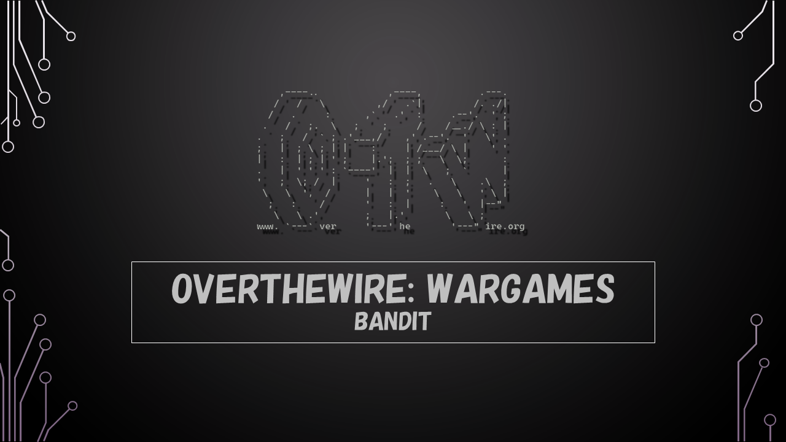

### Level Goal

> There is a setuid binary in the homedirectory that does the following: it makes a connection to localhost on the port you specify as a commandline argument. It then reads a line of text from the connection and compares it to the password in the previous level (bandit20). If the password is correct, it will transmit the password for the next level (bandit21).  
> **NOTE:** Try connecting to your own network daemon to see if it works as you think

### Commands you may need to solve this level

> ssh, nc, cat, bash, screen, tmux, Unix 'job control' (bg, fg, jobs, &, CTRL-Z, …)

```
> whatis ssh  
ssh (1)              - OpenSSH remote login client

> whatis nc  
nc (1)               - arbitrary TCP and UDP connections and listens

> whatis cat  
cat (1)              - concatenate files and print on the standard output

> whatis bash  
bash (1)             - GNU Bourne-Again SHell

> whatis screen  
screen (1)           - screen manager with VT100/ANSI terminal emulation

> whatis tmux  
tmux (1)             - terminal multiplexer
```

**Note:** Not all commands are required to complete the level

### Helpful Reading Material

[Netcat (nc) Command with Examples \| Linuxize](https://linuxize.com/post/netcat-nc-command-with-examples/)

[Understanding the job control commands in Linux – bg, fg and CTRL+Z – The Geek Diary](https://www.thegeekdiary.com/understanding-the-job-control-commands-in-linux-bg-fg-and-ctrlz/)

### Solution

We have an binary file that makes connection to user specified port and reads a line of text. If the text is same as the last level password we get next level password.

So the first task that we need to do is setup an listener on any port on the system that will return the previous level password if we connect to that port using the binary file. We can setup an listener using the `netcat` command.

_(The password for the previous level is stored in_ `/etc/bandit_pass/bandit19` _which we found in the previous level)_

```
bandit20@bandit:~$ echo "GbKksEFF4yrVs6il55v6gwY5aVje5f0j" | netcat -lp 1234 &  
[1] 14333
```

The -l flag is used to setup an listener and the -p flag is used to specify the port the the listener should listen on. As we have not specified IP Address the listener is going to run on localhost.

The "&" at the end of the command is used to specify that we want the command to run in the background. The `jobs` command can be used to view all the processes/ jobs on the system

```
bandit20@bandit:~$ jobs  
[1]+  Running                 echo "GbKksEFF4yrVs6il55v6gwY5aVje5f0j" | netcat -lp 1234 &
```

Now that we have the listener setup we can use the binary file to connect on the same port

```
bandit20@bandit:~$ ls  
suconnect

bandit20@bandit:~$ ./suconnect 1234  
Read: GbKksEFF4yrVs6il55v6gwY5aVje5f0j  
Password matches, sending next password  
gE269g2h3mw3pwgrj0Ha9Uoqen1c9DGr  

[1]+  Done                    echo "GbKksEFF4yrVs6il55v6gwY5aVje5f0j" | netcat -lp 1234
```

As soon as we connect the password of the previous level was compared with the text that we had specified on port 1234 and since they matched we got the password for the next level

Logout of the current session and start next level as bandit21

```
> ssh bandit21@bandit.labs.overthewire.org -p 2220
This is a OverTheWire game server. More information on http://www.overthewire.org/wargames

bandit21@bandit.labs.overthewire.org's password: gE269g2h3mw3pwgrj0Ha9Uoqen1c9DGr
```