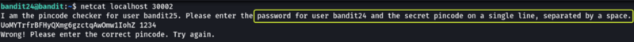

## Level Goal

> A daemon is listening on port 30002 and will give you the password for bandit25 if given the password for bandit24 and a secret numeric 4-digit pincode. There is no way to retrieve the pincode except by going through all of the 10000 combinations, called brute-forcing.

## Helpful Reading Material

[shellmagic.xyz - This website is for sale! - shellmagic Resources and Information.](https://shellmagic.xyz/)

[Bash For Loop \| Linuxize](https://linuxize.com/post/bash-for-loop/)

## Solution

From the question, we understand that there is a service running on port 30002 and that it's using a 4-digit PIN for authentication. If we can authenticate ourselves and submit to the service the password for bandit24 we will be given the password for bandit25.

Since we don't know the PIN the only way to find the right PIN is by brute force. Brute forcing is nothing but trying out all possible combinations for a field until the correct combination is found.

Let's connect to the daemon using Netcat and see what result is returned.



We see that we are required to submit the password for bandit24 and PIN for authentication on the same line separated by a space.

Now we know the format that the data has to be submitted to the service let's write a simple brute forcer using loops that tried all numbers lying between 0000 and 9999 both inclusive (All the 4-digit numbers that possibly lie in this range). Let's look at a code snippet for "for loop".


In the above code snippet, we are iterating through a series of numbers starting at 1 and ending at 10. In each iteration, we are printing the value of the variable "i" using the "echo" statement. The {n1..n2} syntax is used to create a series of numbers that start from n1 and end at n2.

**Note:** If the code snippet does not make sense refer to the attached resource to get a better idea of how to write basic shell scripts

By modifying the above snippet we can achieve what we require. We need to change the value of the start and end value for the sequence of numbers, instead of 1 to 10 we have to use 0000 to 9999. The value returned by echo should be changed to the "password of bandit24" followed by the value of the variable "i" separated by a space as that's the format the input is expected by the daemon. Finally, we can send the result of our brute forcer to Netcat using the pipe `|` operator. Netcat will try all the combinations and return to us the password for the next level when the right value for the PIN is found.

The final code for brute-forcing the password from the daemon would look as follows. Let's run it and see if we get the password.

```
for i in {0000..9999}; 
do 
	echo "UoMYTrfrBFHyQXmg6gzctqAwOmw1IohZ $i"; 
done | nc localhost 30002
```


Are some unsuccessful attempts we have found the password for the next level.

Logout of the current session and log in as bandit25

```
ssh bandit25@bandit.labs.overthewire.org -p 2220

This is a OverTheWire game server. More information on http://www.overthewire.org/wargames

bandit25@bandit.labs.overthewire.org's password: uNG9O58gUE7snukf3bvZ0rxhtnjzSGzG
```