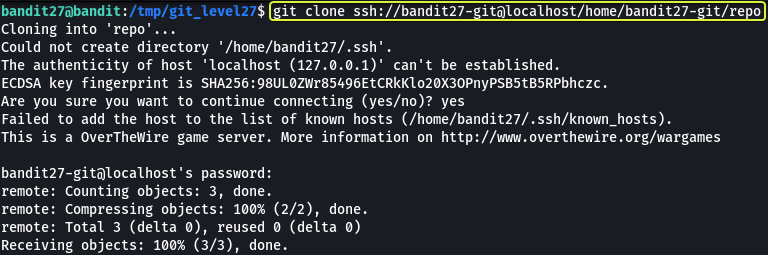

### Level Goal

> There is a git repository at `ssh://bandit27-git@localhost/home/bandit27-git/repo`. The password for the user `bandit27-git` is the same as for the user `bandit27`.  
> Clone the repository and find the password for the next level.

### Commands you may need to solve this level

> git

```
> whatis git  
Git (3pm)        - Perl interface to the Git version control system  
git (1)          - the stupid content tracker
```

### Helpful Reading Material

[Version Control (Git) · the missing semester of your cs education](https://missing.csail.mit.edu/2020/version-control/)

[About Git - GitHub Docs](https://guides.github.com/introduction/git-handbook/)

### Solution

From the question we understand that in this level we are going to be working with Git. Before we clone the repository lets make an folder in the `/tmp` directory as from some of the previous levels we know we only have proper permissions to save files in the `/tmp` folder.

```
bandit27@bandit:~$ cd /tmp/

bandit27@bandit:/tmp$ mkdir git_level27

bandit27@bandit:/tmp$ cd git_level27

bandit27@bandit:/tmp/git_level27$
```

Now that we have created our working directory lets clone the repository.



The password for the repository is the same as bandit27

```
Password: 3ba3118a22e93127a4ed485be72ef5ea
```

Now that we have the repository cloned to our machine. Lets see what are the files that are present in the repository.


We see that there is a file called as "README" in the folder. Lets have a look at the contents of this file.

**Note:** The `.git` directory found in the repository is created by git that consists of files that are required for the proper functioning of the features that are provided by git.

```
bandit27@bandit:/tmp/git_level27/repo$ cat README   
The password to the next level is: 0ef186ac70e04ea33b4c1853d2526fa2
```

And there we go we have the password for the next level !!!

Logout of the current session and login as bandit28 to start the next level

```
ssh bandit28@bandit.labs.overthewire.org -p 2220

This is a OverTheWire game server. More information on http://www.overthewire.org/wargames

bandit28@bandit.labs.overthewire.org's password: 0ef186ac70e04ea33b4c1853d2526fa2
```