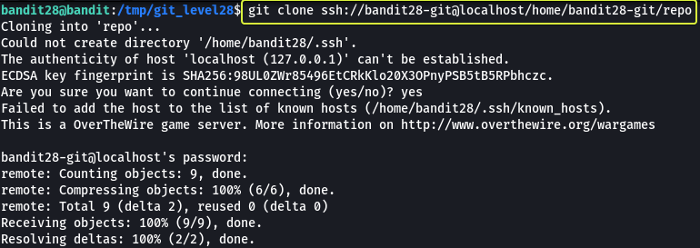
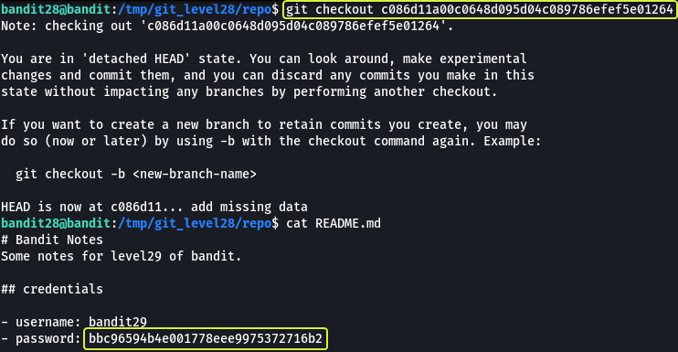

### Level Goal

> There is a git repository at `ssh://bandit28-git@localhost/home/bandit28-git/repo`. The password for the user `bandit28-git` is the same as for the user `bandit28`.  
> Clone the repository and find the password for the next level.

### Commands you may need to solve this level

> git

```
> whatis git  
Git (3pm)        - Perl interface to the Git version control system  
git (1)          - the stupid content tracker
```

### Helpful Reading Material

[Version Control (Git) · the missing semester of your cs education](https://missing.csail.mit.edu/2020/version-control/)

[About Git - GitHub Docs](https://guides.github.com/introduction/git-handbook/)

### Solution

From the question we understand that in this level we are going to be working with Git. Before we clone the repository lets make an folder in the `/tmp` directory as from some of the previous levels we know we only have proper permissions to save files in the `/tmp` folder.

```
bandit28@bandit:~$ cd /tmp/

bandit28@bandit:/tmp$ mkdir git_level28

bandit28@bandit:/tmp$ cd git_level28

bandit28@bandit:/tmp/git_level28$
```

Now that we have created our working directory lets clone the repository.



The password for the repository is the same as bandit28

```
Password: 0ef186ac70e04ea33b4c1853d2526fa2
```

Now that we have the repository cloned to our machine. Lets see what are the files that are present in the repository.


We see that there is a file called as "README.md" in the folder. Lets have a look at the contents of this file.

**Note:** The `.git` directory found in the repository is created by git that consists of files that are required for the proper functioning of the features that are provided by git.

```
bandit28@bandit:/tmp/git_level28/repo$ cat README.md   
# Bandit Notes  
Some notes for level29 of bandit.

## credentials

- username: bandit29  
- password: xxxxxxxxxx
```

Looks like the password for bandit29 has been censored out in the README.md file. There is an possibility that in one of the previous commits the password was present in plain text. Lets have a look at the commit log of this repository.


From the output we understand that initially a README.md file was added. Later some missing data (credentials) was added into the file and in the latest commit the info leak was fixed. So we if we go back one commit we should be able to see the credentials.

To go to an previous version of the repository we make use of the `git checkout` command along with the commit id.

**Note:** When specifying the commit id it is not necessary to use the entire string. The starting 6 digits should be more than sufficient.



Where we go we have found the password for the next level !!!

Logout of current session and login as bandit29 to start next level

```
> ssh bandit29@bandit.labs.overthewire.org -p 2220

This is a OverTheWire game server. More information on http://www.overthewire.org/wargames

bandit29@bandit.labs.overthewire.org's password: bbc96594b4e001778eee9975372716b2
```