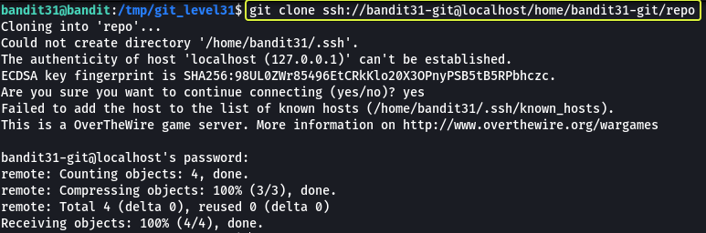

## Level Goal

> There is a git repository at `ssh://bandit31-git@localhost/home/bandit31-git/repo`. The password for the user `bandit31-git` is the same as for the user `bandit31`.  
> Clone the repository and find the password for the next level.

## Commands you may need to solve this level

> git

```
> whatis git  
Git (3pm)        - Perl interface to the Git version control system  
git (1)          - the stupid content tracker
```

## Helpful Reading Material

[Version Control (Git) · the missing semester of your cs education](https://missing.csail.mit.edu/2020/version-control/)

[About Git - GitHub Docs](https://guides.github.com/introduction/git-handbook/)

## Solution

From the question, we understand that at this level we are going to be working with Git. Before we clone the repository let's make a folder in the `/tmp` directory as from some of the previous levels we know we only have proper permissions to save files in the `/tmp` folder.

```
bandit31@bandit:~$ cd /tmp/

bandit31@bandit:/tmp$ mkdir git_level31

bandit31@bandit:/tmp$ cd git_level31

bandit31@bandit:/tmp/git_level31$
```

Now that we have created our working directory let's clone the repository.



The password for the repository is the same as bandit31

```
Password: 47e603bb428404d265f59c42920d81e5
```

Now that we have the repository cloned to our machine. Let us see what files are present in the repository.


We see that there is a file called "README.md" in the folder. Let us have a look at the contents of this file.

There is a file called ".gitignore" as well. This file is used to tell git which files should not be added to the repository. This will come in handy later so keep this in mind.

**Note:** The `.git` directory found in the repository is created by git that consists of files that are required for the proper functioning of the features that are provided by git.


We see that this time we have been instructed to add a file to the remote repository. We are given a filename and the content that needed to be added to the file as well as the branch to which the file needs to be pushed. Let us follow these instructions and create a new file.


We have created the file as specified to us in the instructions. Now let us have a look at the ".gitignore" file that is present in the repository.

```
bandit31@bandit:/tmp/git_level31/repo$ cat .gitignore   
*.txt
```

We see a line in the file that says `*.txt` this means that if any file with the extension ".txt" is made in the repository folder it should not be considered part of the repository. So if we try to add the new file that we created it will not be pushed to the remote repository. So let us delete this file and then push the file.


Now that we have deleted ".gitignore" let us commit the changes and push the changes to the remote repository.


By using the "git add" command we instruct git what files need to be added into the staging area. The "." means adding all files with changes. So we are telling git to add all files that have changed in the repository folder to the staging area.

**Note:** Files that have been deleted are also staged so that when we commit the changes git can figure out what files need to be deleted/ modified.

Next, we are committing (adding/ deleting) files into the local copy of the repository. The "-m" flag is used to specify the commit message. If this flag is not specified then the default text editor will be opened using which we can add the commit message.

After performing the above two steps we have added the "key.txt" file and deleted the ".gitignore" file from the repository but the changes will only be reflected on our local copy. The remote copy is still untouched so to update the remote copy we make use of the "git push" command to which we specify the remote repository URL (by default saved in the variable "origin" for a repository that is cloned) and the branch to which we want to push the changes.

Once we pushed the changes to the remote repository we see that we are given the password for the next level

```
remote: Well done! Here is the password for the next level:  
remote: 56a9bf19c63d650ce78e6ec0354ee45e
```

Logout of the current session and log in as bandit32 to start the next level

```
ssh bandit32@bandit.labs.overthewire.org -p 2220

This is a OverTheWire game server. More information on http://www.overthewire.org/wargames

bandit32@bandit.labs.overthewire.org's password: 56a9bf19c63d650ce78e6ec0354ee45e
```