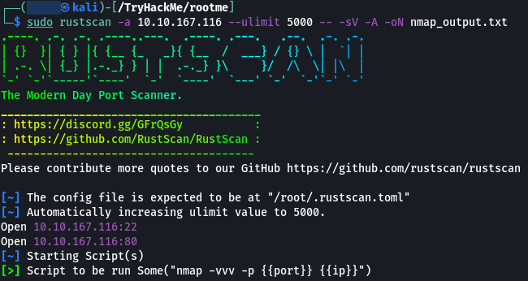
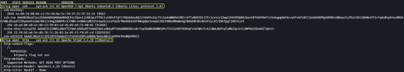
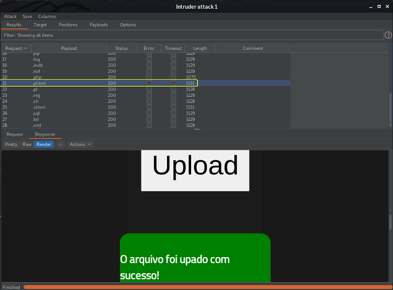
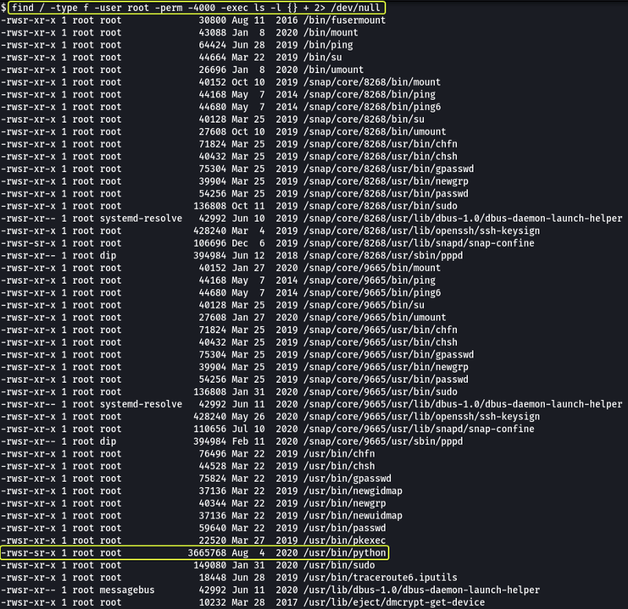

### Task 1 : Deploy the machine

Connect to TryHackMe network and deploy the machine. If you don't know how to do this, complete the [OpenVPN room](https://tryhackme.com/room/openvpn) first.

1. **Deploy the machine**

> No answer required

### Task 2 : Reconnaissance

The first task that is performed when we are given an target to exploit is to find the services that are running on the target. To find services running on the machine I will be using "RustScan" which is an port scanner similar to Nmap but much faster (RustScan in ideal conditions can scan all the ports on the device in under 3 seconds). RustScan also integrates with Nmap so we can find open ports quickly with RustScan and then pipe the results to nmap for using Nmap features.

[GitHub - RustScan/RustScan: 🤖 The Modern Port Scanner 🤖](https://github.com/RustScan/RustScan)



#### Command Options

*   **-a :** Target IP Address
*   **--ulimit :** Number of parallel connections to target
*   **-sV :** Service Versioning
*   **-A :** Aggressive Scan
*   **-oN :** Normal output file

**Note:** All the flags after the `--` along with the ports found by RustScan are going to be passed to nmap for processing

#### Nmap Equivalent

> nmap -vvv -p- -Pn -sV -A -oN nmap_output.txt 10.10.167.116



1. **Scan the machine, how many ports are open ?**

> 2

2. **What version of Apache is running ?**

> 2.4.29

3. **What service is running on port 22 ?**

> SSH

From the Port Scan we have found that there are 2 ports that are open on the target and one of the port is an web server. Lets open the server in or browser and see what we get.


We get an webpage. Lets try to brute force the website and see if we find any hidden directories.


#### Command Options

*   **dir :** Perform directory brute forcing
*   **-u :** URL of Target
*   **-x :** Extensions of files to find
*   **-w :** Wordlist
*   **-t :** Threads (Used for parallelization)

**Note:** The `2> /dev/null` at the end is used to redirect any errors that might occur during the brute forcing process to `/dev/null` (NULL is an special device on Linux that destroys any data that is send to it)

From the above scan we see there are two directories `/uploads` and `/panel` that look interesting and can be useful to us.

4. **Find directories on the web server using the GoBuster tool.**

> No answer required

5. **What is the hidden directory ?**

> /panel

### Task 3 : Getting a shell

Lets visit the `/panel`path and see what we are able to find


We see that we have an upload page. Lets try out files of various extensions to see which are allowed by the website.


I tried to upload an text file first and found that the server allows `.txt` files to be uploaded.


Next I tried to upload a php file and noticed that the server was blocking the uploading of `.php` files. Trying for extensions one by one is going to be tedious so lets use Burp and automate the process.


Capture the upload request using Burp and send the request to Intruder. In the Positions tab set the file extension in the request as the payload (Clear the other payloads of any are selected).


Under the payloads tab. Select an wordlist to use for fuzzig. Here I am making use of the wfuzz common extensions wordlist which is located at `/usr/share/wordlists/wfuzz/general/extensions_common.txt` on Kali Linux.

**Note:** Ensure to deselect the URL-encode these characters option else the fuzzing is not going to work properly.



After the fuzzing was done. I had a look at the result returned for uploading an file with the .phtml extension and saw that the result was success. This is great for us we can use an PHP reverse shell and try to gain access to the system.

We can utilize the excellent reverse shell code that is provided by `pentestmonkey`

[php-reverse-shell/php-reverse-shell.php at master · pentestmonkey/php-reverse-shell · GitHub](https://github.com/pentestmonkey/php-reverse-shell/blob/master/php-reverse-shell.php)

After downloading the file ensure to change the file extension to .phtml and then open the code and set the IP address in the script to our machines IP Address


**Note:** We can find our machines IP Address by using "ip a show eth0" and looking under the inet interface.


When we try to upload the file we see that it gets uploaded successfully. From the Gobuster scan that we had performed at the start we had seen an page called `/uploads` lets open that page and see if we are able to see the files that where uploaded to the server.


We can see the reverse shell that we just uploaded. Before we run the script lets set up an listener on our device this can be done easy using netcat and then lets run the script.

```
netcat -nvlp 1234
```

**Note:** The reason we are using 1234 as port is because this is the port that we specified in the reverse shell script. If you changed the port ensure to change that port here as well.


And as we can see we have managed to get access into the system. On checking which user I was using "whoami" command I saw that I was the "www-html" user.

In the question on TryHackMe we have been told to find a file called `user.txt` so lets make use of the find command and locate this file


#### Command Options

*   **/ :** Search the entire server
*   **-type f :** Search for files only (No directories)
*   **-iname :** Search for file named `<filename>` (Case Insensitive)

**Note:** The `2> /dev/null` at the end is used to redirect any errors that might occur during the brute forcing process to `/dev/null` (NULL is an special device on Linux that destroys any data that is send to it)

We see that there is an file which the name "user.txt" in the `/var/www/` directory

1. **user.txt**

> THM{y0u_g0t_a_sh3ll}

### Task 4 : Privilege escalation

Now that we have found the user flag lets see how we can escalate our privileges and become root. Lets see if there are any files on the system who's SUID bit is set and it is owned by the root user. Files with the SUID bit set when executed are run with the permissions of the owner of the file. So if there is an binary that is owned by root and it has the SUID bit set we could theoretically use this binary to elevate our permissions.

[How to Use SUID, SGID, and Sticky Bits on Linux](https://www.howtogeek.com/656646/how-to-use-suid-sgid-and-sticky-bits-on-linux/)



#### Command Options

*   **/ :** Scan the entire device
*   **-type f :** Look only for files (No directories)
*   **-user root :** Check if the owner of file is root
*   **-perm -4000 :** Look for files that have minimum 4000 as their privilege. 4000 is the numerical representation for a file who's SUID bit is set.
*   **-exec :** Execute a command using the results of find
*   **ls -l {} + :** Display the results in long form ({} is an placeholder for the results that are returned by find. + at the end is used to terminate the -exec option)

The `2> /dev/null` at the end is not required but using that we are sending any errors that could be returned by find (directories that cannot be accessed due to lack of proper permissions) to NULL. NULL is an special device on Linux that deletes whatever data is send to it.

Looking at the output we see that the python binary this is not the usual permissions for this binary so we might be able to use this to gain root access.

1. **Search for files with SUID permission, which file is weird ?**

> /usr/bin/python

Whenever we have to exploit an system binary we refer "GTOBins" who have instructions on how these binary files could be exploited.

2. **Find a form to escalate your privileges.**

> No answer required

[GTFOBins](https://gtfobins.github.io/)


When we search for Python and we look under the SUID session we can see that by running a line of command we could exploit this binary. Lets try this code and see if we can get root.

After running the code and running "whoami" we see that we have become root. Now similar to the user.txt lets search for root.txt using the find command and see there the file is located.


3. **root.txt**

> THM{pr1v1l3g3_3sc4l4t10n}

That's all. Happy Hacking :)