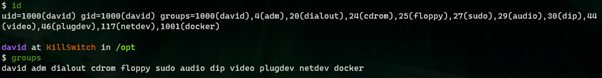
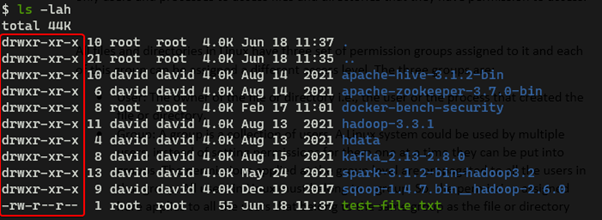
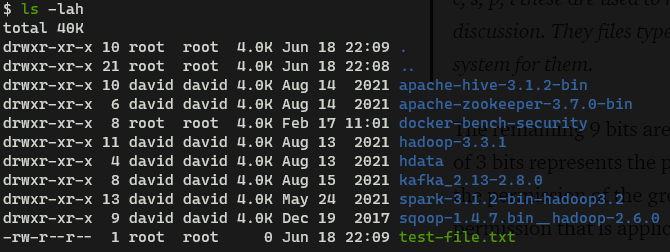
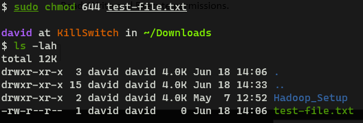

File permissions is an important concept to understand for anyone working with Linux. Permissions are a set of attributes (along with ownership) which is used to control the level of access the users and system processes have on files. It is a security mechanism which ensures that only authorized users and processes can access certain files and directories.

### Permission Groups

All files and directories in Linux have three permission groups assigned to them. Each of this group can be assigned a different access level. The three groups are as follows:

*   **User**: This group represents the owner of the file or directory i.e., the user or the process that created the file or directory.
*   **Group**: A group is nothing but a group of users. A Linux system can have multiple users and say that these users need to be assigned the permissions, instead of setting permissions for them one at a time we can add them all into a group. The permissions applied at the group level are propagated to all the users in that group. So, the permission assigned here applies to all the users that belong to the same group as the file or directory.
*   **Others**: The permissions specified to this group applies to everyone on the system that isn't the file owner and does not belong to the file or directory owner group.

### File Ownership

Before we get into permission sets let's have a quick look on file ownership. Every file and directory in Linux belongs to a user and group. We can view this information using the **ls** command


Notice the highlighted section the first column denotes the owner of the file and the second column denotes the group that owns the file. A file or directory can only be owned by a single group.

To view the groups that we are part of we can make use of the **id** or **groups** command



Notice the numeric values that are outputted by the id command this is the numeric values that is assigned for each user and group on the system. It is also perfectly valid for a user to belong to multiple groups which can be seen in the output of the id and groups command. The value show as UID (User ID) is the name of the user of the system while the value shown as GID (Group ID) is the **primary group** of the user. When a user creates any file or directory it is by default going to be owned by this group.

### Permission Sets

There are three permissions that can be assigned to each file or directory. These permissions are Read, Write and Execute.

| Permission | Access for File                                                                                         | Access for Folder                                      |
|:----------:| ------------------------------------------------------------------------------------------------------- | ------------------------------------------------------ |
|    Read    | Allows a user to read the content of a file but not modify or delete its content                        | Allows a user to list of the contents of the directory |
|   Write    | Allows a user to read a file and modify and edit its content                                            | Allows user to rename, create and delete files         |
|  Execute   | Allows to execute/ run a binary file. Script files require the read permission as well to be executable | Allows to search directory and cd into the directory   |



Going back to the output from before now let's focus on the first column. Notice that there are always 10 bits that are present in this column for each file and directory. The first bit is used to represent the type of file. A **d** in this position represents a directory while a hyphen (**-**) would mean a normal file.

> **Note**: There are some other values that can be found in this position as well like b, c, s, p, l these are used to represent file types which are beyond the scope of this discussion. They files types will only be encountered if one goes digs through the system for them.

The remaining 9 bits are broken down into 3 groups of 3 bits. The first group of 3 bits represents the permission of the owner. The next group represents the permission of the group that owns the file and the last 3 bits represent the permission that is applicable to everyone else on the system.

The first position of each of the 3 groups can have the value r (Read), the second position can have the value w (Write) and the last bit can have the value x (Execute). If any of the 9 bits has a hyphen (-) in its place it means that permission is not set.



Coming back to the image lets try to use what we have learned and try to understand the image more clearly. We can see that there are 8 directories and 1 normal file (Deduced by looking at the first bit of the permissions column) . The directories have the Read, Write & Execute bits set for the owner, the Read and Execute bits set for the owner group and the same bits (Read and Execute) set for the other users. Most of the directories (7 of them) are owned by the user "david" and belong to the group "david" while one of the directory is owned by the user "root "and belongs to the group "root". As for the lone file in the image the owner has the Read and Write bits set, the owner group and other users have only the Read bit set. The file is owned by the "root "user and "root" group.

> **Note**: The first & second directory are special directories. Period (.) denotes the current working directory while Double Period (..) represents the parent directory of the current directory

Permissions can be also represented in numerically form: Read (4), Write (2), Execute (1) and No Permission (0). These permissions can be added together as denote complex permissions as shown below

| Number | Permission Type       | Representation |
|:------:| --------------------- |:--------------:|
|   0    | No Permission         |       —        |
|   1    | Execute               |       –x       |
|   2    | Write                 |      -w-       |
|   3    | Execute & Write       |      -wx       |
|   4    | Read                  |       r–       |
|   5    | Read & Execute        |      r-x       |
|   6    | Read & Write          |      rw-       |
|   7    | Read, Write & Execute |      rwx       |

### Granting & Revoking Permissions

The permissions on a files can be changed using the **chmod** (Change Mode) command. There are two methods to set the permission of a file — symbolic method and the numeric method.

#### Symbolic Method

This approach requires us to explicitly and verbosely specify the permissions that need to be applied on the file. It has the following general form:

```
chmod WhoWhatWhich filename
```

*   **Who**: User, Group, Others, All (u, g, o, a)
*   **What**: Add, Remove, Exact (+, -, =)
*   **Which**: Read, Write, Execute (r, w, x)


We have a file called `test-file.txt` now let's change the permissions for this file so that the owner and others permission groups can have the Read, Write and Execute permissions.


The permission of each of the groups can be assigned separately as a comma separated values as well.

```
sudo chmod u=rwx,o=rwx test-file.txt
```

The plus (+) and minus (-) signs can be used if we want certain permissions to be added or removed. The equal (=) sign sets the permissions exactly to the value specified by the user.

#### Numeric Method

In this approach we make use of the numeric representation of the permissions that were discussed earlier. We need to specify three numbers the first represents the permission of the owner, the second one represents the permission of the owner group and the third represents the permission that is assigned to all the other users.

```
chmod ### file
```

Before we set an example lets reset the permission of the file to its original permission using the Symbolic method and then try to set the same permissions using the numeric method.


As we can see with this approach we can quite quickly and elegantly set the permissions for the file.



In closing, permissions are an important part of the Linux system and is very critical to understand in order to work with Linux effectively. We looked into what are permissions groups and permissions sets. Then we took a small detour to understand groups and file ownership. Then we explored the two methods that can be used to change the permissions of file and directories: symbolic and numeric.

### References

*   [Understanding Linux File Permissions \| Linuxize](https://linuxize.com/post/understanding-linux-file-permissions/)
*   [Understanding Basic File Permissions and ownership in Linux – The Geek Diary](https://www.thegeekdiary.com/understanding-basic-file-permissions-and-ownership-in-linux/)
*   [Fetching Title#5e9d](https://linuxfoundation.org/blog/classic-sysadmin-understanding-linux-file-permissions/)