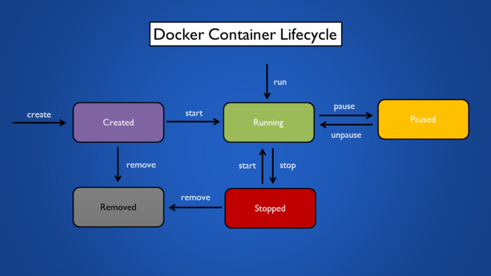
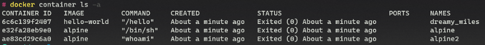
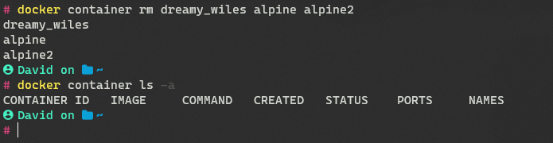
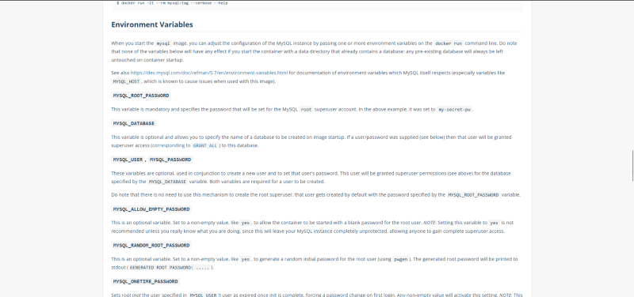
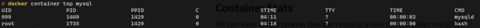

So far, we have looked at the basics related to containers and the various Docker commands for managing Images. In this article, we are going a dive deeper and look at Containers (finally) and their associated commands.

### Container Lifecycle

There are 5 states in which a container can exist during its entire lifetime. These states are illustrated in the figure below.

In this article, we will be covering the 3 main states that we need to know to work with containers - Running, Stopped, and Removed



> **Note:** In the Docker CLI a container in the Running state is shown as **Up** and a container in the Stopped state is shown as **Exited.**

### Container Run Modes

There are two main modes in which images can be run:

*   Foreground Mode (Default)
*   Detached/ Daemon Mode

Foreground mode is further classified into two types Interactive and Non-Interactive

#### Foreground Mode (Non-Interactive)

Containers can be started using the "container run" command.

```
docker image pull hello-world

docker container run hello-world
```

> **Note:** To run an container its not necessary to have the image downloaded locally in advance the docker run command will pull the image from Docker Hub if not found on our system


As you can see the container **started** running a **command** and then **exited**. It is important to note that in Non-Interactive foreground mode, as the name implies we cannot interact with the running container.

**How did the container know what to execute when it was started?**

The command to run at startup is determined by the Dockerfile which is used to build the image (We will look at this in detail in a future article). There is a command called CMD specified in the Dockerfile, which determines the command to execute when a container is run.

There are multiple ways to find out the command that will be executed at the start of the container. One way to check is to use the "image inspect" command

```
docker image inspect hello-world
```


The output shows us all the metadata related to the image. The key that we are looking for is CMD (highlighted in the above image)

Another way to get this information is to look at the Dockerfile directly this can be done by clicking on the tags specified on the Docker Hub page of the image which will take us to a [GitHub](https://github.com/docker-library/hello-world/blob/3332fbee4210b41738d83f6cfdc301a42b96e30d/amd64/hello-world/Dockerfile) repo with the Dockerfile used to build the image (The Dockerfile used to create images are open source and can be viewed by anyone)


The last line CMD is what we are looking for, and it matches the results that we saw from the "image inspect" command

#### Foreground Mode (Interactive)

To run a container in Interactive mode, some additional parameters need to be passed to the "container run" command

```
docker container run --name alpine -it alpine /bin/sh
```

Let's break down the above command the `--name` flag is used to give a name to the running instance of the image (container). This is an optional flag and, if not specified, will be randomly assigned. The `-it` flag is used to specify that we want to run the container in interactive mode and attach the stdin of the container to our terminal (This allows us to execute commands on the container). `/bin/sh` is the command we want to run once the container is started.


Whatever command we specify after the name of the image will override the CMD statement that was specified in the Dockerfile during Image creation.


> **Note:** When we use the run command to start a container Docker internally first runs the **create** command which creates a instance of the image with an modifiable layer added on top of it. At this point the container is still not started by its in a ready state i.e. the configurations to start are container are complete. After this Docker actually starts the container.

### Listing Containers

As discussed earlier in the Lifecycle section, a Docker container can be in multiple states during its lifetime. To view **all** the containers irrespective of their state, we can use the "container ls -a" command.

```
docker container ls -a
```

If the `-a` flag is not used, then only the running containers will be shown.



In the above image, the status of all the containers show as Exited which means they are all in the Stopped State.

> For anyone wondering the names assigned automatically to containers is always an **adjective** followed by the name of an **scientist** :)

### Removing Containers

Once a container has finished executing it will enter the exited (Stopped) state. The rm command is used to clean such containers.

```
docker container rm <container-name>
```



If we do not want interactive containers to persist after we are done using then we can pass the `--rm` flag when creating the container.

```
docker container run --rm hello-world
```


As we can observe this time once the container has finished executing we do not see the container in an exited state in the container list.

### Detached/ Daemon Mode

Containers that are started in detached mode start in the background and do not attach themselves to our terminal. Let us try this using the [MySQL](https://hub.docker.com/_/mysql) image.

```
docker image pull mysql

docker container run --name mysql -d -e MYSQL_ROOT_PASSWORD=password -e MYSQL_ROOT_HOST=% mysql
```


Some Docker images allow defining environment variables that are used to configure some of the parameters used by the image. We can set these parameters using the `-e` flag.

The list of parameters that can be set on an image can be found by looking at the [page](https://hub.docker.com/_/mysql) of the image on Docker Hub.



The ports column from the above image will be covered in detail in the next article. But in brief, Docker allows us to expose some ports on the container which allow us to connect to the container and interact with the service running within it.

What's important to observe is that this time the container is running in the background and is not attached to your terminal.

### Stopping Container

Unlike interactive containers, detached containers need to be stopped explicitly by the user (unless they crash in which case they automatically go to the stopped state)


So once we are done using a container we need to stop it using the "container stop" command.

```
docker container stop <container-name>
```

Alternatively, we can skip the stop command and pass the `-f` flag to the rm command to forcefully remove the running container.

```
docker container rm -f <container-name>
```

Another way to stop a container is to use the "container kill" command, while the result achieved by both commands is the same (stop the container) they go about it differently.

```
docker container kill <container-name>
```

> The _docker_ **_stop_** commands issues the **SIGTERM** signal, whereas the _docker_ **_kill_** commands sends the **SIGKILL** signal

SIGTERM and SIGKILL are Linux signals used to denote the occurrence of an event to processes. The key thing to understand is that SIGTERM is a tamer operation than SIGKILL. The stop command causes the container processes to be terminated gratefully (gives the process in the container few seconds to close properly) unlike the kill command that ends it immediately.

For normal day-to-day Docker usage, it is also better to stick to the "container stop" command unless there is some special reason to use the kill command. I have attached references on this topic which can be refereed for additional details.

### Containers Logs

Some Docker Containers have logging enabled for easy debugging and finding errors that could have occurred using the lifetime of the container. These logs can be accessed using the "container logs" command.

```
docker container logs <container-name>
```


The `-f` flag can be passed to the above command to follow the logs as they are generated.

### Starting Stopped Containers

Suppose we have a stopped container and we want to start it up again then we can use the "container start" command.


From the above image, we can see that the mysql container was started in detached mode, after some time the container was stopped and then later the stopped container was started again.

By default, containers will restart in the mode they were created in using the "container run" command. To restart a detached mode container in interactive mode the `-ai` flag can be used.

```
docker container start -ai <container-name>
```

### Execute Commands on Container

Say we have a running container and we want to quickly run a command on it or we want to debug some error that is occurring in the container for these cases we can make use of the "container exec" command.


In the above image we can see that the MySQL container was started in detached mode and then using the exec command we printed out the name of the current user.

Unlike the "container run" command even after we execute a command on the container the entry point was not overwritten and the container continued to run normally.

The exec command can also be used to connect to the container in interactive mode by using the `-it` flag. The `-u` flag is used to specify the username id of the user to run the container.

> **Note:** An interactive container can be converted into an detached/ daemon container using the `Ctrl + P + Q` shortcut this even works for containers that are started in interactive mode using the "start" and "run" commands.

### Container Statistics

We can view all the processes that are running inside the container using the "container top" command.

```
docker container top <container-name>
```



Similarly to view the resource utilization of all the containers running on the system the "container status" command can be used.

```
docker container status
```


To view all the metadata information related to a container the "container inspect" command can be used.

```
docker container inspect <container-name>
```


### References

*   [Difference Between docker stop and docker kill Commands \| Baeldung](https://www.baeldung.com/ops/docker-stop-vs-kill)
*   [what's the difference between `docker stop` and `docker kill`? - Super User](https://superuser.com/questions/756999/whats-the-difference-between-docker-stop-and-docker-kill)
*   [Which one should I use? docker kill or docker stop? - Stack Overflow](https://stackoverflow.com/questions/28339469/which-one-should-i-use-docker-kill-or-docker-stop)
*   [Docker Container Lifecycle Management \| Docker create run stop remove](https://k21academy.com/docker-kubernetes/docker-container-lifecycle-management/)