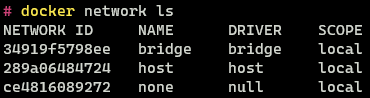
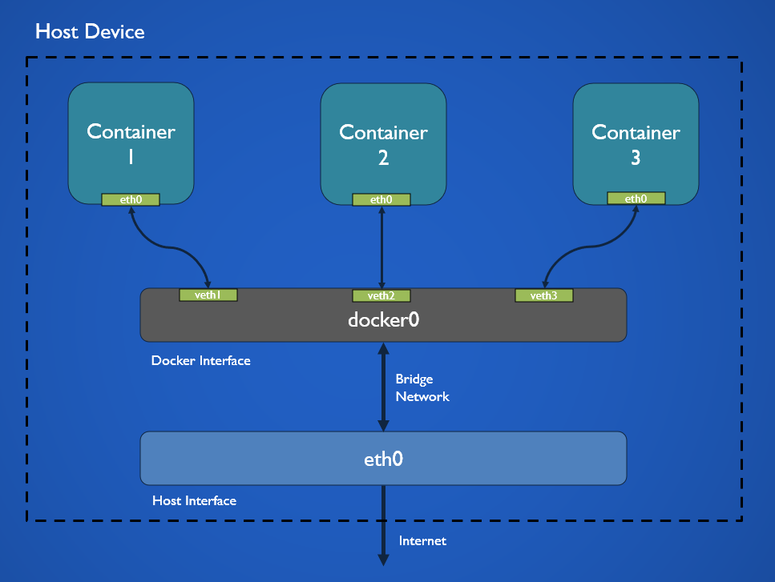
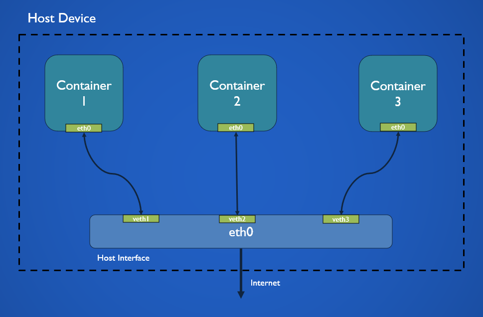
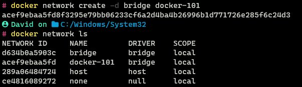
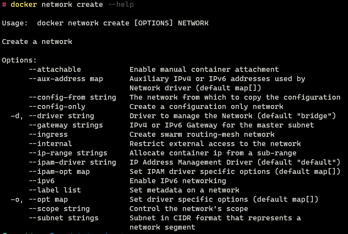
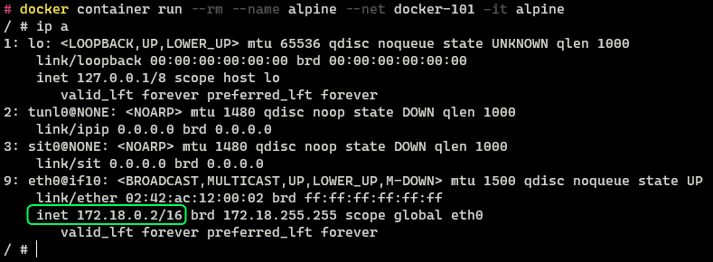
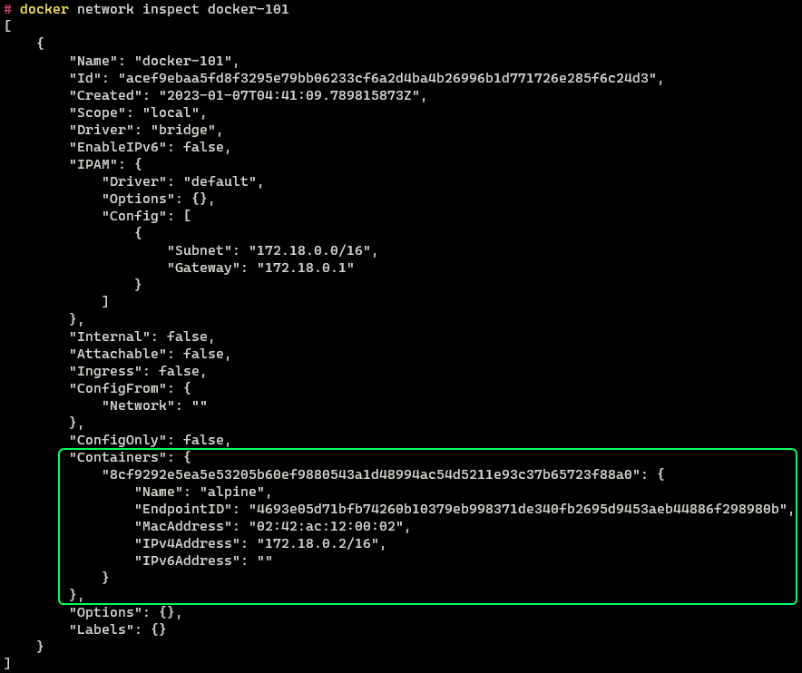
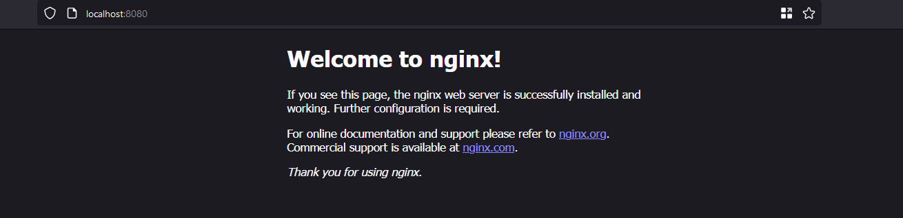
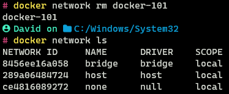

In this post we will be looking at Docker **Networks** with its types and how to use them. The reader is expected to have a high level understanding of Docker and Computer Networks before going through this post.

Docker network helps to facilitate communication between containers and other non-containerized services. That's right not only can a container communicate with other containers, they can even communicate with other services and processes that are not containerized. And the best part all this is possible with minimal configuration and platform agnostic steps.

### Docker Network Types (Default)

To view the networks present in Docker run the following command

```
docker network ls
```



There are three networks that are present by default in all Docker Installations - **Bridge**, **Host** and **None**. The network types are also referred to as **Network Drivers**.

There are additional network drivers (types) that can be downloaded and used in Docker as well. Some of these are provided by Docker while some are provided by third party vendors. Docker Networks are designed to be plug and play so once downloaded without any setup they can be used. Behind the scenes Docker uses platform specific features like iptables, port forwarding, virtual network devices to implement the different network types. This is considered an implementation detail and should be left to Docker to manage. 

#### Bridge Driver



The bridge driver allows to connect separate networks together (Similar to physical Bridge Device). Docker creates an vertical interface called `docker0`. This virtual interface is connected to the network interface on the host system. The host system interface is in turn is connected to the gateway (router/switch) from where it is connected to the internet.

When a new container that uses host network is created it is connected to the `docker0` interface using `veth` (Virtual Ethernet Device). Virtual Ethernet Device can be taught of as a Ethernet cable that is connected from a container to a switch. `veth` creates a virtual tunnel which allows data to flow to and from the container and `docker0` interface. From here the packets travels to the network interface on the host system from where the packets can reach the internet.

Docker containers when created contain an network interface `eth0`  which with the help of `veth` is connect to a port on the virtual docker network interface. The `docker0` interface has its own namespace which means it has its own DNS, iptables, routes rules, etc. and none of the network stack components are shared with the host system interface.

Docker allows us to also create custom bridge networks. In this case instead of `docker0` a different virtual interface, that has its own namespace will be created. This custom bridge interface will also be connect to the `eth0` interface of our host similar to `docker0`.

When a port is exposed by the container on the bridge network. Docker automatically behind a scenes creates firewall rules that forward that port to the specified port on the host system, this is why when `-p` flag is used the container becomes accessible on the host network.

Containers that are connected to the same interface can communicate with each other without exposing any ports by using their container (host) names. We can use container names as the bridge networks have their own DNS server which resolves the host name of the container to its IP address. Containers connected to the same network behave in the same way as physical devices connected in a local network.

While its true that all custom bridge networks have their own DNS server, this is not true for the default bridge network. On this network containers can only connect to each other using IP Addresses unless explicitly connected using the `--link` option. The default bridge network is not recommended to be used in production environment it is only retained for legacy applications and backwards compatibility. When we create a container and don't specify a network it is always connects to the default bridge network. 

More details about the differences between the default bridge network and the user defined bridge network can be found in link (5) in the references section.

#### Host Driver



The host driver allows a container to directly bind to the network interface of the host system. The containers network stack is not isolated from the host in this mode, the container uses the same network namespace as the host system.

As the container is not running in its own isolated network it does not get its own IP Address either. When a port is opened on the container it causes the same port to be opened on the IP Address of the host system.

Host network is supposed to be faster then bridge mode as there is no need for DNS, NAT (Network Address Translation) and other proxies between the host systems network and docker virtual network though in practice this will not be noticeable unless the container exposes a large amount of ports.

Host driver only works on Linux and is **not supported on Windows and MacOS**

#### None Driver


The none driver is used when we want to run containers in complete isolation from each other and the outside world. Containers created in this mode do not have a network stack they only contain a loopback interface. There is no way for the container to connect to the host systems network interface or access the internet.

### Docker Network Commands

#### Inspect Network

To view the configuration details of a network like the network name, id, subnet information and connected containers the `network inspect` command is used. A network can be inspected using its name or its id

```bash
docker network inspect <network-name>
docker network inspect bridge
```


#### Creating New Networks

A new network can be created using the `network create` command. The `-d` flag is used to specify the driver to use to create the network (default: bridge)

```bash
docker network create -d <driver> <network-name>
docker network create docker-101
```



When creating a custom network there are other parameters related to the network that can be configured as well. These options are more advanced and are not required for most use cases. To view these options the `--help` command can be used



#### Adding Container to Network

A container can be attached to a network using in the `--net` option in the `container run` command.

*(Refer Part 2 and 3 in the series for more details on docker container and image commands)*

```bash
docker container run --rm --name alpine --net docker-101 -it alpine
```



The container has been assigned an IP Address `172.18.0.2` automatically using the DHCP server of the virtual docker network. We can confirm the same information by inspecting the network configuration.



In the configuration there is an new section called "Containers" we can see the alpine container is connected to this network and has the same IP Address as seen from within the container.

This same detail can also be verified by looking at the configuration of the container using the `container inspect` command.

```bash
docker container inspect alpine
```

Under the "NetworkSettings" section we can see the details related to the network. We can see that this container is indeed connected to the `docker-101` network.


#### Exposing Port on Container

We can expose ports on the container to be accessible from the host system using the `-p` flag in the `container run` command. Using this option we can access services that are running within the container.

*(Refer Part 2 and 3 in the series for more details on docker container and image commands)*

```bash
docker container run --rm --name nginx -it \
	--net docker-101 -p 8080:80 nginx
```

The syntax for the `-p` flag is as followed `-p <host-port>:<container-port>`. So the `-p` option in the above command translates to open port 80 on the container and connect it to port 8080 on the host system. This makes it such that the http server that is running on the container can be accessed on port 8080 on our local system.

By exposing ports on the container from the host system we are able to access services that are running inside the container.

As discussed in the Host Driver Section Docker behind the scenes uses system specific commands and features to make changes in host systems network interface and the virtual interface that it creates to allow this communication to happen.




The ports that are exposable on a container will always be provided on the details page of the image on the Container Registries website. The same detail can be also found in by using the `image inspect` command and consulting the `Dockerfile` used to build the image.

#### Inter-Container Communication 

Containers that are on the same network can communicate with each other using there hostname. By default the host name is the name that is assigned to the container when its created, by using the `--network-alias` flag a custom hostname that is different from the name of the container can be defined.

For this demonstration I created two alpine containers both connected to the `docker-101` network that we had created before. One container is called `alpine1` and the second container is called `alpine2`. Alpine2 is also assigned a custom hostname `alpine-host`

```bash
docker container run --rm --name alpine1 \
	--net docker-101 -it alpine

docker container run --rm --name alpine2 \
	--net docker-101 --network-alias alpine-host -it alpine
```


We can inspect the `docker-101` network to see that indeed both the containers are using it

```bash
docker network inspect docker-101
```


From `apline1` when we ping `alpine-host` we can see the `alpine2` is accessible from `alpine1`. If we perform the same in the opposite direction it still works. 

From the results observed we can conclude that containers that are running on the same network can access each other using their hostname without any special configuration.

```bash
# Run in Container 1 (alpine1)
ping alpine-host -c 4

# Run in Container 2 (alpine2)
ping alpine1 -c 4
```


> **NOTE**:  
> If we want to access a service that is running on the host system from the container we can use the special DNS name `host.docker.internal` which will resolve to the internal IP Address of the host. Similarly to get the IP of the host gateway the DNS name `gateway.docker.internal` can be used.
> 
> For more details on the same refer link (6) provided in the reference section

#### Host Mode Communication

As discussed earlier containers running in host mode the ports do not have to be exposed explicitly (in fact we will get a warning if we use the `-p` flag) as the containers are directly connected to the interface of the host system.

```bash
docker container run --rm --name nginx \
	-it --net host nginx
```

> **NOTE**:  
> This mode will not work on Docker for Windows and MacOS

Now nginx will be accessible on port 80 on the host system at `http://localhost:80`

#### Add Running Container to Network

It is possible to connect and disconnect a container from a network using the `network connect` and `network disconnect` commands

```bash
# Connect Container to Network
docker network connect <network-name> <container-name>

# Disconnect Container from Network
docker network disconnect <network-name> <container-name>
```

#### Delete a Network

Once we are done using a network it can be deleted using the `network delete` command

```bash
docker network rm docker-101
```



### Docker Network Types (Others)

#### MACVLAN Driver

The MACVLAN driver allows to make Docker containers appear as if they are directly connected to the physical network (The container would appear like its a physical device connected to the router/ switch in the network).

Each containers network interface gets its own IP Address and MAC Address which is assigned to it by the default gateway of the network. This driver is mostly used by legacy applications that cannot function without be connected to a physical network  and/ or by network monitoring devices that need to be on the same network as the other devices in order to be able to analyze packets.

This network mode has some special requirements which need to be supported by the host system and the network gateway for it to work properly. For more details on this driver refer link (7) provided in the references section.

#### IPVLAN Driver

The IPVLAN driver allows to assign containers to different networks which all appear to be connected to the host device (To the networks created by Docker the host system will appear like the router of the network).

In this mode the containers are not assigned there own MAC Addresses but they still get their own IP Addresses. The MAC Address of the host is shared by all the containers. By default in this mode the containers cannot access the internet, inter network communication between the container is possible.

For more details on this network mode and its features and limitations refer link (8) provided in the reference section.

#### Overlay Driver

The Overlay driver is used by default in Docker Swarm a mode that allows Docker to run and manage containers on multiple devices as if they are all part of the same network (Distributed System). 

Overlay mode allows to connect multiple Docker daemons (Docker Hosts) together into a single large system. It can be used to communicate with a container running on a standalone Docker daemon from a Swarm network as well as connect containers running on separate standalone Docker daemons.

For more details on overlay network refer link (9) provided in the reference section.

### References

1.  [Networking overview \| Docker Documentation](https://docs.docker.com/network/)
2.  [Use bridge networks \| Docker Documentation](https://docs.docker.com/network/bridge/)
3. [Use host networking \| Docker Documentation](https://docs.docker.com/network/host/)
4. [Container networking \| Docker Documentation](https://docs.docker.com/config/containers/container-networking/)
5. [Going Behind The Scenes of Docker Networking - Argus](https://argus-sec.com/blog/engineering-blog/docker-networking-behind-the-scenes/)
6. [Explore networking features \| Docker Documentation](https://docs.docker.com/desktop/networking/)
7. [Use macvlan networks \| Docker Documentation](https://docs.docker.com/network/macvlan/)
8. [Use IPvlan networks \| Docker Documentation](https://docs.docker.com/network/ipvlan/)
9. [Use overlay networks \| Docker Documentation](https://docs.docker.com/network/overlay/)