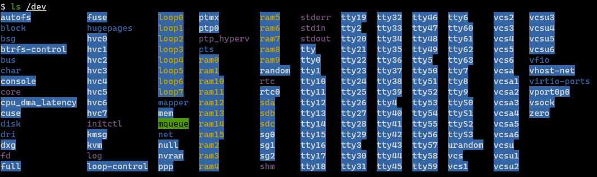
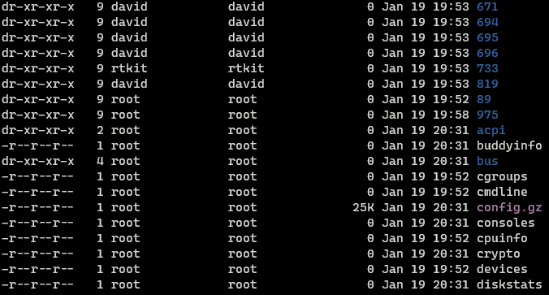

All devices generate data in some shape or form. The generated can have different structures, sizes and even different levels of sensitivity. To store data permanently computers make use of nonvolatile storage devices like Hard Disk Drives (HDD), Solid State Drives (SSD) and USB Sticks. Once the data is written to disk we need some method to be able to retrieve and manage the stored data, this is where filesystems (often abbreviated to fs) come into the picture. 

> Data cannot be permanently stored on RAM as its a type of volatile memory. Volatile memory can only hold data while its powered, when power is removed everything on it is destroyed. 

A filesystem is a method and data structure that is used by Operating Systems to help retrieve, store and manage data, it can also be taught of as an index that is used to quickly and efficiently access files that are present on disk. Different Operating Systems (OS) can and will use different filesystems to manage data. In this post, we will look at the structure of the filesystem that is found on Linux systems.

The Filesystem Hierarchy Structure (FHS) is a reference standard created to describe the layout of directories and their content on a Linux system. This standard is maintained by Linux Foundation and is currently in its 3rd version.

On Windows, if the PC has more a one physical storage medium or partition then each storage medium or partition is assigned a different drive letter. In this type of filesystem, each drive has its separate file hierarchy. This means to look for a file we may have to search different drives like `C:` and `D:`. When we connect a removable device like USB it will also show up as a separate drive letter.

The Linux filesystem combines all drives into a single filesystem which starts at `/`. All other directories on the system are a child of the `/` directory. This means that there is only one file hierarchy to search for files on the device. Even removable devices like USBs that are connected to the system will show up as a subdirectory under `/`. 

### Linux Filesystem Structure


> **Pro Tip:**  
> For a high level overview of the directories and its purpose on the filesystem one can use the `man hier` command

#### / (Root) Directory

All the files and directories in Linux are located under the root directory. It is the parent of all directories on Linux. Only the root user has permission to write in this directory.

#### /bin Directory

The `/bin` (Binary) directory stores binary files that are used for booting as well as repairing the operating system. In Single user mode, only binaries in this directory are available by default. The executables in this directory are system critical i.e. they are required for the OS to operate properly.

> **What is single user mode ?**  
> It is a mode in Linux that is mainly used for maintenance and repair of the operating system. In this mode services that are not critical to the OS are not started. Most of the directory are also not mounted, even the network services are stopped in this mode. If we start the OS in this mode we are directly logged into the system as the root user (no login screen). Single user mode is also called rescue mode, run level 1 and run level S. On some systems, rescue mode and single user mode are considered different run levels. This mode is like the Linux equivalent of Safe Mode on Windows.  
>   
> The mode that we normally use Linux in is called multiuser mode. This mode has two types, one in which we operate the system using the GUI (used on most PCs and Laptops) also called graphical mode and another where we use the system using the command line (Severs). For the system to reach the multiuser state it has to first reach single user mode.

#### /sbin Directory

All the points mentioned for `/bin` hold are applicable for `/sbin`. The difference is that for running the binary files located in this directory the user needs to have root privilege.

> **Important:**  
> Keep the points mentioned about `/bin` and `/sbin`  and `/lib` in mind as we will revisit them in the `/usr` directory section.

#### /lib Directory

Library files are pieces of code that can be used by executables that are present in `/bin` and `/sbin`. The files present in this folder are used to provide functionalities that are common to multiple executables, instead of including the library code again and again with each executable they are stored in this directory from where all applications can reference it as required.

A common extension found in this directory is `.so` (Shared Object). Library files that are used by the Linux kernel can be found under `/lib/modules`. 

On some systems, there will be additional library directories like `/lib32` and `/lib64`. These folders also contain library code but here they are segregated based on the architecture for which they were compiled. Files in the `/lib32` folder will only work on 32-bit systems and files in `/lib64` will only run on 64-bit systems.

#### /home Directory

The `/home` directory is used to store the personal data of each user on the system. This folder contains user data and user-specific configuration files. 

When a new user is created a subdirectory with their username is created in `/home`. If we have a user called Alice on the system then there will be a directory called `/home/alice` which Alice can use to store her data. A user cannot access the content that is present in the home directory of another user.

This entire directory can be set up on a separate physical disk as well (but in the filesystem, it will still appear under `/`). When set up on a different drive it is possible to completely reinstall the OS on the main drive without losing any of the configurations that were made to the OS and applications for the users.

#### /etc Directory

This directory is used to store system-wide configuration files. User-specific config will not be found in this directory. Many of the scripts used by the OS and services are found in this folder. This directory also contains shell scripts used to start/stop individual services.

#### /usr Directory

In this directory binary files that are not system critical i.e. files required only after the system is in multiuser mode can be found. This directory also contains `/bin`, `/sbin` and `/lib` directories. For normal users on the system, the binaries in the `/usr/bin` folder take precedence over the once-in `/bin`.

On most modern Linux distributions the content of `/bin`, `/sbin` and `/lib` is the same as `/usr/bin`, `/usr/sbin` and `/usr/lib` this is because the directories under `/` are symlinked to their corresponding directories in `/usr`. Because of this, the separation that was present between system-critical binaries and non-critical binaries doesn't exist anymore. Nowadays even in single-user mode the `/usr` directory gets mounted as it contains the actual binary files.

> **Why was this segregation among binaries files created in the first place ?**  
> Back in the day when Linux was still being developed its creators where not able to fit the entire OS on the disk that was available at the time so they decided to split the OS onto two separate disks. The first disk contained the essential files to boot and start the OS and the second one contained the binaries that would be used by the users on the OS. Nowadays because of the abundance of high capacity storage this is no more a issue so this segregation is not really needed due of which systems choose just to include all the binary files in one location.


#### /dev Directory

`/dev` contains special files that represent physical devices connected to the system. Virtual devices like `/null`, `/zero` and `/random` that are used by Linux are also found here.

**"On Linux, everything is a file"**. This is a statement one will come across often while working with Linux. Since everything is considered a file on Linux, we can read and write data to and from physical devices just like a normal file. Behind the scenes, the driver associated with the device will call the appropriate code required to convert the data it receives into a format that can be understood by the device.

The hard drives that are present in our system will also be listed in the `/dev` (Devices) directory. Their name will start with "sd" and be followed by a letter starting from a. If we have two drives on our system they will be listed as sda and sdb. Each partition of the device will be represented with a number so if sda had 3 partitions they would be shown as sda1, sda2 and sda3.

The `/null` virtual device is like a black hole it will destroy whatever is sent into it. The `/zero` device is used to generate a string of infinite zeros while `/random` is used to provide a random stream of characters. The `/null` device is quite frequently used to discard the error messages that are generated by a command.



#### /proc Directory

Information about processes that are running on the system is stored in `/proc` (Process) directory. All the files in this folder are virtual. Virtual files have special properties, their size is always 0 bytes even when there is a large amount of data in them. Also, the creation time of these files will always match the current system time. 

The `/proc` directory is a virtual filesystem as it does not contain any real files. The content of this directory is created on the fly by the OS. It is used to surface data of the processes running on the system in the form of files (remember the statement "On Linux everything is a file"). Each numeric folder in `/proc` represents an id associated with a process running on the system, inside them we can get information about that process.

#### /sys Directory

The `/sys` directory is used to provide an interface to the kernel and its configuration. This directory is also a virtual filesystem that is stored only in RAM. The files in this directory are mainly kernel data structures that allow them to interface with the hardware of the system.

Due to the age and history of Linux, there is some overlap between the data that is found in `/sys` and `/proc` which makes giving these directories a proper description difficult. In general to access hardware-related information one should use the `/sys` interface while for accessing process information one should use the `/proc` interface.

```bash
# Change the brightness of monitor
echo N > /sys/class/backlight/acpi_video0/brightness

# Get Network Cards MAC Address
cat /sys/class/net/<interface-name>/address
```

> **Note:**  
> Virtual filesystems are also referred to as pseudo filesystems. Both are the same, they are filesystems that contain files that don't really exist. The virtual files in these filesystems are populated the OS. The contents of these filesystems are stored in RAM (not disk) and are recreated every time the system is booted. The common pseudo filesystems found on Linux are `/dev`, `/proc`, `/sys` and `/run`



```bash
# View Memory Usage Information
cat /proc/meminfo

# View CPU Information
cat /proc/cpuinfo
```

#### /boot Directory

`/boot` directory contains files related to the kernel along with scripts required to boot the system. `initrd` (an in-memory filesystem) that is used by the kernel during the boot process to store data along with GRUB the Linux bootloader which allows the system to load the kernel is found in this directory.

`initrd`: Initial RAM Disk is a filesystem that is used by the kernel for its initialization at boot

#### /opt Directory

The `/opt` (Optional) directory as such does not have a purpose, traditionally third-party applications that are not managed by the package manager of the OS are installed in this location. Nowadays this directory is seldom used. Most users will install third-party applications in the `/usr/local` directory.

#### /var Directory

The Variable directory is used to store files that are of **varying sizes** i.e. files that are expected to grow to very large sizes. We will find application runtime information such as logs, cache and crash information in this location. The files in this directory are not auto-deleted by the OS. `/var` is an important location for system administrators as it allows them to analyze information related to incidents on the system like misbehaving software, user access violation and application crashes.

`/var/crash`: Stores information about crashes  
`/var/log`: Contains log files  
`/var/spool`: Temporary queue used by services like printer

#### /tmp Directory

As the name suggests the `/tmp` directory is used to store temporary data generated by applications and users. `/tmp` is deleted everything the system is restarted so it cannot be used to store permanent data.

#### /media Directory

When we connect a removable device like USB Stick and SD Card it will show up as a folder under `/media`. This directory is used to access removable devices connected to the system. On some Linux distributions when a device is mounted to `/media` it will show up as an icon on the taskbar.

#### /mnt Directory

In a similar light to `/mnt`, the mount directory is also for mounting devices. This directory is used to interact with devices that are manually mounted to the system by the administrator. Devices connected here do not show up in the taskbar on the OS.

> **Can we manually mount to `/media` ? Is there any other location where we can mount devices ?**  
> In practice we can interchangeably use `/media` and `/mnt` without any issue. In fact we can mount devices manually to any arbitrary directory on the system but, by convention, we should always use `/media` and `/mnt`.

#### /run Directory

The `/run` directory is a recent addition to FHS (added in v3). It was introduced to accommodate the storage of runtime information for processes that are started before `/var/run` is mounted. Before the introduction of this directory boot time processes has to rely on hacky solutions to store their runtime data but with the introduction of `/run` this is no more required. `/run` is also a virtual filesystem.

In most distributions `/var/run` which was traditionally used for runtime data is symlinked to `/run` as this is the new location for storing runtime information. Both directories are still present on all systems for backward compatibility.

#### /root Directory

This directory is the home directory of the root user. Root user does not get a directory under `/home` like other users. Root privileges are required to write data into this folder.

> Do not confuse `/root` with `/` (Root Directory) though they have the same name they are completely different. 

#### /srv Directory

The Service directory is used to house data that will be accessed by external users from services running on the system i.e. data that can be accessed by users over the internet. If we had a HTTP server running on the device by convention the data for the site being hosted should be stored in this directory.

### Further Reading

1. [An introduction to Linux filesystems \| Opensource.com](https://opensource.com/life/16/10/introduction-linux-filesystems)
2. [Filesystem Hierarchy Standard - Wikipedia](https://en.wikipedia.org/wiki/Filesystem_Hierarchy_Standard)
3. [Linux Directory Structure Explained for Beginners](https://linuxhandbook.com/linux-directory-structure/)
4. [Chapter 3. The proc File System](https://web.mit.edu/rhel-doc/5/RHEL-5-manual/Deployment_Guide-en-US/ch-proc.html)
5. [filesystems - What is in /dev, /proc and /sys? - Unix & Linux Stack Exchange](https://unix.stackexchange.com/questions/188886/what-is-in-dev-proc-and-sys)
6. [Linux - Difference between /run and /var/run - Unix & Linux Stack Exchange](https://unix.stackexchange.com/questions/175345/difference-between-run-and-var-run)