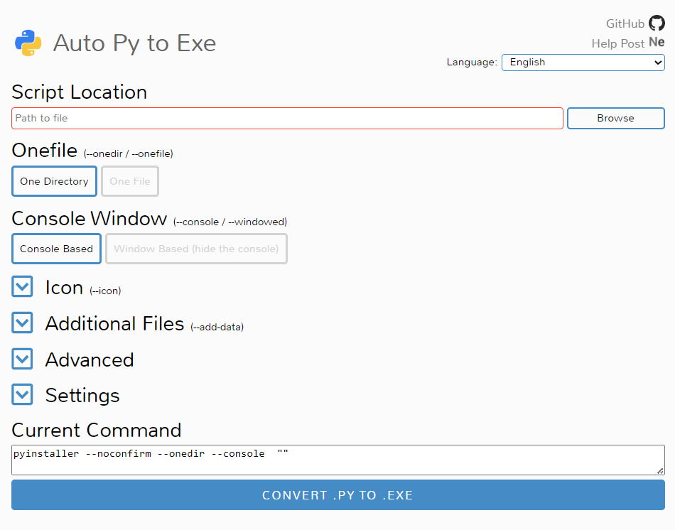
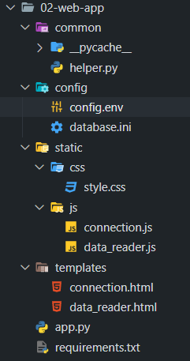
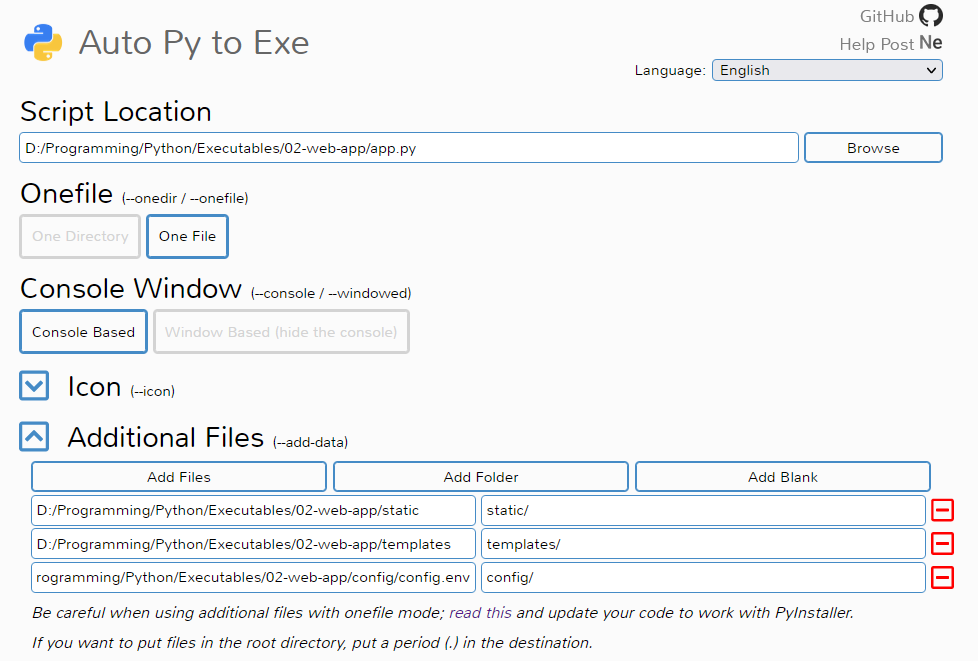
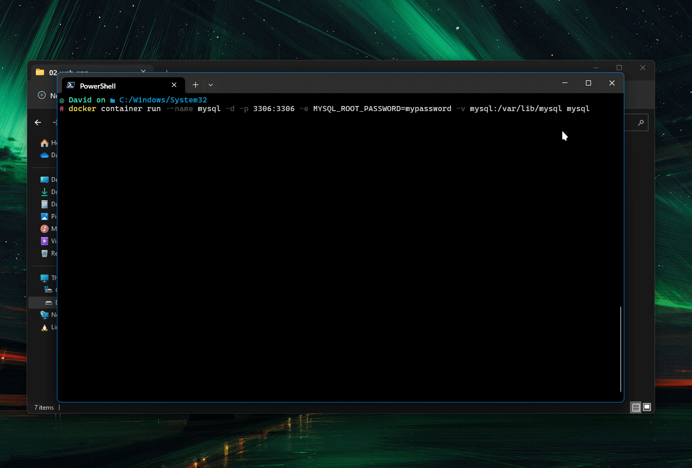
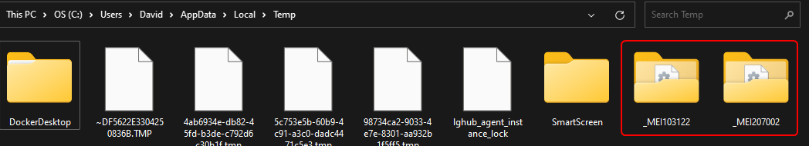

## Introduction

To be able to run Python code the Python interpreter has to be installed on the system. But there are situations where we want end users to be able to run our code without installing Python. One way to cater to this use case is by turning the code into an executable.

Using `pyinstaller` Python code can be converted into an executable.

[PyInstaller Manual — PyInstaller 5.13.0 documentation](https://pyinstaller.org/en/stable/)

PyInstaller is a CLI-based tool that can generate executables. `auto-py-to-exe` is a GUI that is built over `pyinstaller` that makes the progress of creating the executable user-friendly.

[GitHub - brentvollebregt/auto-py-to-exe: Converts .py to .exe using a simple graphical interface](https://github.com/brentvollebregt/auto-py-to-exe)

## Installation

If the code that is going to be packaged uses a virtual environment ensure to install `auto-py-to-exe` in that virtual environment.

```bash
# Install the Package
pip install auto-py-to-exe

# Launch the GUI
auto-py-to-exe
```

The GUI will open up in the default browser configured on the system.



## PyInstaller Options

### Script Location

In the script location field, the Python file that starts the application has to be mentioned.

### Onefile

The one-file option will produce a single executable that will contain all the application code along with all of its dependencies and static assets. When using this option there is a small modification that has to be made in the code for the executable to be able to reference files that are stored inside it.

The one-directory option will create a directory that will contain an executable that will launch the application. The directory will contain all the dependencies and assets that are required to run the code. When using one directory option no changes in the code have to be made to reference files.

### Console Window

The console-based option is used when the application does not have a GUI or when the application output is logged to the terminal.

The window-based option hides the terminal and all the output that is logged to the terminal. Use this option only when the application has a GUI.

### Icon

This option is used to select an image (`.ico`) that will be used as the icon for the executable.

### Additional Files

PyInstaller only includes `.py` files that are used by the code in the executable that is created. Using this option we can define all the static files that also need to be packaged with the executable.

This option should **not be used to store configuration files in the executable**. All the files that are stored inside the executable are **stateless** i.e. the changes that are made to the files by the program in its running state will not be available when the application is launched the next time.

This ephemeral nature of files is only applicable when the one-file option is used. In one directory mode, even the config files that will be used by the application should be declared in this section.

### Advanced

The options that are used frequently under advanced are `--name` and `--hidden-import`. 

Using `--name` the name that will be given to the executable can be defined.

PyInstaller crawls through all the Python files that are used by the code starting from the entry point file looking for import statements. The packages that are found using this method are automatically included in the executable. Some packages cannot be detected using this method such packages need to be added using the `--hidden-import` option.

[When Things Go Wrong — PyInstaller 5.13.0 documentation](https://pyinstaller.org/en/stable/when-things-go-wrong.html#listing-hidden-imports)

### Settings

Under this section, the Output Directory field is used to define the directory where the executable that is created will be stored.

## Example: Web App to Executable

I have written a simple application that we will be using for this exercise. It is a web application that connects to a MySQL database and displays the data that is stored in the tables. We are going to convert this application to an executable. 

To follow along download the code from the link provided below.

[Executables.zip - Google Drive](https://drive.google.com/file/d/1DqJMEd-sdMLDbb3efGmi5YENvGsV0BLq/view?usp=sharing)



On the terminal type `auto-py-to-exe` to launch the GUI.

`app.py` is the file that is used to start the application. The path to this file needs to be provided in the Script Location field.

I want to save the application as a single executable so I selected the One File option. 

Since my application prints logs on the terminal I require the terminal to be visible so I selected the Console Based option.

We are working with a web application there are static files (HTML, CSS, JS) that need to be bundled along with the Python code. The path to these directories is defined using the Additional Files option.

The `config.env` file is an internal configuration file that shouldn't be modified by the end user. This file will be stored in the executable and should also be mentioned in the Additional Files section.



Since I am using the One File option and I want the changes that are written to the `database.ini` file to persist I am not including it under Additional Files.

Under the Advanced section enter a name that will be used for the executable that is generated.

In the Settings menu provide the Output Directory where the executable will be saved.

A small adjustment has to be made in the code since the code references a config file whose state needs to be maintained and the One File option is used.

> [!NOTE]
> The Python code also references HTML files, but since they are read using `render_template` the below change is not required.  
> The change is required for all files that are read or written using the `open()` function and using libraries like `python_dotenv` and `configparser`.


First, include the `relative_path()` function from the below Stack Overflow post. I have added the snippet in the `helper.py` file. 

[python - Bundling data files with PyInstaller - Stack Overflow](https://stackoverflow.com/questions/7674790/bundling-data-files-with-pyinstaller-onefile/13790741#13790741)

Next, in all the places where the internal configuration file is referenced wrap the path with this helper function.


That's it. With these changes, we are now ready to generate an executable from our code.




## Appendix

Depending on the libraries being used other changes may need to be made to the code for it to work properly. Solutions to most of them can be found by reading through the article linked below.

[Issues When Using auto-py-to-exe - Nitratine](https://nitratine.net/blog/post/issues-when-using-auto-py-to-exe/)

When I was working on a different project that utilized the multi-processing library the code would not work when converted into an executable. The modifications to be made to the code to work with multi-processing can be found at the below link.

[python - PyInstaller-built Windows EXE fails with multiprocessing - Stack Overflow](https://stackoverflow.com/questions/24944558/pyinstaller-built-windows-exe-fails-with-multiprocessing)

On executing executables that are created using the One File option the content of the executable is extracted temporarily into the Temp directory in the `_MEIXXXX` folder.



If the running executable is not terminated properly the `_MEIXXXX` folders that are created are not deleted. Every time the executable is run a new `_MEIXXXX` folder is created. This will lead to unnecessary disk space being used.

While the executable only contains compiled Python files `.pyc` the code is not obfuscated. This means if a person is willing to put in the effort they can reverse engineer the compiled code to view the source code.

## Additional References

- [How can I make a Python script standalone executable to run without ANY dependency? - Stack Overflow](https://stackoverflow.com/questions/5458048/how-can-i-make-a-python-script-standalone-executable-to-run-without-any-dependen)
- [How to Easily Convert a Python Script to an Executable File (.exe) \| by The PyCoach \| Towards Data Science](https://towardsdatascience.com/how-to-easily-convert-a-python-script-to-an-executable-file-exe-4966e253c7e9)
- [Convert Python Script to .exe File - GeeksforGeeks](https://www.geeksforgeeks.org/convert-python-script-to-exe-file/)
- [Using PyInstaller to Easily Distribute Python Applications – Real Python](https://realpython.com/pyinstaller-python/)
