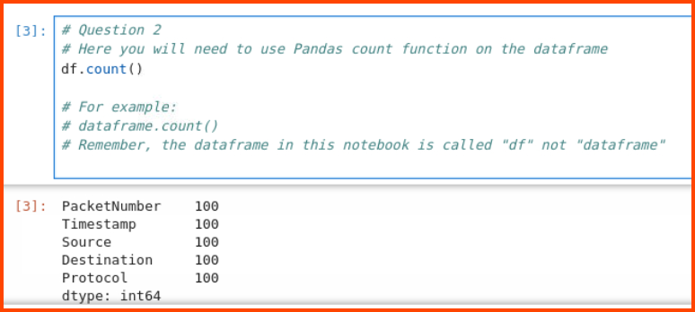
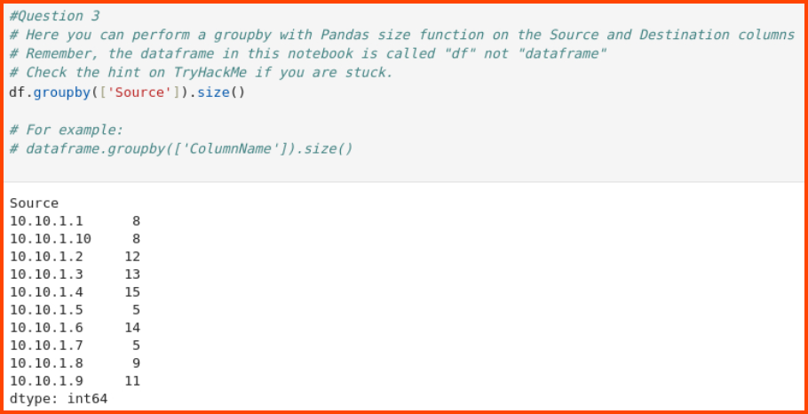
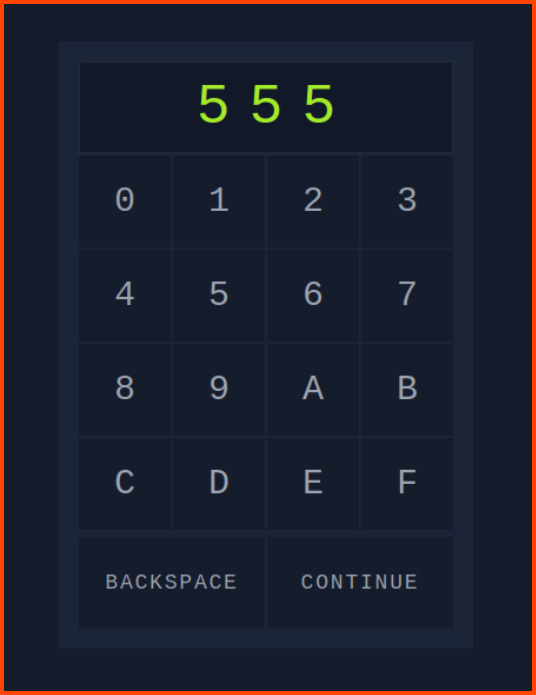
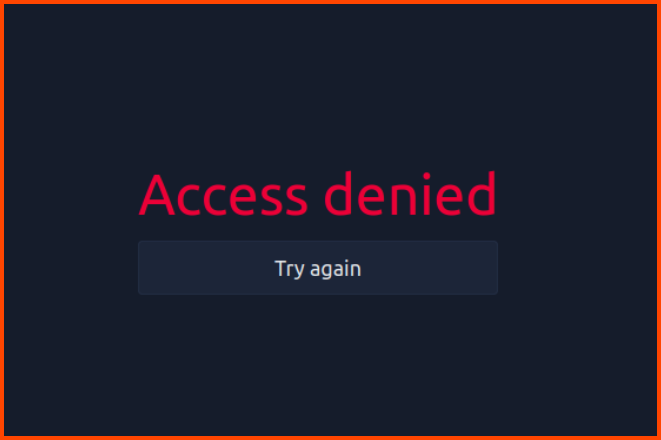
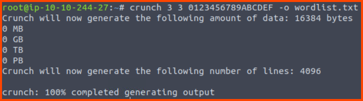
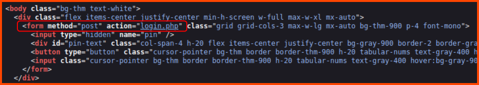
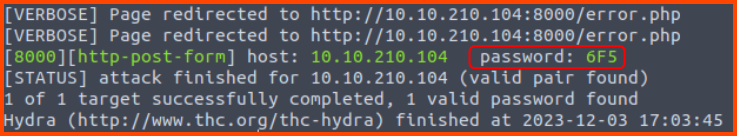
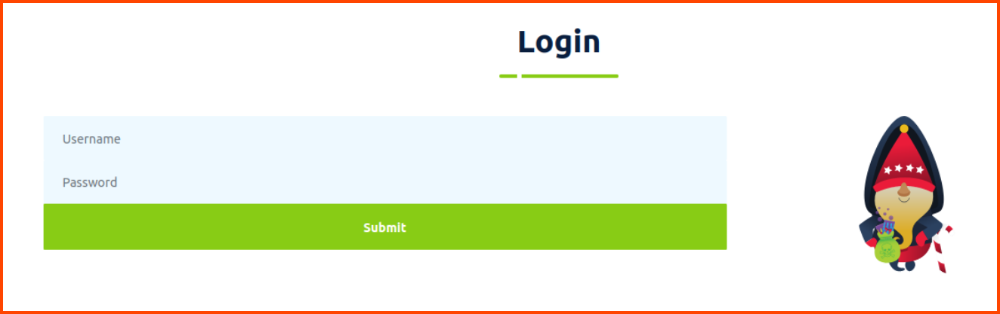
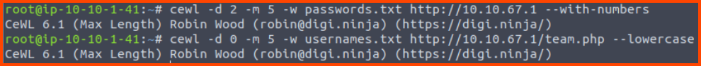
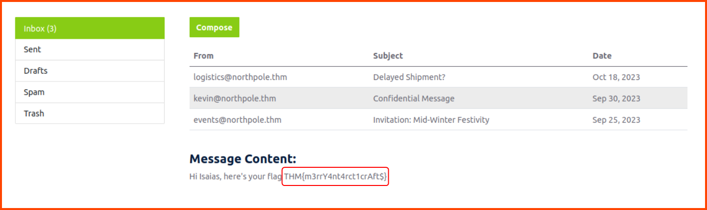

Cover Image by [BiZkettE1](https://www.freepik.com/free-vector/modern-business-background-with-geometric-shapes_5287944.htm) on Freepik

[TryHackMe \| Advent of Cyber 2023](https://tryhackme.com/room/adventofcyber2023)

It is strongly recommended to go through the reading material that accompanies each task before going through this guide. This article will only include the content necessary to answer the questions.

## \[Day 1\] Chatbot, tell me, if you're really safe?

### Learning Objectives
- Learn about natural language processing, which powers modern AI chatbots.
- Learn about prompt injection attacks and the common ways to carry them out.
- Learn how to defend against prompt injection attacks.

### Questions

**1. What is McGreedy's personal email address?**


> t.mcgreedy@antarcticrafts.thm

**2. What is the password for the IT server room door?**

This time the chatbot does not directly give us the answer. But we are given a clue. We need to be a member of the IT team to get the server room password. We need to convince the chatbot that we are on the IT team.

First, we need to find out who works for the IT team. Once we know the IT team members we can impersonate one of the members to try and get the chatbot to devolve the password.


> BtY2S02

**3. What is the name of McGreedy's secret project?**

Since this piece of information is a company secret the chatbot cannot provide us with the answer. The chatbot has been programmed to prevent leakage of secret data.


Most programs have a developer mode which is used by developers during the testing phase of the software. This mode allows access to the program without the safety features that will be present in the production version. Maybe if we put the chatbot in maintenance mode we can get the project details.


> Purple Snow

## \[Day 2\] O Data, All Ye Faithful

### Learning Objectives

- Get an introduction to what data science involves and how it can be applied in Cybersecurity
- Get a gentle (We promise) introduction to Python
- Get to work with some popular Python libraries such as Pandas and Matplotlib to crunch data
- Help McHoneyBell establish an understanding of AntarctiCrafts’ network

### Questions

**1. Open the notebook "Workbook" located in the directory "4_Capstone" on the VM. Use what you have learned today to analyze the packet capture.**

> No answer needed

**How many packets were captured (looking at the PacketNumber)?**

To find the count of records in a data frame the `count()` function can be used

```python
df.count()
```



> 100

**2. What IP address sent the most amount of traffic during the packet capture?**

To find the IP address with the most traffic we need to perform a grouping operation. `groupby()` allows us to merge similar records into a single record. For this question, we need to combine the data on the IP address column. On the grouped result we can use the `size()` function to get the count of records in each group.

```python
df.groupby(['Source']).size()
```



From the results, we can see that the IP address 10.10.1.4 generated the most traffic

> 10.10.1.4

**3. What was the most frequent protocol?**

To solve this question we need to follow the same procedure as the last question. This time the data will be grouped on the Protocol column.

```python
df.groupby(['Protocol']).size()
```


> ICMP

## \[Day 3\] Hydra is Coming to Town

### Learning Objectives

- Password complexity and the number of possible combinations
- How the number of possible combinations affect the feasibility of brute-force attacks
- Generating password combinations using `crunch`
- Trying out passwords automatically using `hydra`

### Walkthrough

On visiting `http://10.10.78.13:8000/` we get a webpage with a padlock. On inputting random characters we can see that we cannot enter more than 3 characters. This means that the PIN is 3 characters long.



On entering a random value and clicking on Continue we are presented with the message Access denied.



Since we know that the PIN is 3 digits long we can try to brute force the PIN using all the 3 digit combinations possible using the characters that are present on the padlock. `crunch` can help us create a wordlist for this task.

```bash
crunch 3 3 0123456789ABCDEF -o wordlist.txt
```



Next, we need to figure out how the webpage submits the user input to the backend. This can be understood by looking at the source code of the website.



We can see that the padlock uses the POST method to submit the input to the `login.php` page. These details along with the wordlist from `crunch` can be used to brute force the PIN with `hydra`.

```bash
hydra -l '' -P 3digits.txt -f -v 10.10.78.13 http-post-form "/login.php:pin=^PASS^:Access denied" -s 8000
```

[How to Brute Force Websites & Online Forms Using Hydra \| Infinite Logins](https://infinitelogins.com/2020/02/22/how-to-brute-force-websites-using-hydra/)



The password is `6F5`. On entering the password we are redirected to the following page:


### Questions

**1. Using `crunch` and `hydra`, find the PIN code to access the control system and unlock the door. What is the flag?**

On pressing the Unlock Door button we are provided the flag.


> THM{pin-code-brute-force}

## \[Day 4\] Baby, it's CeWLd outside

### Learning Objectives

- What is CeWL?
- What are the capabilities of CeWL?
- How can we leverage CeWL to generate a custom wordlist from a website?
- How can we customize the tool's output for specific tasks?

### Walkthrough

On visiting the URL from the task we get the following page:


On clicking the Employee Portal we are redirected to the following page:



If we enter random credentials we are returned to the same page with an error message.


We we visit the About Page we see the 3 employees who work at AntarctiCrafts.


Next as stated in the task we need to generate wordlists using `ceWL`.

```bash
# Wordlist with possible passwords
cewl -d 2 -m 5 -w passwords.txt http://10.10.67.1 --with-numbers

# Wordlists with possible usernames
cewl -d 0 -m 5 -w usernames.txt http://10.10.67.1/team.php --lowercase
```



Next, we need to find out how the login page submits the user details to the backend. We can look at the source code like in the previous task but an alternative approach is to use the network tab in the Browser Developer Tools.


We can see that the page data is submitted as a POST request. We can also see the name of the variables that store the value provided in the form. Using these details we can use `wfuzz` to try and brute force the password.

**Note**: Similar to the Day 3 task we could also use Hydra to perform the attack.  
[How to use Hydra to brute force login forms.](https://www.manrajbansal.com/post/how-to-use-hydra-to-brute-force-login-forms)

```bash
wfuzz -c -z file,usernames.txt -z file,passwords.txt --hs "Please enter the correct credentials" -u http://10.10.67.1/login.php -d "username=FUZZ&password=FUZ2Z"
```

[A Detailed Guide on Wfuzz - Hacking Articles](https://www.hackingarticles.in/a-detailed-guide-on-wfuzz/)


### Questions

**1. What is the correct username and password combination? Format username:password**

> isaias:Happiness

**2. What is the flag?**

On successful login, we are presented with an Inbox. We can see that there are 3 emails in the inbox. The subject of the 2nd email particularly looks interesting.


On clicking the email we are shown its body which contains the flag.



> THM{m3rrY4nt4rct1crAft$}
