Cover Image Background by <a href="https://www.freepik.com/free-vector/modern-business-background-with-geometric-shapes_5287944.htm#page=3&query=powerpoint%20background&position=15&from_view=search&track=ais" target="_blank" rel="noopener noreferrer">BiZkettE1</a> on Freepik

[TryHackMe \| Advent of Cyber 2023](https://tryhackme.com/room/adventofcyber2023)

It is strongly recommended to go through the reading material that accompanies each task before going through this guide. This article will only include the content necessary to answer the questions.

## \[Day 5\] A Christmas DOScovery: Tapes of Yule-tide Past

### Learning Objectives

- Experience how to navigate an unfamiliar legacy system.
- Learn about DOS and its connection to its contemporary, the Windows Command Prompt.
- Discover the significance of file signatures and magic bytes in data recovery and file system analysis.

### Questions

**1. How large (in bytes) is the AC2023.BAK file?**

The backup file is present in the root of the C drive. Using the `dir` command we can list all the files in the directory.


> 12,704

**2. What is the name of the backup program?**

The backup program is present in the `C:\Backup\Tools` directory.

```cmd
cd TOOLS\BACKUP
dir
```

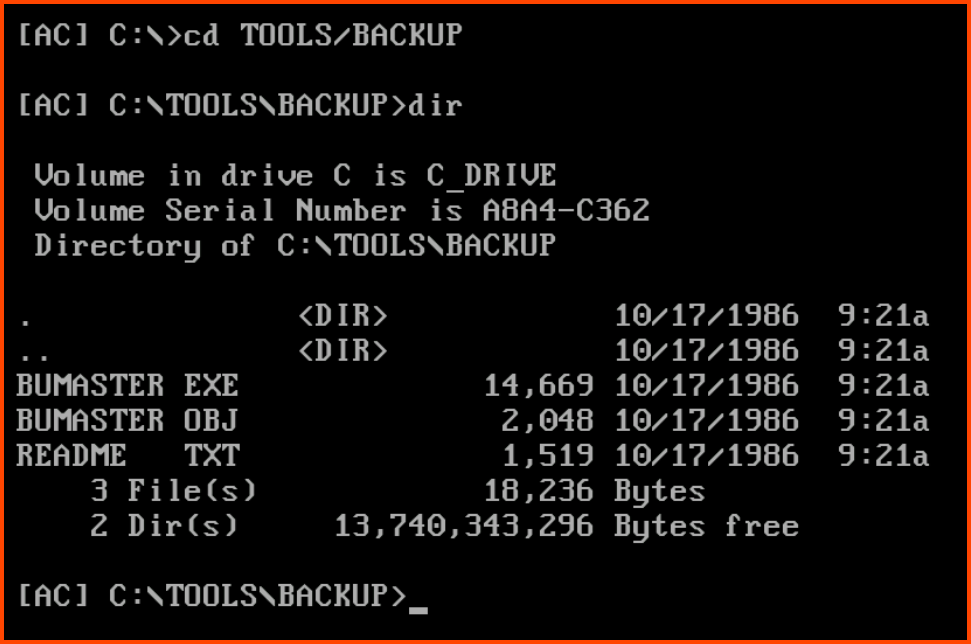

Looking at the name of the program are not able to guess the full name of the application. There is a readme file in the directory on opening it using the `edit` command we get the name of the application.

```cmd
edit README.TXT
```

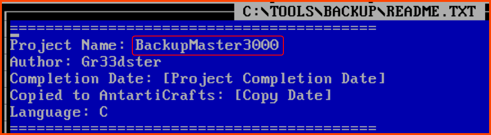

> BackupMaster3000

**3. What should the correct bytes be in the backup's file signature to restore the backup properly?**

On trying to restore the corrupted system using the backup we find out that there is something wrong with our backup. The output instructs us to look at the readme file for troubleshooting steps.

```cmd
BUMASTER.EXE C:\AC2023.BAK
```

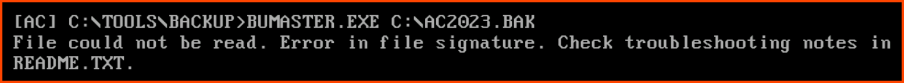

On opening the readme using the `edit` command and scrolling to the bottom we find the troubleshooting section. The section tells us that the first bytes of the backup file should start with characters `41 43`.

```cmd
edit README.TXT
```

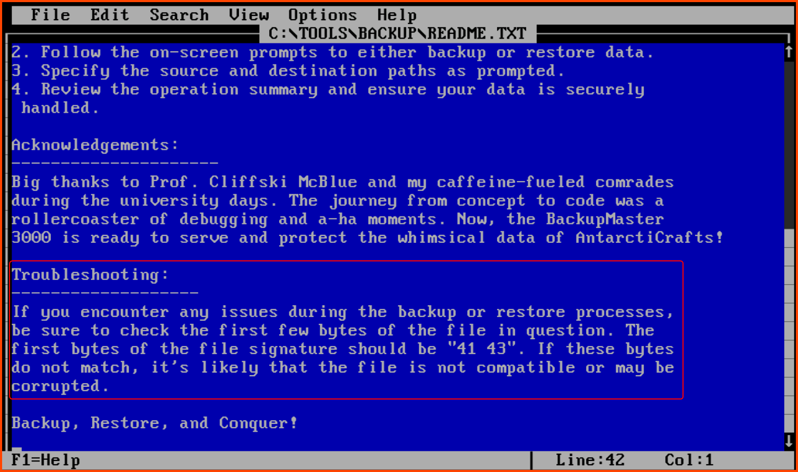

> 41 43

**4. What is the flag after restoring the backup successfully?**

On opening the backup using `edit` we see that the first bytes are `XX`. Not `41 43` as mentioned in the documentation.

```cmd
cd C:\
edit AC2023.BAK
```


`edit` shows us the content of the file in ASCII encoding while the readme provided uses the starting characters of the file in hexadecimal notation. So to fix the file using `edit` we need to replace the `XX` with the ASCII representation of `41 43`.

[Hex to ASCII Text String Converter](https://www.rapidtables.com/convert/number/hex-to-ascii.html)

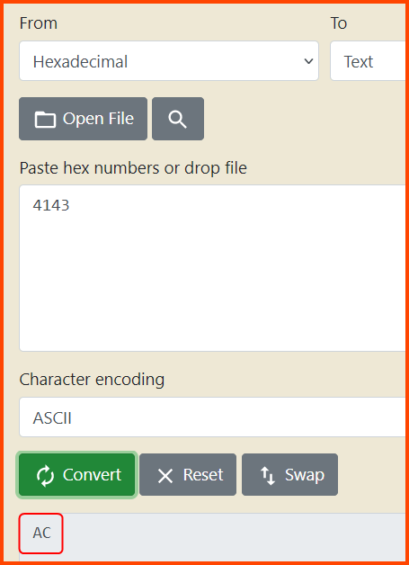

In ASCII `41 43` is represented as `AC`. 

On replacing `XX` with `AC` in the backup file using `edit` and running it using the backup software we get the flag.


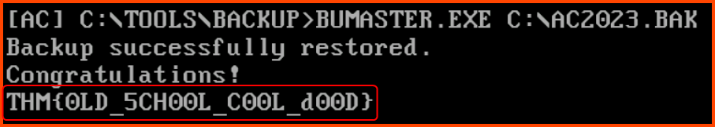

> THM{0LD_5CH00L_C00L_d00D}

## \[Day 6\] Memories of Christmas Past

### Learning Objectives

- Understand how specific languages may not handle memory safely.
- Understand how variables might overflow into adjacent memory and corrupt it.
- Exploit a simple buffer overflow to directly change the memory you are not supposed to access.

### Walkthrough

To complete the game we need to purchase a star and give it to the Christmas tree.

We know that the program has buffer overflow issues. To cause the player name section of the memory to overflow into the coins section of the memory we need at least 13 characters. So from the computer, we need to give ourselves 13 coins. Using 13 coins we can change our name to a new 13-character name. This will cause the name section of the memory to overflow into the 1st byte of the memory reserved for storing information related to the coins.


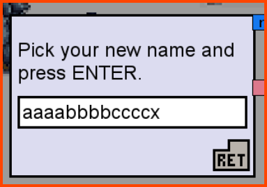

On changing our name to `aaaabbbbccccx` the number of coins that we have also changed. The new value is 120.


We can now try to overflow the entire memory reserved for storing the coin value. This should give us a large amount of coins which can then be used to buy the star.

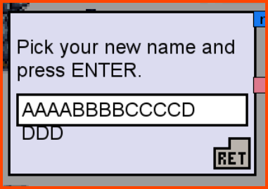


Now that we have a lot of coins we can proceed to buy the star from the shop.


On buying the star the shopkeeper refuses to give us the star and instead gives us a different item.


This item is of no use to us as we cannot complete the game without the star.

If we look at our memory we observe that we have a section at the end that is reserved to store the items in the inventory. The item that the shopkeeper gave us seems to have a hex value of e and the ball that we already had in the inventory has a value of 1.


We can try to overflow the memory up to the inventory section. We could replace the 1st item in the inventory with a `d` which is in the ID for the star in hex. 

For writing `d` as the 1st character in the memory segment of inventory we need to utilize 45 characters. The starting 44 characters can be any valid hex character.


### Questions

**1. If the coins variable had the in-memory value in the image below, how many coins would you have in the game?**


In the reading for the task, we have been told that the integers are stored in little-endian format on the system on which the game is running. Which means the bytes have been written from left to right. To get the correct value in decimal we need to first reverse the bytes. On reversal, we get `53 50 4f 4f`. Now we can convert this number to decimal.

[Hexadecimal to Decimal Converter](https://www.rapidtables.com/convert/number/hex-to-decimal.html)

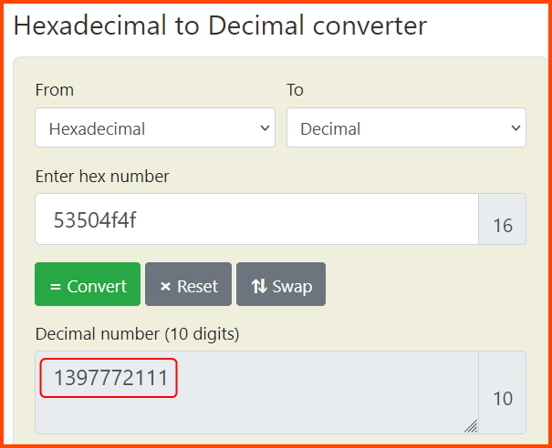

> 1397772111

**2. What is the value of the final flag?**

Once we have the star we can go to the tree to complete the game and get the flag.


> THM{mchoneybell_is_the_real_star}

## \[Day 7\] ‘Tis the season for log chopping!

### Learning Objectives

- Revisiting log files and their importance.
- Understanding what a proxy is and breaking down the contents of a proxy log.
- Building Linux command-line skills to parse log entries manually.
- Analyzing a proxy log based on typical use cases.

### Questions

**1. How many unique IP addresses are connected to the proxy server?**

```bash
# List unique IP addresses
cat access.log | cut -d ' ' -f2 | sort | uniq

# Count of unique IP addresses
cat access.log | cut -d ' ' -f2 | sort | uniq | wc -l
```

The `wc` command along with the `-l` (line count) flag can be used to get the count.

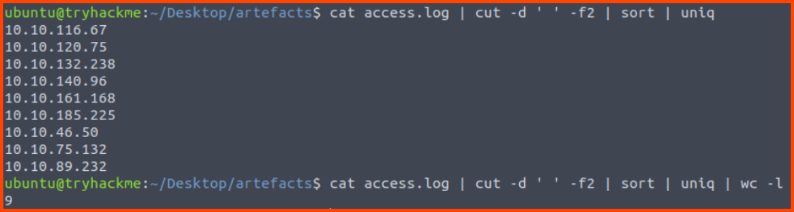

> 9

**2. How many unique domains were accessed by all workstations?**

To get the correct result the port numbers need to be removed from the domain names.

```bash
cat access.log | cut -d ' ' -f3 | cut -d ':' -f1 | sort | uniq | wc -l
```


> 111

**3. What status code is generated by the HTTP requests to the least accessed domain?**

Using the 1st command we find the domain that is accessed the last. Then using that domain we extract the status code field from the data.

```bash
# Find least accessed domain
cat access.log | cut -d ' ' -f3 | cut -d ':' -f1 | sort | uniq -c | sort -n | head -n 1

# Find status code
grep partnerservices.getmicrosoftkey.com access.log | cut -d ' ' -f6 | head -n 1
```

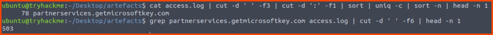

The above two queries can be combined into a single query using bash subshell. A subshell is specified using the `$()` syntax. The subshell is executed before the main command is executed.

[Do parentheses really put the command in a subshell? - Unix & Linux Stack Exchange](https://unix.stackexchange.com/questions/138463/do-parentheses-really-put-the-command-in-a-subshell)

```bash
grep $(cat access.log | cut -d ' ' -f3 | cut -d ':' -f1 | sort | uniq -c | sort -n | head -n 1 | tr -s ' ' | cut -d ' ' -f3) access.log | cut -d ' ' -f6 | head -n 1
```


> 503

**4. Based on the high count of connection attempts, what is the name of the suspicious domain?**

```bash
cut -d ' ' -f3 access.log | cut -d ':' -f1 | sort | uniq -c | sort -rn | head -n 10
```


> frostlings.bigbadstash.thm

**5. What is the source IP of the workstation that accessed the malicious domain?**

Using the 1st command we find the malicious domain and using the 2nd command we find the machine that accessed the malicious domain.

```bash
# Find malicious domain
cut -d ' ' -f3 access.log | cut -d ':' -f1 | sort | uniq -c | sort -rn | head -n 10

# Machine that accessed malicious domain
grep frostlings.bigbadstash.thm access.log | cut -d ' ' -f2 | head -n 1
```


Similar to a previous question. This one can also be solved using a single command using bash subshells. This solution will only work on static data as the subshell gets the position of the malicious domain which is used by the main command. If the dataset was dynamic the position of the malicious domain could change.

```bash
grep $(cut -d ' ' -f3 access.log | cut -d ':' -f1 | sort | uniq -c | sort -rn | head -n 4 | tail -n 1 | tr -s ' ' | cut -d ' ' -f3) access.log | cut -d ' ' -f2 | head -n 1
```

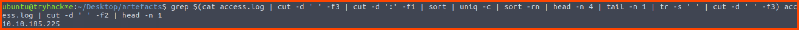

> 10.10.185.225

**6. How many requests were made on the malicious domain in total?**

> 1581

**7. Having retrieved the exfiltrated data, what is the hidden flag?**

```bash
grep frostlings.bigbadstash.thm access.log | cut -d ' ' -f5 | cut -d '=' -f2 | base64 -d
```


> THM{a_gift_for_you_awesome_analyst!}

## \[Day 8\] Have a Holly, Jolly Byte!

### Task Objectives

- Analyze digital artifacts and evidence.
- Recover deleted digital artifacts and evidence.
- Verify the integrity of a drive/image used as evidence.

### Questions

**1. What is the malware C2 server?**

After loading the drive into FTK Imager in the DO_NOT_OPEN directory there is a secretchat.txt file that contains the URL of the C2 server.


> mcgreedysecretc2.thm

**2. What is the file inside the deleted zip archive?**

Files marked with the x symbol have been deleted from the drive. The `JuicyTomaTOY.zip` archive contains an executable file with the same name.


> JuicyTomaTOY.exe

**3. What flag is hidden in one of the deleted PNG files?**

In the root of the drive, there are 2 image files. Both were deleted by the user of the drive. We can search the content of the images by selecting the image and viewing it in Hex mode. Then using `Ctrl + F` we can open the search menu and look for the string `THM{`. The string will be found in the image `potrait.png`.


> THM{byt3-L3vel_@n4Lys15}

**4. What is the SHA1 hash of the physical drive and forensic image?**

To find the Hash select the drive in the left-hand sidebar and then click on File - Verify Disk/Image.

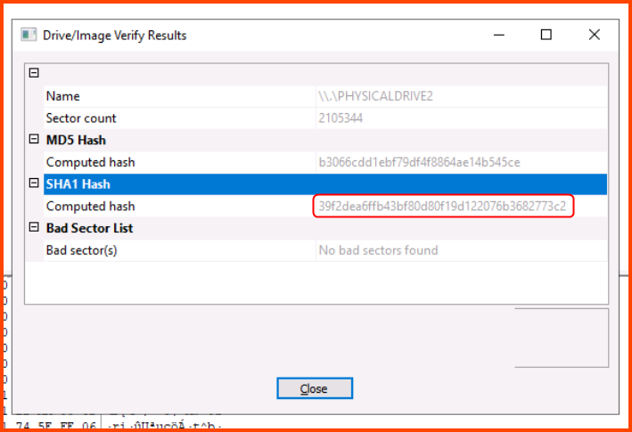

> 39f2dea6ffb43bf80d80f19d122076b3682773c2
