Cover Image by [BiZkettE1](https://www.freepik.com/free-vector/modern-business-background-with-geometric-shapes_5287944.htm) on Freepik

[TryHackMe \| Advent of Cyber 2023](https://tryhackme.com/room/adventofcyber2023)

It is strongly recommended to go through the reading material that accompanies each task before going through this guide. This article will only include the content necessary to answer the questions.

## \[Day 13\] To the Pots, Through the Walls

### Learning Objectives

- Learn to understand incident analysis through the Diamond Model.
- Identify defensive strategies that can be applied to the Diamond Model.
- Learn to set up firewall rules and a honeypot as defensive strategies.

### Questions

**1. Which security model is being used to analyze the breach and defense strategies?**

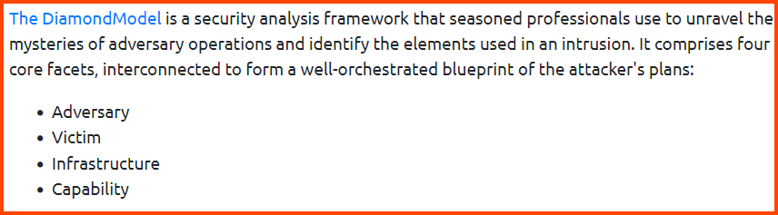

> Diamond Model

**2. Which defense capability is used to actively search for signs of malicious activity?**

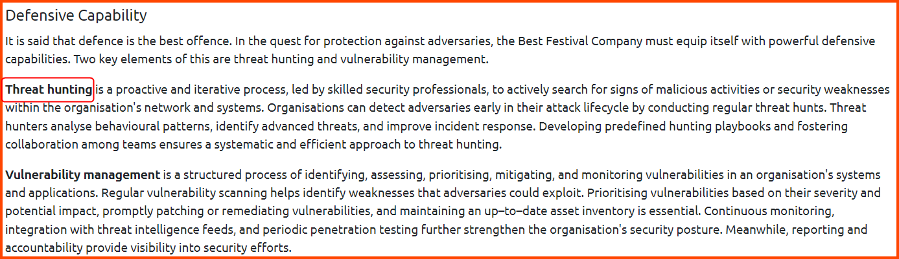

> Threat Hunting

**3. What are our main two infrastructure focuses? (Answer format: answer1 and answer2)**


> Honeypot and Firewall

**4. Which firewall command is used to block traffic?**


> deny

**5. There is a flag in one of the stories. Can you find it?**

We have a bash script that applies UFW rules. Let us run the script to apply the required configuration.

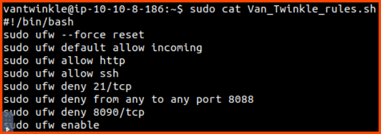


We can see that the firewall denies connections on port 21, 8088 and 8090. The web server could be running on any one of these ports.

The brute force method to find the web server is to change the deny rules to allow rules one by one until we can access the website.

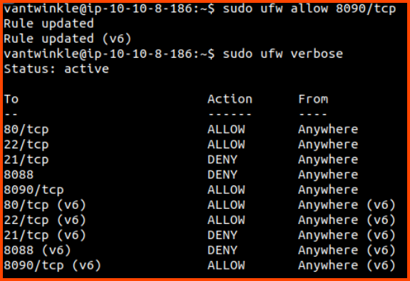

An alternative approach is to run Nmap from the Attack Machine on the target to identify filtered ports. Once we find filtered ports we can check the firewall rules to see if any ports overlap, then we can just enable the overlapping rules.


> THM{P0T$\_W@11S_4_S@N7@}

## \[Day 14\] The Little Machine That Wanted to Learn

### Learning Objectives

- What is machine learning?
- Basic machine learning structures and algorithms
- Using neural networks to predict defective toys

### Questions

**1. What is the other term given for Artificial Intelligence or the subset of AI meant to teach computers how humans think or nature works?**

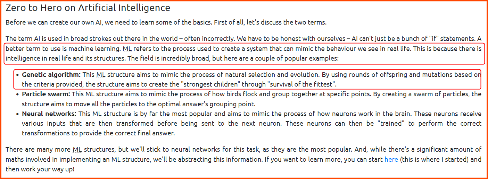

> Machine Learning

**2. What ML structure aims to mimic the process of natural selection and evolution?**

> Genetic Algorithm

**3. What is the name of the learning style that makes use of labeled data to train an ML structure?**

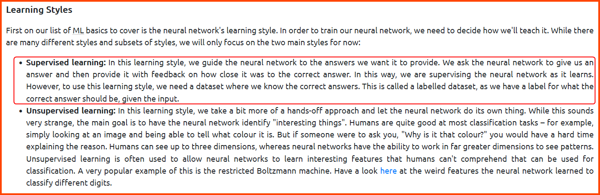

> Supervised Learning

**4. What is the name of the layer between the Input and Output layers of a Neural Network?**

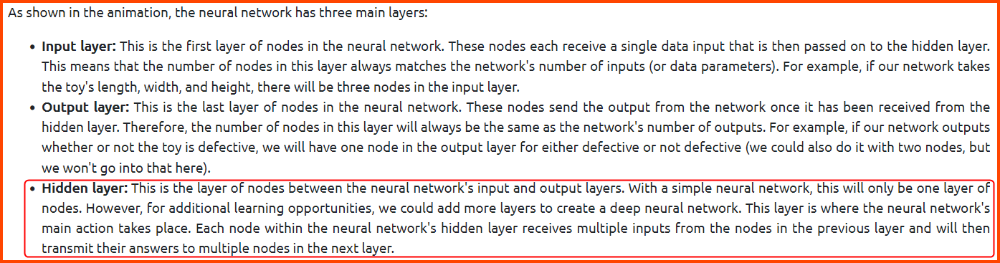

> Hidden Layer

**5. What is the name of the process used to provide feedback to the Neural Network on how close its prediction was?**

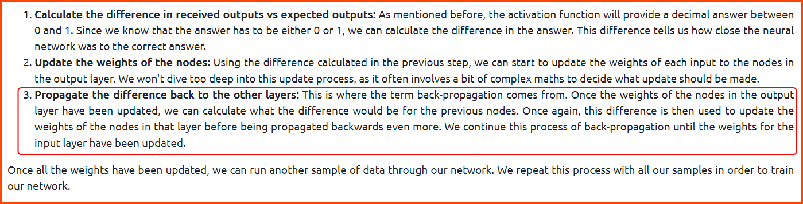

> Back-Propagation

**6. What is the value of the flag you received after achieving more than 90% accuracy on your submitted predictions?**

To answer this question complete the code that is present in the VM with the snippets that have been provided in the writeup.


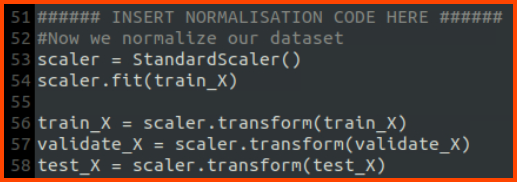

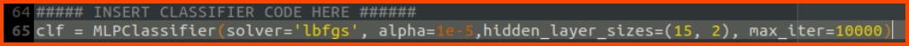

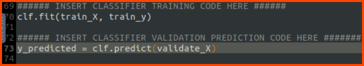

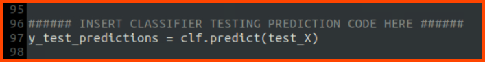

Once the snippets have been added save the file and execute the code.


The accuracy of the model should be greater than 90%. If the value is less than 90 run the code again till an accuracy greater than 90% is reached. Once the threshold has been met upload the output file that is generated by the code to the following URL to get the flag.

```
http://websiteforpredictions.thm:8000/
```

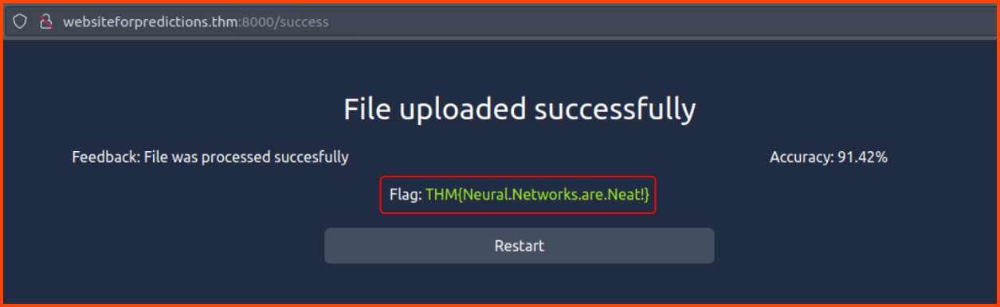

> THM{Neural.Networks.are.Neat!}

## \[Day 15\] Jingle Bell SPAM: Machine Learning Saves the Day!

### Learning Objectives  

- Different steps in a generic Machine Learning pipeline
- Machine Learning classification and training models
- How to split the dataset into training and testing data
- How to prepare the Machine Learning model
- How to evaluate the model's effectiveness

### Questions

**1. What is the key first step in the Machine Learning pipeline?**

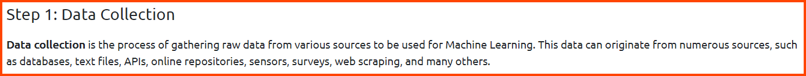

> Data Collection

**2. Which data preprocessing feature is used to create new features or modify existing ones to improve model performance?**

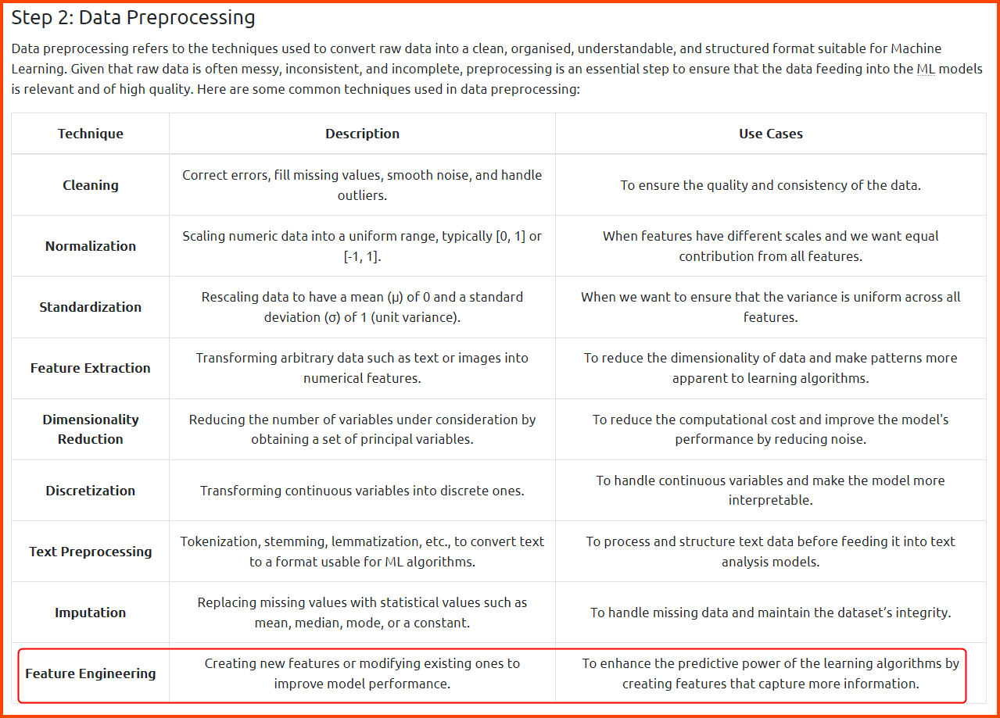

> Feature Engineering

**3. During the data splitting step, 20% of the dataset was split for testing. What is the percentage weightage avg of precision of spam detection?**


> 0.98

**4. How many of the test emails are marked as spam?**

Run all the cells in the notebook before running the model testing-related code.


> 3

**5. One of the emails that is detected as spam contains a secret code. What is the code?**

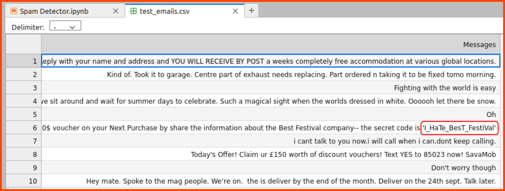

> I_HaTe_BesT_FestiVal

## \[Day 16\] Can't CAPTCHA this Machine!

### Learning Objectives

- Complex neural network structures
- How does a convolutional neural network function?
- Using neural networks for optical character recognition
- Integrating neural networks into Red team tooling

### Questions

**1. What key process of training a neural network is taken care of by using a CNN?**

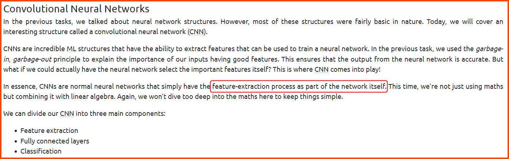

> Feature Extraction

**2. What is the name of the process used in the CNN to extract the features?**


> Convolution

**3. What is the name of the process used to reduce the features down?**

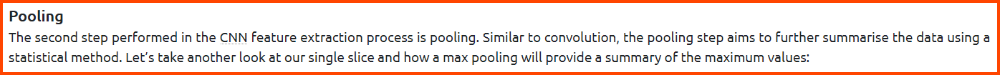

> Pooling

**4. What off-the-shelf CNN did we use to train a CAPTCHA-cracking OCR model?**

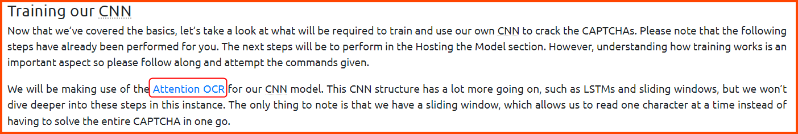

> Attention OCR

**5. What is the password that McGreedy set on the HQ Admin portal?**

Follow along with the write-up, test and deploy the ML model for solving CAPTCHAs


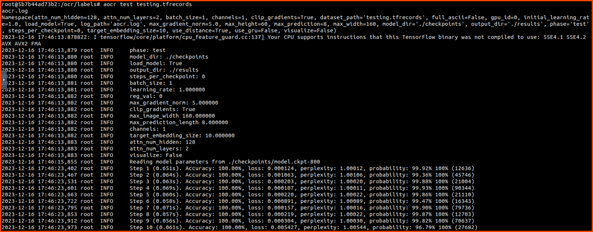

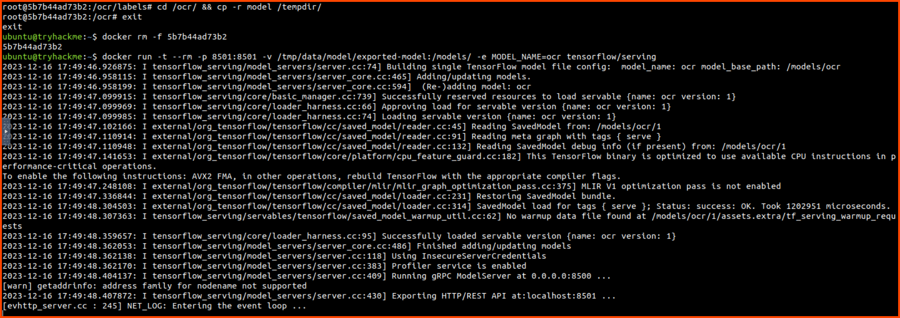

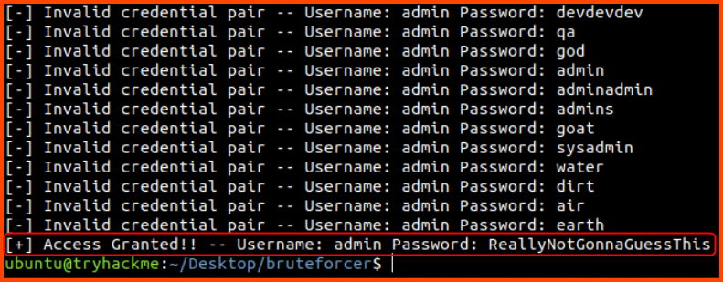

> ReallyNotGonnaGuessThis

**5. What is the value of the flag that you receive when you successfully authenticate to the HQ Admin portal?**

```
http://hqadmin.thm:8000/
```


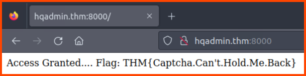

> THM{Captcha.Can't.Hold.Me.Back}
