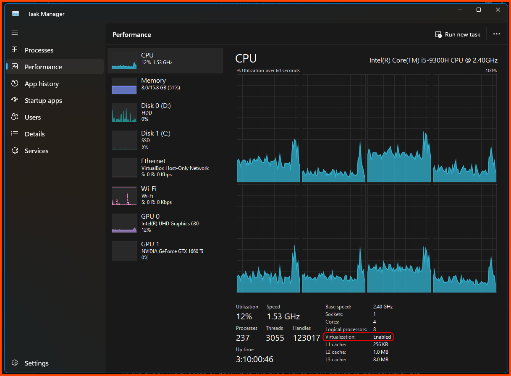

Banner Background by <a href="https://www.freepik.com/free-vector/gradient-white-color-background-abstract-modern_34010189.htm#query=simple%20backgrounds&position=28&from_view=search&track=ais&uuid=96e36b2e-64b3-42e2-8fd8-4fd18a6e1d5d">logturnal</a> on Freepik  
Hacker Image by <a href="https://www.freepik.com/free-vector/hacker-operating-laptop-cartoon-icon-illustration-technology-icon-concept-isolated-flat-cartoon-style_11602236.htm#page=2&query=hacker&position=28&from_view=search&track=sph&uuid=070b0d8a-d045-434d-9a51-f239e46d5f17">catalyststuff</a> on Freepik

In this guide we will be exploring how to setup an Cybersecurity Home Lab virtually on our laptop/PC. I will be using VirtualBox running on my Windows Laptop.

This guide will have multiple parts each covering a different component of the lab. If changes are introduced in a already published guide a note will be added at the start of the article to highlight the changes.

This guide has been heavy inspired by the following:

- [Building a Security Lab in VirtualBox](https://benheater.com/building-a-security-lab-in-virtualbox/)
- [Building Blue Team Home Lab Part 1 - Introduction | facyber](https://facyber.me/posts/blue-team-lab-guide-part-1/)

## Home Lab Overview

- pfSense (Gateway & Firewall)
- Kali Linux (Management VM)
- Active Directory Lab (Domain Controller & 2 Clients)
- Malware Analysis Lab (Windows & Linux)
- Security VMs (DFIR & SIEM)
- Cyber Range (Subnet for Vulnerable VMs)

> **Note**  
> pfSense is the gateway and firewall for our lab. With it the other VMs in the lab will not be able to connect to a network. Hence, pfSense should always be the first VM that is booted when using the lab. Once pfSense has booted other VMs can be launched.

## System Requirements

- 64-bit multi-threaded CPU (minimum 4 cores) with Virtualization Support
- 16GB RAM
- 500GB Disk Space

## Enabling Virtualization

To use VirtualBox our system has to support virtualization. On a Windows system to check if virtualization is supported and enabled open Task Manager (Ctrl + Shift + Esc) and go to the Performance Tab. If like in the image below virtualization is shown as enabled then no changes need to be made. 

If it shows as disabled it means the CPU supports virtualization but it is disabled is the BIOS. If Virtualization is not shown as an option it means that the CPU does not support virtualization.

If virtualization is shown as disabled we need to enable it in the BIOS. The process of getting to the BIOS varies from device to device. Refer the device manual and online forums for device specific instructions.

[Enabling Virtualization in your PC BIOS](https://bce.berkeley.edu/enabling-virtualization-in-your-pc-bios.html)

## Installing VirtualBox

Follow the guide that is linked below to install VirtualBox and VirtualBox Guest Addons. As of writing of this article the latest version of VirtualBox is `7.0.12`.

<iframe width="560" height="315" src="https://www.youtube-nocookie.com/embed/nwjZWHou8u0?si=mdoF4IC2u89sIEtz" title="YouTube video player" frameborder="0" allow="accelerometer; autoplay; clipboard-write; encrypted-media; gyroscope; picture-in-picture; web-share" allowfullscreen></iframe>
