Banner Background by <a href="https://www.freepik.com/free-vector/gradient-white-color-background-abstract-modern_34010189.htm#query=simple%20backgrounds&position=28&from_view=search&track=ais&uuid=96e36b2e-64b3-42e2-8fd8-4fd18a6e1d5d">logturnal</a> on Freepik  
Hacker Image by <a href="https://www.freepik.com/free-vector/hacker-operating-laptop-cartoon-icon-illustration-technology-icon-concept-isolated-flat-cartoon-style_11602236.htm#page=2&query=hacker&position=28&from_view=search&track=sph&uuid=070b0d8a-d045-434d-9a51-f239e46d5f17">catalyststuff</a> on Freepik

## Download Kali Linux

Go to the following link: [Get Kali \| Kali Linux](https://www.kali.org/get-kali/#kali-installer-images)

From the Installer Image section download the 64-bit Recommended Installer. The image is ~4GB in size so it will take sometime to download.


Once its downloaded we should have an `.iso` file. As of writing the latest version of Kali Linux is `2023.4`.

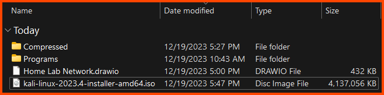

## Kali Linux VM Creation

Select Tools from the sidebar and then from the toolbar select New.

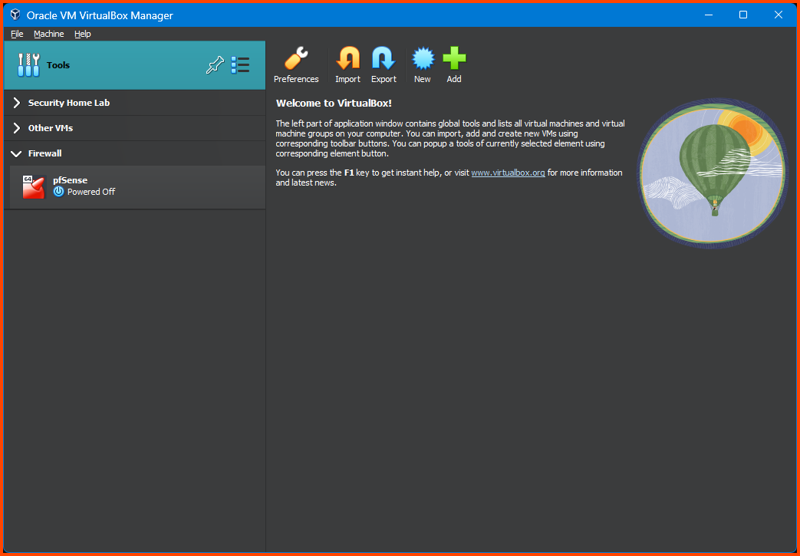

For name enter the name to be give to the VM. Ensure Folder is set to the location where the Home Lab is going to be saved. Leave the ISO Image option empty. Ensure to select the correct option for Type and Version. Once everything looks right click Next. 


On this page leave everything on its default values.


Increase the disk size to 80GB and ensure Pre-allocate Full Size is not selected.


Confirm that all the settings look right and click on Finish.


The VM to install Kali Linux is ready.

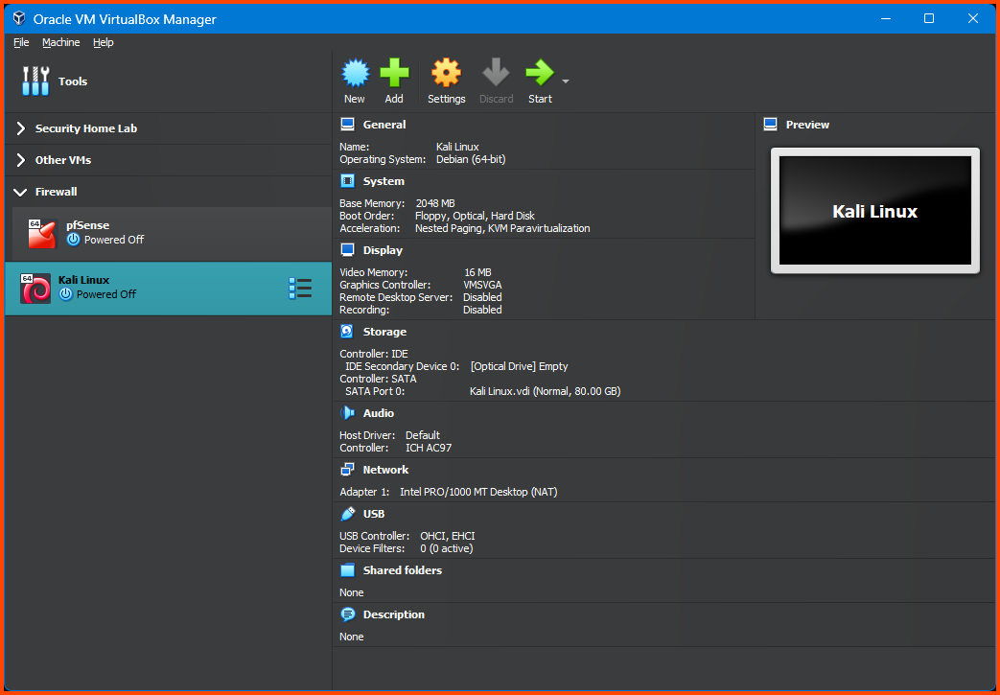

### Adding VM to Group

Similar to the previous module this is an optional step but its highly recommended as its helps to keep the Home Lab VMs organized and grouped together. Right click on the Kali Linux VM from the menu select Move to Group option and then chose New.

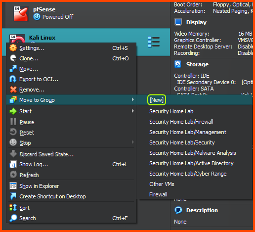

The VM will new be added to a Group called New Group. Right click on the group name and select Rename Group. Name the group Management.


Select the Firewall and Management group (Ctrl + Click). Right click on the name of one of the group. From the menu select Move to Group and then chose New.


Now both the groups should be nested inside a group called New Group. Select the group and chose Rename Group. Give the group the name Home Lab.


In the end we should have the following structure. The main group will be called Home Lab. It has two sub-groups. The first sub-group is called Firewall and has the pfSense VM. The second sub-group has the name Management and has the Kali Linux VM.

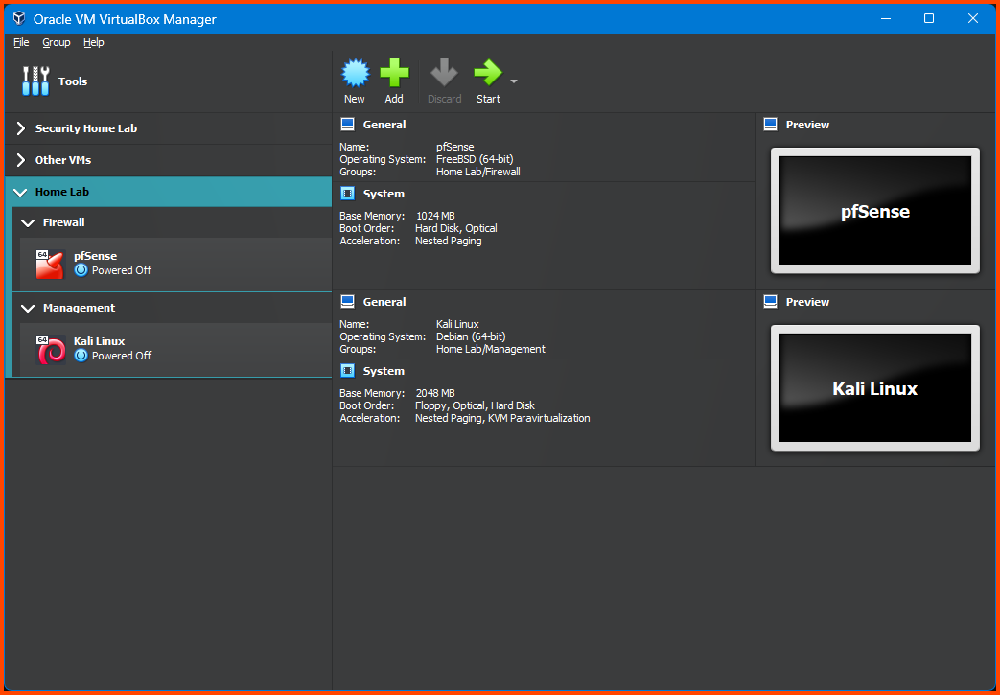

## Kali Linux VM Configuration

Select the Kali Linux VM and then from the toolbar select Settings.

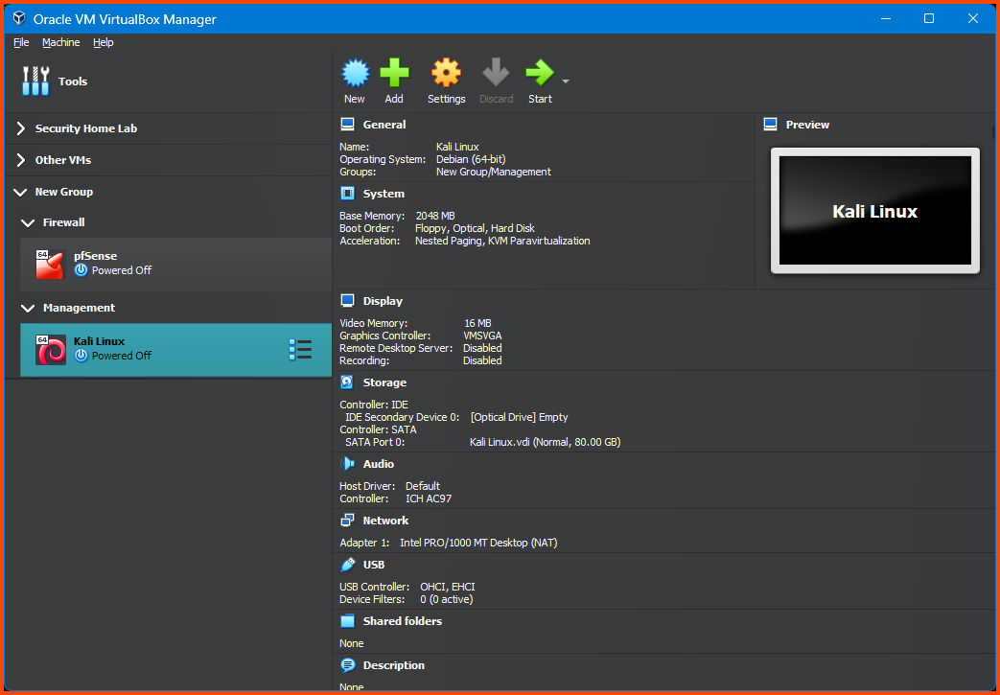

### System Configuration

Select System from the sidebar. Under Motherboard for the Boot Order option ensure that Hard Drive in on the top followed by Optical. Uncheck Floppy.  


### Boot Image Configuration

Select Storage from sidebar. Select the Empty disk that is present below Controller: IDE. Click on the small disk icon the the right side of the Optical Drive option.

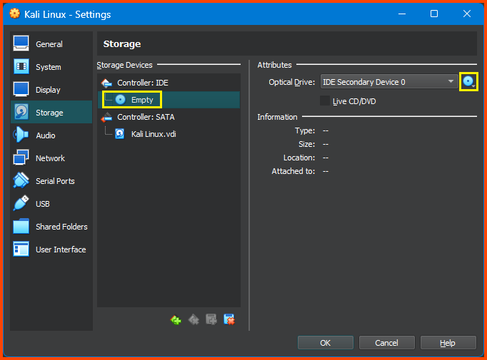

Select Choose a disk file and then select the downloaded `.iso` file for Kali Linux.

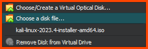

The final setting should look as follows:


### Network Configuration

Select Network from the sidebar. Under Adapter 1 check Enable Network Adapter. For Attached to select Internal Network. For name select LAN 0. Expand the Advanced option. For Adapter Type select Paravirtualized Network (virtio-net).

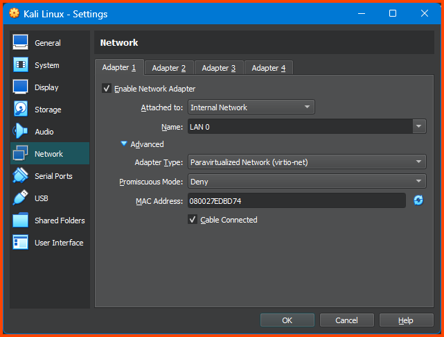

## Kali Linux Installation

Remember to boot the pfSense VM if it was shutdown before proceeding with the Kali Linux installation.

Select Kali Linux from the sidebar and click on Start on the toolbar.


From the Installer menu select Graphical Install.


Select your Language, location and keyboard layout.


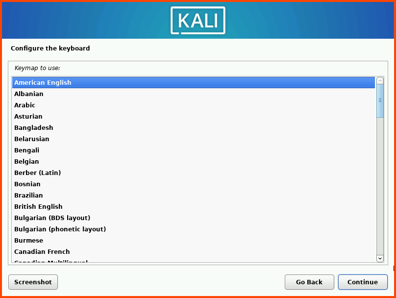

Enter a name for the VM. You can use any name here. The hostname is used to identify the system on the network. It also shows up on the prompt on the terminal. The hostname can also be changed.


Leave the domain name input blank and click on Continue.

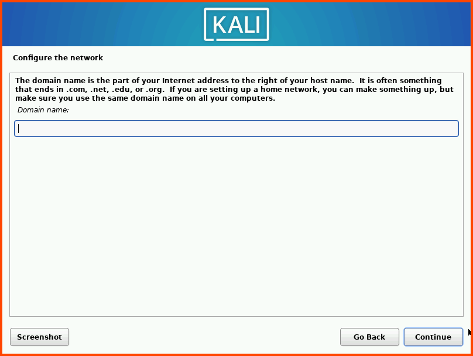

Enter your name. This name will be shown on the login screen.


The username is used to create the home directory for the user. All the user related configuration will be stored in this folder.

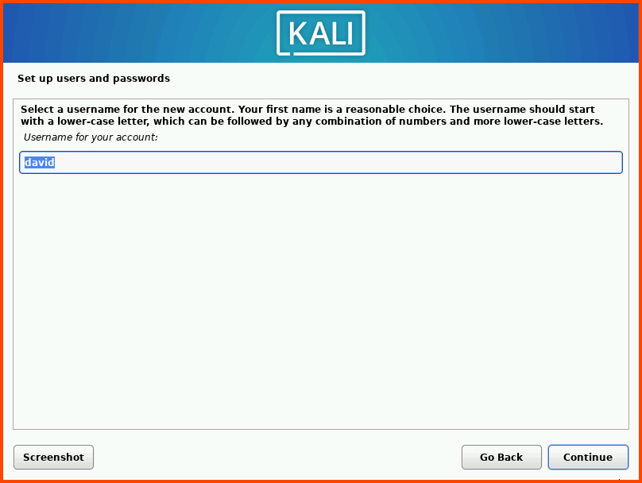

Enter a strong password for the VM. Re-enter the password in the second field and click on Continue.

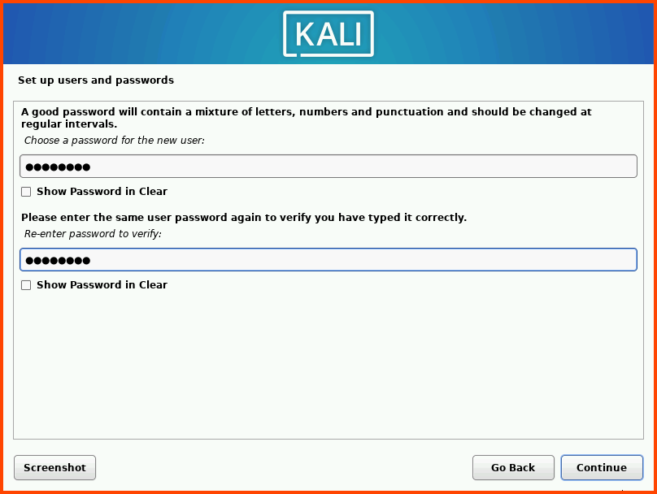

Select your timezone and then click on Continue.


Select the drive (`sda`) and click on Continue.


Select the option: All files in one partition and click on Continue. 

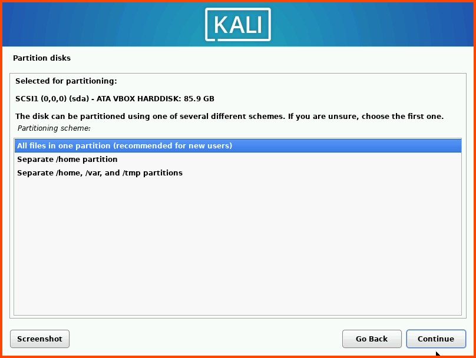

Select Finish partitioning and write changes to disk and then click on Continue.


Select Yes as the option and click on Continue.

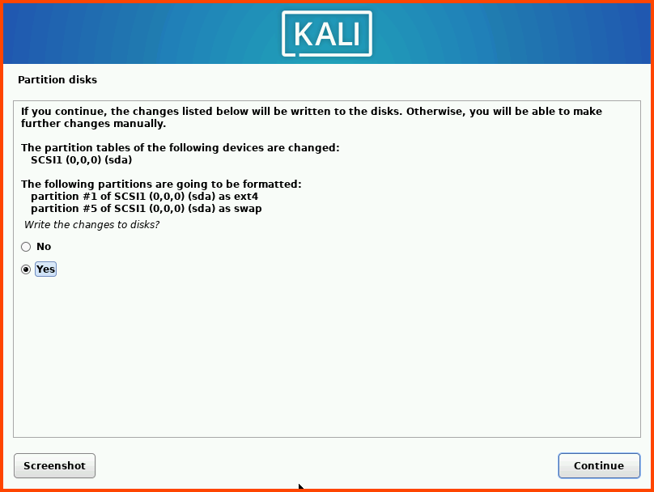

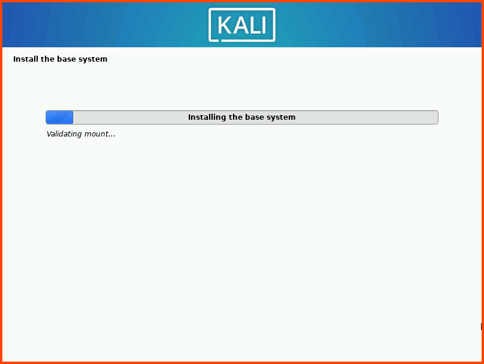

Once the base system installation is complete we need to chose the desktop environment that will be installed for Kali Linux. I like GNOME so I have selected GNOME for installation. The default is XFCE while it does not look as pretty as GNOME it is much lighter and should provide better performance. KDE Plasma is the prettiest and offers a lot of bells and whistles in the UI department. I would only recommend KDE if you can spare 2 cores and 4GB RAM for this VM. Once the desktop environment is select click on Continue.

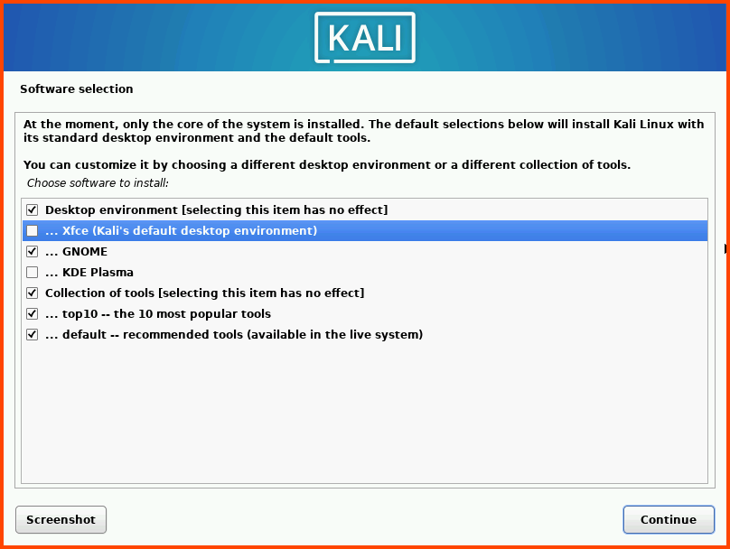

The installation will take a long time. Once the installation is complete the GRUB menu needs to be configured. Select Yes and click on Continue. 

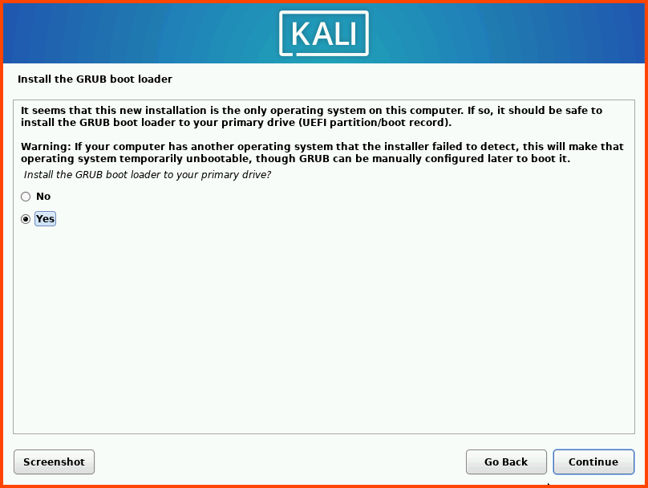


Click on Continue to Reboot the system.


After reboot we should see the Login screen. Click Enter to login.

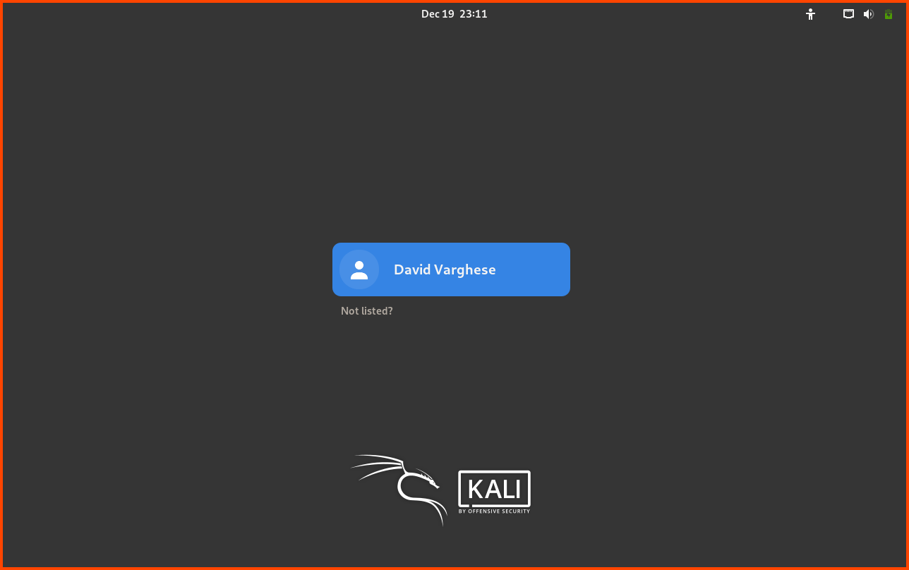

Enter the password that was configured during the installation.

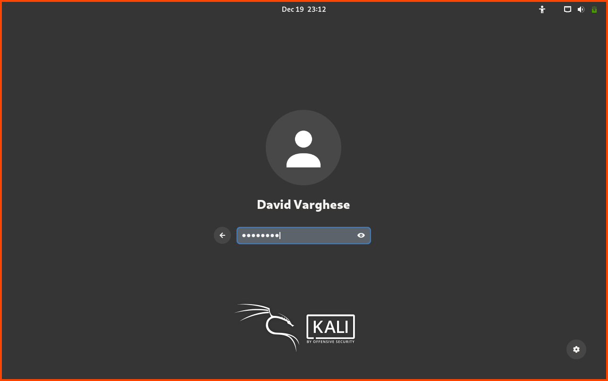

## Kali Linux Configuration

Once on the desktop. From the dock at the bottom. Select the Terminal.


On running `ip a` we can see that the Kali VM is connected to the `10.0.0.1` network which is the LAN network we had configured in pfSense. Without changing any firewall rules this network should be able to access the internet.

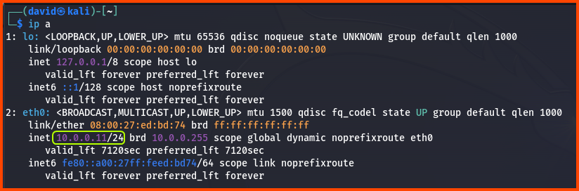

Use the following command to update the system:

```bash
sudo apt update && sudo apt full-upgrade
```

Enter your password when prompted.


Once the sources have been fetched we will be asked to confirm the update enter `Y` and press `Enter` or press `Enter` directly to start the update.


After the update is complete run the following command to remove the unused packages:

```bash
sudo apt autoremove
```

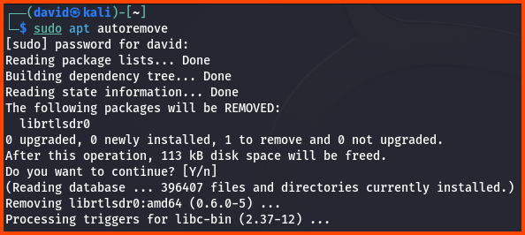

In the next module we are going to look at the pfSense UI and setup firewall rules for the different network interfaces.
