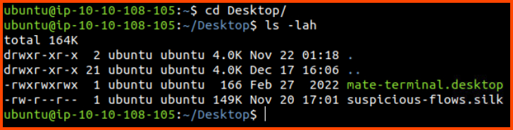
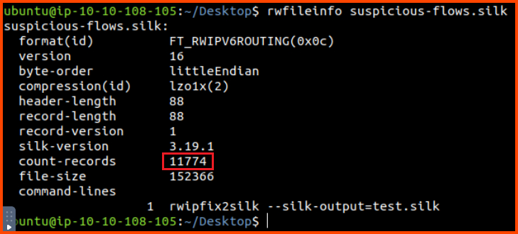
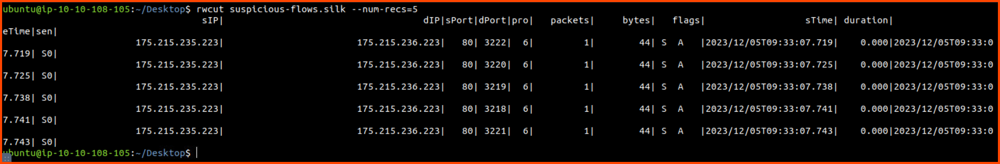
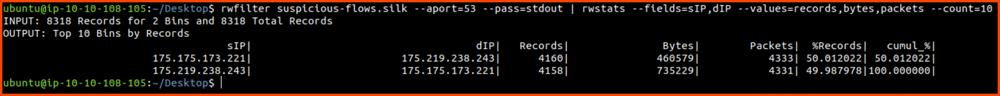
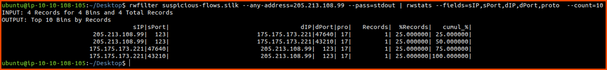
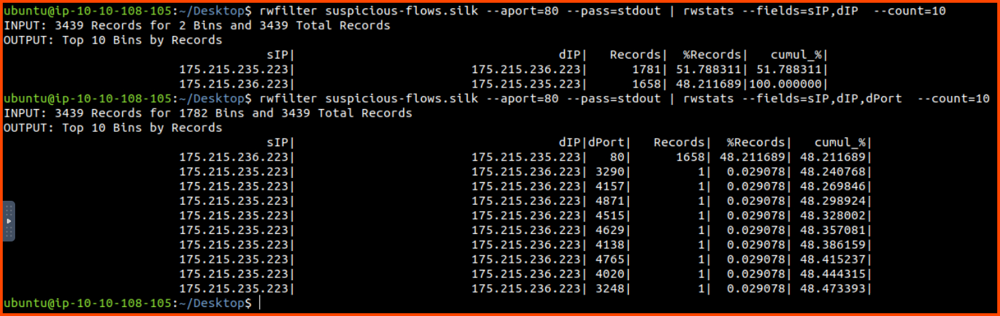
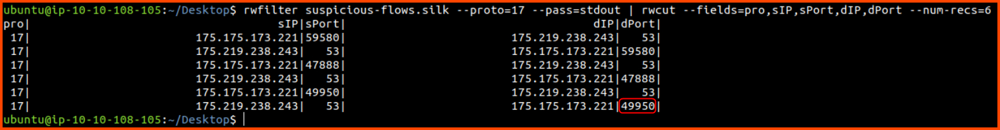

Cover Image Background by <a href="https://www.freepik.com/free-vector/modern-business-background-with-geometric-shapes_5287944.htm#page=3&query=powerpoint%20background&position=15&from_view=search&track=ais" target="_blank" rel="noopener noreferrer">BiZkettE1</a> on Freepik

[TryHackMe \| Advent of Cyber 2023](https://tryhackme.com/room/adventofcyber2023)

It is strongly recommended to go through the reading material that accompanies each task before going through this guide. This article will only include the content necessary to answer the questions.

## \[Day 17\] I Tawt I Taw A C2 Tat!

### Learning Objectives

- Gain knowledge of the network traffic data format
- Understand the differences between full packet captures and network flows
- Learn how to process network flow data
- Discover the SiLK tool suite
- Gain hands-on experience in network flow analysis with SiLK

### Walkthrough

Today's challenge focuses on NetFlow Packet Analysis. Before analyzing the packet capture that has been provided to us we need to learn how to use SiLK. It is an open-source tool which allows us to work with NetFlow data.

We can look at metadata related to SiLK and the NetFlow packet that we want to analyze using the following commands:



```bash
silk_config -v
```


```bash
rwfileinfo suspicious-flows.silk
```



Now we can take a look at `rwcut` which is an SiLK utility that allows to extract fields from the raw NetFlow packet capture.

```bash
# List the first 5 records
rwcut suspicious-flows.silk --num-recs=5
```



```bash
: '
List protocol, source IP, source port, destination IP, destination Port 
for the first 5 records
'
rwcut suspicious-flows.silk --fields pro,sIP,sPort,dIP,dPort --num-recs=5
```


Next we can take a look at `rwfilter` which is the utility that allows us to filter out packets based on a condition.

```bash
: '
List protocol, source IP, source port, destination IP, destination Port
for the first 5 records where protocol is 17 (UDP)
'
rwfilter suspicious-flows.silk --proto=17 --pass=stdout | rwcut --fields=pro,sIP,sPort,dIP,dPort --num-recs=5 
```


Finally, lets look at `rwstatus`. This utility provides us with stats about the traffic that is captured in the NetFlow file.

```bash
: '
List the destination IP, Record count, Packet count and Total data transmitted in bytes for Top 10 most active unique source IP, destination IP pair
'
rwstats suspicious-flows.silk --fields=dPort --values=records,packets,bytes,sIP-Distinct,dIP-Distinct --count=10
```


Using the above command we are able to look at the amount of traffic that has been transmitted between the top 10 most chatty client and server pair. We can see that majority of the packets have been transmitted on port 53 (DNS) and port 80 (HTTP).

**Note**: `--num-recs=5` returns the first 5 records from the file. `--count=10` return the top 10 records that match the provided condition.

Now that we know how to use the packet inspection utilities that are provided by SiLK lets analyze the packets and look for anomalies patterns.

```bash
: '
List the source IP and amount of data trasmitted in bytes 
for the top 10 chatty source IPs
'
rwstats suspicious-flows.silk --fields=sIP --values=bytes --count=10 --top
```


From the above result we can see that `175.219.238.243`, `175.175.173.221` and `175.215.235.223` are the most active clients.

```bash
: '
List the source IP, destination IP, record count, packet count and bytes transmitted for the top 10 most active source IP, destination IP pair
'
rwstats suspicious-flows.silk --fields=sIP,dIP --values=records,bytes,packets --count=10
```


From the results we can see that the to and from communication between `175.175.173.221` and `175.219.238.243` makes up more that 70% of the traffic.

```bash
: '
List the source IP, destination IP, record count, packet count and data transmitted in bytes for the top 10 packets where the source port or destination port is 53
'
rwfilter suspicious-flows.silk --aport=53 --pass=stdout | rwstats --fields=sIP,dIP --values=records,bytes,packets --count=10
```



From the result we can see that almost 100% of the DNS traffic on network is occurring between these two hosts. This is not normal traffic unless both the hosts are DNS servers.

```bash
: '
List the source IP, destination IP and start time of the flow for the first 10 records in the file where source IP is 175.175.173.221
'
rwfilter suspicious-flows.silk --saddress=175.175.173.221 --dport=53 --pass=stdout | rwcut --fields=sIP,dIP,stime | head -10

: '
List the source IP, destination IP and start time of the flow for the first 10 records in the file where source IP is 175.175.173.221
'
rwfilter suspicious-flows.silk --saddress=175.219.238.243 --dport=53 --pass=stdout | rwcut --fields=sIP,dIP,stime | head -10
```


From the above results we can observe that all the DNS traffic is flowing in a single direction. The time delay between the DNS requests is quite suspicious. One potential explanation for the traffic is the existence of an C2 server. `175.175.173.221` could be an infected host that is talking to an C2 server (`175.175.173.221`) using DNS.

Next we can check to see if there are any other hosts that are talking to this C2 server.

```bash
: '
List the source IP, destination IP for the top 10 most active flows that have the source IP or destination IP as 175.175.173.221
'
rwfilter suspicious-flows.silk --any-address=175.175.173.221 --pass=stdout | rwstats --fields=sIP,dIP  --count=10
```

From the results we can see the `205.213.108.99` has also communicated with the client that could be a C2 server.


```bash
: '
List the source IP, source port, destination IP, destination port and protocol for the top 10 most active flows that have the source IP or destination IP as 175.175.173.221
'
rwfilter suspicious-flows.silk --any-address=205.213.108.99 --pass=stdout | rwstats --fields=sIP,sPort,dIP,dPort,proto  --count=10
```



`205.213.108.99` has sent 4 packets to the C2 server. Since there aren't many packets we don't have to investigate this IP further.

During the initial analysis we had also observed that a lot of packets where being transmitted on port 80. Lets explore this lead to see if there is any anomalous traffic.

```bash
: '
List the source IP and destination IP for the top 10 clients that have the most traffic on port 80 
'
rwfilter suspicious-flows.silk --aport=80 --pass=stdout | rwstats --fields=sIP,dIP --count=10

: '
List the source IP, destination IP and destination port for the top 10 clients that have the most traffic on port 80 
'
rwfilter suspicious-flows.silk --aport=80 --pass=stdout | rwstats --fields=sIP,dIP,dPort --count=10
```



From the results we can see that there is a lot of traffic on port 80 between `175.215.235.223` and `175.215.236.223`. If we break down the results to include the destination port we observe that 48% of the traffic from `x.x.235.223` to `x.x.236.223` on port 80.

```bash
: '
List the source IP, destination IP, destination port, TCP flags and flow start time for the packets with source IP as 175.215.236.223
'
rwfilter suspicious-flows.silk --saddress=175.215.236.223 --pass=stdout | rwcut --fields=sIP,dIP,dPort,flag,stime | head

: '
List the source IP, TCP flags and destination IP for all packets with source IP as 175.215.236.223
'
rwfilter suspicious-flows.silk --saddress=175.215.236.223 --pass=stdout | rwstats --fields=sIP,flag,dIP --count=10

: '
List the source IP, TCP flags and destination IP for all packets with source IP as 175.215.235.223
'
rwfilter suspicious-flows.silk --saddress=175.215.235.223 --pass=stdout | rwstats --fields=sIP,flag,dIP --count=10
```


From the above results we can see that `x.x.236.223` sends multiple SYN packets to `x.x.235.223`. The timing of these packets look suspicious as well. Additionally, if we list all the packets that have been sent between these hosts we do not see any ACK packets. Which could have been send to finish the TCP handshake. This traffic now looks very suspicious. If we look at all the packets that have been sent from the target to the source we see SYN ACK packets being sent. 

This traffic looks like a SYN flood DoS attack. In this attack the attacker starts an TCP handshake with the target but never completes it. This cause the target to leave the connection open for the source to reply which never happens. This leads to all the open ports on the target to get utilized preventing legitimate traffic from reaching it.

```bash
: '
List the source IP and destination IP for the top 10 flows that have the source IP or destination IP as 175.215.236.223
'
rwfilter suspicious-flows.silk --any-address=175.215.236.223 --pass=stdout | rwstats --fields=sIP,dIP  --count=10
```


We do not see any other host speaking with `x.x.236.223` which implies that this host is not trying to DoS any other device on the network.

### Questions

**1. Which version of SiLK is installed on the VM?**


> 3.19.1

**2. What is the size of the flows in the count records?**


> 11774

**3. What is the start time (sTime) of the sixth record in the file?**

```bash
# List the first 6 records
rwcut suspicious-flows.silk --num-recs=6
```


> 2023/12/05T09:33:07.755

**4. What is the destination port of the sixth UDP record?**

```bash
: '
List protocol, source IP, source port, destination IP, destination Port
for the first 6 records where protocol is 17 (UDP)
'
rwfilter suspicious-flows.silk --proto=17 --pass=stdout | rwcut --fields=pro,sIP,sPort,dIP,dPort --num-recs=6
```



> 49950

**5. What is the record value (%) of the dport 53?**

```bash
: '
List the destination IP, Record count, Packet count and Total data transmitted in bytes for Top 10 most active unique source IP, destination IP pair
'
rwstats suspicious-flows.silk --fields=dPort --values=records,packets,bytes,sIP-Distinct,dIP-Distinct --count=10
```


> 35.332088

**6. What is the number of bytes transmitted by the top talker on the network?**

```bash
: '
List the source IP and amount of data trasmitted in bytes 
for the top 10 chatty source IPs
'
rwstats suspicious-flows.silk --fields=sIP --values=bytes --count=10 --top
```


> 735229

**7. What is the sTime value of the first DNS record going to port 53?**

```bash
: '
List the source IP, destination IP and start time of the flow for the first 10 records in the file where source IP is 175.175.173.221
'
rwfilter suspicious-flows.silk --saddress=175.175.173.221 --dport=53 --pass=stdout | rwcut --fields=sIP,dIP,stime | head -10
```


> 2023/12/08T04:28:44.825

**8. What is the IP address of the host that the C2 potentially controls? (In defanged format: 123\[.\]456\[.\]789\[.\]0 )**

> 175[.]175[.]173[.]221

**9. Which IP address is suspected to be the flood attacker? (In defanged format: 123\[.\]456\[.\]789\[.\]0 )**

```bash
: '
List the source IP, destination IP, destination port, TCP flags and flow start time for the packets with source IP as 175.215.236.223
'
rwfilter suspicious-flows.silk --saddress=175.215.236.223 --pass=stdout | rwcut --fields=sIP,dIP,dPort,flag,stime | head

: '
List the source IP, TCP flags and destination IP for all packets with source IP as 175.215.236.223
'
rwfilter suspicious-flows.silk --saddress=175.215.236.223 --pass=stdout | rwstats --fields=sIP,flag,dIP --count=10
```


> 175[.]215[.]236[.]223

**10. What is the sent SYN packet's number of records?**

> 1658

