Banner Background by [logturnal](https://www.freepik.com/free-vector/gradient-white-color-background-abstract-modern_34010189.htm) on Freepik  
Hacker Image by [catalyststuff](https://www.freepik.com/free-vector/hacker-operating-laptop-cartoon-icon-illustration-technology-icon-concept-isolated-flat-cartoon-style_11602236.htm) on Freepik

In this module, we will go over the installation of pfSense. Additionally, we will also complete the initial configuration required to onboard the subnets that make up our lab into pfSense.  

> [!INFO] Lab Startup
> pfSense is going to be the default gateway and firewall for our home lab. The pfSense VM should be the first VM that is booted. Once the pfSense VM up other VMs in the lab can be launched.

## Download pfSense

Go to the following link: [Download pfSense Community Edition](https://www.pfsense.org/download)  
As of writing the latest version of pfSense is **`2.7.2`**.

Select the following:  
Architecture: **`AMD64 (64-bit)`**  
Installer: **`DVD Image (ISO) Installer`**   
Mirror: **`Location closest to you`**

The downloaded file will have the extension **`.iso.gz`**. Use a decompression software like **`7-Zip`** to extract the image.

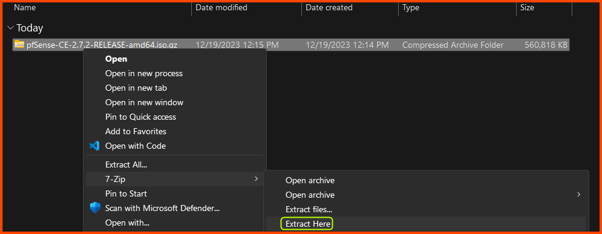

After extraction, we will have a file that has the **`.iso`** extension. 

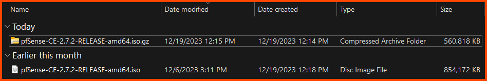

## pfSense VM Creation

Launch VirtualBox. Check on **`Tools`** from the sidebar and then Select **`New`** from the Toolbar.

For <u>Name</u>, you can enter anything that makes sense. The <u>Folder</u> option defines the location where the VM will be saved. From the <u>ISO Image</u> dropdown select Others and select the **`.iso`** file that we just downloaded. Select <u>Type</u> as **`BSD`** and <u>Version</u> as **`FreeBSD (64-bit)`** and then click on **`Next`**.

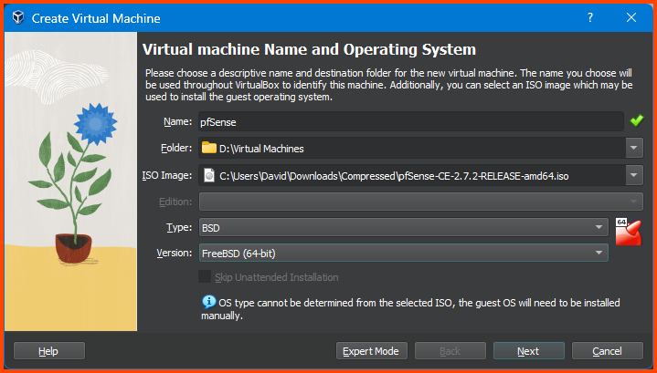

Here we select the amount of RAM and CPU that the VM can use. No need to change anything. Click on **`Next`** to continue.

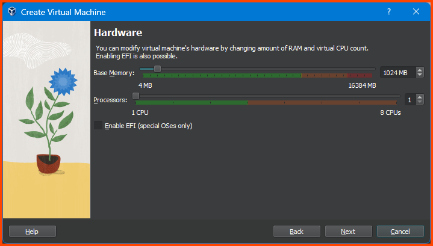

On this page, we choose the amount of storage space to reserve for the VM. Enter **`20GB`** in the input field.

[10.2. Understanding Virtual Disks](https://rhv.bradmin.org/ovirt-engine/docs/Administration_Guide/Understanding_virtual_disks.html)

Confirm that everything looks right and then click on **`Finish`**.

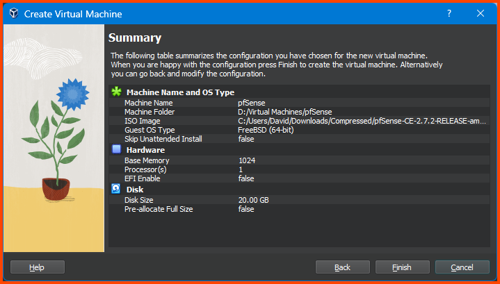

Once done we should see the newly created VM in the sidebar.

> [!INFO]
> Ignore the "Security Home Lab" and "Other VMs" Group that will be present in all the images. These groups contain VMs I have created for testing purposes. They will not be present in your instance. 

### Adding VM to Group

I like to keep my VMs organized by using the Groups feature of VirtualBox. This makes it easy to store related VMs together.

Right-click on the pfSense VM from the sidebar, select **`Move to Group -> [New]`**. The VM will now be added to a <u>Group</u> called **`New Group`**. 

Right-click on the Group, and select **`Rename Group`**. Name the Group **`Firewall`**.

The final result should match the following:

## pfSense VM Configuration

Before we boot the VM we need to configure some settings related to VirtualBox. Select the pfSense VM from the sidebar and then click on **`Settings`**.

### System Configuration

Select **`System -> Motherboard`** in the <u>Boot Order</u> section use the arrows to move the **`Hard Disk`** to the top, **`Optical`** should be next. Ensure that **`Floppy`** is unchecked. 

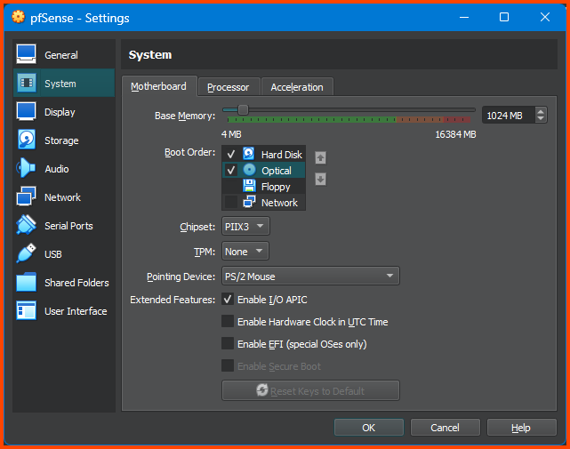

### Audio & USB Configuration

Go to the **`Audio`** tab and uncheck the **`Enable Audio`** option. Since the VM we are configuring is a router we do not need audio.

Go to the **`USB`** tab and uncheck the **`Enable USB Controller`** option. Since the VM we are configuring is a router we do not need USB support.

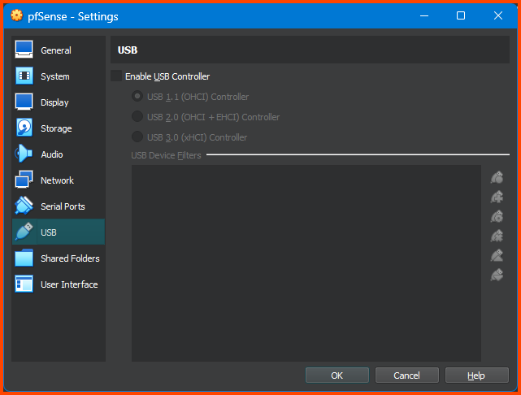

### Network Configuration

Go to **`Network -> Adapter 1`**. For the <u>Attached to</u> field select **`NAT`**. Expand the **`Advanced`** section and for <u>Adaptor Type</u> select **`Paravirtualized Network (virtio-net)`**.

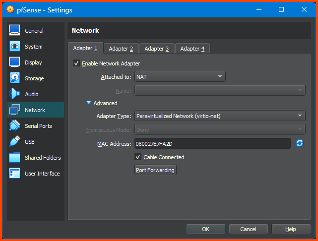

Select **`Adapter 2`**. Tick the **`Enable Network Adapter`** option. For the <u>Attached to</u> option select **`Internal Network`**. For <u>Name</u> enter **`LAN 0`**. Expand the **`Advanced`** section. For <u>Adapter Type</u> select **`Paravirtualized Network (virtio-net)`**.

Select **`Adapter 3`**. Tick the **`Enable Network Adapter`** option. For the <u>Attached to</u> option select **`Internal Network`**. For <u>Name</u> enter **`LAN 1`**. Expand the **`Advanced`** section. For <u>Adapter Type</u> select **`Paravirtualized Network (virtio-net)`**.

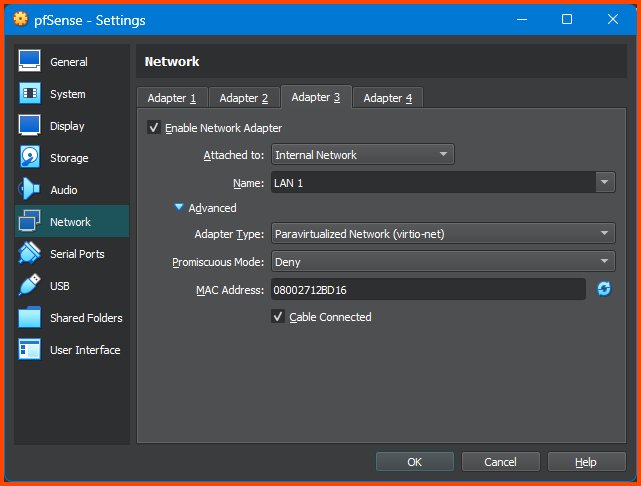

Select **`Adapter 4`**. Tick the **`Enable Network Adapter`** option. For the <u>Attached to</u> option select **`Internal Network`**. For <u>Name</u> enter **`LAN 2`**. Expand the **`Advanced`** section. For <u>Adapter Type</u> select **`Paravirtualized Network (virtio-net)`**. 

Once done click on **`OK`** to save the changes and close the configuration menu.

[VirtualBox Network Settings: All You Need to Know](https://www.nakivo.com/blog/virtualbox-network-setting-guide/)

> [!INFO]
> The network diagram shown in the first module consisted of 6 network interfaces. VirtualBox only allows us to configure 4 interfaces uses the UI. Towards the end of the guide we will see how to add more interfaces using VirtualBox CLI.

## pfSense Installation

Select the pfSense VM from the sidebar and click on **`Start`** from the toolbar.

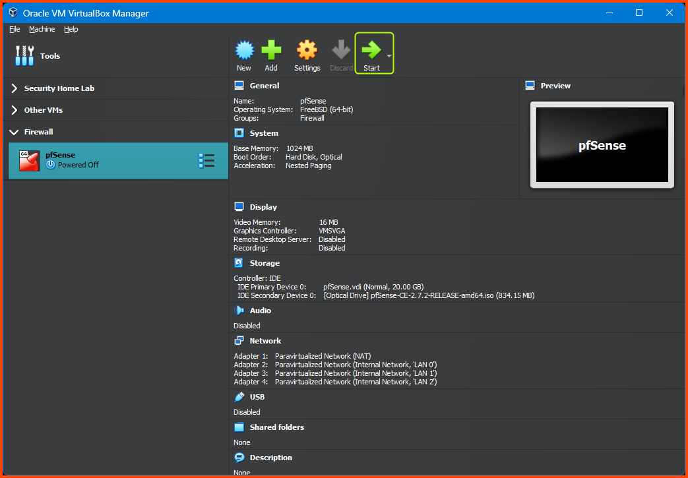

On boot, a banner will be shown followed by a lot of text. Wait for the below screen to appear. Press **`Enter`** to Accept the agreement. 

Press **`Enter`** to start the Installation.

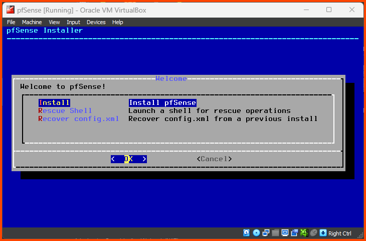

Press **`Enter`** to select the <u>Auto (ZFS)</u> partition option.

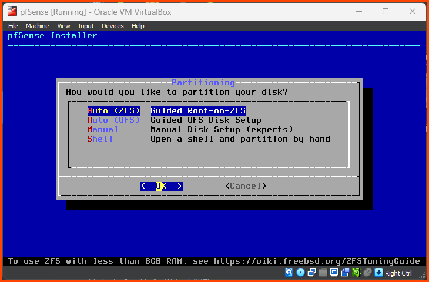

Press **`Enter`** to select <u>Proceed with Installation</u>.

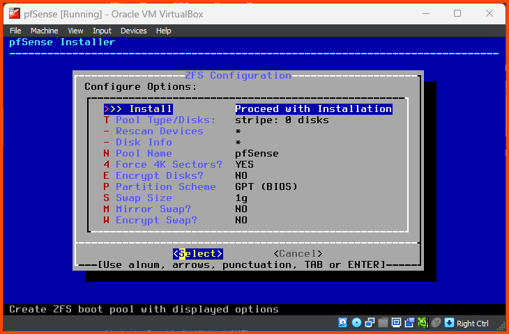

Press **`Enter`** to select <u>Stripe - No Redundancy</u>.

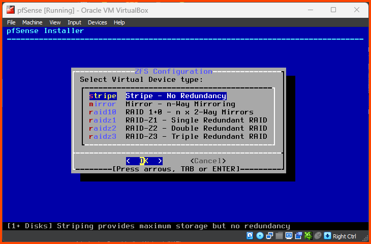

Use the **`Spacebar`** key to select the Hard Drive (**`ada0`**) then press **`Enter`** to continue.

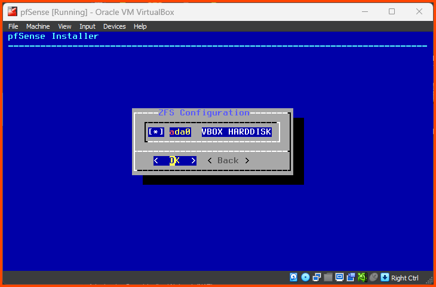

Use the Left Arrow to select **`YES`** and then press **`Enter`** to continue.

Wait for the installation to complete.

Press **`Enter`** to Reboot the VM.

## pfSense Configuration

Once pfSense reboots the first order of business is to onboard the adapters we configured in the VM settings. 

Should VLANs be set up now? **`n`**  
In the next step, we will configure the interfaces manually.

Enter the WAN interface name: **`vtnet0`**  
Enter the LAN interface name: **`vtnet1`**  
Enter the Optional 1 interface name: **`vtnet2`**  
Enter the Optional 2 interface name: **`vtnet3`**  

Do you want to proceed?: **`y`**

Since the **`WAN`** interface of pfSense is managed by VirtualBox it has been assigned an IPv4 address by the VirtualBox DHCP server. pfSense has also assigned an IPv4 address to the **`LAN`** interface using its DHCP service. The **`OPT1`** and **`OPT2`** interfaces have not been assigned any IP address. We do not want the IP addresses of the interfaces to change on boot so we will assign static IPv4 addresses to the **`LAN`**, **`OPT1`** and **`OPT2`** interfaces.

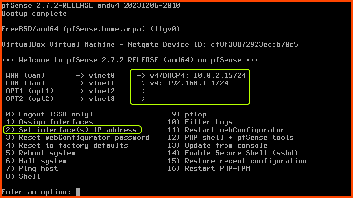

> [!INFO]
> The IP address of the `WAN` interface can be different in your case since it is assignment randomly by the VirtualBox DHCP server.

#### Configuring LAN (vtnet1)

Enter **`2`** to select "Set interface(s) IP address". Enter **`2`** to select the **`LAN`** interface.

Configure IPv4 address LAN interface via DHCP?: **`n`**  
Enter the new LAN IPv4 address: **`10.0.0.1`**  
Enter the new LAN IPv4 subnet bit count: **`24`**  

For the next question directly press **`Enter`**. Since this is a **`LAN`** interface we do not have to worry about configuring the upstream gateway.

Configure IPv6 address LAN interface via DHCP6: **`n`**  
For the new LAN IPv6 address question press **`Enter`**  
Do you want to enable the DHCP server on LAN?: **`y`**  
Enter the start address of the IPv4 client address range: **`10.0.0.11`**  
Enter the end address of the IPv4 client address range: **`10.0.0.243`**  
Do you want to revert to HTTP as the webConfigurator protocol?: **`n`**

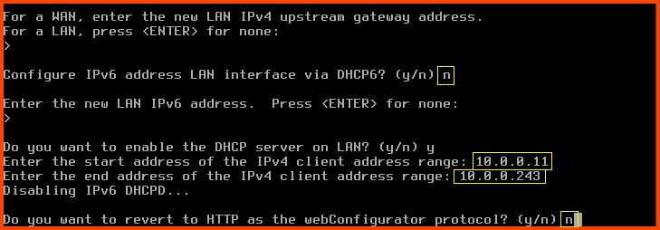

pfSense will use the inputs we provided and configure the interface.  
Press **`Enter`** to complete the **`LAN`** interface configuration.

Once the changes apply we see that the IP address of the **`LAN`** interface has changed to the IP address that we provided.

### Configuring OPT1 (vtnet2)

Enter **`2`** to select "Set interface(s) IP address". Enter **`3`** to select the **`OPT1`** interface.

Configure IPv4 address OPT1 interface via DHCP?: **`n`**  
Enter the new OPT1 IPv4 address: **`10.6.6.1`**  
Enter the new OPT1 IPv4 subnet bit count: **`24`**  

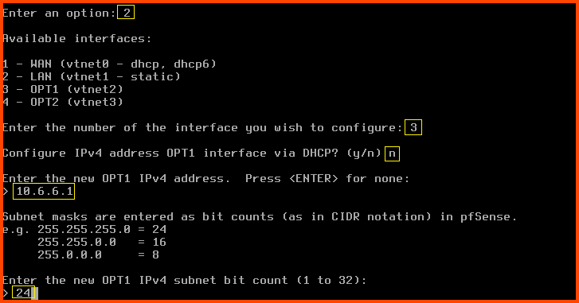

For the next question directly press **`Enter`**. Since **`OPT1`** is a **`LAN`** interface we do not have to worry about configuring the upstream gateway.

Configure IPv6 address OPT1 interface via DHCP6: **`n`**  
For the new OPT1 IPv6 address question press **`Enter`**  
Do you want to enable the DHCP server on OPT1?: **`y`**  
Enter the start address of the IPv4 client address range: **`10.6.6.11`**  
Enter the end address of the IPv4 client address range: **`10.6.6.243`**  
Do you want to revert to HTTP as the webConfigurator protocol?: **`n`**

Press **`Enter`** to save the changes and return to the main menu.

### Configuring OPT2 (vtnet3)

Enter **`2`** to select "Set interface(s) IP address". Enter **`4`** to select the **`OPT2`** interface.

Configure IPv4 address OPT2 interface via DHCP?: **`n`**  
Enter the new OPT2 IPv4 address: **`10.80.80.1`**  
Enter the new OPT2 IPv4 subnet bit count: **`24`**  

For the next question directly press **`Enter`**. Since **`OPT2`** is a **`LAN`** interface we do not have to worry about configuring the upstream gateway.

Configure IPv6 address OPT2 interface via DHCP6: **`n`**  
For the new OPT2 IPv6 address question press **`Enter`**  
Do you want to enable the DHCP server on OPT2?: **`n`**  
Do you want to revert to HTTP as the webConfigurator protocol?: **`n`**

> [!INFO]
> **`OPT2`** will be used to setup the Active Directory (AD) Lab. The Domain Controller (DC) in the lab will act as the DHCP server. Since the DC will perform DHCP we have disabled DHCP-based IP address assignment for this interface in pfSense.  

Press **`Enter`** to save the changes and return to the main menu.

The IP addresses for the **`LAN`**, **`OPT1`** and **`OPT2`** interfaces should be as follows:

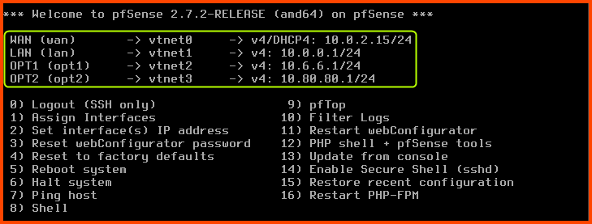

With this, we have completed the onboarding of the interfaces in pfSense. There are additional settings that need to be configured. We will change these settings once we set up Kali Linux in the next module. From Kali Linux, we will access the pfSense Web Interface and proceed with the setup. 

> [!INFO]
> pfSense Web Interface can be accessible for all the **`LAN`** interfaces in our LAN. 

## Shutdown pfSense

When we start the lab pfSense is the first VM that has to be booted. When we shut down the lab pfSense will be the last VM that is stopped.

Enter a option: **`6`** (Halt system)
Do you want to process?: **`y`**

This will initiate the shutdown sequence.

## Post-Installation Cleanup

After the VM is shut down. Click on **`Settings`** from the toolbar.

Go to the **`Storage`** tab. In the <u>Storage Devices</u> section click on the pfSense **`.iso`** image then click on the small disk image on the right side of the <u>Optical Drive</u> option.

From the dropdown select **`Remove Disk from Virtual Drive`**. Click on **`OK`** to save the changes and close the configuration menu.

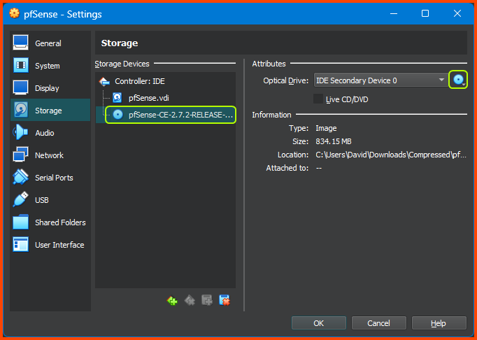

The **`.iso`** file along with the **`.iso.gz`** file that was downloaded to create the VM can be deleted if you do not want to store them.

In the next module, we will set up Kali Linux on the **`LAN`** interface. This VM will be used to configure and manage pfSense. It will also be used as the attack VM to target the vulnerable systems on the **`OPT1 (CYBER_RANGE)`**.
