---
categories:
  - Security
  - Home Lab
date: 2024-01-06 09:10:00 -0600
description: A step-by-step guide for building your very own Cybersecurity Home Lab using VirtualBox
img_path: /assets/
published: true
tags:
  - security
  - home-lab
  - virtualbox
  - networking
  - pfsense
title: "Building a Virtual Security Home Lab: Part 4 - pfSense Firewall Configuration"
---

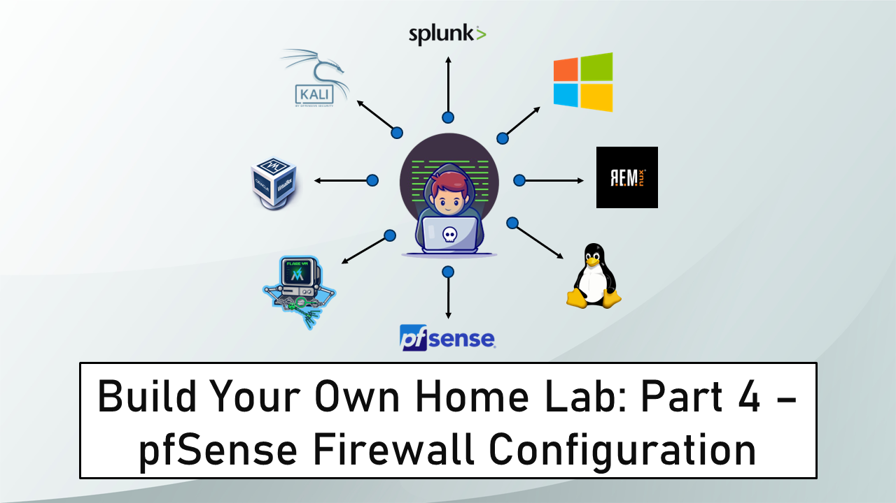

Banner Background by [logturnal](https://www.freepik.com/free-vector/gradient-white-color-background-abstract-modern_34010189.htm) on Freepik  
Hacker Image by [catalyststuff](https://www.freepik.com/free-vector/hacker-operating-laptop-cartoon-icon-illustration-technology-icon-concept-isolated-flat-cartoon-style_11602236.htm) on Freepik

In this module, we will finish the pending pfSense setup. After that, we will define firewall rules for the subnets we defined for our home lab. 

## pfSense General Configuration

### Web Portal Setup

On the Kali Linux VM, open the web browser and navigate to **`https://10.0.0.1`**. 

You will get the following message <u>Warning: Potential Security Risk Ahead</u>. This warning can be ignored. We get this warning because the URL that we are trying to access does not use the secure HTTP (HTTPS). Click on **`Advanced`** and then click on **`Accept the Risk and Continue`**.


This will open the pfSense Web UI login page. Login using the default credentials.  
Username: **`admin`**  
Password: **`pfsense`**


Click on **`Next`**.

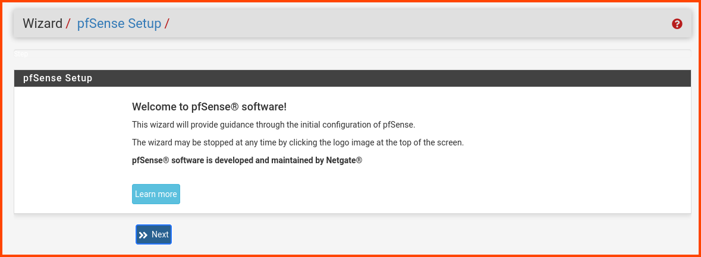

Click **`Next`** again.


In the **`General Information`** section. Provide a <u>Hostname</u> and <u>Domain</u> name. This can be any name you choose. The <u>hostname</u> can be used to identify the pfSense VM on the network. Uncheck the <u>Override DNS</u> option and then click **`Next`**.


Select your <u>Timezone</u> and then click **`Next`**. 


Scroll to the bottom of the page and look for the **`RFC1918 Networks`** section. Uncheck the <u>Block RFC1918 Private Networks</u> option. 


> [!INFO]
> We disable this option because our WAN interface is not an real WAN interface. It uses an private IP address instead of an public IP address which would be used by a real WAN interface to connect to the Internet.  
> Our WAN interface uses a private IP address to send data packets to the host system which then sends the data packets to the router present in the network.

Don't change any value on this page. Click on **`Next`**.


Enter a new password for the admin user. Store the password in a secure place.


Click on **`Reload`** to apply the changes.

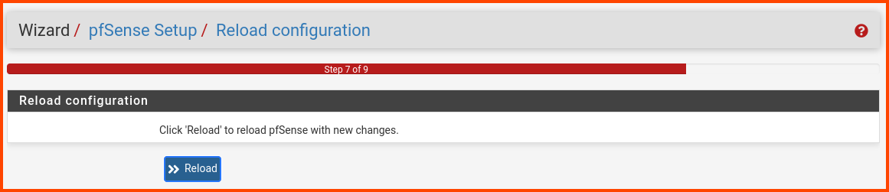

Click on **`Finish`**.

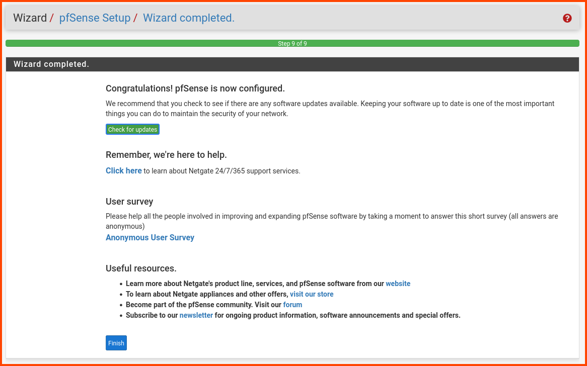

Once the onboarding is complete we will be able to access the pfSense dashboard.


### Interface Renaming

From the navigation bar select **`Interfaces -> OPT1`**.

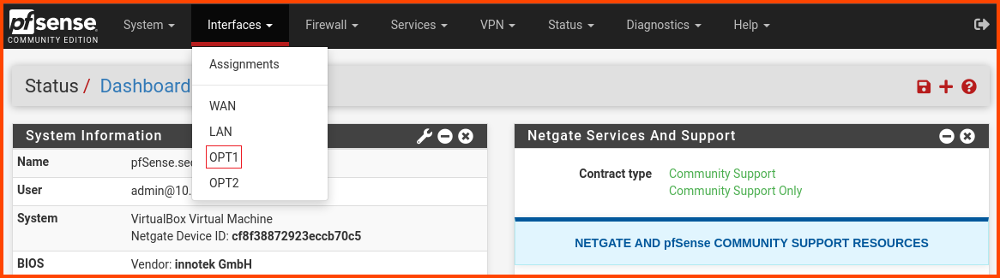

In the <u>Description</u> field enter **`CYBER_RANGE`**. Scroll to the bottom and click on **`Save`**. 

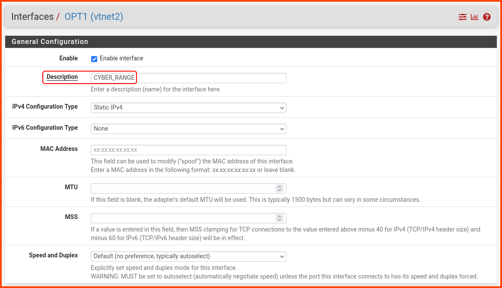

At the top of the page, a new popup will appear. Click on **`Apply Changes`**.


From the navigation bar select **`Interfaces -> OPT2`**. 


In the <u>Description</u> field enter **`AD_LAB`**. Scroll to the bottom of the page and click on **`Save`**. A popup will appear at the top of the page click on **`Apply Changes`**.

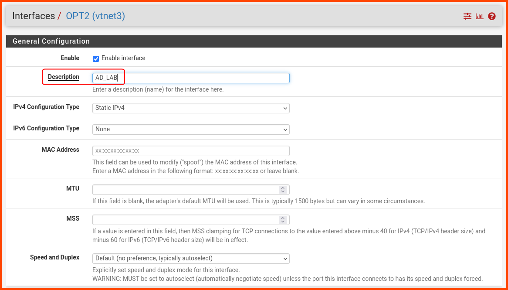

### DNS Resolver Configuration

From the navigation bar select **`Services -> DNS Resolver`**.

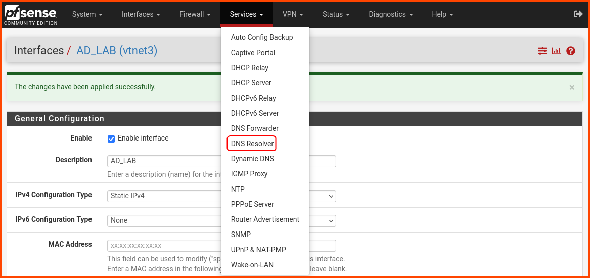

Scroll to the bottom of the page, look for the highlighted options and enable them. No need to save just yet. Scroll to the top of the page.


Click on **`Advanced Settings`**.


Scroll down to the **`Advanced Resolver Options`** section and enable the highlighted options. Scroll to the end and click on **`Save`**.

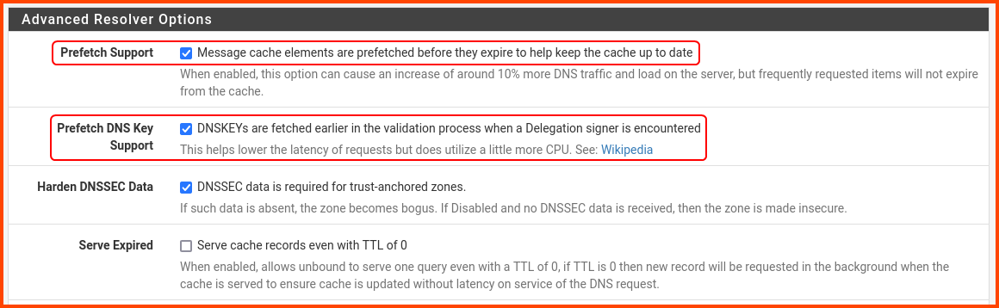

A popup will appear at the top of the page. Click on **`Apply Changes`**.


### Advanced Configuration

From the navigation bar select **`System -> Advanced`**.


Go to the **`Networking`** tab


Scroll to the end in the **`Network Interfaces`** section and enable the highlighted option. This option should improve the performance of pfSense. Click on **`Save`**.


A popup will appear click on **`OK`** to reboot pfSense.

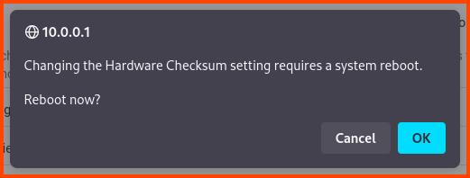

The following page will be shown while pfSense applies the changes.

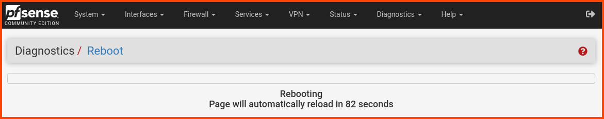

Once the reboot is complete we will be asked to log in again. Use the new password to access the Dashboard.


## Kali Linux Static IP Assignment

From the navigation bar select **`Status -> DHCP Leases`**.

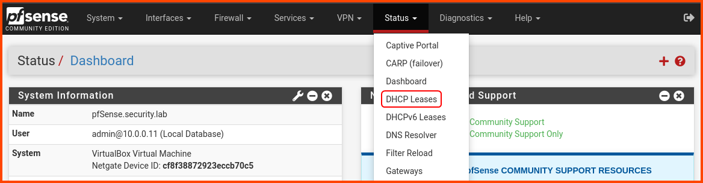

In the **`Leases`** section, we should see the Kali Linux VM with its current IP address. Click on the highlighted **`+`** icon to assign a static IP to Kali Linux. The static IP will make it easier for us to apply firewall rules to interfaces that should only be able to reach the Kali VM. 

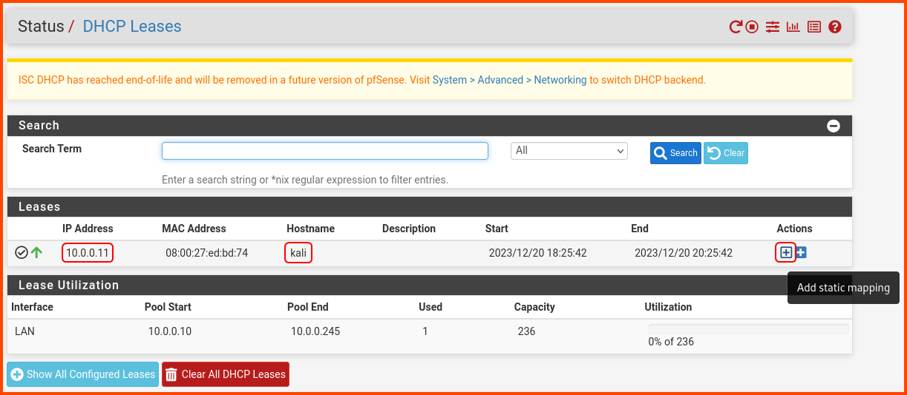

In the <u>IP Address</u> input enter **`10.0.0.2`**. Scroll to the bottom and click on **`Save`**.


A popup will show up at the top of the page. Click on **`Apply Changes`**.

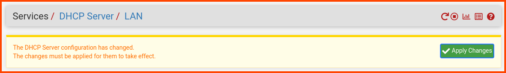

### Refresh Kali Linux IP Address

Open a terminal on the VM. Use the following command to see the current IP address.

```bash
ip a l eth0
```

We want the VM to release the current IP address and use the static IP that was reserved. This can be achieved using the following command:

```bash
sudo ip l set eth0 down && sudo ip l set eth0 up
```

Enter password when prompted. To confirm that the VM is using the static IP run the following command:

```bash
ip a l eth0
```


## pfSense Firewall Configuration

From the navigation bar select **`Firewall -> Rules`**.

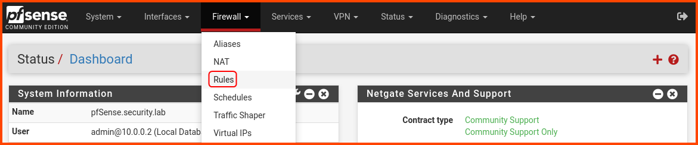

### LAN Rules

Go to the **`LAN`** tab. The LAN tab will have some predefined rules.


Click on the "<u>Add rule to top</u>" button to create a new rule. 


Change the following options:  
Action: **`Block`**  
Address Family: **`Ipv4+IPv6`**  
Protocol: **`Any`**  
Source: **`LAN subnets`**  
Destination: **`WAN subnets`**  
Description: **`Block access to services on WAN interface`**

Scroll to the bottom and click on **`Save`**.


A popup will appear at the top of the page. Click on **`Apply Changes`**.


The final LAN rules should look as follows.

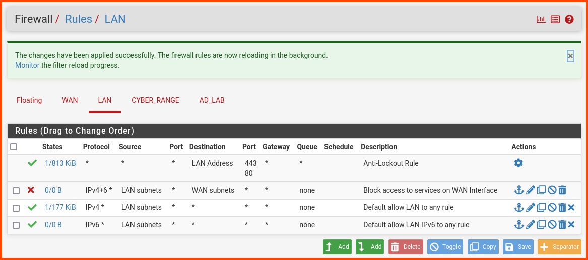

The order of the rules is important. If the order is not correct. Drag the rules around till it matches the above image.

### CYBER_RANGE Rules

Before creating the rules for **`CYBER_RANGE`** we need to create a <u>Alias</u>. From the navigation bar select **`Firewall -> Aliases`**.


In the <u>IP</u> tab click on **`Add`** to create a new alias.

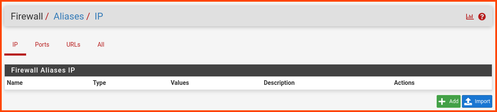

Enter the following details:  
Name: **`RFC1918`**  
Description: **`Private IPv4 Address Space`**  
Type: **`Network(s)`**  
Network 1: **`10.0.0.0/8`**  
Network 2: **`172.16.0.0/12`**  
Network 3: **`192.168.0.0/16`**  
Network 4: **`169.254.0.0/16`**  
Network 5: **`127.0.0.0/8`**

Click on **`Save`** to create an alias.


A popup will show up at the top click on **`Apply Changes`**.


The final result should be as follows:

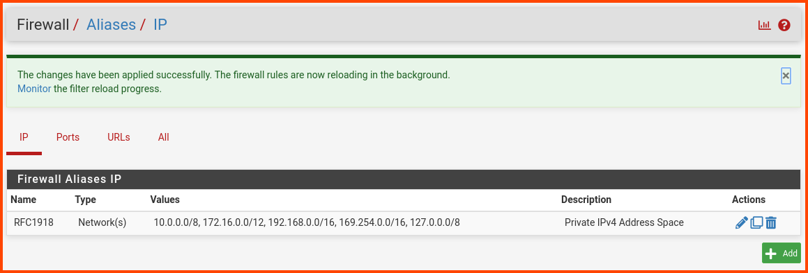

From the navigation bar select **`Firewall -> Rules`**. Select the **`CYBER_RANGE`** tab.


Use the "<u>Add rule to end</u>" button for all the rules.

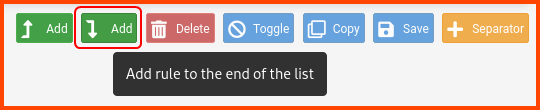

Configure the rule as follows:
Address Family: **`IPv4+IPv6`**  
Protocol: **`Any`**  
Source: **`CYBER_RANGE subnets`**  
Destination: **`CYBER_RANGE address`**  
Description: **`Allow traffic to all devices on the CYBER_RANGE network`**

Scroll to the bottom and click on **`Save`**.


A popup will appear at the top to save the changes, no need to click on that just yet. Click on the "<u>Add rule to end</u>" button to create a new rule.

The rule has the following details:  
Protocol: **`Any`**  
Source: **`CYBER_RANGE subnets`**  
Destination: **`Address or Alias - 10.0.0.2`**  
Description: **`Allow traffic to Kali Linux VM`**

Scroll to the bottom and click on **`Save`**.


Click on the "<u>Add rule to end</u>" button to create a new rule.

Create a rule with the following settings:  
Protocol: **`Any`**  
Source: **`CYBER_RANGE subnets`**  
Destination: **`Address or Alias - RFC1918`** (Select Invert match)  
Description: **`Allow to any non-private IPv4 Address`**

Scroll to the bottom and click on **`Save`**. 


Click on the "<u>Add rule to end</u>" button to create a new rule.

Create a rule with the following settings:  
Action: **`Block`**  
Address Family: **`IPv4+IPv6`**  
Protocol: **`Any`**  
Source: **`CYBER_RANGE subnets`**  
Description: **`Block access to everything`**

Scroll to the bottom and click on **`Save`**.

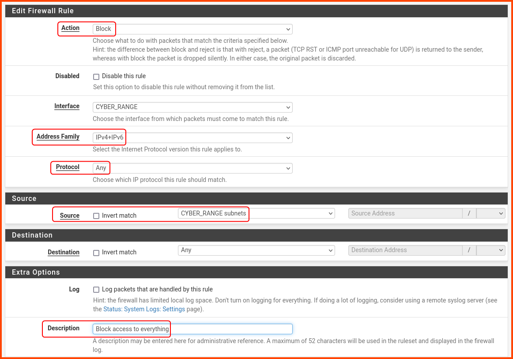

Click on the **`Apply Changes`** button in the popup at the top of the screen.


The final rules should look as follows:

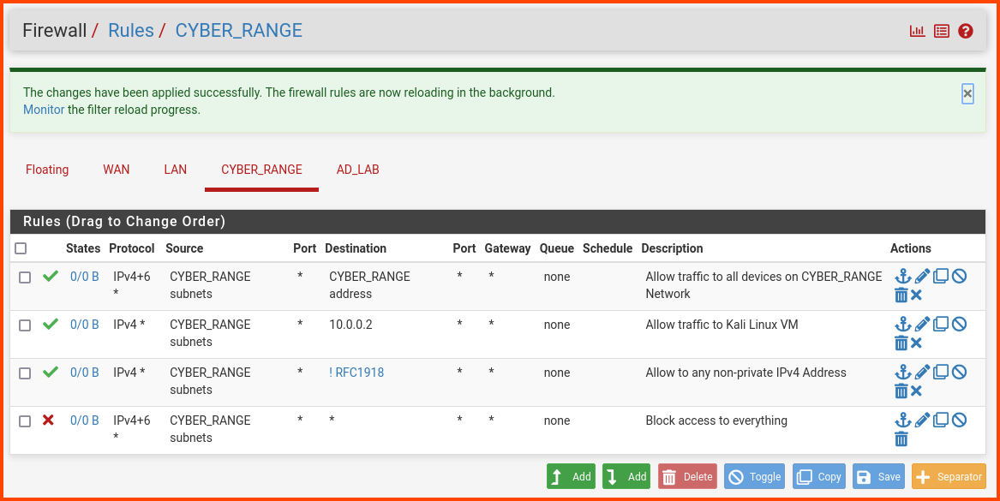

### AD_LAB Rules

Click on the **`AD_LAB`** tab. Use the "<u>Add rule to end</u>" button to create new rules.


Create a rule with the following settings:  
Action: **`Block`**  
Address Family: **`IPv4+IPv6`**  
Protocol: **`Any`**  
Source: **`AD_LAB subnets`**  
Destination: **`WAN subnets`**  
Description: **`Block access to services on WAN interface`**

Scroll to the bottom and click on **`Save`**.

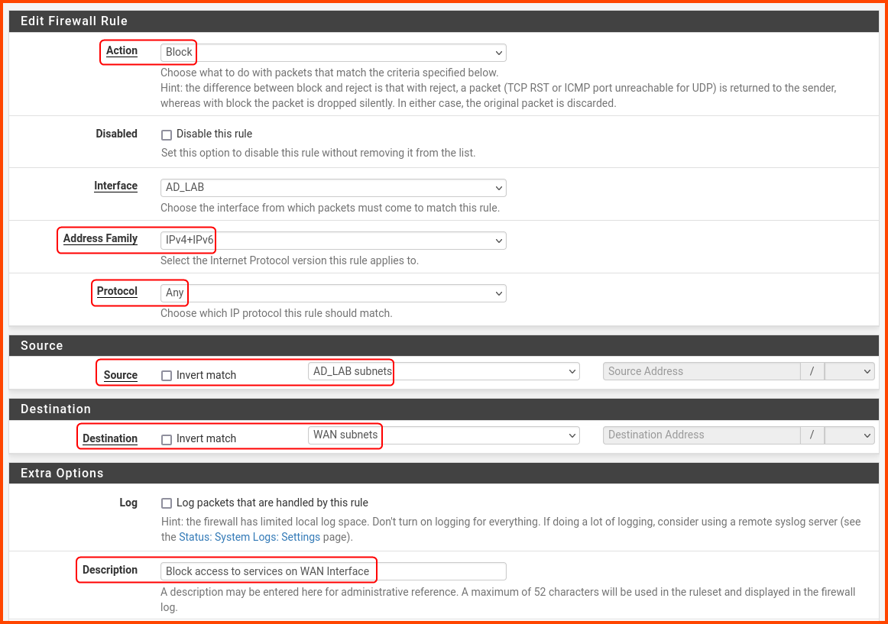

A popup will appear at the top to save the changes, no need to click on that just yet. Click on the "<u>Add rule to end</u>" button to create a new rule.

The rule has the following details:  
Action: **`Block`**  
Address Family: **`IPv4+IPv6`**  
Protocol: **`Any`**  
Source: **`AD_LAB subnets`**  
Destination: **`CYBER_RANGE subnets`**  
Description: **`Block traffic to CYBER_RANGE interface`**

Scroll to the bottom and click on **`Save`**.


Click on the "<u>Add rule to end</u>" button to create a new rule.

The rule has the following details:  
Address Family: **`IPv4+IPv6`**  
Protocol: **`Any`**  
Source: **`AD_LAB subnets`**  
Description: **`Allow traffic to all other subnets and Internet`**

Scroll to the bottom and click on **`Save`**.


Click on the **`Apply Changes`** button in the popup at the top of the screen.

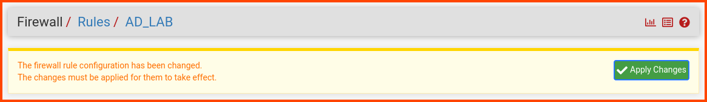

The final rules should look as follows:

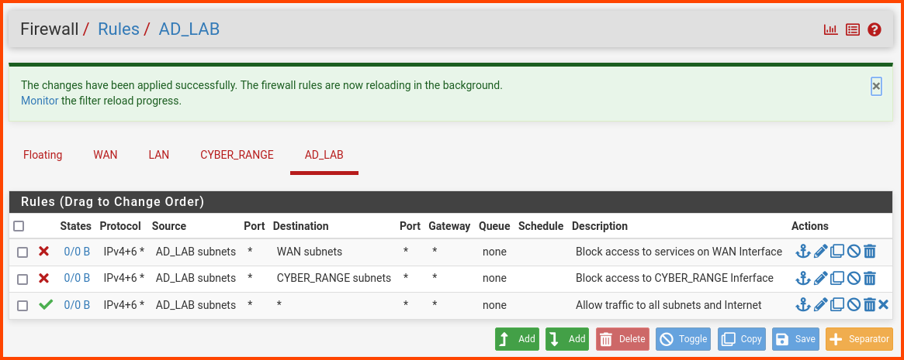

## pfSense Reboot

Now we need to restart pfSense to persist the firewall rules. From the navigation bar select **`Diagnostics -> Reboot`**.

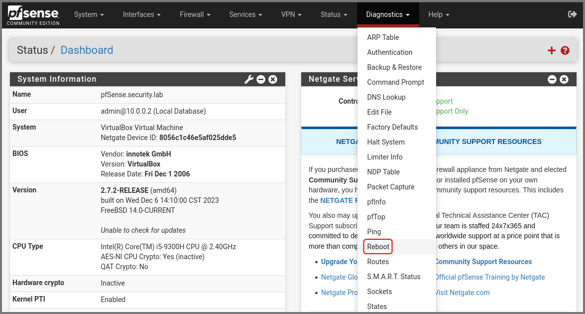

Click on **`Submit`**.


Once pfSense boots up you will be redirected to the login page.

In the next module, we will add some vulnerable VMs to the **`CYBER_RANGE`** interface and then we will test our connectivity to them from the Kali Linux VM.

[Part 5 - Cyber Range Setup](https://blog.davidvarghese.dev/posts/building-home-lab-part-5/)