---
categories:
  - Security
  - Home Lab
date: 2024-01-20 18:00:00 -0600
description: A step-by-step guide for building your very own Cybersecurity Home Lab using VirtualBox
img_path: /assets/
published: true
tags:
  - security
  - home-lab
  - virtualbox
  - networking
  - active-directory
title: "Building a Virtual Security Home Lab: Part 7 - Active Directory Lab Setup - Part 2"
---

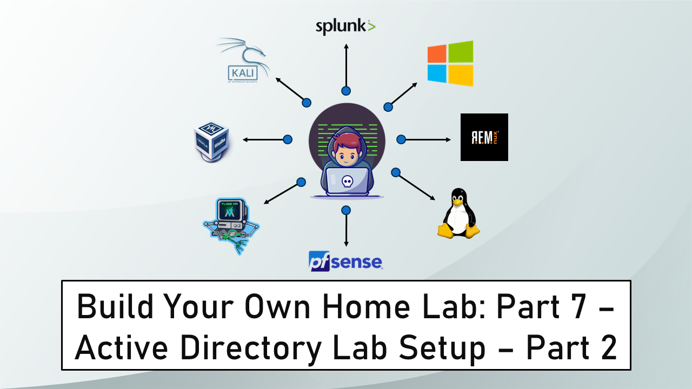

Banner Background by [logturnal](https://www.freepik.com/free-vector/gradient-white-color-background-abstract-modern_34010189.htm) on Freepik  
Hacker Image by [catalyststuff](https://www.freepik.com/free-vector/hacker-operating-laptop-cartoon-icon-illustration-technology-icon-concept-isolated-flat-cartoon-style_11602236.htm) on Freepik

In the previous module, we installed Windows Server 2019, installed AD Domain Services, configured DHCP and set up a DNS Forwarder. In this module, we will continue building out the AD Lab by completing the Domain Controller setup and adding devices to the AD environment.

## Windows Server 2019 Setup

### Domain Configuration

#### Certificate Service Installation

Select **`Manage`** from the top right corner of Server Manager and then select "<u>Add Roles and Features</u>".


Click **`Next`** till you reach the <u>Server Roles</u> page. Enable "<u>Active Directory Certificate Services</u>".

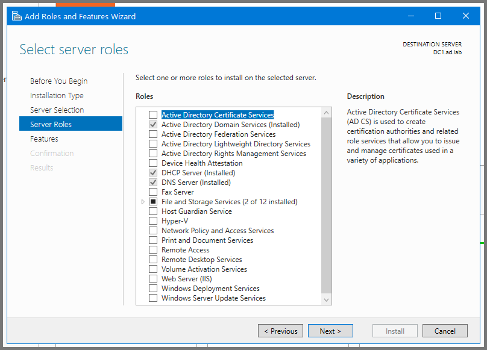

Click on **`Add Features`**.

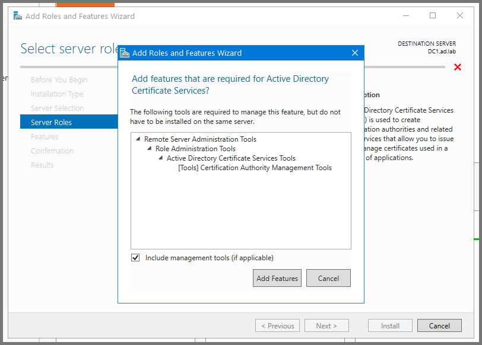

Click on **`Next`** to continue.


Click **`Next`** till you reach the **`Role Services`** Page. Enable "<u>Certificate Authority</u>". Click on **`Next`** to continue.

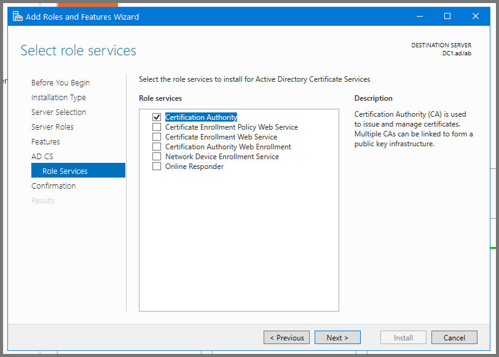

Click on **`Install`** to start the setup.


After the installation is complete the server has to be restarted. Open the <u>Start Menu</u>, click on the <u>Power</u> icon and then select **`Restart`**.

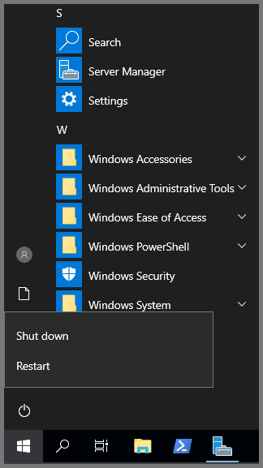

Click on **`Continue`** to restart the system.

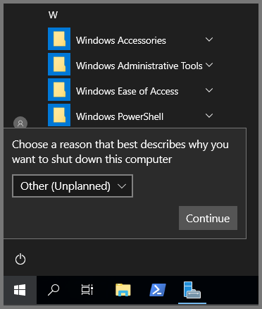

#### Certificate Service Configuration

After the restart once Server Manager loads. Click on the <u>Flag</u> icon on the top right side and select "<u>Configure Active Directory Certificate Services</u>"


Click on **`Next`**.

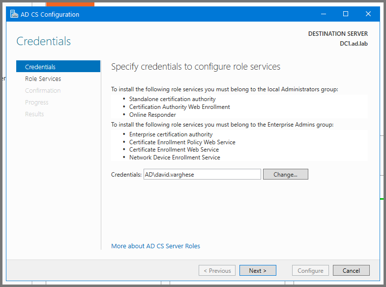

Enable "<u>Certification Authority</u>" and click on **`Next`**.

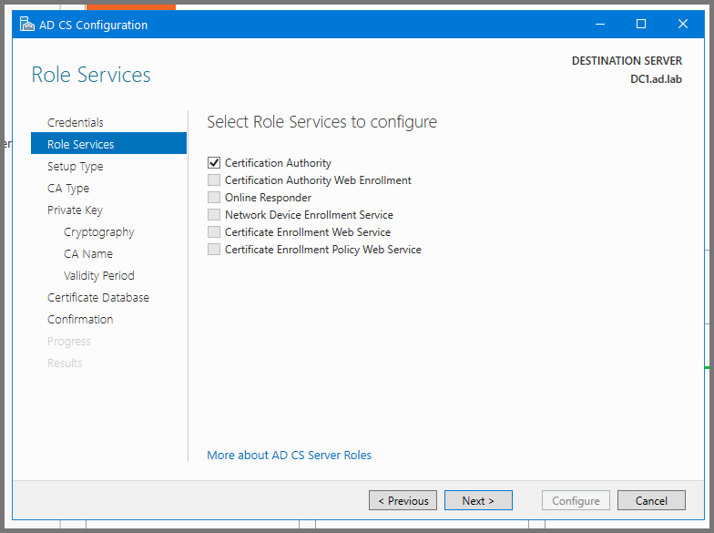

Click on **`Next`**.


Click on **`Next`**.

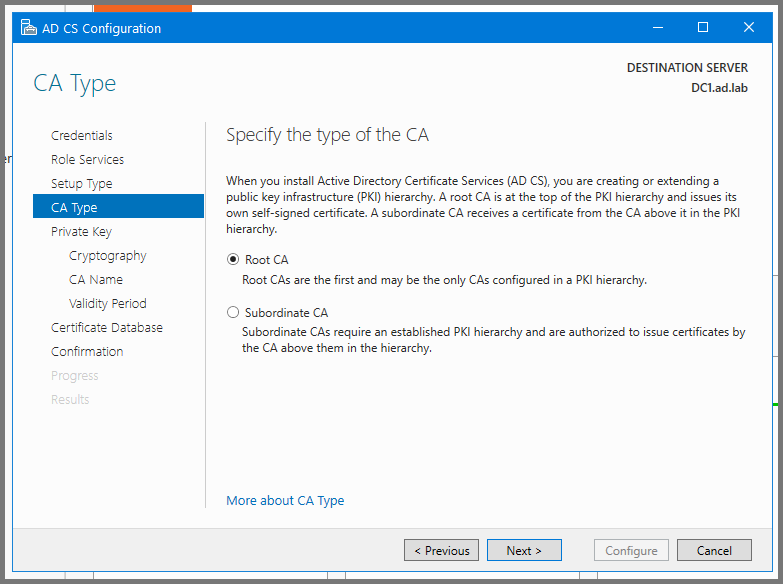

Click on **`Next`** till you reach the <u>Confirmation</u> page. Click on **`Configure`** to save the changes.

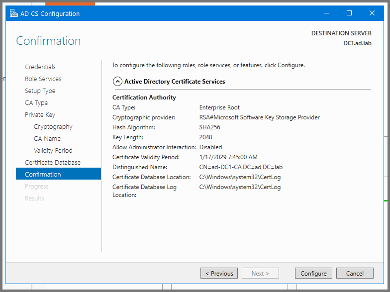

Click on **`Close`**.


### User Configuration

#### AD Admin Setup

Open the <u>Start menu</u> click on "<u>Windows Administrative Tools</u>" and then select **`Active Directory Users and Computers`**.


Right-click on the <u>domain name</u> (in my case **`ad.lab`**) in the sidebar. Then select **`New -> User`**.  

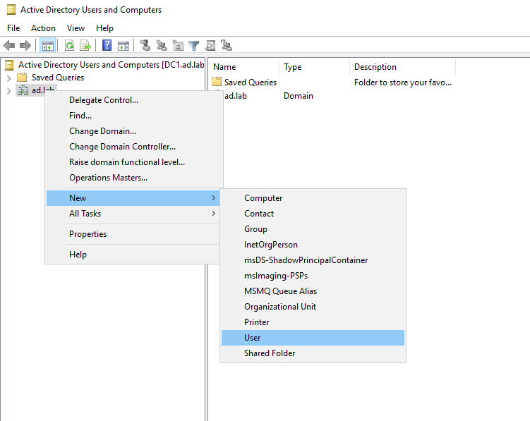

Enter the <u>First Name</u>, <u>Last Name</u> and <u>User logon name</u> for the new user. This user will be the **`Administrator`** for the Domain Controller.

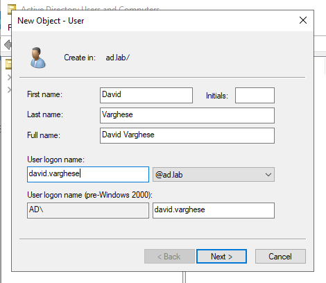

Enter the <u>Password</u> for the user. Uncheck all options leaving "<u>Password never expires</u>". Click on **`Next`** to create the user.

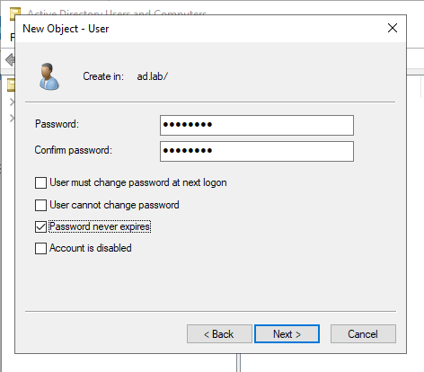

Expand the dropdown on the domain name from the sidebar. Click on **`Users`**. Then double-click on "<u>Domain Admins</u>".

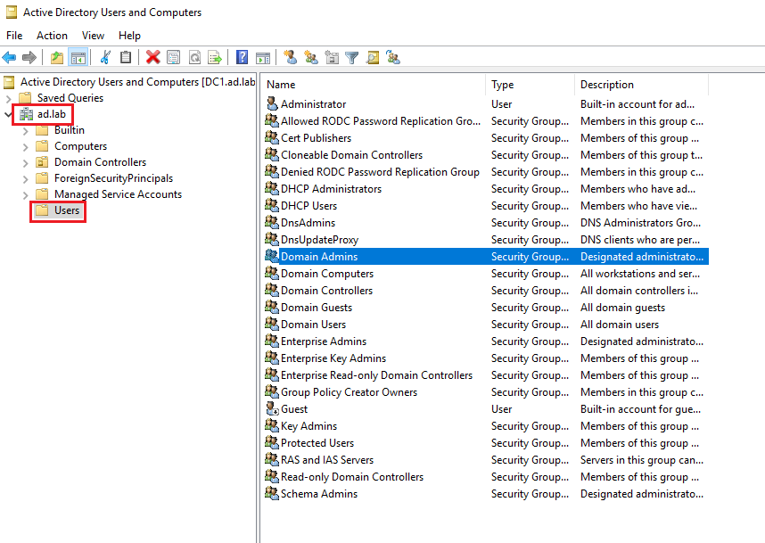

Go to **`Members -> Add`**.

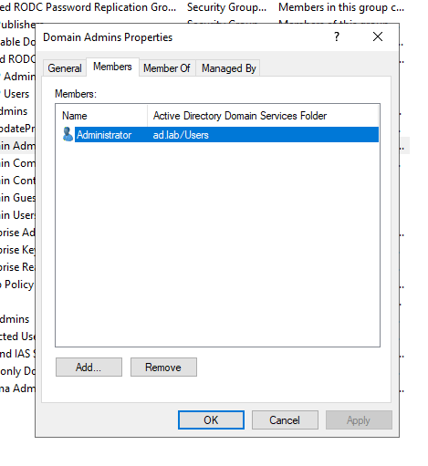

Enter the <u>name</u> of the user and check on **`Check Names`**.


Click on **`OK`**.

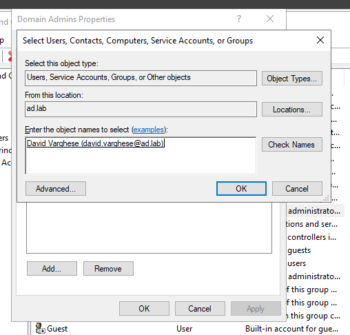

Click on **`Apply`** then **`OK`** to persist the changes.


Open the <u>Start</u> menu and then click on the <u>user logo</u> and then select **`Sign out`**.

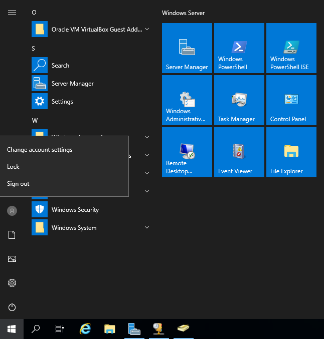

From the login screen select "<u>Other user</u>". Then enter the <u>login name</u> and <u>password</u> that was configured for your domain administrator.


#### AD User 1 Setup

Open the <u>Start menu</u>. Select "<u>Windows Administrative Tools</u>" and then choose **`Active Directory Users and Computers`**.

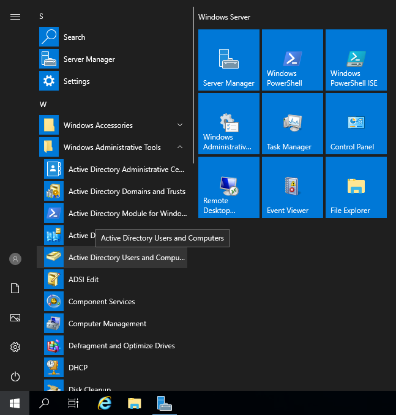

Right-click on the <u>domain name</u> from the sidebar. Select **`New -> User`**.


Enter the details for the user.

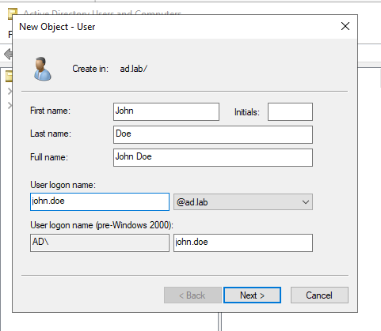

Give the user a <u>password</u>. Check the "<u>User cannot change password</u>" and "<u>Password never expires</u>" options. Click **`Next`** to create a user.

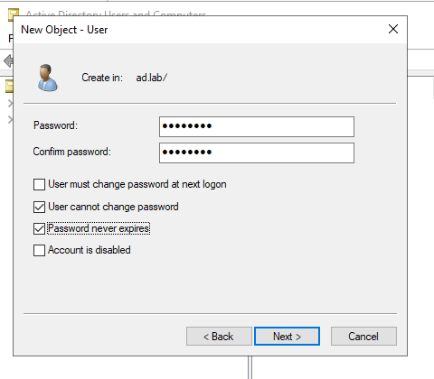

#### AD User 2 Setup

Follow the same steps as above to create a second AD User.


## Making AD Lab Exploitable

To make the Active Directory Lab vulnerable we need to change some settings. We will use a PowerShell script and change so and Group Policies to achieve the desired result.

> [!INFO]
> You can skip this section and continue from the "<u>Windows 10 Enterprise VM1 Setup</u>" step if you do not plan to make your Active Directory Lab vulnerable to attacks

### Running Vulnerable AD Script

Right-click on the <u>Start menu</u> and select **`Windows PowerShell (Admin)`**.

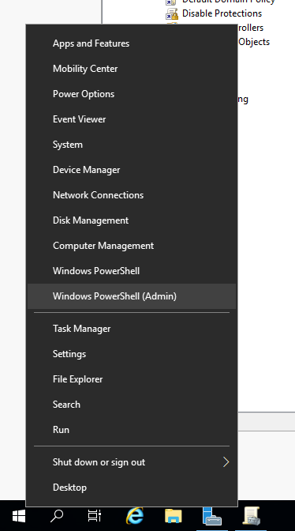

Run the following command:

```powershell
# Allow Execution of Scripts
Set-ExecutionPolicy -ExecutionPolicy Bypass -Force
```


```powershell
# Download and Execute Script
[System.Net.WebClient]::new().DownloadString('https://raw.githubusercontent.com/WaterExecution/vulnerable-AD-plus/master/vulnadplus.ps1') -replace 'change\.me', 'ad.lab' | Invoke-Expression
```

> [!WARNING]
> Replace **`ad.lab`** with the name you have used for your Active Directory Domain before running the above command.  

The above command constants of the following steps:
**`[System.Net.WebClient]::new().DownloadString()`**: Downloads the Script  
**`-replace`**: Change string present in the script  
**`Invoke-Expression`**: Execute the Script

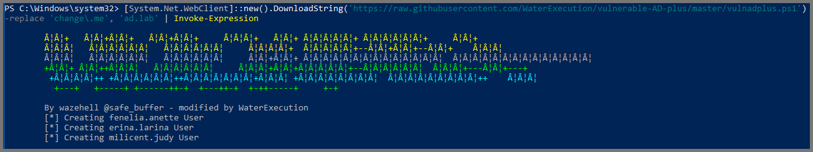

Once the script reaches the end. It will wait for 30 seconds and then restart the system.

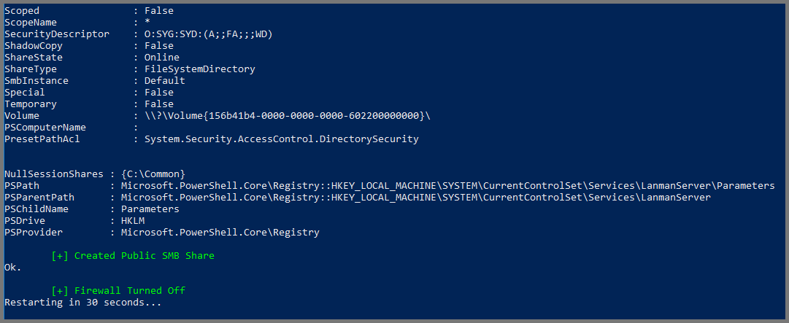

### Group Policy Configuration

After the system restarts open the <u>Start menu</u> and click on "<u>Windows Administrative Tools</u>" then choose **`Group Policy Management`**.

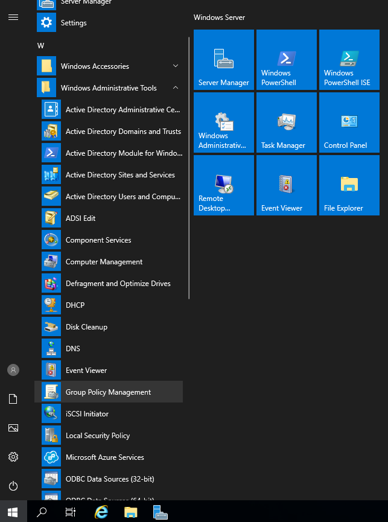

Expand "<u>Forest</u>" and then expand "<u>Domains</u>".


#### Disable Windows Defender and Firewall

Right-click on the <u>domain name</u>. Select "<u>Create a GPO in the domain and link here</u>".

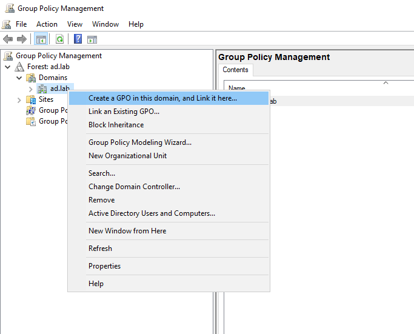

Give the GPO the <u>name</u> **`Disable Protections`**.


Expand the d<u>omain name</u>. Right-click on "<u>Disable Protections</u>" and choose **`Edit`**.


This will open the <u>Group Policy Management Editor</u>. From the sidebar go to the following folder: **`Computer Configuration -> Policies -> Administrative Templates -> Windows Components -> Windows Defender Antivirus`**.


Select "<u>Windows Defender Antivirus</u>". From the right side select "<u>Turn off Windows Defender Antivirus</u>" and click on **`Edit policy setting`**.

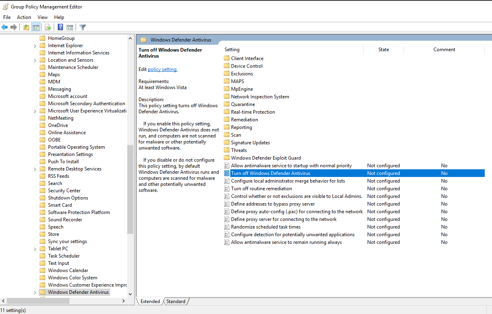

Set it to **`Enabled`**. Click on **`Apply`** then **`OK`** to save the changes.


Double-click on **`Real-time Protection`**.

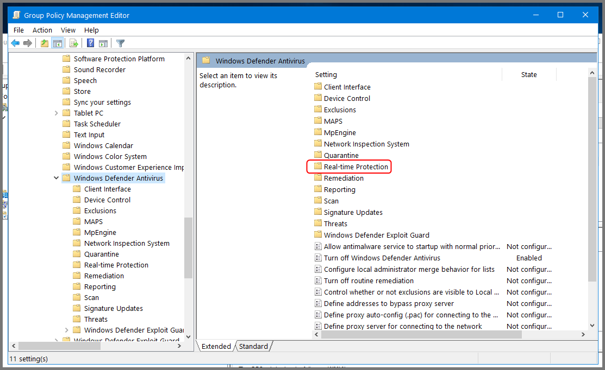

Select "<u>Turn off real-time protection</u>" and then click on "<u>Edit policy settings</u>"


Set it to **`Enabled`**. Click on **`Apply`** then **`OK`** to save the changes.

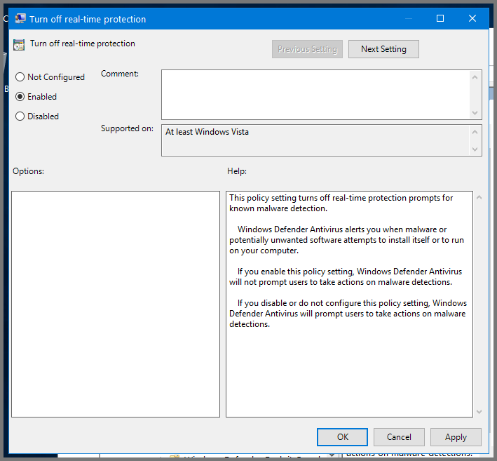

Expand the sidebar folders to the following: **`Computer Configuration -> Policies -> Administrative Templates -> Network -> Network Connections -> Windows Defender Firewall -> Domain Profile`**. 

Select "<u>Windows Defender Firewall: Protect all network connections</u>". Click on "Edit policy settings".

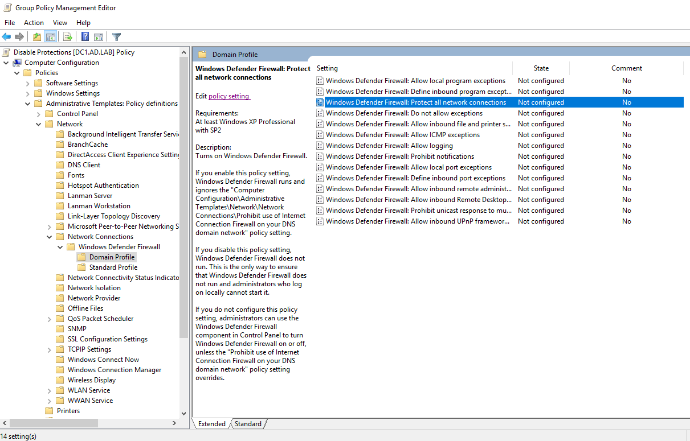

Set it to **`Disabled`**. Click on **`Apply`** then **`OK`** to save the changes. 

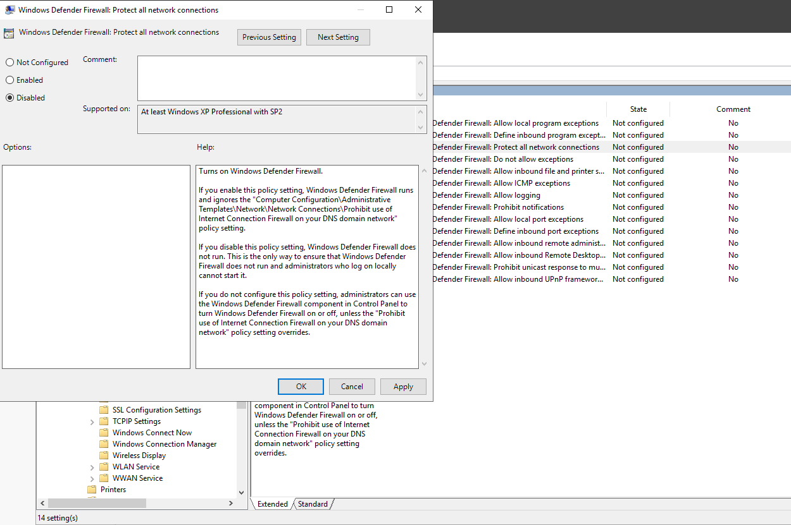

Close Group Policy Management Editor. From the sidebar of Group Policy Management right-click on "<u>Disable Protections</u>" and choose "<u>Enforced</u>". 


#### Enable Remote Login for Local Admins

Right-click on the <u>domain</u> name. Select "<u>Create a GPO in the domain and link here</u>".


Give the GPO the name **`Local Admin Remote Login`**.


Right-click on "<u>Local Admin Remote Login</u>" and choose **`Edit`**.

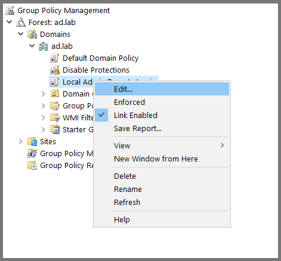

Using the sidebar descend into **`Computer Configuration -> Preferences -> Windows Settings -> Registry`**. Then, right-click **`Registry`** and choose **`New -> Registry Item`**.


For the Hive field select **`HKEY_LOCAL_MACHINE`**. To fill the value in the "<u>Key Path</u>" field click on the **`...`** button.


In the window that opens up navigate to the following directory: **`SOFTWARE\Microsoft\Windows\CurrentVersion\Policies\System`**

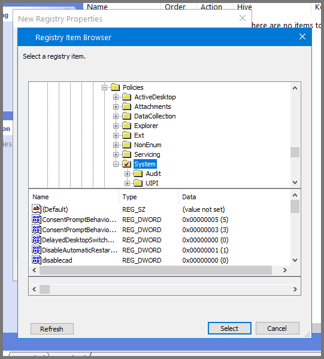

Enter the following for the remaining fields:  
Value name: **`LocalAccountTokenFilterPolicy`**  
Value type: **`REG_DWORD`**  
Value data: **`1`**

Click on **`Apply`** then **`OK`**. Close Group Policy Management Editor.


#### Enable WinRM Server

Right-click on the <u>domain</u> name. Select "<u>Create a GPO in the domain and link here</u>".


Give the GPO the name **`Enable WinRM Server`**.

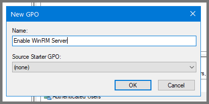

Right-click on "<u>Enable WinRM Server</u>" and choose **`Edit`**.

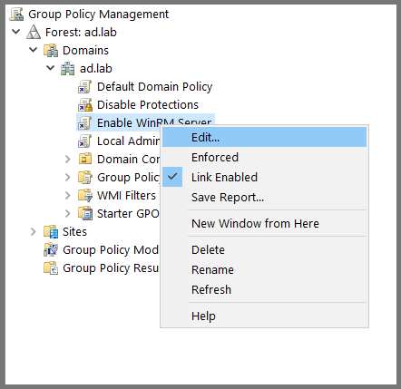

Using the sidebar go to the following folder: **`Computer Configuration -> Policies -> Administrative Templates -> Windows Components -> Windows Remote Management (WinRM) -> WinRM Service`**.

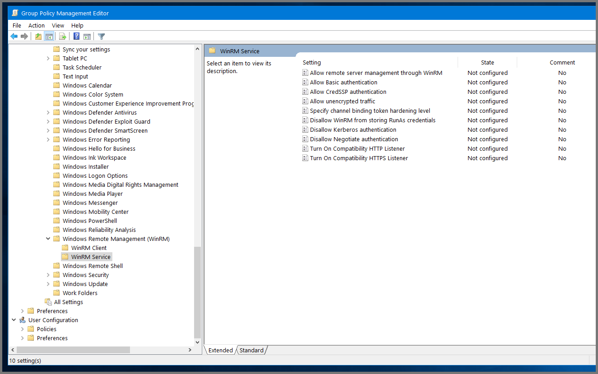

Select "<u>Allow remote server management through WinRM</u>" and then click on "<u>Edit policy settings</u>".


Set the policy to **`Enabled`**. In the <u>IPv4 filter</u> field enter **`*`**. Click on **`Apply`** then **`OK`**.

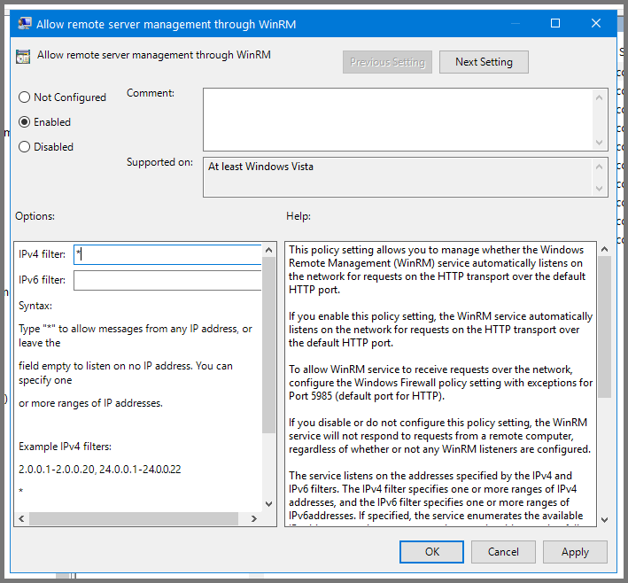

Select "<u>Allow Basic authentication</u>" and click on "<u>Edit policy settings</u>".


Set the policy to **`Enabled`**. Click on **`Apply`** and then **`OK`**.

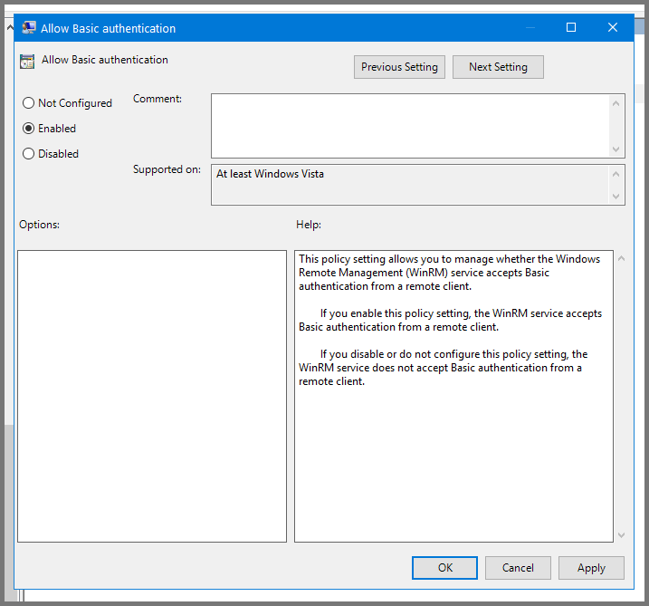

Select "<u>Allow unencrypted traffic</u>" and click on "<u>Edit policy settings</u>".

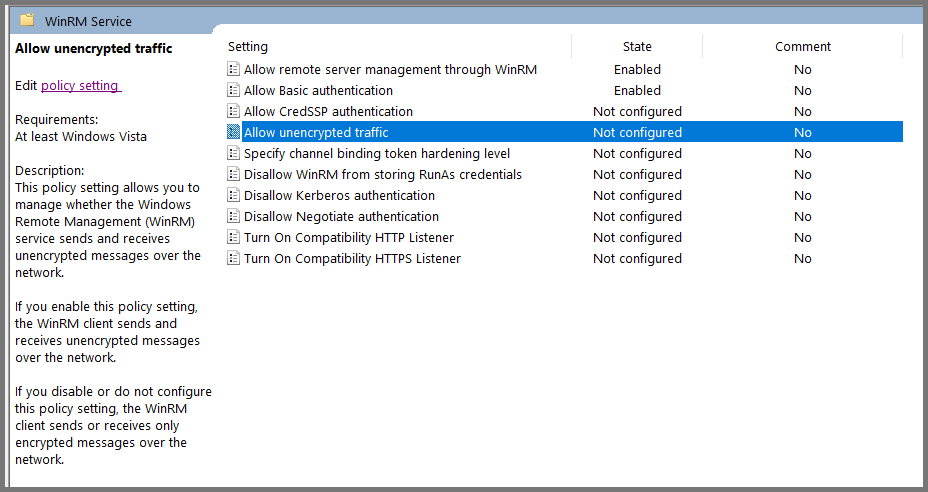

Set the policy to **`Enabled`**. Click on **`Apply`** then **`OK`**.


In the sidebar navigate to: **`Computer Configuration -> Preferences -> Control Panel Settings`**. Right-click on <u>Services</u> and select **`New -> Service`**.


Select <u>Startup</u> to **`Automatic`**. Use the **`...`** button to select the <u>Server name</u>.

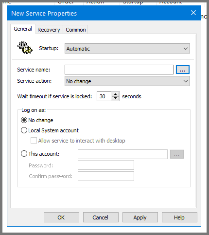

Select "<u>Windows Remote Management (WS-Management)</u>" and click on **`Select`**.

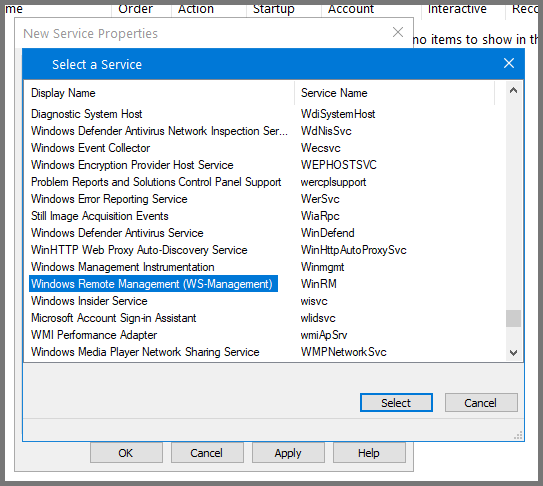

For <u>Service action</u> select **`Start service`**. Click on **`Apply`** then **`OK`**.


Using the sidebar navigate to the following location: **`Computer Configuration -> Policies -> Administrative Templates -> Windows Components -> Windows Remote Shell`**

Select "<u>Allow Remote Shell Access</u>" and click on "<u>Edit policy setting</u>".


Set the policy to **`Enabled`**. Click on **`Apply`** then **`OK`**. Close the Group Policy Management Editor.

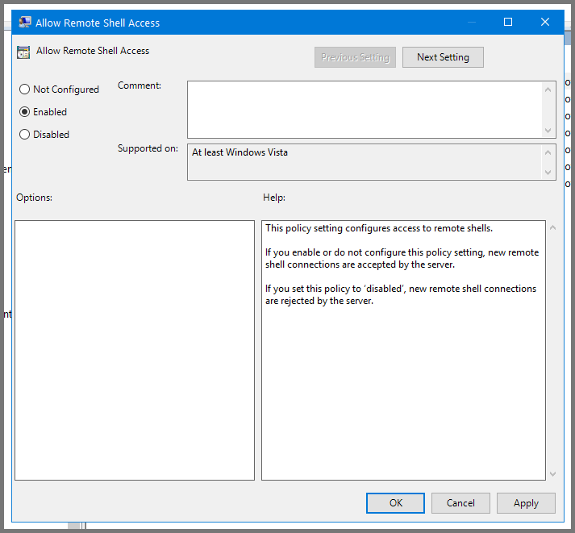

#### Enable RDP (Remote Desktop Protocol)

Right-click on the <u>domain</u> name. Select "<u>Create a GPO in the domain and link here</u>".


Give the GPO the name **`Enable RDP`**.

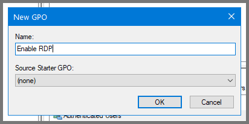

Right-click on "<u>Enable RDP</u>" and select **`Edit`**.

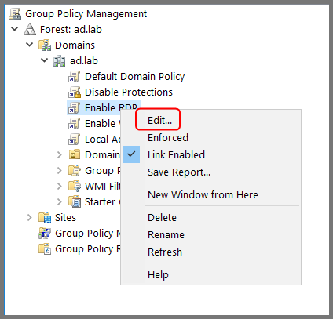

Using the sidebar navigate to the following folder: **`Computer Configuration -> Policies -> Administrative Templates -> Windows Components -> Remote Desktop Services -> Remote Desktop Session Host -> Connections`**.

Select "<u>Allow users to connect remotely using Remote Desktop Services</u>" and click on "<u>Edit policy settings</u>".

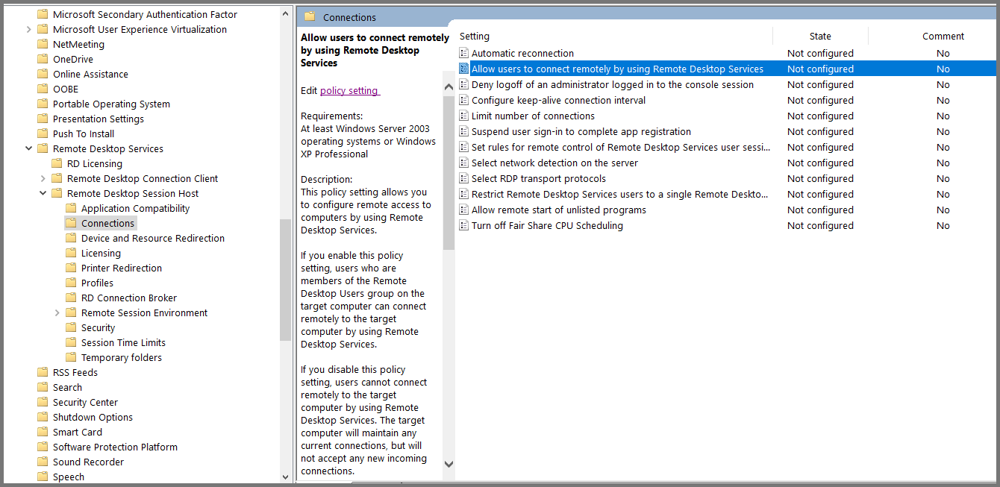

Set the policy to **`Enabled`**. Click on **`Apply`** then **`OK`**. Close Group Policy Management Editor.

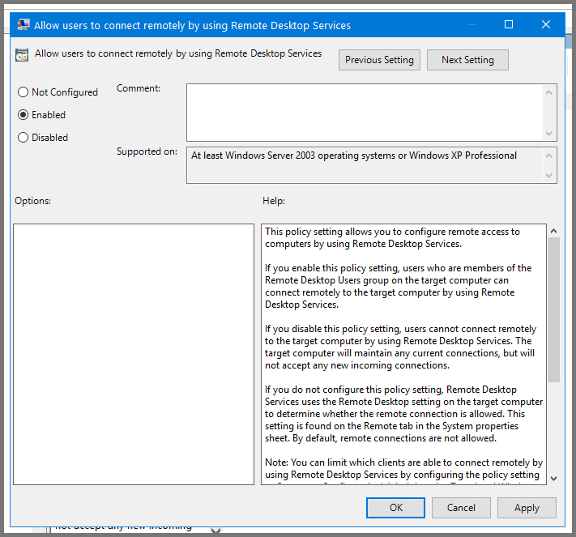

#### Enable RPC (Remote Procedure Call)

Right-click on the <u>domain</u> name. Select "<u>Create a GPO in the domain and link here</u>".


Give the GPO the name **`Enable RPC`**.

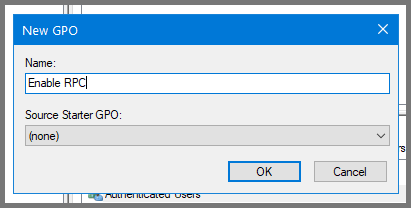

Right-click on "<u>Enable RPC</u>" and select **`Edit`**.

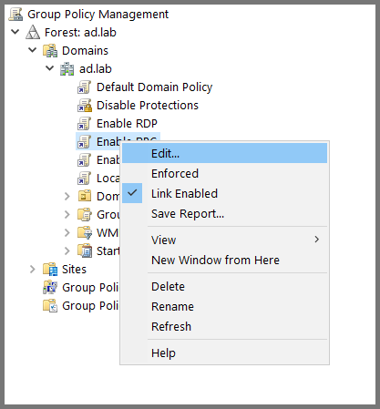

Using the sidebar navigate to the following folder: **`Computer Configuration -> Administrative Templates -> System -> Remote Procedure Call`**.

Select "<u>Enable RPC Endpoint Mapper Client Authentication</u>" and click on "<u>Edit policy settings</u>".

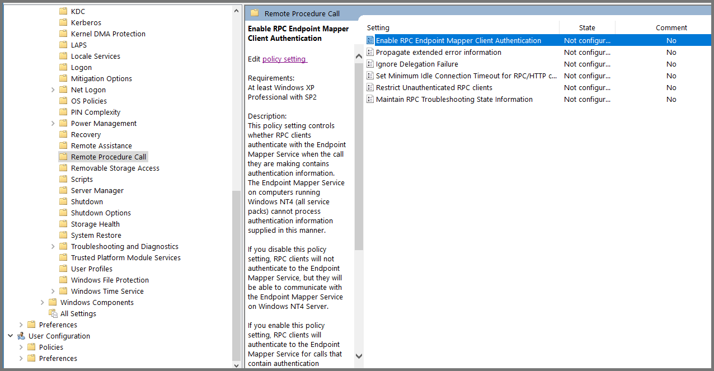

Set the policy to **`Enabled`**. Click on **`Apply`** then **`OK`**. Close Group Policy Management Editor.


#### Enforce the Domain Policies

Right-click on the <u>Start menu</u> and select **`Windows PowerShell (Admin)`**.


In the terminal enter the following:

```powershell
gpupdate /force
```

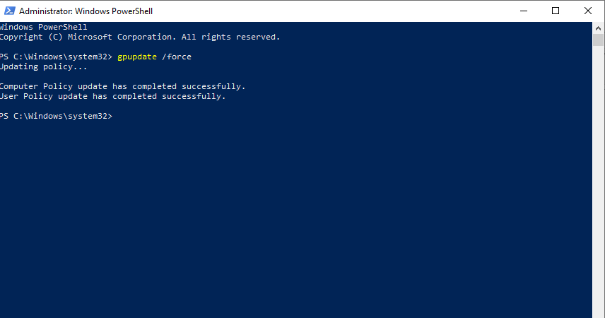

Now whenever a new device joins our AD environment the Group Policies that apply to all the devices will automatically be applied to them. With this, we have completed the Domain Controller setup.

> [!INFO]
> For the rest of the module the DC VM should be left powered on. To use the AD lab DC should be the first VM that is launched.

## Windows 10 Enterprise VM1 Setup

Select Windows 10 Enterprise VM1 from the sidebar then click on **`Start`**.

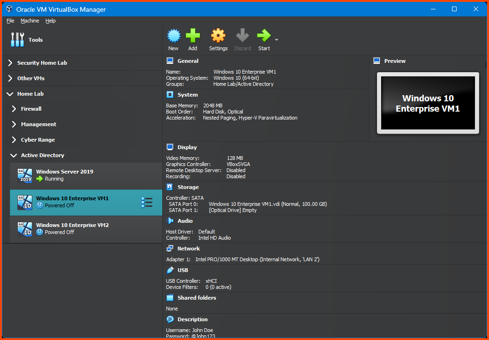

### OS Installation

Click on **`Next`**.


Click on **`Install now`**.


<u>Accept</u> the agreement and then click on **`Next`**.


Select "<u>Custom: Install Windows only (advanced)</u>".


Select **`Disk 0`** and then click on **`Next`**.


The VM will reboot multiple times during the installation.


Select your **`Region`** and **`Keyboard Layout`**.


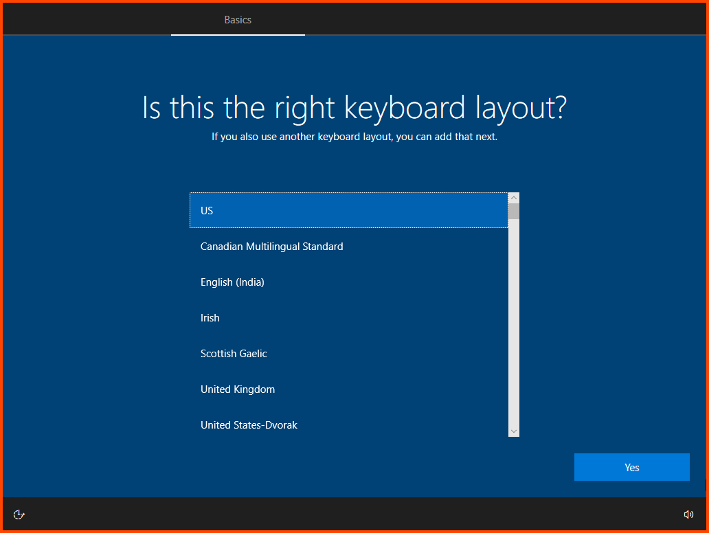

Click on **`Skip`**.


Select "<u>Domain join instead</u>". This will allow us to configure a local account.


Enter a <u>username</u> and click on **`Next`**. 


> [!INFO]
> You can provide any username in this step but to avoid confusion I would recommend using the <u>First Name</u> of one of the non-admin users that was created in AD. In my case the two AD users are John Doe and Jane Doe. For this VM I have choose John, when i configure the 2nd VM I will use Jane.

Enter a <u>password</u> and click on **`Next`**.

This password can be different from the password that was configured in Active Directory.

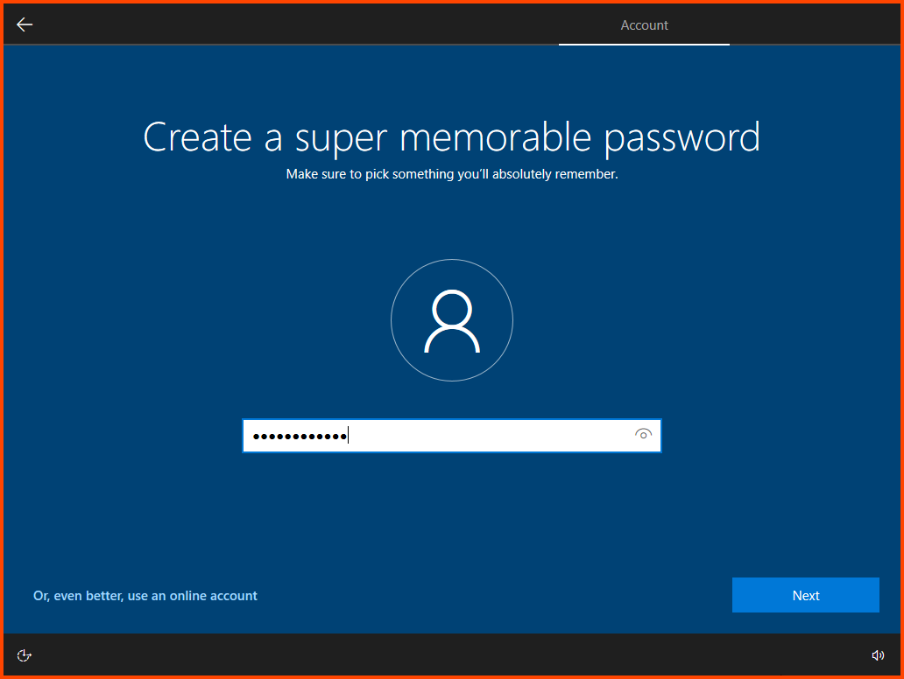

Configure the "<u>Security Questions</u>" for the user. Remember to note down these details in a secure location.


Disable all the features that are shown. Then click on **`Accept`**.


Select **`Not now`**.


Once on the desktop a prompt to allow internet access should show up click on **`Yes`**.

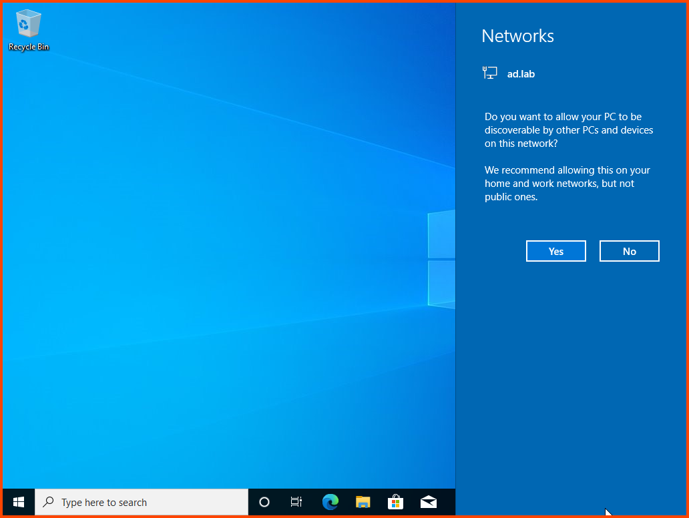

### Guest Additions Installation

Similar to the Windows 2019 Server VM we need to install <u>Guest Additions</u> to enable Fullscreen mode. From the VM toolbar select **`Devices -> Remove disk for virtual drive`**. This will remove the Windows 10 image.


Click on **`Devices -> Insert Guest Additions CD image`**.


Open <u>File Explorer</u>. Once the disk has loaded from the sidebar select the disk drive. Double-click **`VBoxWindowsAdditions`** to start the installer. 


Click **`Next`**.


Click **`Next`**.


Click on **`Install`** to start the installation.


Select "<u>Reboot now</u>" and then click on **`Finish`**. The VM will reboot.


Login into the system. 

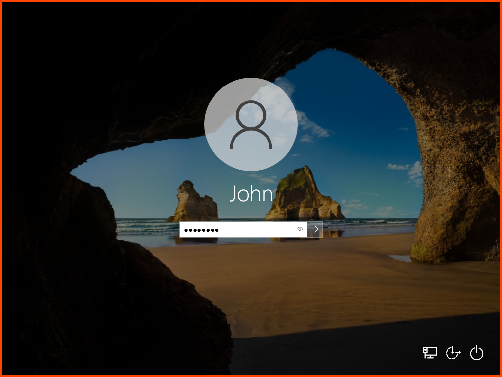

From the toolbar select **`Optical Devices -> Remove disk from virtual drive`** to remove the <u>Guest Additions</u> image.


Use the shortcut **`Right Ctrl+F`** to enter <u>Fullscreen mode</u>. Use the same key to exit Fullscreen. The VM should automatically scale to fit the window size. 

### Adding VM1 to Domain

Now we can add this device to the AD domain and log in as an AD user.

Click on the <u>Search Bar</u> and search for "<u>This PC</u>". Right-click on it and select **`Properties`**.

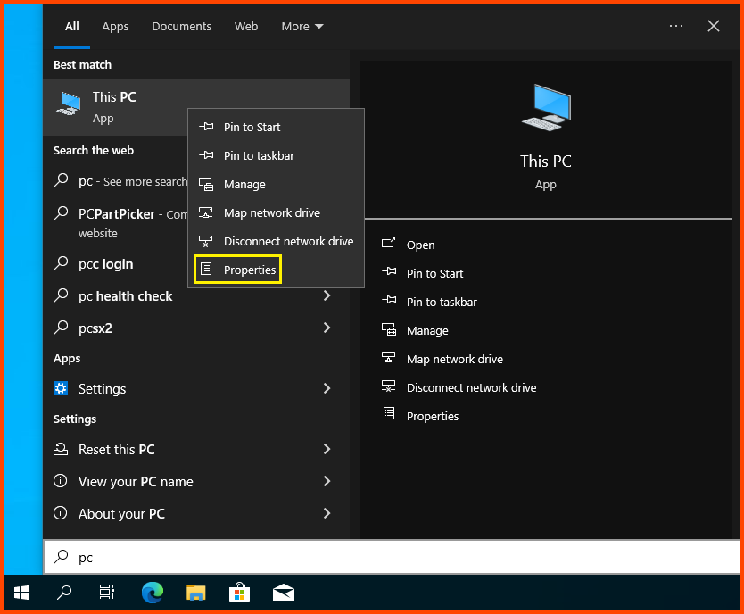

Click on **`Advanced system settings`**.

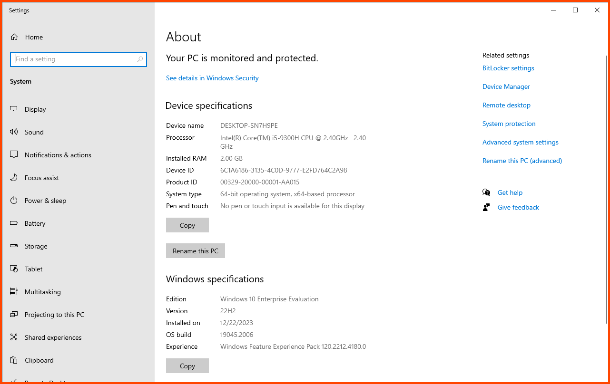

Select the "<u>Computer Name</u>" tab and click on **`Change`**.

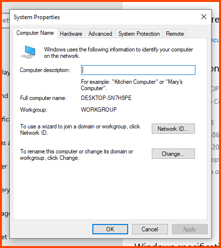

In the <u>Computer name</u> field enter a name that can be used to easily identify this VM. In the <u>Member of</u> section select **`Domain`** and enter the name of the AD domain (in my case **`ad.lab`**). Then click on **`More`**.

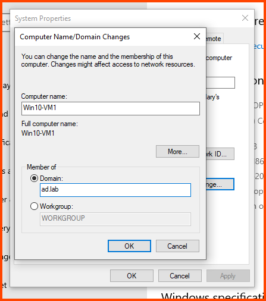

In the "<u>Primary DNS suffix of this computer</u>" field enter the <u>domain name</u>. Click on **`OK`**.

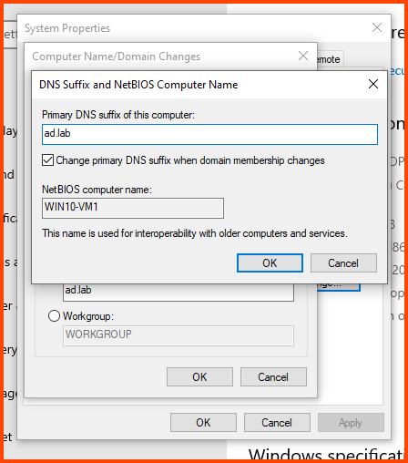

Click on **`OK`**.

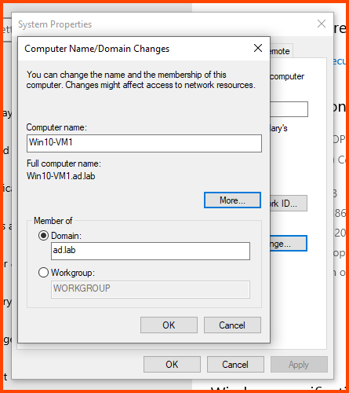

Now a popup should appear. Enter the <u>login name</u> and <u>password</u> of the Domain Admin and click on **`OK`**.


The device will be added to the AD environment. Click on **`OK`**.


The device needs to be rebooted to apply the domain-specific settings. Click on **`OK`** to continue.

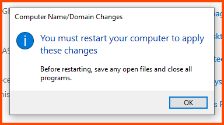

Click on "<u>Restart Now</u>".

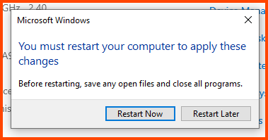

Once on the login screen. Click on "<u>Other user</u>". Enter the <u>login name</u> and <u>password</u> of the AD user that will use this device and press **`Enter`**. 


Now we are logged into the system as the AD user. To confirm this we can open PowerShell and run **`whoami`**.


## Windows 10 Enterprise VM2 Setup

Follow the same steps as above to configure the VM for the second user.

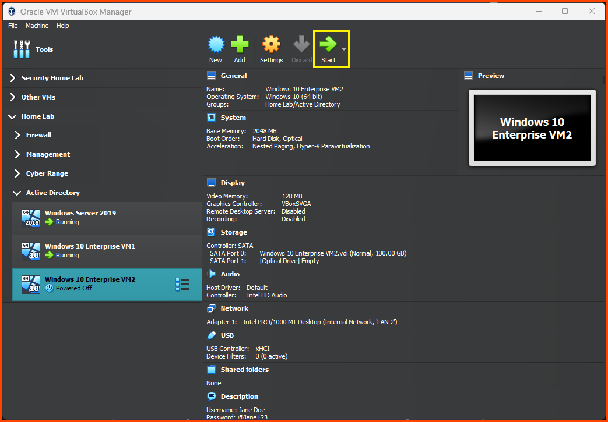

### OS Installation


Use the First Name of the second user that was configured in AD.


### Guest Additions Installation


### Adding VM2 to Domain


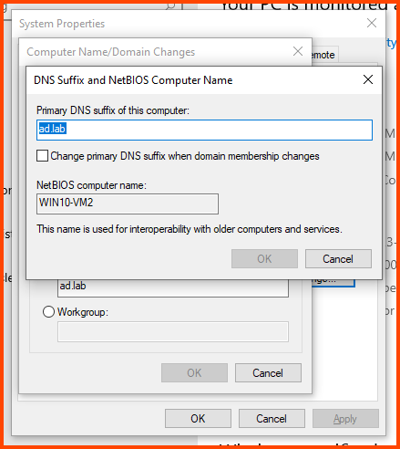

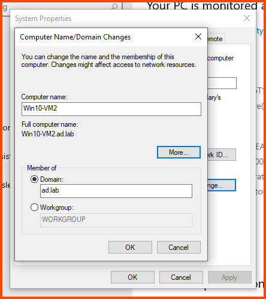


Login using the AD credentials of the second AD user.


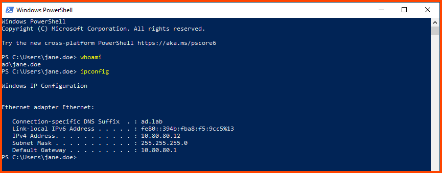

## Appendix

With this, we have completed the setup of the Active Directory lab. To wrap up, in this module we set up 3 VMs. The 1st VM (Windows Server 2019) was configured to be the Domain Controller and the other 2 VMs (Windows 10 Enterprise) were configured as client devices. Additionally, on the DC VM, we enabled DHCP, set up DNS Forwarder, enabled AD Certificate Services and configured Policies to be applied to all devices that are part of the AD environment.

You can delete the Windows Server 2019 ISO file if you do not want to store it for future use. Do not delete the Windows 10 Enterprise ISO just yet as we will require it to setup FlareVM.  

### DNS & DHCP Verification

To verify that the client VMs are indeed connected to the AD environment you can open **`DHCP Manager`** and compare the IP address shown with the IP address that has been assigned to the VM.


Similarly, we can use **`DNS Manager`** to confirm that new DNS entries have been added for the client devices.


### Taking VM Snapshots

> [!INFO]
> Snapshots can be taken with the VM in a running state but sometimes doing so can cause the VM to behave erratically. So I recommend "Powering off" all the VM before taking its Snapshot. 

Select the <u>Windows Server 2019 VM</u>. Click on the "<u>Hamburger menu</u>" and select **`Snapshots`** from the dropdown menu.


Click on **`Take`** from the toolbar.


Give the snapshot a descriptive <u>name</u> and click on **`OK`**.

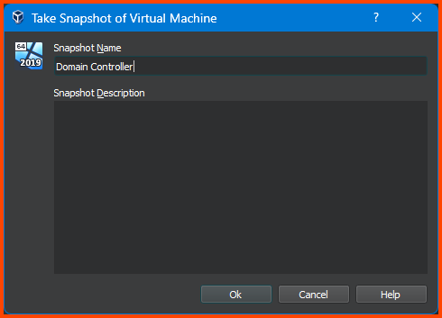

This will create a new Snapshot from the VM.


Select the <u>Windows 10 Enterprise VM1</u> from the sidebar and follow the above steps to create a Snapshot.


Follow the same steps to create Snapshot for <u>Windows 10 Enterprise VM2</u>.


Right-click on the hamburger menu and select "<u>Details</u>" to return to the VM configuration page.

### Alternative AD Setup

Many other features and services can enabled on the DC. Refer to the below links for variations on the installation process.

- [How to Setup a Basic Home Lab Running Active Directory - YouTube](https://www.youtube.com/watch?v=MHsI8hJmggI)
- [How to Build an Active Directory Hacking Lab - YouTube](https://www.youtube.com/watch?v=xftEuVQ7kY0)

### Hacking AD Lab

There any numerous attacks that can be performed against an AD environment. Refer to the below links to see some of the commonly used hacks.

* [Hack Your VirtualBox AD Lab](https://benheater.com/hack-your-virtualbox-ad-lab/)
* [Active Directory Methodology - HackTricks](https://book.hacktricks.xyz/windows-hardening/active-directory-methodology)

In the next module, we will begin the setup of the Malware Analysis Lab.