---
categories:
  - Security
  - Home Lab
date: 2024-01-26 19:30:00 -0600
description: A step-by-step guide for building your very own Cybersecurity Home Lab using VirtualBox
img_path: /assets/
published: false
tags:
  - security
  - home-lab
  - virtualbox
  - networking
  - malware
title: "Building a Virtual Security Home Lab: Part 8 - Malware Analysis Lab Setup"
---

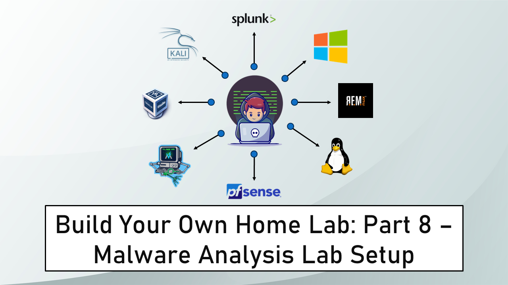

Banner Background by [logturnal](https://www.freepik.com/free-vector/gradient-white-color-background-abstract-modern_34010189.htm) on Freepik  
Hacker Image by [catalyststuff](https://www.freepik.com/free-vector/hacker-operating-laptop-cartoon-icon-illustration-technology-icon-concept-isolated-flat-cartoon-style_11602236.htm) on Freepik

In the module, we are going to set up the Malware Analysis Lab. This lab will consist of two VMs. One of the VMs will be for Windows Malware Analysis and the other one will be for Linux Malware Analysis.

## Creating New Interface

VirtualBox GUI does not allow us to create more than four Network Interfaces. 


However, we can configure up to 8 interfaces per VM. To add more than 4 interfaces we have to utilize the VirtualBox CLI.

### VirtualBox CLI Setup

The VirtualBox CLI binary is called **`VBoxManage.exe`**.

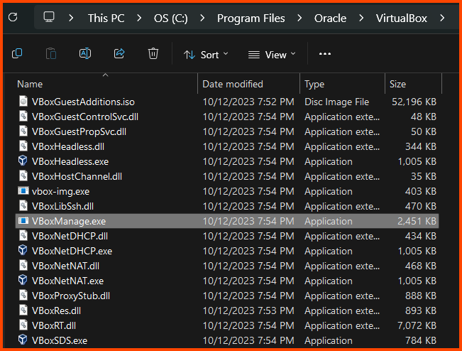

To be able to use the CLI we have to add its path as an environment variable.  
VirtualBox is by default installed at **`C:\Program Files\Oracle\VirtualBox`**. 

Copy the path to the executable from the navigation bar.

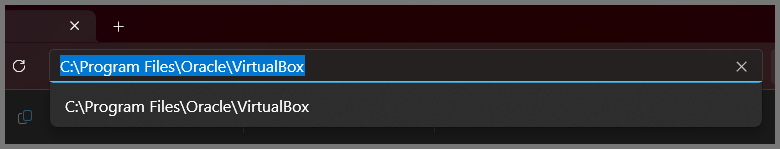

Open Search and type "<u>Environment</u>". Click on **`Edit environment variables for your account`**.

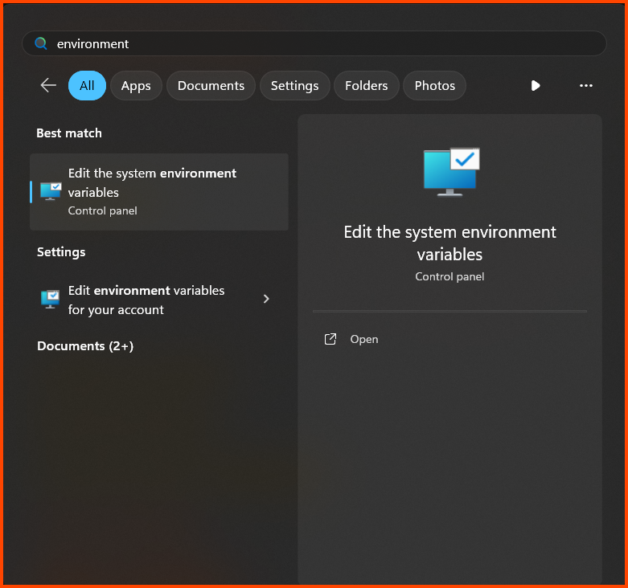

In the top window select the variable named "<u>Path</u>" and then click on **`Edit`**.

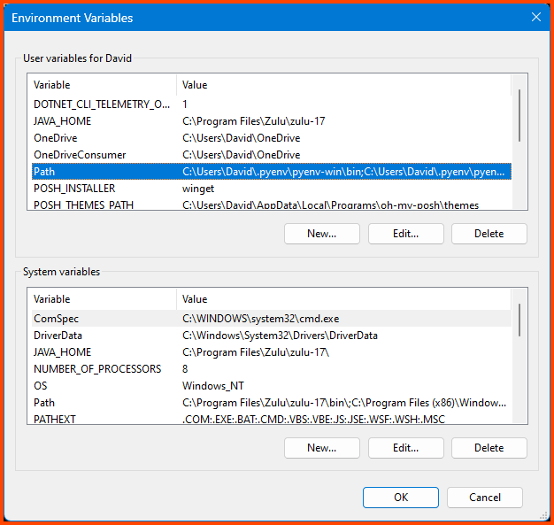

Click on **`New`** and then paste the path to the VirtualBox CLI. Then click on **`OK`**.


Click on **`OK`** to close the Environment Variables menu.

To test if the variable was added successfully open PowerShell and run the following command:

```powershell
# List all installed VMs
VBoxManage list vms
```


### Creating new Interface

Before we create the new interfaces we need to know the name of the pfSense VM (it is "pfSense" in my case). The VM should also be "Powered Off".


To add a network interface run the following commands:

```powershell
# Create a Internet Network
VBoxManage modifyvm "pfSense" --nic5 intnet

# Use the Paravirtualized Adapter
VBoxManage modifyvm "pfSense" --nictype5 virtio

# Give it the name LAN 3
VBoxManage modifyvm "pfSense" --intnet5 "LAN 3"

# Network Interface is connected by Cable
VBoxManage modifyvm "pfSense" --cableconnected5 on
```

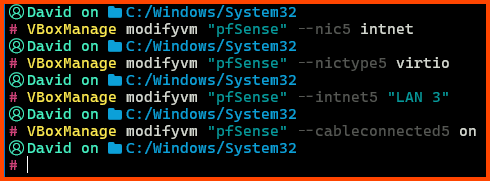

> [!INFO]
> In the above commands "pfSense" is the name of my VM.  
> In the 3rd command in place of "LAN 3" you can use a different name that matches your network interface naming convention.

Now if we look at the overview of the pfSense VM we should see Adapter 5.

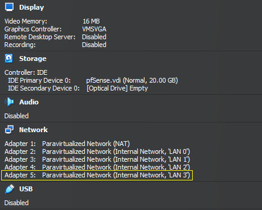

> [!NOTE]
> Interfaces that are created using the CLI will not show up in the Settings page for the VM. If you want to modify the adapter settings you have to do it using the CLI.

### Enabling the Interface

Start the pfSense VM. On boot, you will notice that there are still only 4 interfaces. The new interface has to be onboarded before it shows up in pfSense.

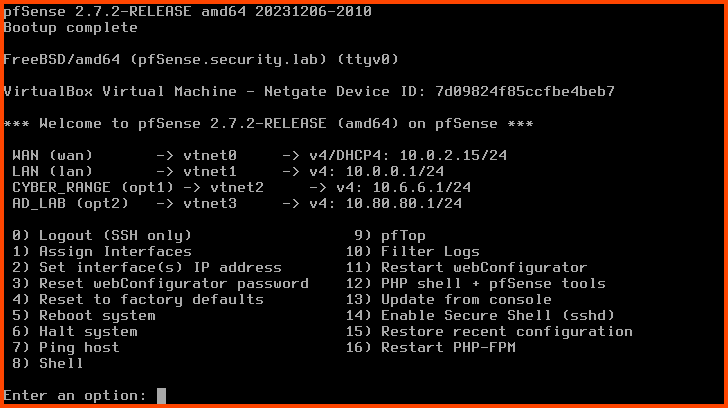

Enter **`1`** to select "Assign Interfaces".  
Should VLANs be set up now? **`n`**

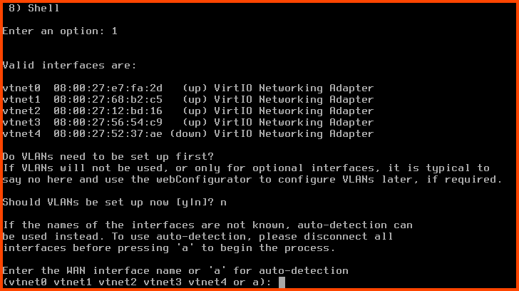

Enter the WAN interface name: **`vtnet0`**  
Enter the LAN interface name: **`vtnet1`**  
Enter the Optional 1 interface name: **`vtnet2`**  
Enter the Optional 2 interface name: **`vtnet3`**  
Enter the Optional 3 interface name: **`vtnet4`**

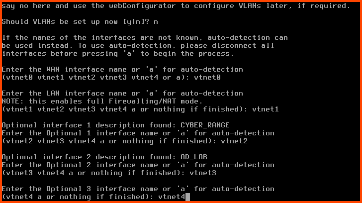

Do you want to proceed?: **`y`**

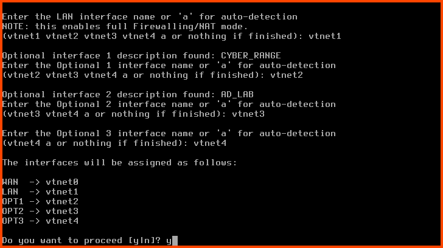

The new interface has been added. Now we need to assign the interface an IP address.

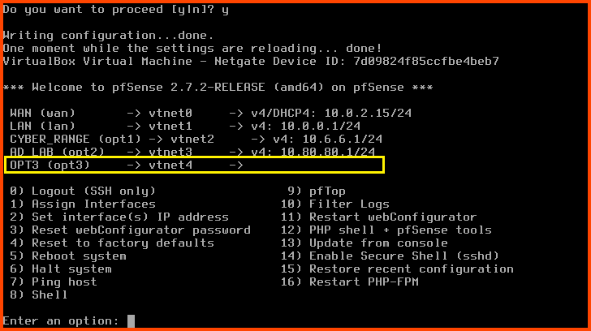

Enter **`2`** to select "Set interface(s) IP address"  
Enter **`5`** to select the OPT3 interface. 

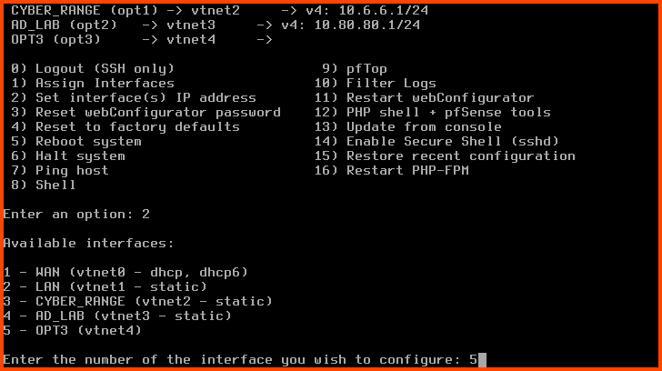

Configure IPv4 address OPT3 interface via DHCP?: **`n`**  
Enter the new OPT3 IPv4 address: **`10.99.99.1`**  
Enter the new OPT3 IPv4 subnet bit count: **`24`**  

For the next question press **`Enter`**. Since we are configuring a LAN interface we do not have to worry about the upstream gateway.

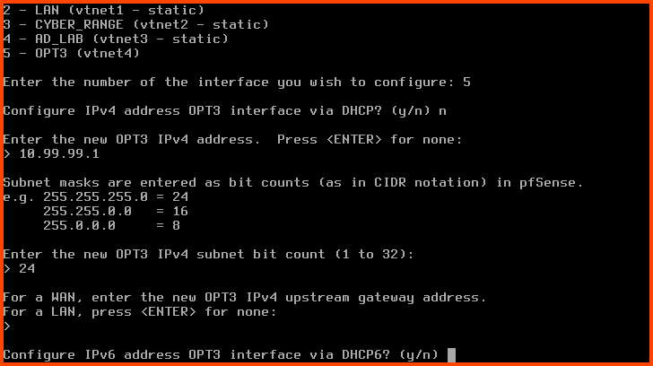

Configure IPv6 address OPT3 interface via DHCP6: **`n`**  
For the new OPT3 IPv6 address question press **`Enter`**.  
Do you want to enable the DHCP server on OPT3?: **`y`**  
Enter the start address of the IPv4 client address range: **`10.99.99.11`**  
Enter the end address of the IPv4 client address range: **`10.99.99.243`**  
Do you want to revert to HTTP as the webConfigurator protocol?: **`n`**

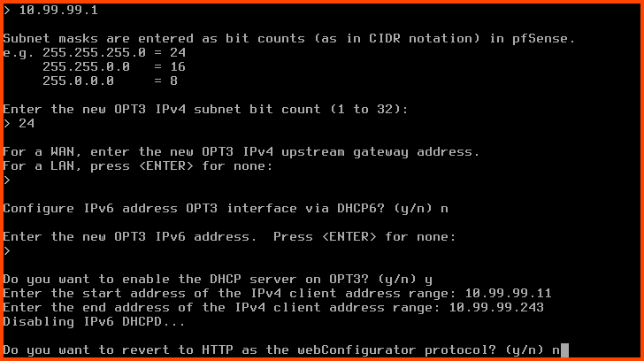

Now interface OPT3 will have an IP address.


### Renaming the Interface

Launch the Kali Linux VM. Login to the pfSense web portal. From the navigation bar select **`Interfaces -> OPT3`**. 

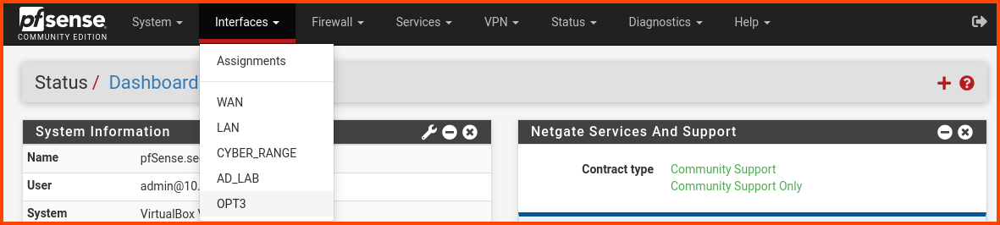

In the description field enter **`ISOLATED`**. Scroll to the bottom and click on **`Save`**.

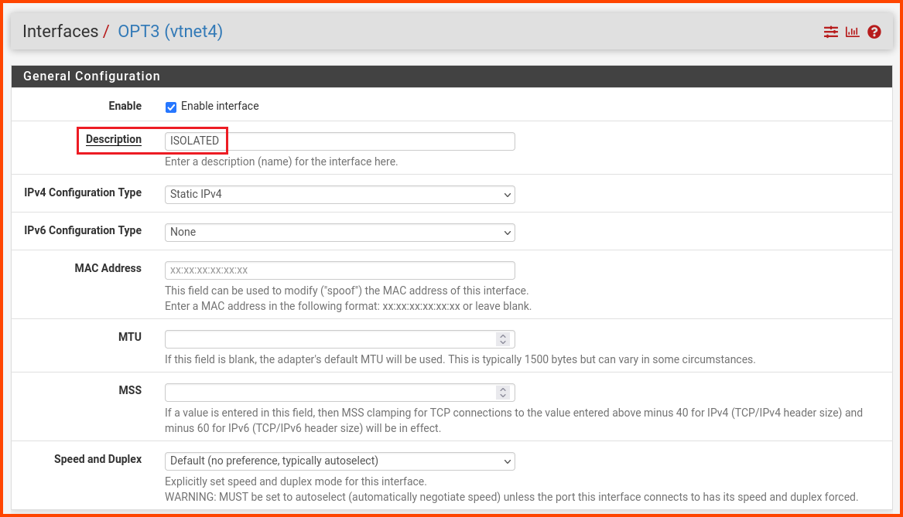

Click on **`Apply Changes`** in the popup that appears to persist the changes.

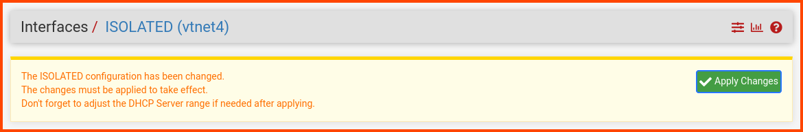

### Interface Firewall Configuration

From the navigation bar click on **`Firewall -> Rules`**.

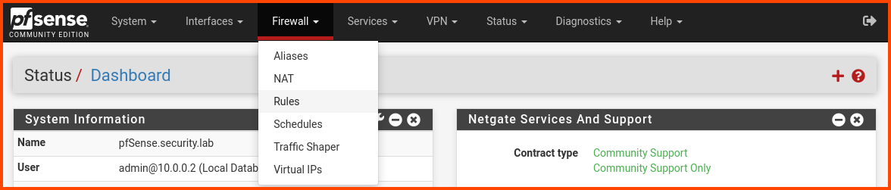

Select the **`ISOLATED`** tab. Click on the "<u>Add</u>" button to create a new rule.

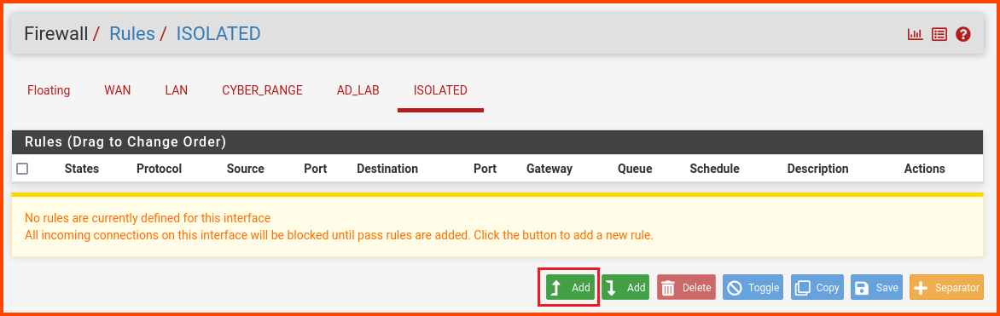

Change the values as follows:  
Action: **`Block`**  
Address Family: **`IPv4+IPv6`**  
Protocol: **`Any`**  
Source: **`ISOLATED subnets`**  
Description: **`Block access to everything`**

Scroll to the bottom and click on **`Save`**.

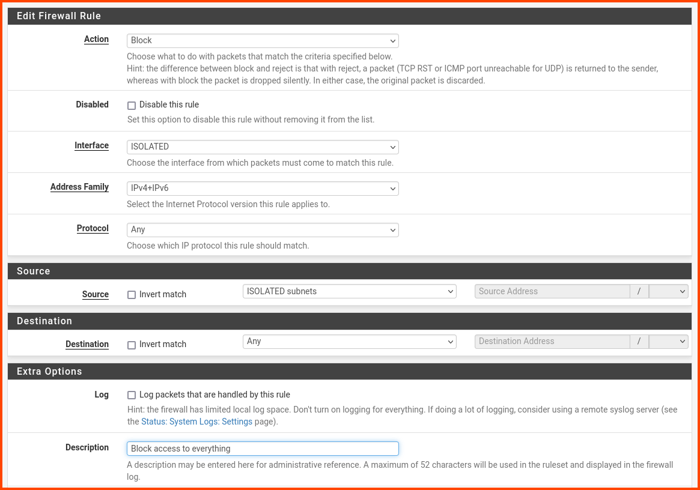

In the popup click on **`Apply Changes`** to persist the new rule.


> [!INFO]
> Since this Interface is going to be used for Malware Analysis we are blocking network access. This will ensure that malware cannot spread to other systems using the network. 

## Flare VM Setup

To install Flare we need a Windows machine. Flare can be set up using most versions of Windows. Since we already have the ISO for Windows 10 Enterprise I will be using it to configure Flare.

### Windows ISO Download

Go to the following URL: [Windows 10 Enterprise \| Microsoft Evaluation Center](https://www.microsoft.com/en-us/evalcenter/download-windows-10-enterprise)

Click on the <u>64-bit edition</u> Enterprise ISO download option. The ISO file is ~5GB.

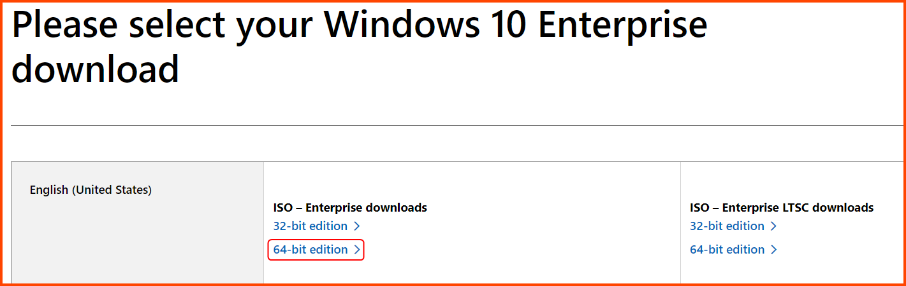

### Creating the VM

Select <u>Tools</u> from the sidebar and click on **`New`**.


Give the VM a <u>name</u>. Select the downloaded Windows 10 ISO Image. Check "<u>Skip Unattended Installation</u>". Then click on **`Next`**.


Increase <u>Base Memory</u> to **`4096MB`** and click on **`Next`**.

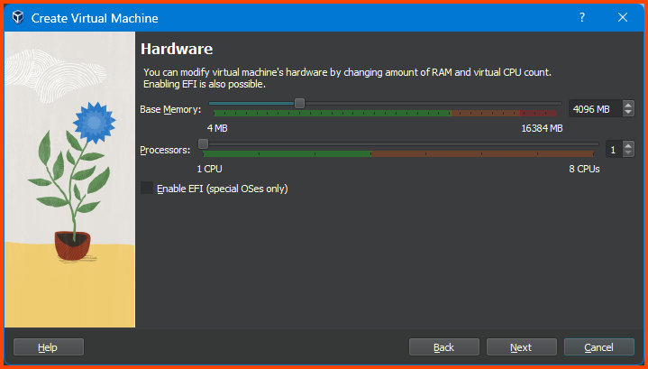

Increase the <u>Drive Size</u> to **`100GB`** and click on **`Next`**.

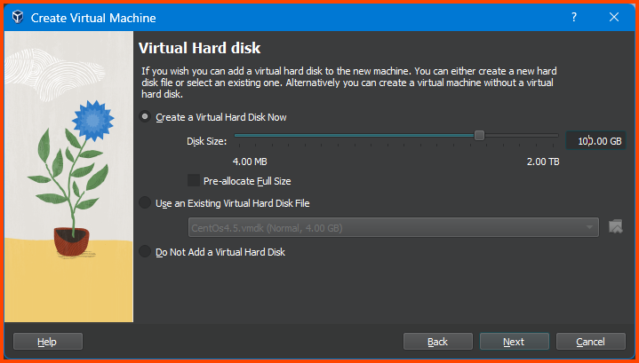

Verify all the settings and click on **`Finish`**.

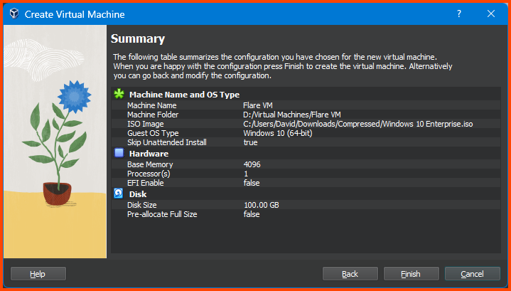

#### Adding VM to Group

Right-click on the VM and select **`Move to Group -> [New]`**.


Right-click on the group and rename it to "<u>Malware Analysis</u>".


Right-click on the "Malware Analysis" group and select **`Move to Group -> Home Lab`**.


The final result should look as follows:

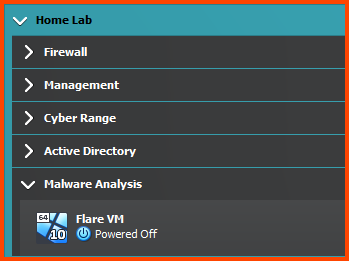

### Configuring the VM

Select the VM then from the toolbar select **`Settings`**.

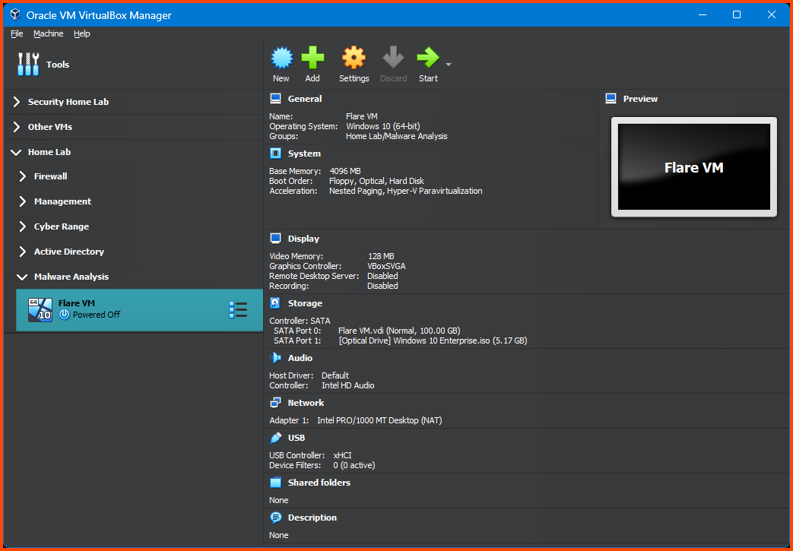

Go to **`System -> Motherboard`**. In the <u>Boot Order</u> field ensure that **`Hard Disk`** is on the top followed by **`Optical`**. Uncheck **`Floppy`**.


Leave the **`Network Adatper`** on its default setting of **`NAT`**.


> [!NOTE]
> Machines assigned to the **`ISOLATED`** interface does not have internet connection. But to setup Flare we need Internet access. Once we finish the configuring Flare we will move it to the correct subnet. 

Click on **`OK`** to save the settings.

### Installing Windows

Select the Flare VM from the sidebar and click on **`Start`**.


Install Windows as shown below. The installation process is identical to the process from the previous module (Part 7).


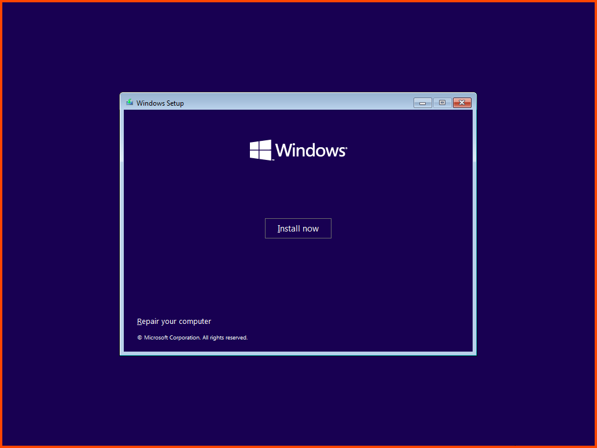

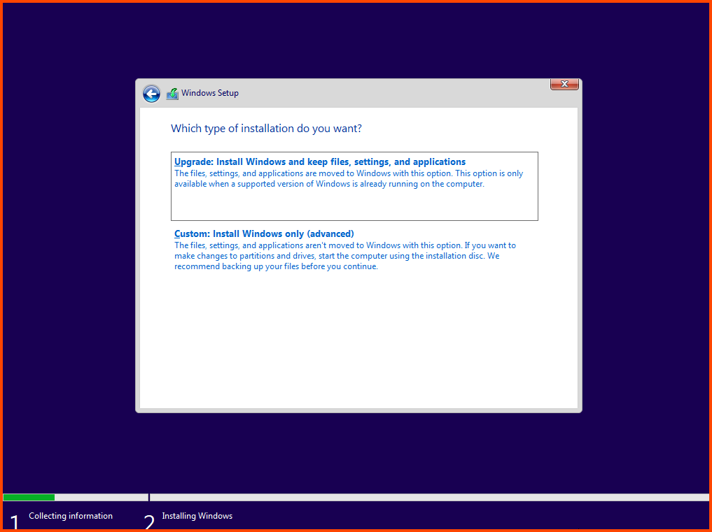


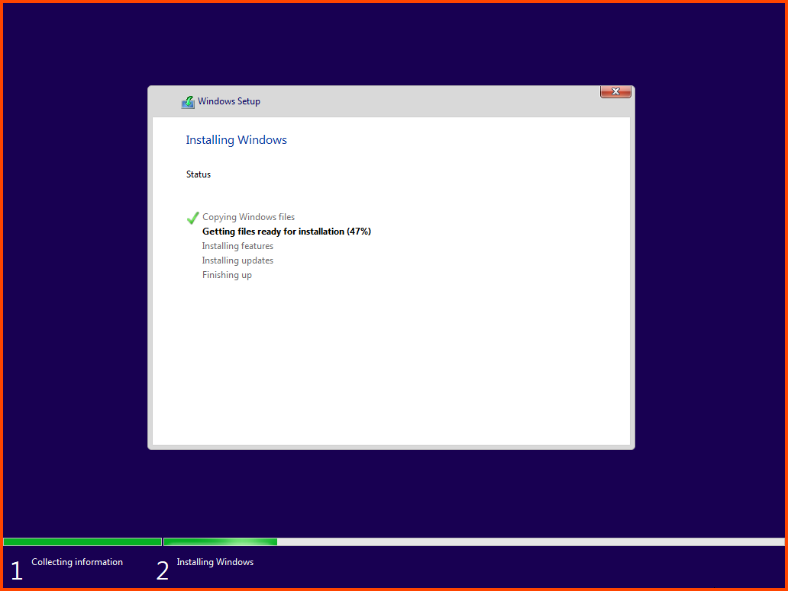


Select "Domain join instead".

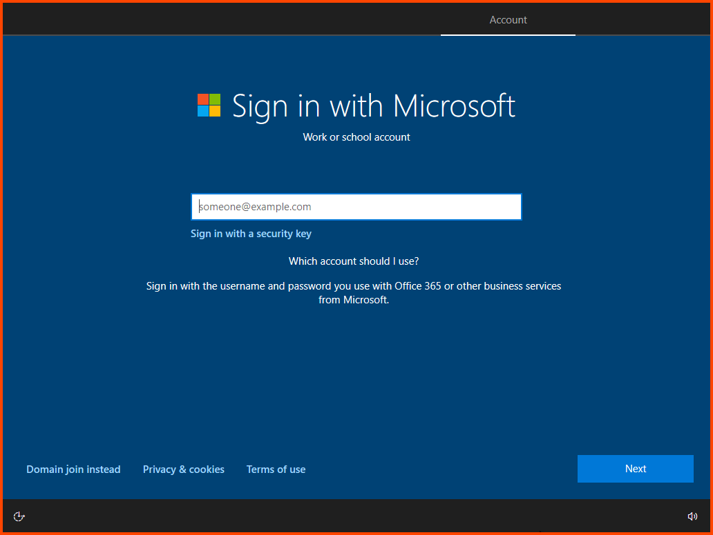

> [!WARNING]
> Provide a name that does not use special characters and spaces. This is very important. The installer for Flare will not work otherwise. 


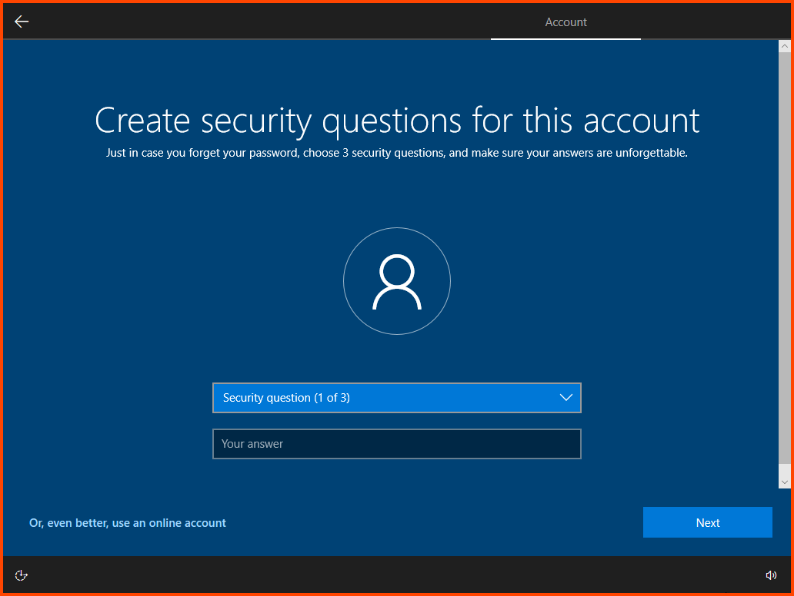

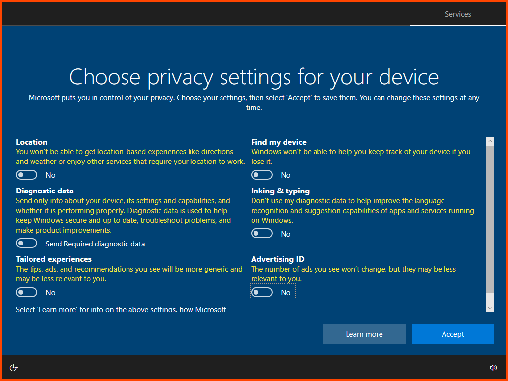


Once on the desktop Windows will ask should access to the Internet be allowed click on **`Yes`**.

#### Guest Additions Installation

Install Guest Additions to enable the resizing on the VM display. Once again you can refer to the last module (Part 7) for more detailed steps.

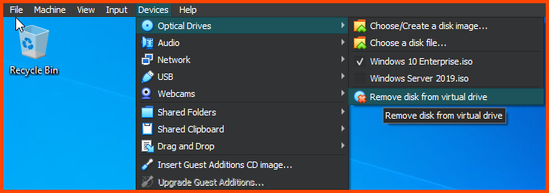

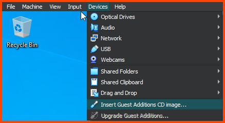

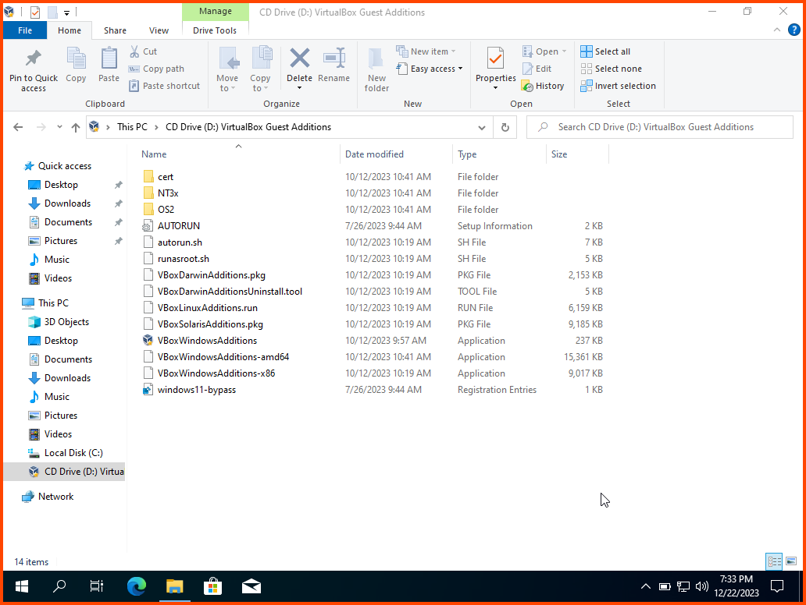


After rebooting the VM. Remove the Guest Addition Image.


#### Creating VM Snapshot 1

Before we proceed we are going to take a snapshot of the VM. Snapshots allow us to roll back to an old functional state of the VM.

Shut down the VM. Click on the <u>Hamburger menu</u> on the right of the VM name in the sidebar. Select **`Snapshots`**.


Click on **`Take`**.

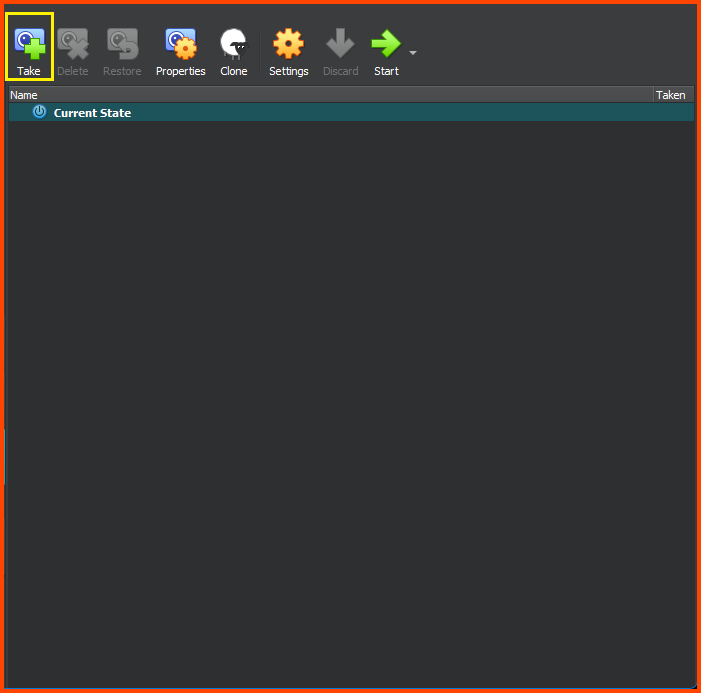

Give the Snapshot a descriptive name. Click on **`OK`** to create the Snapshot.


Click on the <u>Hamburger menu</u> and click on **`Details`** to return to the original page.

### Flare VM Pre-Install Configuration

You can read more about Flare VM and its pre-requisites on the below link:  
[mandiant/flare-vm: A collection of scripts to setup a reverse engineering environment](https://github.com/mandiant/flare-vm)

TLDR; "Windows Updates" and "Windows Defender" have to be disabled.

#### Disabling Windows Update

[How to change account password on Windows 11 \| Windows Central](https://www.windowscentral.com/software-apps/windows-11/how-to-change-account-password-on-windows-11)

Open on <u>Search</u> bar and search for "<u>Settings</u>". Open the Settings app.


Click on "<u>Update & Security</u>".


Click on the "<u>Pause updates for 7 days</u>" button.

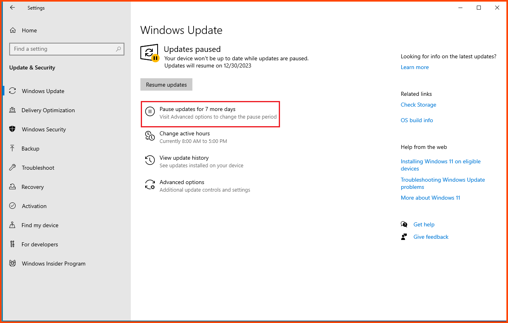

#### Disabling Windows Defender

Download the following script: [jeremybeaume/tools: Script to disable Windows Defender](https://github.com/jeremybeaume/tools/blob/master/disable-defender.ps1)

Right-click on the <u>Shield</u> icon on the taskbar and select "<u>View Security Dashboard</u>".


Click on "<u>Virus & threat protection</u>".

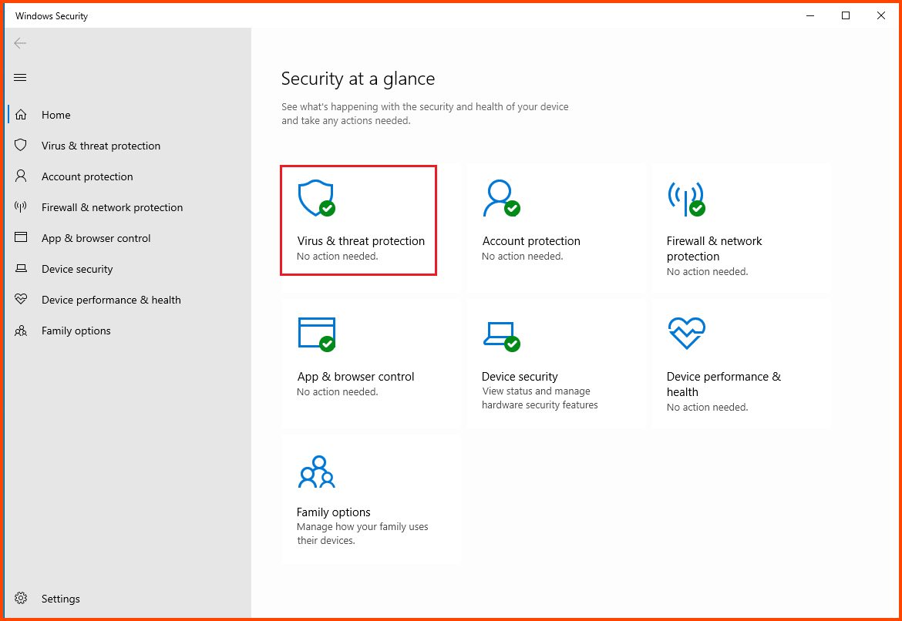

Select "<u>Manage settings</u>" from the "<u>Virus & threat protection settings</u>" section.


Disable all the features that are shown in the image below:


Right-click on the <u>Start</u> menu and select "<u>Windows PowerShell (Admin)</u>".


Run the following command to download the script:

```powershell
# Save the script in the Downloads folder
Invoke-WebRequest "https://raw.githubusercontent.com/jeremybeaume/tools/master/disable-defender.ps1" -OutFile $HOME\Downloads\disable-defender.ps1
```

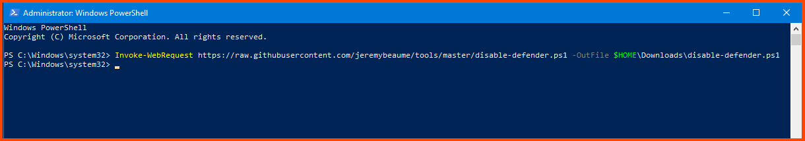

Use the shortcut **`Windows+R`** to open the Run dialog. Enter **`msconfig`** and click on **`OK`**. 

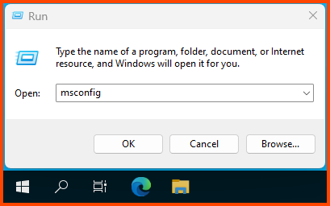

Navigate to the <u>Boot</u> tab. In the <u>Boot options</u> section enable "<u>Safe boot</u>" and then click on **`OK`** to save changes.


Click on **`Restart`** to boot into Safe Mode.

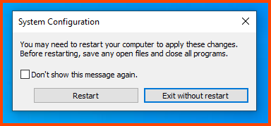

In Safe Mode, the VM cannot be resizable. Safe Mode essentially disables all features that are not required to run the OS.


Right-click on the <u>Start</u> menu and select "<u>Windows PowerShell (Admin)</u>" and enter the following commands:

```powershell
# Change directory
cd .\Downloads\
# Unblock the downloaded script
Unblock-File .\disable-defender.ps1
# Disable the PowerShell policy preventing script execution 
Set-ExecutionPolicy Unrestricted -Force
# Start the script
.\disable-defender.ps1
```


Once the script completes its execution press **`Enter`** to close the script. Reboot the VM for the changes to take place.

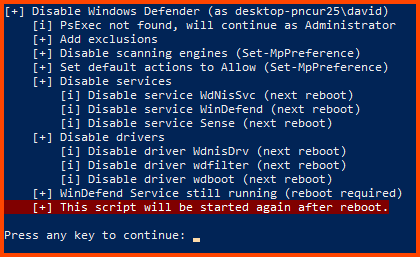

Press **`Windows+R`** to open the <u>Run</u> dialog. Enter **`msconfig`** and click on **`OK`**.

Navigate to the <u>Boot</u> tab. From the <u>Boot options</u> section disable "<u>Safe boot</u>". Click on **`Apply`** then **`OK`**. <u>Restart</u> the VM to boot normally into Windows.


Wait for some time for Defender to load completely and then you will see that "<u>Virus & threat protection</u>" will show as disabled. This means that the script worked successfully.


#### Renaming the VM

Search for "<u>This PC</u>" and from the right side click on "<u>Properties</u>".


Select "<u>Rename this PC</u>".

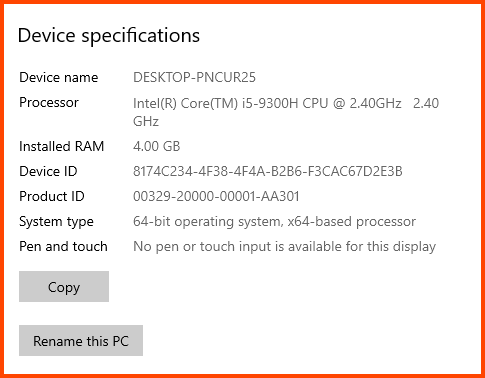

Give the PC a name. Click on **`Next`** and then select "<u>Restart Now</u>" for the changes to take effect. 

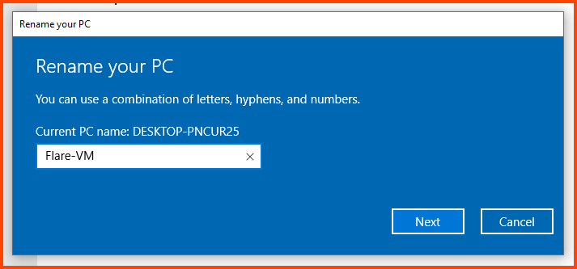

#### Creating VM Snapshot 2

Shut down the VM. Go to the <u>Snapshot</u> page using the <u>Hamburger menu</u>. Click on **`Take`** to create a new Snapshot.


Give the Snapshot a descriptive name. Then click on **`OK`**.


Use the <u>Hamburger menu</u> and return to the <u>Details</u> page. Click on **`Start`** to start the VM.

### Flare VM Installation

Right-click on the <u>Start</u> menu and select "<u>Windows PowerShell (Admin)</u>".


Enter the following commands to download and run the Flare VM script.

```powershell
# Download the FlareVM script
Invoke-WebRequest "https://raw.githubusercontent.com/mandiant/flare-vm/main/install.ps1" -OutFile $HOME/Downloads/install.ps1
# Go to Downloads Folder
cd $HOME/Downloads
# Unlock the downlaoded script
Unblock-File .\install.ps1
# Disable PowerShell script execution policy 
Set-ExecutionPolicy Unrestricted -Force
# Run the script
.\install.ps1
```


The script will make some checks before starting the installation.

Enter **`Y`** when asked about Snapshot. Enter password when prompted.


After some time the Flare VM configuration dialog will open.

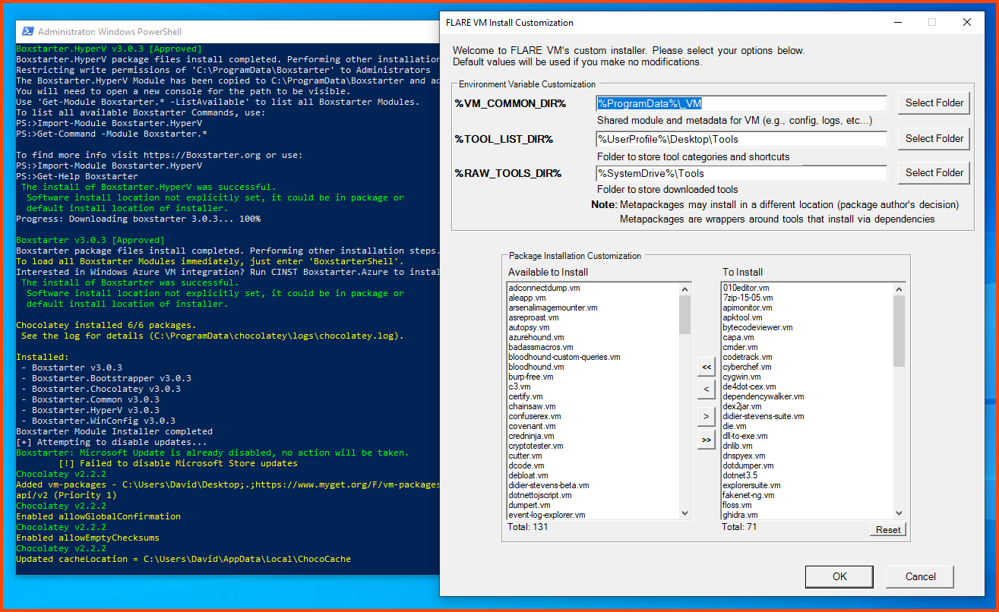

In the <u>Package Installation Customization</u> section from the left side select "<u>debloat.vm</u>" and click on the <u>right arrow</u> to select it for installation.

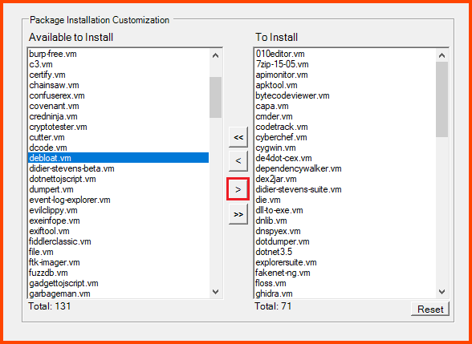

Click on **`OK`** to start the install. The VM will restart multiple times during the setup.


The installation can take a very long time. Once the setup is complete we will get the following prompt click on **`Finish`** to complete the setup.

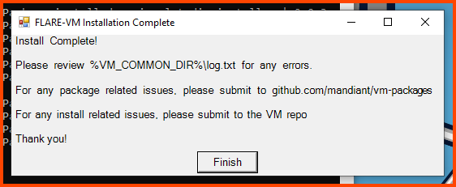

After the installation is complete. Restart the VM to complete the setup.

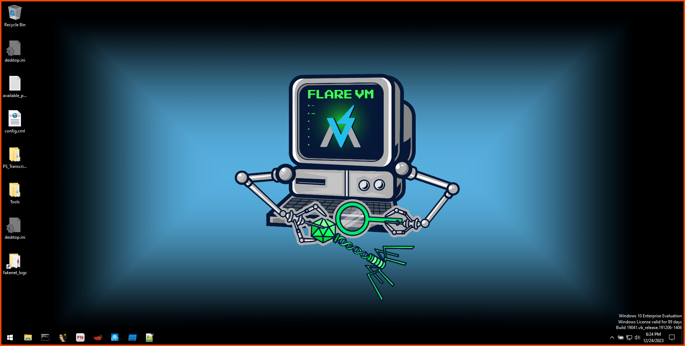

### Post-Install Configuration

#### Installing OpenSSH Server

Once we move this VM to the **`ISOLATED`** subnet it will not be able to access the internet. We will not be able to download malware samples directly from the Internet. We will download the samples onto a different VM that has Internet access and then move them to this machine using SSH. I will cover this process in more detail in a later module. For now, we need to install "<u>OpenSSH Server</u>".

Open the Search bar. Type "<u>Add</u>" and from the results select the "<u>Add or remove programs</u>" option.


Click on **`Optional Features`** under "<u>Apps & features</u>".


Click on **`Add a feature`**. This will open a new menu.

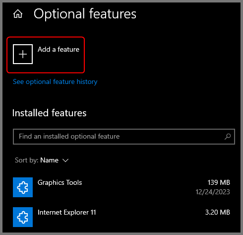

Search for "<u>SSH</u>". Enable "<u>OpenSSH Server</u>" and then click on **Install**.


Once the install is complete if you search for "<u>SSH</u>" in the "<u>Installed features</u>" section you should see "OpenSSH Client" and "OpenSSH Server".

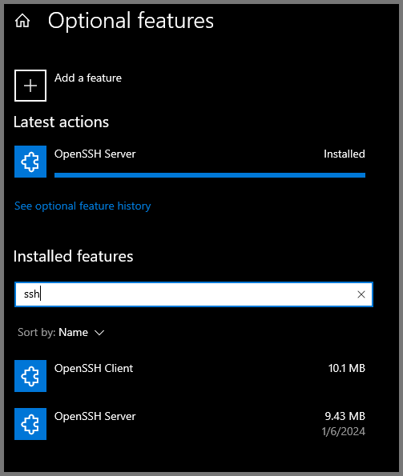

#### Moving VM to the Isolated Network

Shut down the VM. Open the VM **`Settings`** page and go to **`Network`**. For the <u>Attached to</u> field select **`Internal Network`**. For <u>name</u> select **`LAN 3`**. Click on **`OK`** to save the changes.

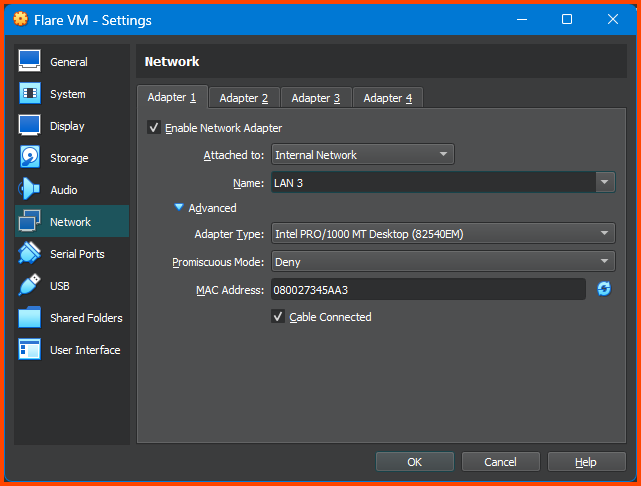

#### Creating VM Snapshot 3

Using the <u>Hamburger menu</u> open the Snapshot page. Click on **`Take`** to create a Snapshot. Give the Snapshot a descriptive name and then click on **`Ok`**.

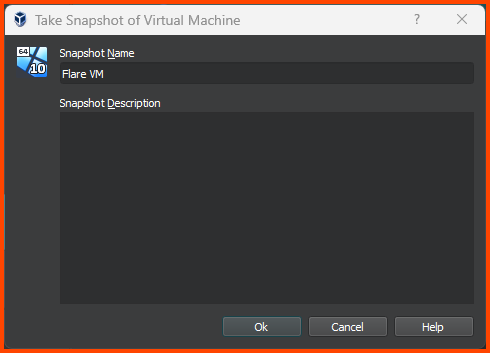

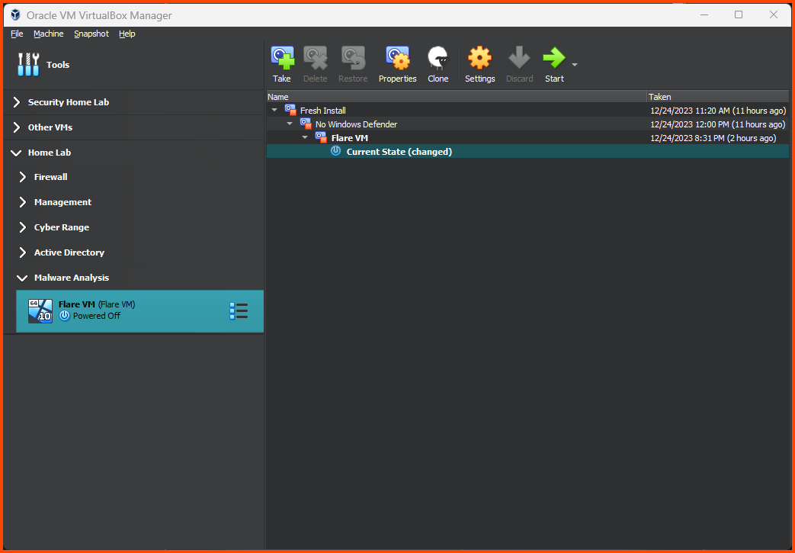

You can now delete the Windows 10 Enterprise ISO if you do not plan to store it in the future.

## REMnux VM Setup

### Download Image

Go to the following link: [Get the Virtual Appliance - REMnux Documentation](https://docs.remnux.org/install-distro/get-virtual-appliance)

Click on **`Box`** to open the download page.


Click on the blue <u>Download</u> button. The image is ~5GB.


Once the download is complete we will have an **`.ova`** file.

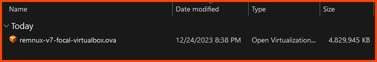

### Creating the VM

Click on <u>Tools</u> from the sidebar and then select **`Import`**.

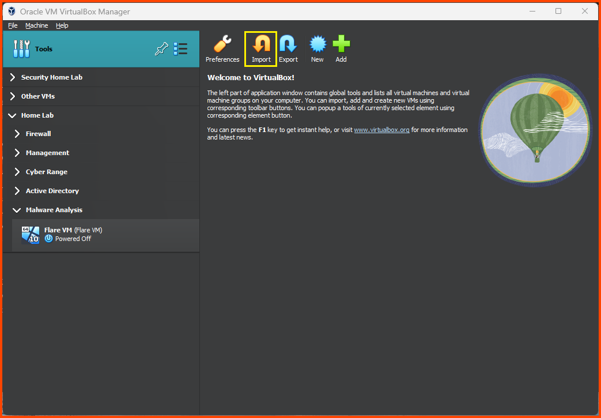

Select the downloaded OVA file and click on **`Next`**.

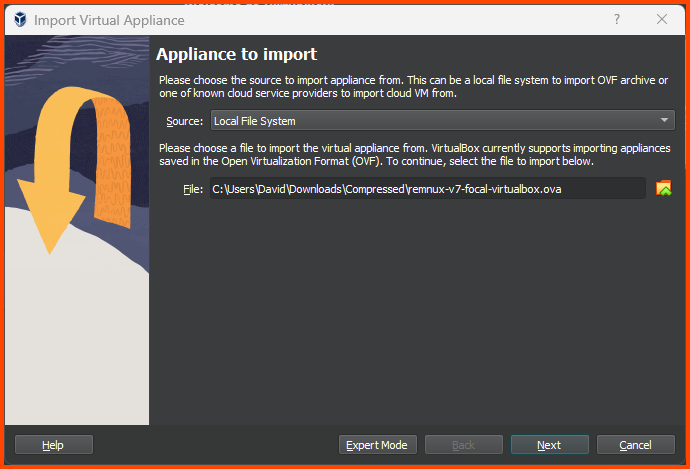

Configure the VM as required. Ensure the VM has **`4096MB`** of RAM. For the MAC Address Policy select "<u>Generate new MAC addresses for all network adapters</u>" then click on **`Finish`**.

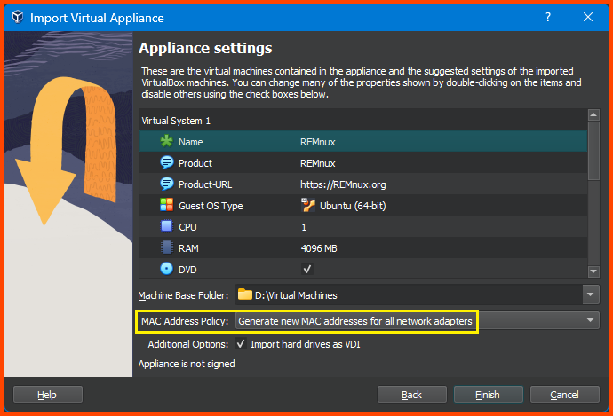

#### Adding VM to Group

Once the import is complete right-click on the VM and select **`Move to Group -> Home Lab/Malware Analysis`**.

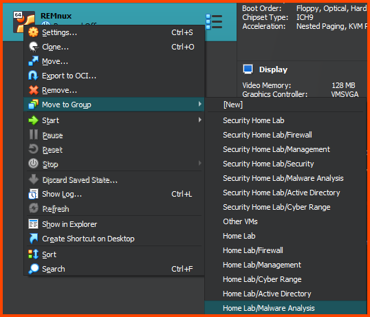

### Configuring the VM

Select the VM then click on **`Settings`** from the toolbar. 

Go to **`System -> Motherboard`**. In <u>Boot Order</u> ensure that **`Hard Disk`** is on the top followed by **`Optical`**. Uncheck **`Floppy`**. Click on **`OK`** to save the changes.

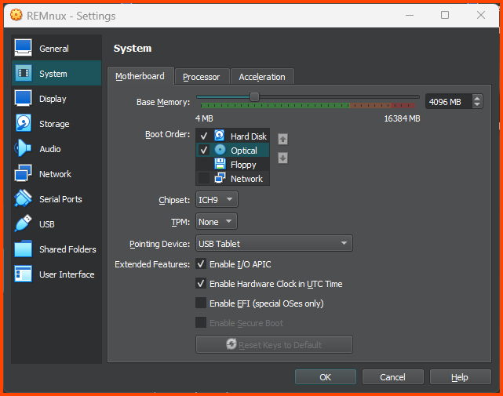

### Post-Install Configuration

Select the VM and from the toolbar click on **`Start`**.

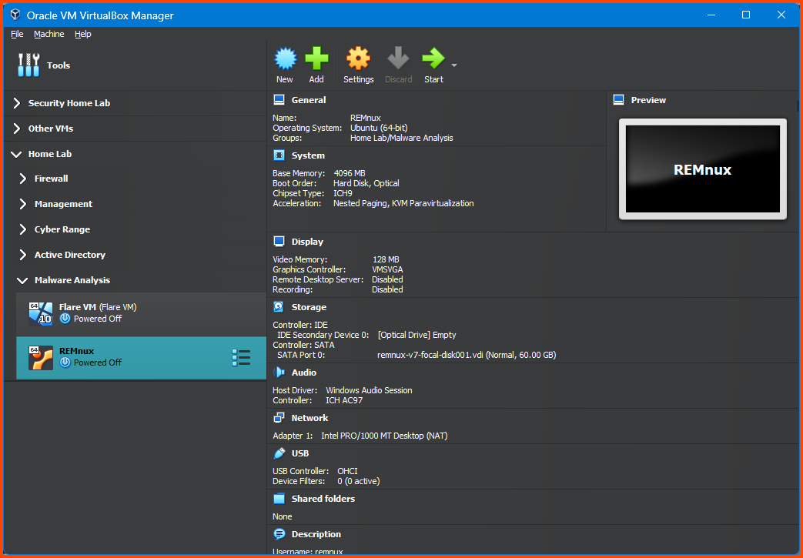

#### Updating Guest Additions

The VM will already have <u>Guest Additions</u> installed but it will be an older version. From the VM toolbar select **`Devices -> Upgrade Guest Additions`** to update Guest Additions.

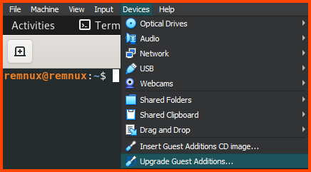

#### Upgrading Packages

Once Guest Additions is updated open a Terminal and enter the following command to update the system packages.

```bash
remnux upgrade
```

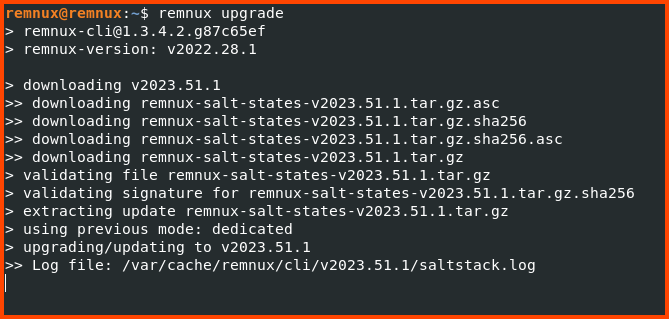

Once the update is complete restart the VM.

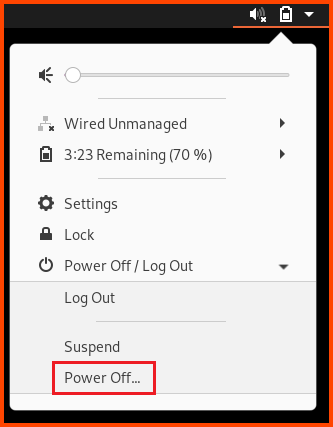

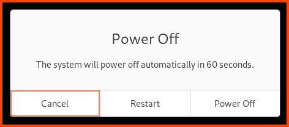

#### Moving VM to the Isolated Network

Shut down the VM. Open the **`Settings`** menu and select **`Network`**. 

For the <u>Attached to</u> option select **`Internal Network`**. For the <u>name</u> field select **`LAN 3`**. Click on **`OK`** to save the changes. This will move the VM to the **`ISOLATED`** interface that does not have internet access.


#### Creating VM Snapshot

Click on the <u>Hamburger menu</u> and select **`Snapshot`**.

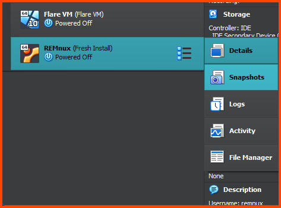

Click on **`Take`** to create a Snapshot.


Give the Snapshot a descriptive name. Then click on **`OK`**.

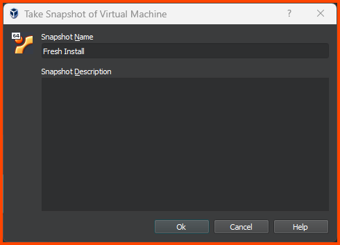


Use the <u>Hamburger menu</u> to go back to the **`Details`** page.

In the next, module we will start configuring the Security subnet. This subnet will have our DFIR VM and SIEM (Splunk).
