---
categories:
  - Security
  - Home Lab
date: 2024-01-26 19:45:00 -0600
description: A step-by-step guide for building your very own Cybersecurity Home Lab using VirtualBox
img_path: /assets/
published: false
tags:
  - security
  - home-lab
  - virtualbox
  - networking
  - dfir
title: "Building a Virtual Security Home Lab: Part 9 - Tsurugi Linux (DFIR) Setup"
---

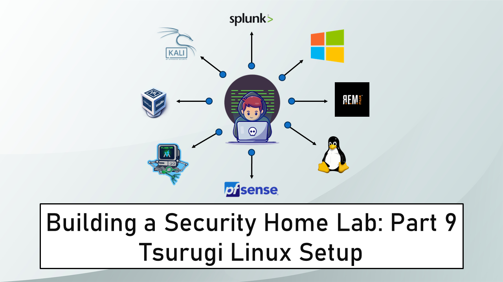

Banner Background by [logturnal](https://www.freepik.com/free-vector/gradient-white-color-background-abstract-modern_34010189.htm) on Freepik  
Hacker Image by [catalyststuff](https://www.freepik.com/free-vector/hacker-operating-laptop-cartoon-icon-illustration-technology-icon-concept-isolated-flat-cartoon-style_11602236.htm) on Freepik

In this module we are going to setup Tsurugi Linux which is an Linux based OS that is configured with the commonly used Digital Forensics & Incident Response tools. Before deploying the VM we will create a new Interface called Security that will have our DFIR VM and in the future other security tools.

## Creating New Interface

To run our DFIR VM require to create a new Interface for our router. As discussed in the last module using VirtualBox GUI we cannot create more than more Interface but using the CLI we can create up to 8 Interfaces. So let us use the CLI to create a new interface.

### Creating new Interface

Before creating the interface we need the name of the pfSense VM. In my case the VM is called "pfSense" also ensure the VM is "Powered Off" before running the commands.


Launch PowerShell and run the following commands:

```powershell
# Create a Internet Network
VBoxManage modifyvm "pfSense" --nic6 intnet

# Use the Paravirtualized Adapter
VBoxManage modifyvm "pfSense" --nictype6 virtio

# Give it the name LAN 3
VBoxManage modifyvm "pfSense" --intnet6 "LAN 4"

# Network Interface is connected by Cable
VBoxManage modifyvm "pfSense" --cableconnected6 on
```

**Note:** In the above commands "pfSense" is the name of my VM. In the 3rd command in place of "LAN 3" you can use a different name that matches your network name convention.

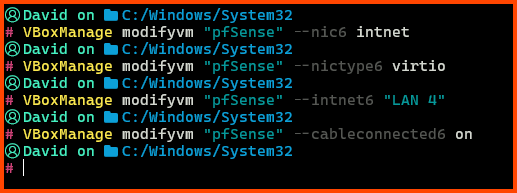

The pfSense VM will now have an Adapter 6.

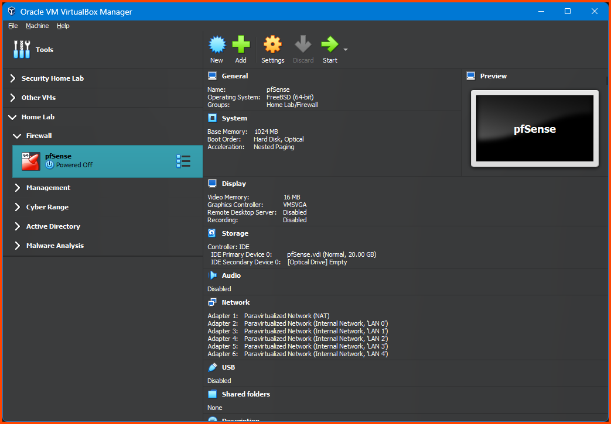

### Enabling the Interface

Start the pfSense VM. pfSense will not detect the new interface. We need to onboard the interface before if shows up.

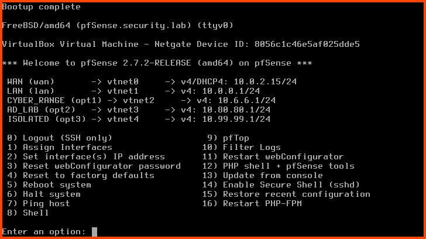

Enter `1` to select "Assign Interfaces".  
Should VLANs be set up now? `n`

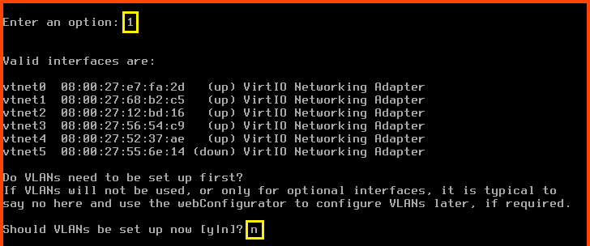

Enter the WAN interface name: `vtnet0`  
Enter the LAN interface name: `vtnet1`  
Enter the Optional 1 interface name: `vtnet2`  
Enter the Optional 2 interface name: `vtnet3`  
Enter the Optional 3 interface name: `vtnet4`  
Enter the Optional 4 interface name: `vtnet5`


Do you want to proceed?: `y`


The new interface is onboarded. Now we need to assign it an IP address.

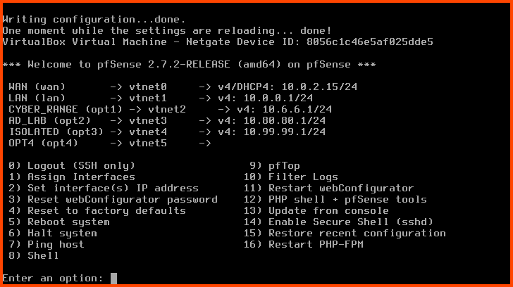

Enter `2` to select "Set interface(s) IP address". Enter `6` to select the OPT4 interface.

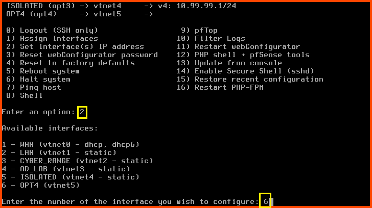

Configure IPv4 address OPT3 interface via DHCP?: `n`  
Enter the new OPT3 IPv4 address: `10.10.10.1`  
Enter the new OPT3 IPv4 subnet bit count: `24`  

For the next question directly press `Enter`. Since this is an `LAN` interface we do not have to worry about configuring upstream gateway.

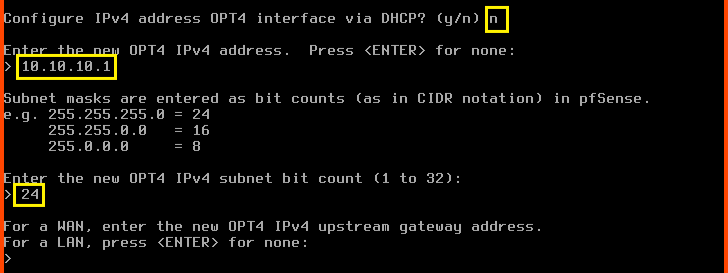

Configure IPv6 address OPT3 interface via DHCP6: `n`  
For the new OPT3 IPv6 address question press `Enter`.  
Do you want to enable the DHCP server on OPT3?: `y`  
Enter the start address of the IPv4 client address range: `10.10.10.11`  
Enter the end address of the IPv4 client address range: `10.10.10.243`  
Do you want to revert to HTTP as the webConfigurator protocol?: `n`

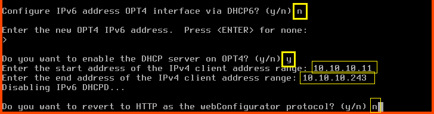

Now interface OPT4 will have an IP address.


### Renaming the Interface

Launch the Kali Linux VM. Login to the pfSense web portal. From the navigation bar select `Interfaces -> OPT4`. 


In the description field enter `SECURITY`. Scroll to the bottom and click on Save.


Click on Apply Changes in the popup that appears to persist the changes.

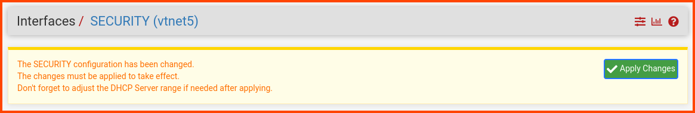

### Interface Firewall Configuration

From the navigation bar click on `Firewall -> Rules`.


Select the SECURITY tab. Click on the "Add" button to create a new rule.


Change the values as follows:  
Action: `Block`  
Address Family: `IPv4+IPv6`  
Protocol: `Any`  
Source: `SECURITY subnets`  
Destination: `WAN subnets`  
Description: `Block access to services on WAN interface`

Scroll to the bottom and click on Save.


Ignore the popup for saving changes. Click on "Add" to create a new rule.

Change the values as follows:  
Action: `Block`  
Address Family: `IPv4+IPv6`  
Protocol: `Any`  
Source: `SECURITY subnets`  
Destination: `LAN subnets`  
Description: `Block access to services on LAN`

Scroll to the bottom and click on Save.

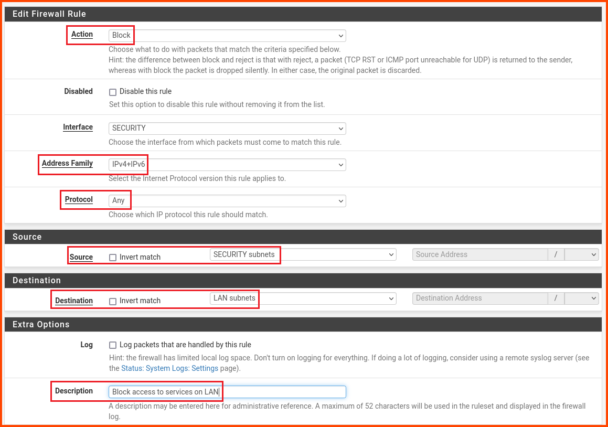

Click on "Add" to create a new rule.

Change the values as follows:  
Address Family: `IPv4+IPv6`  
Protocol: `Any`  
Source: `SECURITY subnets`  
Description: `Block traffic to all subnets and Internet`

Scroll to the bottom and click on Save.

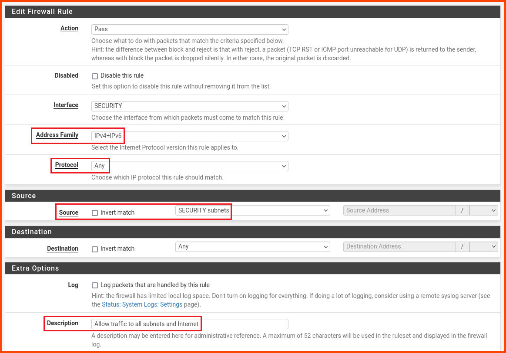

In the popup click on Apply Changes to persist the new rule.


The final result will be as follows:

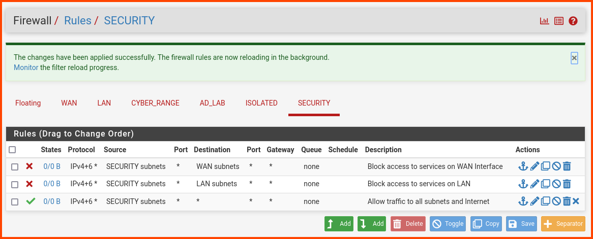

## Tsurugi Linux Setup

### Download Image

Go to the following URL: [Tsurugi Linux - Downloads](https://tsurugi-linux.org/downloads.php). Select one of the Mirror Links.


Download the ISO image. As of writing the latest version of Tsurugi Linux is `2023.2`.  
The ISO is ~16GB. It will take a while to download.


After download is complete we will have a `.iso` file.


### Creating the VM

Select Tools from the sidebar and then select New.

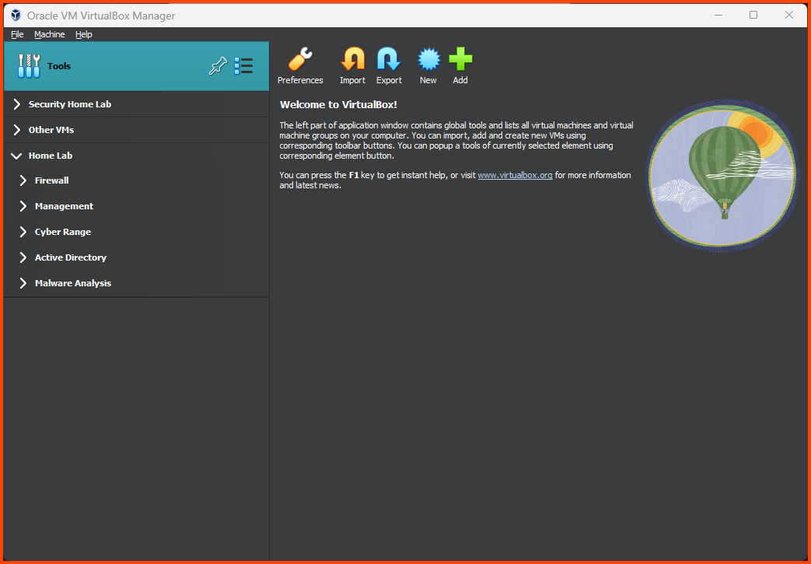

Give the VM a name and then select the downloaded ISO image. Click on Next.


Increase the Base Memory to 4096MB and then click on Next.

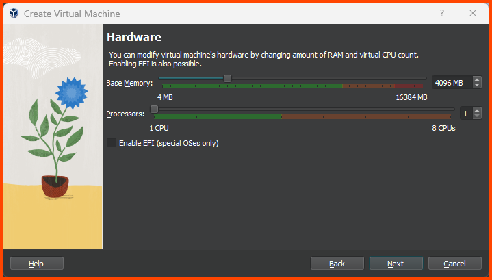

Increase the Hard Disk size to 150GB. Ensure that Pre-allocate Full Size is not selected.

**Note:** Tsurugi Linux installation will not work if we provide less than 110GB of storage.

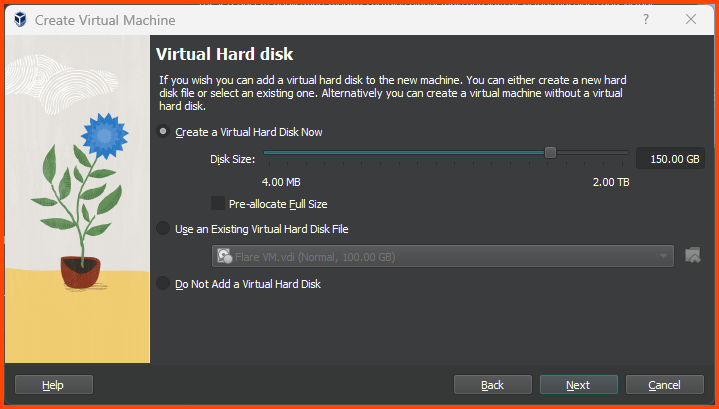

Click if all the settings look right and then click on Finish.

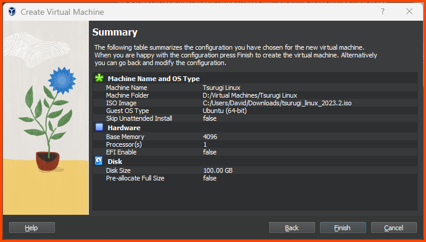

#### Adding VM to Group

Right-click on the VM name and select "Move to Group" and then chose New.


Right-click on the group name, select "Rename Group" and call it "Security".


Right-click on the group name, select "Move to Group" and then select "Home Lab".

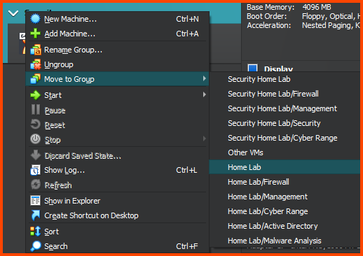

The final result should match the following:


### Configuring the VM

Select the VM and then from the toolbar select "Settings".

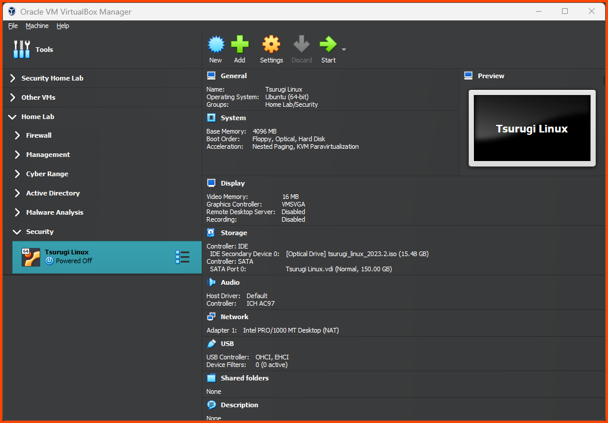

Go to `System -> Motherboard`. In Boot Order ensure that Hard Disk is on top followed by Optical. Uncheck Floppy.


Go to `Network -> Adapter 1`. For Attached to option select Internal Network. For name select LAN 4. Click on Ok to save the changes.

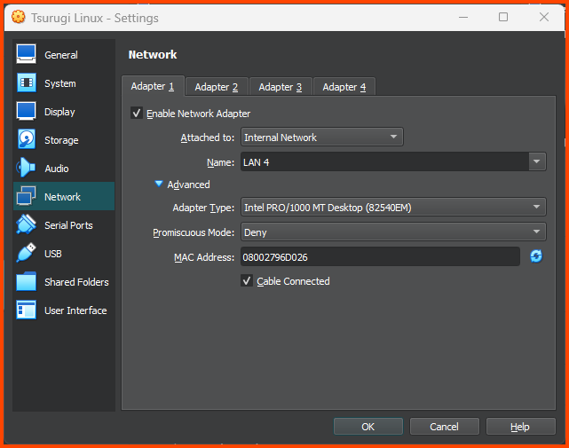

### Installing Tsurugi Linux

Select the VM and from the toolbar select Start.


Press Enter to start the Tsurugi Linux in GUI mode.


Once on the desktop double-click on Displays.


In the Resolution window select 1600x1050 and click on Apply.

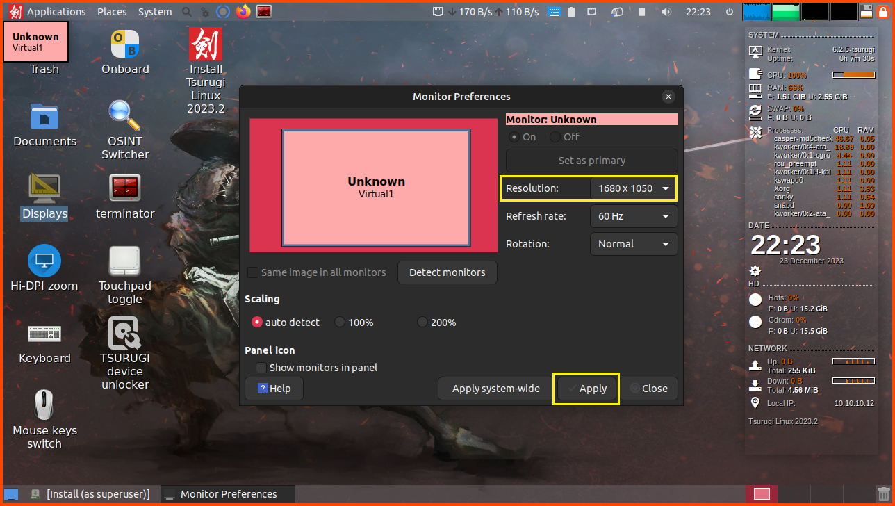

Click on Keep This Configuration to confirm the changes.

**Note:** Without changing the resolution of the screen you will not be able to see the buttons that exist at the bottom of the Installer.

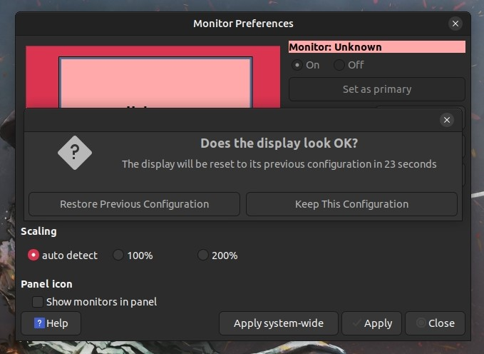

Double-click on the "Install Tsurugi Linux 2023.2" icon to start the installer.


Once the installer starts. Use the scrollbar on the right side of the VM display and scroll to the bottom. Select your language and click on Continue.

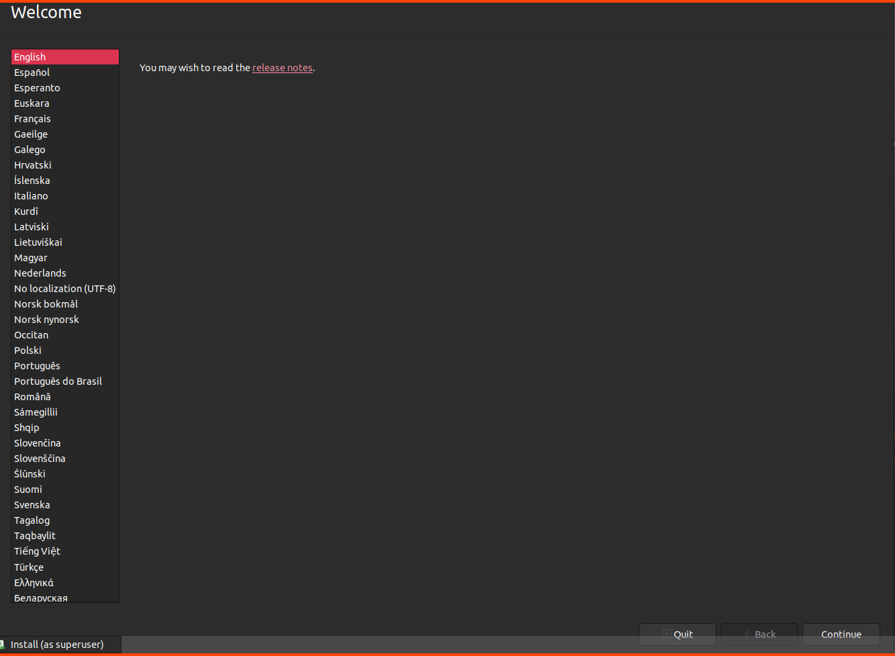

Select Keyboard and click on Continue.


Enable "Install third party software for graphics and Wi-Fi hardware and additional media features" and click on Continue. 


Click on Install Now.

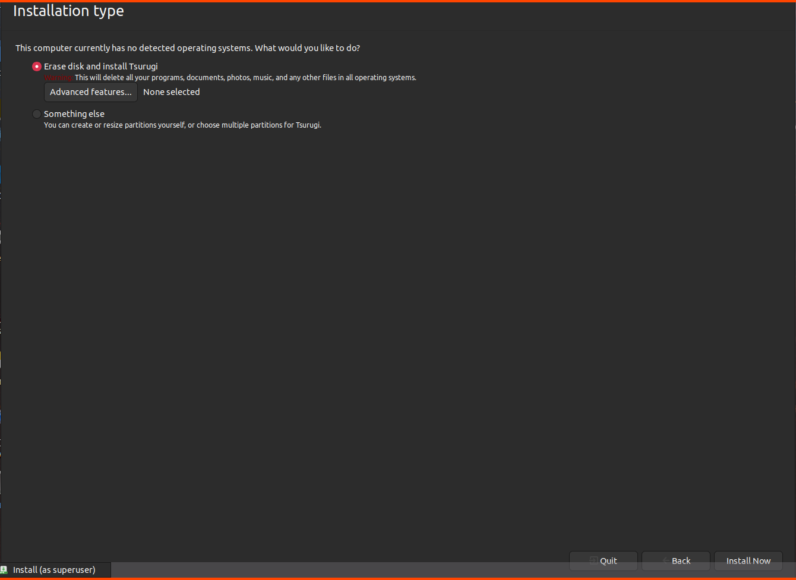

Click on Continue.

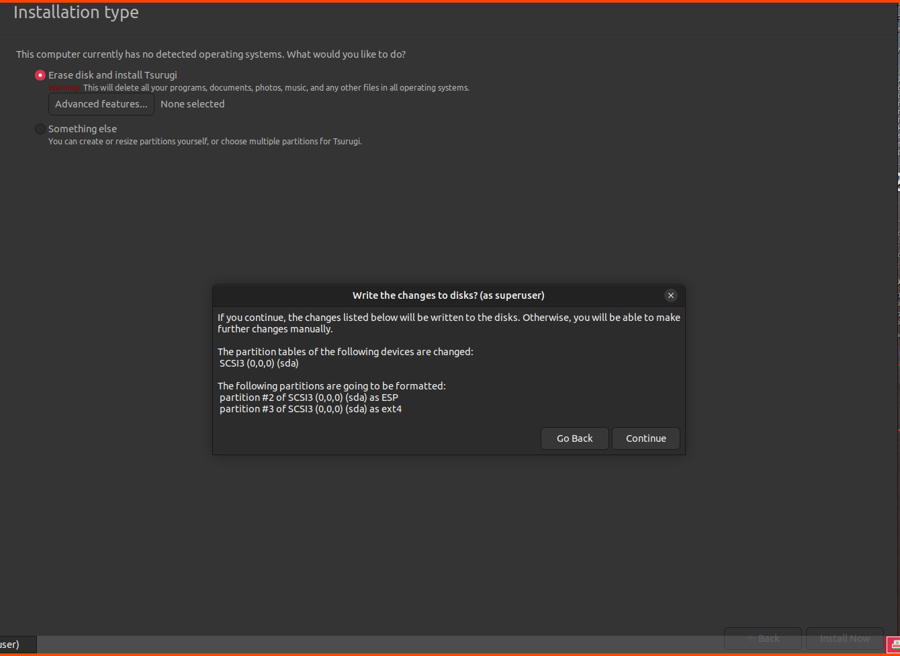

Select your location/timezone using the map and click on Continue.


Provide a username, computer name and password then click on Continue.


Wait for the Operating System to install.

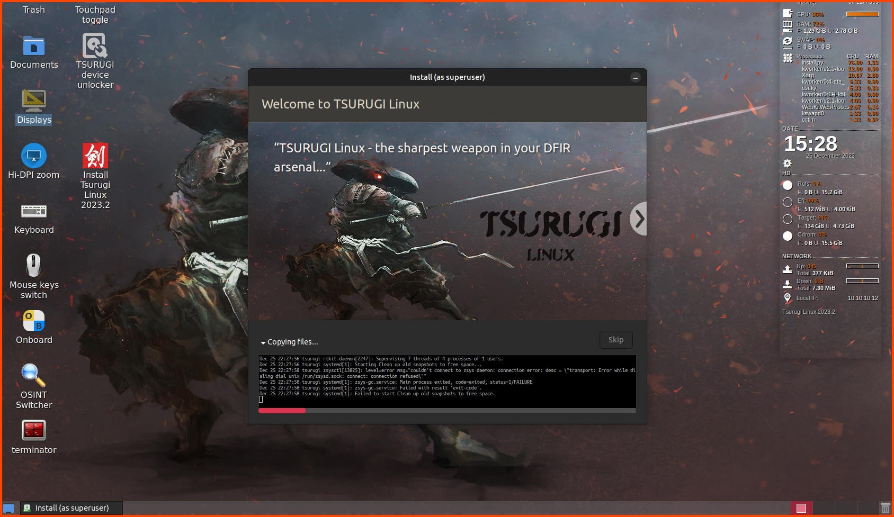

After the install is complete click on "Restart Now".

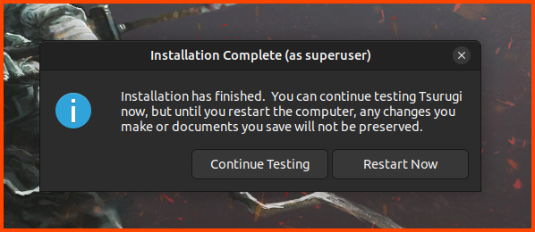

When the VM reboots you might get the following screen. VirtualBox will automatically remove this disk. Press Enter to continue.

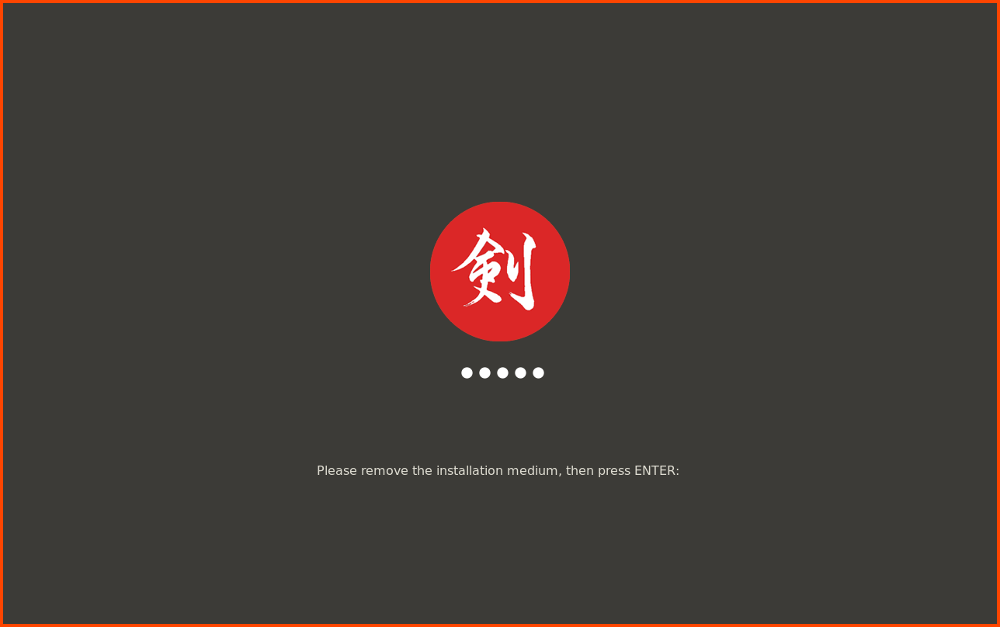

Login using the password that was configured.


### Post-Install Configuration

#### Guest Additions Installation

Click on `Devices -> Inert Guest Additions CD Image`. This will insert the ISO image.

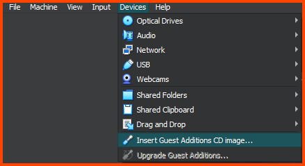

You might be prompted for credentials. Enter the password and click on Authenticate.

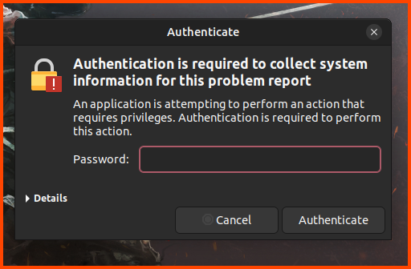

From the top right-corner click on the CD icon then select `Mount VBox_GAs`.


The ISO image will not be visible on the desktop. Double-click on the Image icon.


From the toolbar select `Tools -> Open Current Folder in Terminal`.


Run the following command to install Guest Additions.

```bash
sudo ./VBoxLinuxAdditions.run
```


Once the install is complete. Press `Right Ctrl+F` to enter Fullscreen mode. The same key can be used to exit Fullscreen the VM will scale to fit the window size. From the top right-corner select `Eject VBox_GAs` to remove the ISO image.


To Shutdown the system click on the icon beside the clock then select "Shut Down".


Select "Shut Down".

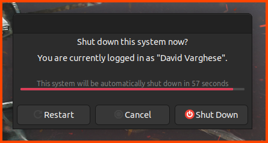

#### Updating the System

Open `terminator` and run the following command:

```bash
sudo apt update && sudo apt full-upgrade
```

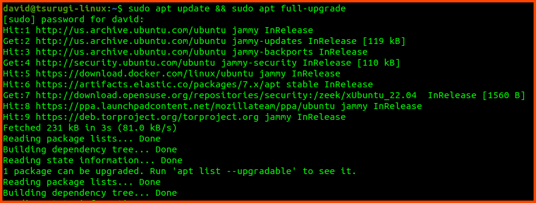

If there are any updates click Enter to start the install. Provide password when prompted.

#### Creating VM Snapshot

Use the Hamburger menu beside the VM name to access the Snapshot page.


Click on Take to create a Snapshot.

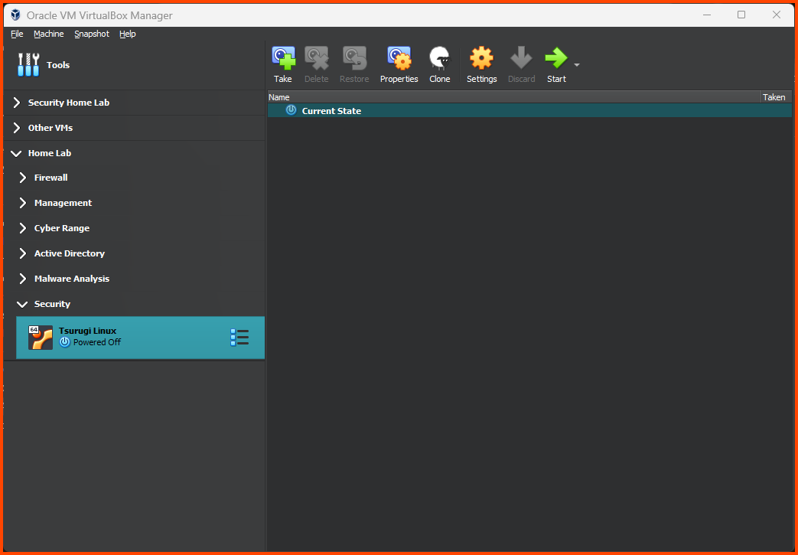

Give the Snapshot a descriptive name and click on Ok.


Use the Hamburger menu and click on Details to return to the main page.


In the next module, we will install Ubuntu and then download and setup Splunk. We will also install the Splunk Universal Forwarder on the Domain Controller in our Active Directory Lab. This will allow us to capture capture the events that are generated on the DC.