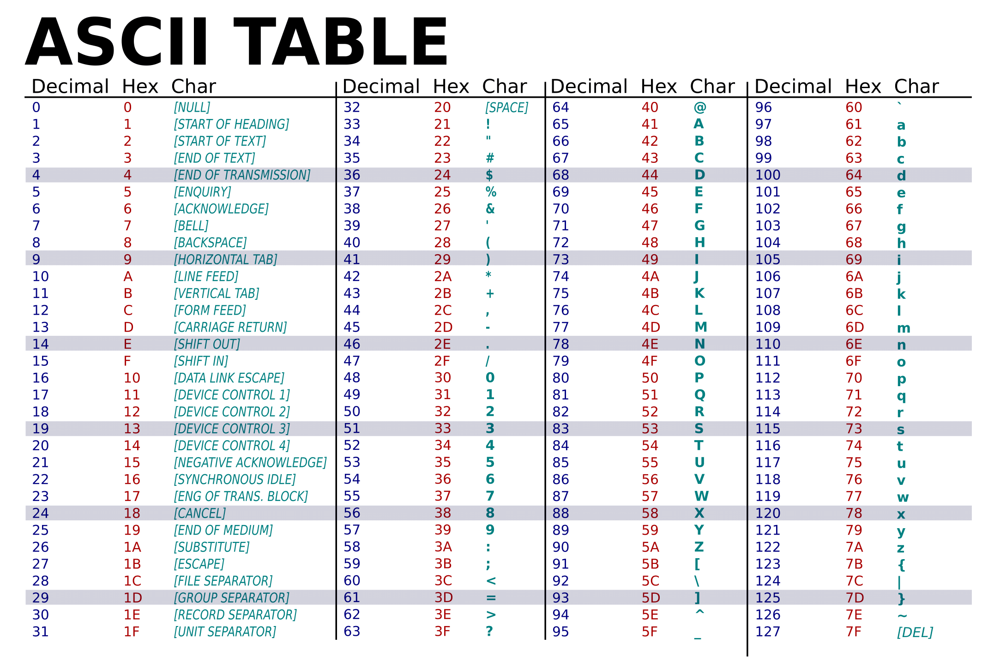
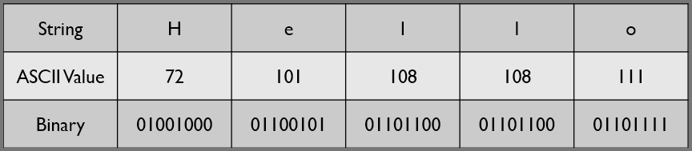
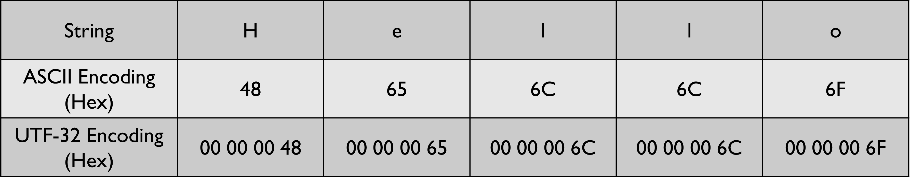

Before diving into the various character encoding standards we first need to understand why we even need to encode characters. Computers use a system that uses 1s and 0s to represent data. Whether it's a number like `42` or a character like the letter `d` it has to be transformed into a stream of 1s and 0s for the computer to be able to understand it. For a number, it makes sense to convert it into its Base-2 (Binary) number system equivalent which a computer can understand. For example, the integer `42` would be represented as `00101010` in binary. But what about the letter d? What about letters used in Asian languages? What about emojis? How do we represent non-numeric characters on a computer? The solution - use a collectively agreed-upon mapping that assigns each character a numeric value which can then be converted to binary.

### General Terminologies

#### Character Set

A **character set** or a character repertoire is simply a **set of unordered characters**. The Latin alphabet and the Greek alphabet are both examples of character sets.

#### Coded Character Set

A **coded character set** maps each character in its repertoire to an integer value. Each character is essentially assigned a position in the character set. The integer that represents a character in a coded character set is called a “**Code Point**”. The range of numbers that are required to map all the characters in the coded character set is called a “**Code Space**”. 

The term character set is commonly used to also refer to a coded character set. For the rest of this article, I will be using the term character set to refer to a coded character set.

[Character Encoding Terminologies - Wikipedia](https://en.wikipedia.org/wiki/Character_encoding#Terminology)

### ASCII

ASCII or the American Standard Code for Information Exchange is a very popular, easy-to-understand character encoding standard. ASCII maps a set of control characters, Arabic numbers, Latin characters and punctuations to numbers between 0 and 127.

> [!INFO] Control Characters
> Control characters, also known as non-printing characters (NPC), are characters in a character set that do not represent a written character or symbol. They are used to signal to the computer to perform special action, such as ringing a bell, erasing the screen, or controlling where the next character will display. They include characters such as tab, line feed, and carriage return.

The character set that is used by ASCII is also called ASCII. The ASCII character set is comprised of 128 characters. To represent all 128 characters in binary, 7-bits ($2^7 = 128$) are required. To convert a string like “Hello” to ASCII we would have to look up the code point for each of the characters from an ASCII table. The code points would then be converted into binary. Finally, we would concatenate the binary representation of all the characters together to get the version of the string that can be used by computers. The process of representing a character in its binary form using a character set is called “**Character Encoding**”. To decode the string the same steps are performed in reverse.

Some of you will be wondering why 7-bits, why not a clean byte (8-bits). ASCII was created well before 8-bit bytes became ubiquitous. The notion of calling 8 bits a byte was not yet established. 

Iterations of ASCII that were released after the concept of a byte had become commonplace used 8 bits to encode each character. The MSB in each encoded character was used for error correction. Nowadays, ASCII is represented using 8-bits with the MSB bit set to 0.

**MSB (Most Significant Bit)**: Bit that has the highest value in a bit stream. It is usually the bit that is farthest to the left.

ASCII had one big disadvantage, its code space of 128 characters was quite small. The code space was not large enough to represent characters from other languages. The need for additional characters eventually led to the creation of Extended ASCII. 

#### Extended ASCII

It is a character encoding standard that utilizes 8-bits ($2^8 = 256$) to encode each character. Extended ASCII includes the original ASCII character set, plus an additional 128 characters. A formal definition for “Extended ASCII” was never created. As a result, different countries and organizations assigned different characters to the extended code space. This resulted in numerous character sets being created that could all be encoded using Extended ASCII. To be able to correctly decode data that included code points from the extended ASCII code space, we have to know the exact character set that was used to encode the data.

#### Code Page

When using products from vendors like Microsoft and Oracle, you may come across the term “code page”. A code page is just another term for a character set. The term code page was coined by IBM to market the support of different character sets on their Mainframe systems. Code pages that pertain to ASCII typically have the first 127 code points representing the original ASCII characters. The upper 128 code points (values 128-255) of each code page differed considerably. Each code page represented a different variant of Extended ASCII.

> [!INFO]
> While ASCII and Extended ASCII were the most popular character encodings around at the time, they were not the only character encodings in use. Many countries created their character encodings or used variations of ASCII. Japan created multiple encoding standards to represent Japanese characters. The encodings that were used in Japan were all incompatible with each other. This resulted in data being transmitted between computers to frequently appear garbled. The incompatibility was such a big issue that there is a word in Japanese to describe it - "Mojibake" (garbled text).

Once the internet came around and global communication became commonplace, the use of wildly different incompatible encoding standards became a major source of frustration. To address this issue, the Unicode consortium was established. The group was tasked with designing a standard that would support characters from all the world's major writing systems along with symbols like emojis.

<iframe 
	width="560" height="315" src="https://www.youtube-nocookie.com/embed/MijmeoH9LT4?si=DKLzUB2NQHRvQJXy" title="YouTube video player" frameborder="0" allow="accelerometer; autoplay; clipboard-write; encrypted-media; gyroscope; picture-in-picture; web-share" allowfullscreen>
</iframe>

### Unicode Terminologies

#### Grapheme
It is the smallest functional unit in a writing system. The `c` in `cat` and `朋` in `朋友` (friend) are both examples of graphemes. Unicode utilizes the term grapheme to refer to what a user normally would think of as a character.

#### Code Point
It is the number (index) that uniquely represents a grapheme in a character set. A grapheme in Unicode can be constructed using one or more code points. 

Pay attention to the grapheme `é`. It can be represented in Unicode using a single code point as well as by combining two code points. 

[Find Unicode Characters - Compart](https://www.compart.com/en/unicode/)  
[Victory Hand: Medium Skin Tone Emoji - Emojipedia](https://emojipedia.org/victory-hand-medium-skin-tone)

> [!INFO]
> Unicode code points are mostly represented in hexadecimal. The `U+` in front of the number is optional. This notation is adopted to make it clear that the number represents a Unicode code point. 

#### Encoding
It is the process that is followed to convert a code point into its binary representation. ASCII has a single encoding strategy in which the code point of a grapheme is directly converted into its binary equivalent.

<iframe 
	width="560" height="315" src="https://www.youtube-nocookie.com/embed/ut74oHojxqo?si=dmKpMbFE2CuhrO7v" title="YouTube video player" frameborder="0" allow="accelerometer; autoplay; clipboard-write; encrypted-media; gyroscope; picture-in-picture; web-share" allowfullscreen>
</iframe>

#### Code Unit
Code Unit represents the number of bits that are used by an encoding to represent characters. Some commonly used character encoding schemes used code units of 8-bit, 16-bit, and 32-bit. ASCII utilized a code unit of 7-bits to encode its characters while Extended ASCII used a code unit of 8-bits to represent its character set.

### Unicode

Similar to ASCII, Unicode is a character set. The goal with Unicode was to develop a system to represent every single character that we would ever require using a single character set. The Unicode standard can represent ~1.1 million unique graphemes. As of today (Unicode 5.1) we are using ~150,000 of the available code points. This means ~960,000 code points in Unicode are still unassigned.

[Unicode - Wikipedia](https://en.wikipedia.org/wiki/Unicode)

Unicode has 3 encoding schemes that are commonly used today. Each encoding scheme has its own set of advantages and disadvantages. One should carefully consider these characteristics before choosing an encoding scheme for their application.

### Planes and Blocks

The Unicode code space is divided into groups called planes. A plane is a continuous group of 65,536 ($2^{16}$) code points. Unicode has 17 planes numbered from 0 to 16. Each plane is further divided into blocks. Unlike planes, blocks do not have a fixed size. Planes and blocks are used to organize the Unicode standard into groups of related characters. Planes group graphemes on general attributes like frequency and age (modern, historic). While blocks are used to group graphemes by language and general application area. Most of the Unicode that are assigned as of Unicode 15.1 are located in the first 3 planes.

[Planes & Blocks (Unicode) - Wikipedia](https://en.wikipedia.org/wiki/Plane_(Unicode))

#### Plane 0: Basic Multilingual Plane (BMP)    
This plane contains characters from almost all modern languages. Many of the code points in BMP are used to represent CJK characters. As of Unicode 15.1, BMP contains 164 blocks. BMP spans the range `0x0000-0x​FFFF`. UTF-16 can represent all the characters in this plane using a single 16-bit code unit.

#### Plane 1: Supplementary Multilingual Plane (SMP)  
The plane mainly contains historic characters along with symbols and notations that are used within certain fields. As of Unicode 15.1, SMP contains 151 blocks. SMP spans the range `0x10000-0x1FFFF`.

#### Plane 2: Supplementary Ideographic Plane (SIP)
This plane is used to represent CJK characters that are not represented in BMP. This plane consists of 7 blocks. SMP spans the range `0x20000-0x2FFFF`.

#### Plane 3: Tertiary Ideographic Plane (TIP)    
This plane is made up of 2 blocks. As of Unicode 15.1, this plane consists of a small number of rarely used CJK characters. TIP spans the range `0x30000-0x3FFFF`.

#### Plane 4-13: Unassigned Plane
No graphemes have been so far assigned in these planes. The 10 unassigned planes span the range `0x40000-0x​DFFFF`.

#### Plane 14: Supplementary Special-purpose Plane (SSP)
This plane consists of two blocks. SSP spans the range `0xE0000-0xEFFFF`.

#### Plane 15-16: Private Use Area Planes (SPUA)  
These two blocks are reserved for private use. The two planes are called SPUA-A and SPUA-B. They are reserved to denote characters outside that Unicode standard that could have special meaning when used within an organization. The Unicode standard will never assign any character to this plane. SPUA spans the range `0xF0000-0x10FFFF`.

### UTF-32 Encoding
It is one of the encoding strategies that is supported by Unicode. It uses 4 bytes or 32 bits to encode each code point. A stream of 32 bits is also called a “double word”.

[UTF-32 - Wikipedia](https://en.wikipedia.org/wiki/UTF-32)

e.g., The grapheme `द` (Devanagari Letter Da) has the code point `U+0926` which would be denoted by the code point `2342` in decimal. Its encoded form in binary would be `00000000 00000000 00000100 100100110`. Code points that are not 32 bits in length are left padded with 0's.  Since all graphemes are encoded using 4 bits, UTF-32 is a fixed-length encoding scheme. 

The below example shows the string “Hello” encoded using UTF-32. I have shown the encoded result in Hex to save space.

The main advantage of UTF-32 is that each code point gets encoded to a string of fixed length. So if we are given the stream `00 00 00 48 00 00 00 65 00 00 00 6C` we can easily figure out where a new code point would start. Every 4th hex pair will be a new code point. This makes finding the nth code point in a UTF-32 stream extremely trivial. 

The biggest disadvantage of this encoding is that it is space-inefficient. UTF-32 requires 4x the space used by ASCII to encode each grapheme. UTF-32 is also not backward compatible with ASCII, so UTF-32 cannot be used to communicate with old programs that only understand ASCII. Additionally, some old devices use eight consecutive 0s in a row to represent the end of transmission. UTF-32 uses consecutive 0s as padding. If we try to communicate with these old devices the transmission will always get disconnected prematurely. 

### Conclusion

So far we covered some of the terminologies that are used when encoding is being discussed, and then we took a look at ASCII and Extended ASCII. Next, we took a look at the Unicode standard and discussed how the Unicode code space is split into planes and blocks. Finally, we covered UTF-32 which is one of the three encoding schemes that is supported by Unicode.

In the next module, we will continue the discussion by looking at the remaining Unicode character encoding schemes and then we will take a look at what it means for an encoding scheme to be self-synchronizing.
