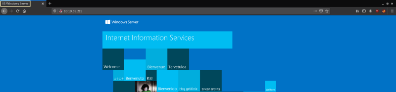
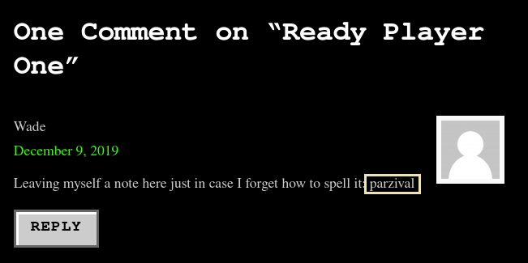
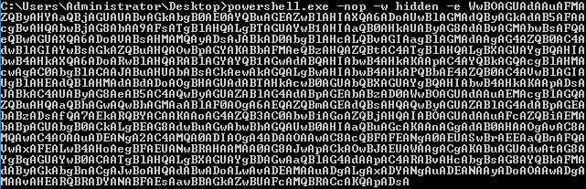

Cover Image by [BiZkettE1](https://www.freepik.com/free-vector/modern-business-background-with-geometric-shapes_5287944.htm) on Freepik

## Task 1: Mission Start!

1. **Deploy the machine! This is a Windows box so give it a few minutes (3-5 at max) to come online**

> No answer required

## Task 2: Activate Forward Scanners and Launch Proton Torpedoes

1. **How many ports are open on our target system?**


> 2

1. **Looks like there's a web server running, what is the title of the page we discover when browsing?**



> IIS Windows Server

3. **Interesting, let's see if there's anything else on this web server by fuzzing it. What hidden directory do we discover?**


### Command Options

* **dir:** Enumerate directories and files
* **u:** Target URL
* **-x:** File formats to enumerate
* **-w:** Wordlist to use for enumeration
* **-t:** No. of threads

> /retro

4. **Navigate to our discovered hidden directory, what potential username do we discover?**


> wade

5. **Crawling through the posts, it seems like our user has had some difficulties logging in recently. What possible password do we discover?**



> parzival

6. **Log into the machine via Microsoft Remote Desktop (MSRDP) and read user.txt. What are its contents?**

```
xfreerdp +clipboard /u:wade /p:parzival /v:<machine-ip>
```


> THM{HACK_PLAYER_ONE}

## Task 3: Breaching the Control Room

1. **When enumerating a machine, it's often useful to look at what the user was last doing. Look around the machine and see if you can find the CVE which was researched on this server. What CVE was it?**


> CVE-2019-1388

**Note:** As of 14/03/2021 there is a bug in the machine due to which the history in the browser is missing. The workaround, for now, is just to google for the vulnerability and continue with the rest of the challenge

1. **Looks like an executable file is necessary for the exploitation of this vulnerability and the user didn't clean up very well after testing it. What is the name of this executable?**


> hhupd

3. **Research vulnerability and how to exploit it. Exploit it now to gain an elevated terminal!**

On searching online we come across two links that show us how we can use the executable file to exploit the vulnerability

[GitHub - jas502n/CVE-2019-1388: CVE-2019-1388 UAC提权](https://github.com/jas502n/CVE-2019-1388)

> No answer required

1. **Now that we've spawned a terminal, let's go ahead and run the command 'whoami'. What is the output of running this?**


> NT AUTHORITY\SYSTEM

5. **Now that we've confirmed that we have an elevated prompt, read the contents of root.txt on the Administrator's desktop. What are the contents? Keep your terminal up after exploitation so we can use it in task four!**


> THM{COIN_OPERATED_EXPLOITATION}

## Task 4: Adoption into the Collective

1. **Return to your attacker machine for this next bit. Since we know our victim machine is running Windows Defender, let's go ahead and try a different method of payload delivery! For this, we'll be using the script web delivery exploit within Metasploit. Launch Metasploit now and select 'exploit/multi/script/web_delivery' for use.**


> No answer required

2. **First, let's set the target to PSH (PowerShell). Which target number is PSH?**


> 2

3. **After setting your payload, set your lhost and lport accordingly such that you know which port the MSF web server is going to run on and that it'll be running on the TryHackMe network.**


> No answer required

**Note:** The value for LHOST can be found by running "ip a show tun0" and looking under Inet

4. **Finally, let's set our payload. In this case, we'll be using a simple reverse HTTP payload. Do this now with the command: 'set payload windows/meterpreter/reverse_http'. Following this, launch the attack as a job with the command 'run -j'.**

> No answer required

5. **Return to the terminal we spawned with our exploit. In this terminal, paste the command output by Metasploit after the job was launched. In this case, I've found it particularly helpful to host a simple Python web server (python3 -m http.server) and host the command in a text file as copying and pasting between the machines won't always work. Once you've run this command, return to our attacker machine and note that our reverse shell has spawned.**




> No answer required

6. **Last but certainly not least, let's look at persistence mechanisms via Metasploit. What command can we run in our meterpreter console to set up persistence which automatically starts when the system boots? Don't include anything beyond the base command and the option for boot startup.**


> run persistence -X

7. **Run this command now with options that allow it to connect back to your host machine should the system reboot. Note, you'll need to create a listener via the handler exploit to allow for this remote connection in actual practice. Congrats, you've now gained full control over the remote host and have established persistence for further operations!**

> No answer required

That's all. Happy Hacking :)