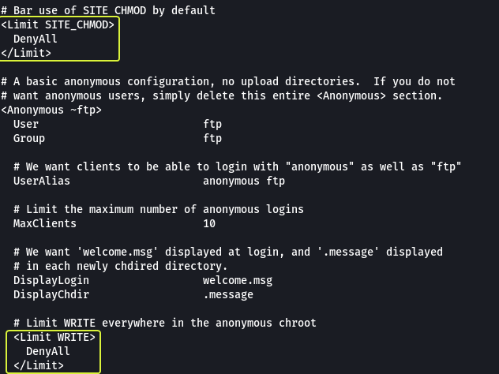
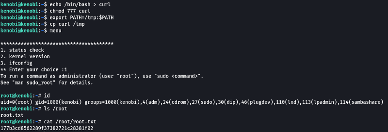

Cover Image by [BiZkettE1](https://www.freepik.com/free-vector/modern-business-background-with-geometric-shapes_5287944.htm) on Freepik

## Task 1: Deploy the vulnerable machine

1. **Make sure you're connected to our network and deploy the machine**

> No answer required

The first task that is performed when we are given a target to exploit is to find the services that are running on the target. To find services running on the machine I will be using "RustScan" which is a port scanner similar to Nmap but much faster (RustScan in ideal conditions can scan all the ports on the device in under 3 seconds). RustScan also integrates with Nmap so we can find open ports quickly with RustScan and then pipe the results to Nmap for using Nmap features.

[GitHub - RustScan/RustScan: 🤖 The Modern Port Scanner 🤖](https://github.com/RustScan/RustScan)

### Command Options

*   **-a:** Target IP Address
*   **-b:** Batch Size (No. of ports to scan in one second)
*   **-t:** Timeout (Time to wait between each batch)
*   **-sV:** Service Versioning
*   **-oN:** Normal output file

**Note:** All the flags after the `--` along with the ports found by RustScan are going to be passed to Nmap for processing

### Nmap Equivalent

> nmap -vvv -p- -Pn -sV -oN nmap_output.txt 10.10.130.183

**Note:** The ports over 2100 can be ignored in this room as they are just RPC calls that are being executed on the system. Another point to be mentioned here is the service running on port 111 (rpcbind). It is a server that is used to convert RPC addresses to local machine addresses. Some services like NFS require rpcbind to function properly.

[Remote procedure call - Wikipedia](https://en.wikipedia.org/wiki/Remote_procedure_call)

2. **Scan the machine with Nmap, how many ports are open?**

> 7

## Task 2: Enumerating Samba for shares

From the scan results, we can see that we have SMB running on the system (Ports 129, 445). The SMB ports are generally not secured properly and if anonymous login is enabled it allows anyone to view the shares without authentication. Since we know there is a high probability of finding an issue with SMB we should start our attack by looking at the SMB service.

**Note:** Shares or Shared Resource is the technical term that is used when referring to the directories that are accessible using SMB.

Nmap provides scripts to enumerate SMB Shares so let's use them to see if we can collect any information about the target.

> nmap -p 445 -script=smb-enum-shares,smb-enum-users 10.10.130.183

1. **Using the Nmap command above, how many shares have been found?**

> 3

From the results, we can see that we do have an anonymous share. Since it does not require any authentication and has READ/WRITE access let's use it and see what we can discover.

For connecting to SMB shares on Linux we can use the "smbclient" utility

2. **Once you're connected, list the files on the share. What is the name of the file can you see?**

> log.txt

We can directly view the content of the "log.txt" file on the share using the "more" command but let us try out an alternate approach downloading all the files on the share to our system and then viewing them (This is simply done so that we can learn how to use a new tool).

**Note:** When connected to a share typing "?" will get us a help menu of all the supported commands

For downloading all the data from a share we can use the "smbget" command.

Now that we have downloaded the share let's look at the "log.txt" file and see what information we can collect.

Going through the log file we were able to see some interesting information. An SSH key was generated and stored on the target system. There is an FTP Server that is running on port 21 (This was found by Nmap as well). The rest of the file contains information about the configuration of the FTP Server. In this configuration, we see two blocks of code that are used to block the usage of the WRITE and CHMOD commands on the server (keep this in mind will come in handy later).

3. **What port is FTP running on?**

> 21

We have enumerated the SMB service and found some data. Next, we can have a look at NFS to see if anything useful about that target can be found. Nmap provides scripts for enumerating NFS so let's use them.

> nmap -p 111 -script=nfs-ls,nfs-statfs,nfs-showmount 10.10.130.183

From the results, we can see that the /var directory of the target machine is being served by NFS.

**Note:** Observe how to enumerate NFS we are scanning the rpcbind server (Port 111) instead of the NFS Server. This is done because the rpcbind server holds the information about the NFS Server.

[9.9. NFS and rpcbind Red Hat Enterprise Linux 6 \| Red Hat Customer Portal](https://access.redhat.com/documentation/en-us/red_hat_enterprise_linux/6/html/storage_administration_guide/s2-nfs-methodology-portmap)

4. **What mount can we see?**

> /var

## Task 3: Gain initial access with ProFtpd

From our initial Nmap scan, we know that an FTP server is running on the target and it is using ProFtpd version 1.3.5. We can confirm this by using Netcat and connecting to the port to capture the banner.

1. **What is the version?**

> 1.3.5

Now that we know the name of the service being used and its version let us use "Searchsploit" to check Exploit-DB to see if there are any know vulnerabilities for this exact version.

2. **How many exploits are there for the ProFTPd running?**

> 3

Looking at the results we can see that there are indeed vulnerabilities for this version of the service. On further inspection, we can see that they are all involved in the copy command. We see a module named "mod_copy" that allows to run remote commands. Let's take a look at the manual for this function and see how we can use it.

[ProFTPD module mod_copy](http://www.proftpd.org/docs/contrib/mod_copy.html)

From the manual, we see that this module implements two functions:
*   **SITE CPFR:** Allows to select a file to be copied
*   **SITE CPTO:** Specifies the location to paste the copied file

Another interesting observation that we can make from the manual is that these commands could be blocked by disallowing SITE_COPY. Since we did not find any code in the configuration that was disabling SITE_COPY we can conclude that we can use the "mod_copy" module to copy files on the target from one location to another from a remote location.

When we went through the "log.txt" file earlier we spotted lines showing that an SSH key was created on the system. We can use the "mod_copy" module to copy that SSH key into the "/var" directory that know is being served by NFS. When we can mount the NFS directory and copy the file onto our system.

3. **We know that the FTP service is running as the Kenobi user (from the file on the share) and an ssh key is generated for that user.**

> No answer required

Once we copy the key into the "/var" directory let's mount that directory on our system using NFS and download the key.

4. **We knew that the /var directory was a mount we could see (task 2, question 4). So we've now moved Kenobi's private key to the /var/tmp directory.**

> No answer required

**Note:** The mount command is used to mount drives on a Linux system. kenboiNFS is the location where the remote "/var "directory is going to be mounted. So after mounting if we list the files in the kenobiNFS folder, we will see the files that are present on the remote machines "/var" directory.

Now that we have copied the SSH key onto our system let's use SSH and login into the target system and find the user flag.

5. **What is Kenobi's user flag (/home/kenobi/user.txt)?**

> d0b0f3f53b6caa532a83915e19224899

## Task 4: Privilege Escalation with Path Variable Manipulation

Now that we have a foothold on the system our next goal is to elevate privileges. One of the ways to do this is to exploit binaries on the system that have the SUID bit set. The SUID bit gives the executor of the binary the same privileges as the owner of the binary. So if there is a binary that is owned by root and it has the SUID bit set we could theoretically use this binary to elevate our permissions. Another important thing to note is that files that are called/accessed by a process have the same permissions as the calling process.

[How to Find Files With SUID and SGID Permissions in Linux](https://www.tecmint.com/how-to-find-files-with-suid-and-sgid-permissions-in-linux/)

Let's find all the binary files that are present on the system that is owned by root and have the SUID bit set.

### Command Options

*   **/:** Scan the entire device
*   **-type f:** Look only for files (No directories)
*   **-user root:** Check if the owner of the file is the root user
*   **-perm -4000:** Look for files that have a minimum of 4000 as their privilege. 4000 is the numerical representation for a file whose SUID bit is set.
*   **-exec:** Execute a command using the results of find
*   **ls -l {} +:** Display the results in long form ({} is a placeholder for the results that are returned by find. + at the end is used to terminate the -exec option)

The `2> /dev/null` at the end is not required but using that we are sending any errors that could be returned by find (directories that cannot be accessed due to lack of proper permissions) to NULL. NULL is a special device on Linux that deletes whatever data is sent to it.

Looking at the output we see a binary called "menu". This does not look like a service that is found on a Linux system so mostly this was coded by the owner of the system. If we are lucky the binary may contain some misconfiguration that we could use to our advantage.

1. **What file looks particularly out of the ordinary?**

> /usr/bin/menu

2. **Run the binary, how many options appear?**

> 3

Since the file is a binary most of the content in the file is not going to be human readable. We can use the "strings" command to find the human-readable lines that are present in the file.

When we look at the results we see curl (a utility found on Linux) is being used in one of the steps during execution. The binary for curl has been directly invoked without using the complete path to the binary. When we don't specify the complete path the system will look at the PATH variable and search in all the locations that are specified in the path for the file that is required. Since the path variable is editable by anyone we can use this to our advantage.

By creating a file called curl and then adding the location to our file at the start of the PATH variable we can make the system use our file instead of the actual curl tool. So if we copy the contents of the binary "/bin/bash" (This is the binary that spawns the shell) into the curl file we create when our file is called by the binary "menu" we should get a root shell. The binary "menu" is owned by root so any file that is accessed by it is also going to root privileges.

1. **We copied the /bin/sh shell, called it curl, gave it the correct permissions and then put its location in our path. This meant that when the /usr/bin/menu binary was run, it is using our path variable to find the "curl" binary. Which is a version of /usr/sh, as well as this file being run as root it runs our shell as root!**

> No answer required

4. **What is the root flag (/root/root.txt)?**

> 177b3cd8562289f37382721c28381f02

That's all. Happy Hacking :)