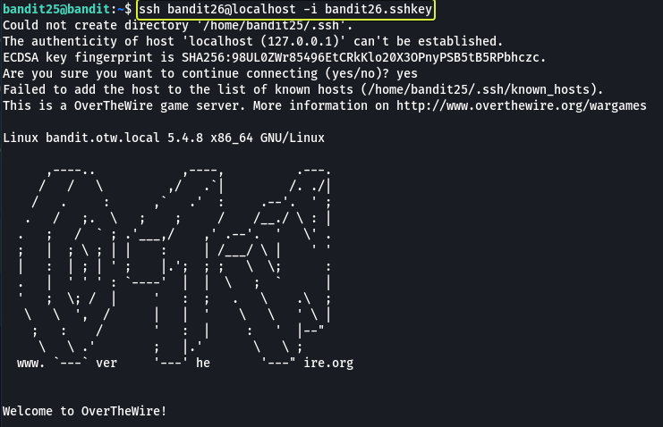
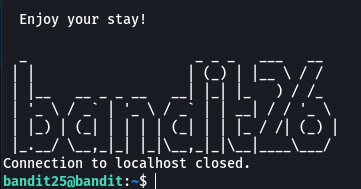
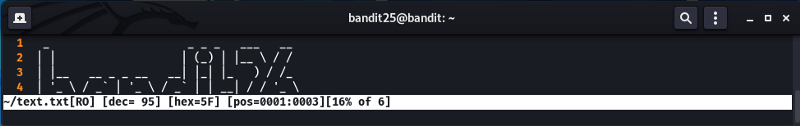

## Level Goal

> Logging in to bandit26 from bandit25 should be fairly easy… The shell for user bandit26 is not **/bin/bash**, but something else. Find out what it is, how it works and how to break out of it.

## Commands you may need to solve this level

> ssh, cat, more, vi, ls, id, pwd

```
> whatis ssh  
ssh (1)              - OpenSSH remote login client

> whatis cat  
cat (1)              - concatenate files and print on the standard output

> whatis more  
more (1)             - file perusal filter for crt viewing

> whatis vi  
vi (1)               - Vi IMproved, a programmer's text editor

> whatis ls  
ls (1)               - list directory contents

> whatis id  
id (1)               - print real and effective user and group IDs

> whatis pwd  
pwd (1)              - print name of current/working directory
```

**Note:** Not all commands are required to complete the level

## Helpful Reading Material

[more(1) - Linux manual page](https://man7.org/linux/man-pages/man1/more.1.html)

[How to specify shell for Vim? - Super User](https://superuser.com/questions/287994/how-to-specify-shell-for-vim)

[Understanding the /etc/passwd File \| Linuxize](https://linuxize.com/post/etc-passwd-file/)

[more command in Linux with Examples - GeeksforGeeks](https://www.geeksforgeeks.org/more-command-in-linux-with-examples/)

## Solution

Let's view if there are any files in our current working directory.

```
bandit25@bandit:~$ ls
bandit26.sshkey
```

We see that we have the SSH key for bandit26 let's use SSH and login into the next level.



**Note:** We are connecting to "localhost" because bandit26 also exists on the same device as bandit25 and to connect to the same device that we are already on we use the hostname as localhost. There was no need to specify the port because similar to the hostname we are trying to connect to the same device and the device is already aware of the port on which SSH is running.



On looking at the output it looks like we did connect to bandit26 but we were logged out immediately. In the question we have been told that the default shell for bandit26 is not "/bin/bash" so let us find out what shell is being used.

The "/etc/passwd" file consists of information regarding the users on the device along with the shell that is being used by each user.

```
cat /etc/passwd
```


We see that a shell called "/usr/bin/showtext" is being used by bandit26. Let's have a look at the content of this "showtext" shell to see what we are dealing with.


Looking at the content we see that the shell is a shell script that is using the "more" command and outputting the contents of the text.txt file and then terminating. From what we saw before it's safe to assume that the banner with the text bandit26 is the content that is saved in this file.

Looking at this script we can understand that the reason that we were getting logged out is the line "exit 0" which is executed as soon as all the text from the text.txt file is displayed. So we need to find a way by which we do not exit out of the more utility.

From my previous experience with the "more" command, I know that if the amount of content that needs to be displayed on the terminal is more than the size of the terminal the more tool goes into interactive mode the command does not quit till we don't view all the contents in the file or we don't exit manually the program.

There is an example where I tried to view the content of the .bashrc file using the more command.

```
more .bashrc
```


Notice how the entire content is not shown in the terminal like with the "cat" command. The more utility is waiting for us to scroll through the content and reach the end at which point the command finishes this execution.
In our case, since the text that needs to be printed to the terminal is less than the size of the terminal the more command finishes execution and proceeds to the next command in the shell script.

We need to open more in the interactive mode so let us make the size of our terminal very small and then try to login as bandit26. If our understanding of what is happening is current this time we should not get logged out and we should be in the interactive mode of more.

```
ssh bandit26@localhost -i bandit26.sshkey
```


As expected we are in more and since the content could not fit in our terminal more has entered the interactive mode. Now the next step for us is to somehow spawn a "/bin/bash" shell.

If we look at the man pages of more we see that by pressing the "v" key while in interactive mode it will open the current line in an editor that is defined by the VISUAL and EDITOR environment variables. If both the variables are not set then Vim will be used. Let us see by pressing "v" which editor we get.



Looking at the output looks like it opened the Vim editor. This is great anyone who has used Vim knows that Vim has a command mode that can execute system commands. By performing a quick Google search we can gather that using the "set shell" command we can change the shell of a user and by invoking "shell" the user should be loaded into the specified shell. The ":" operator is used to enter command mode in Vim.


**Note:** Once this command is entered we will be put in insert mode so press "Esc" to exit insert mode and enter the next command.


And as we will see we have launched the bash shell and are logged in as bandit26. Let us capture the password for bandit26 so that we can use it later if required.


**Note 1:** It is recommended to complete the next level right after this as you are already logged in as bandit26 plus if log out now then you will have to repeat the same steps as above to log in once more into bandit26.

**Note 2:** If logging out remember that you have to logout twice once from bandit26 and then from bandit25. When trying to return to bandit25 you will end up in Vim in insert mode use Esc to quit insert mode and enter `:q` to quit Vim now more should open up press q again to exit more as well.