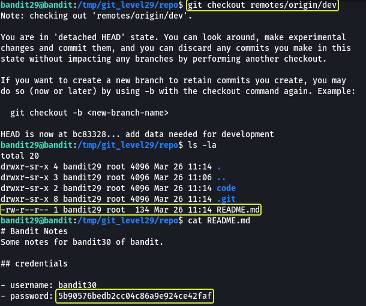

## Level Goal

> There is a git repository at `ssh://bandit29-git@localhost/home/bandit29-git/repo`. The password for the user `bandit29-git` is the same as for the user `bandit29`.  
> Clone the repository and find the password for the next level.

## Commands you may need to solve this level

> git

```
> whatis git  
Git (3pm)        - Perl interface to the Git version control system  
git (1)          - the stupid content tracker
```

## Helpful Reading Material

[Version Control (Git) · the missing semester of your cs education](https://missing.csail.mit.edu/2020/version-control/)

[About Git - GitHub Docs](https://guides.github.com/introduction/git-handbook/)

## Solution

From the question, we understand that at this level we are going to be working with Git. Before we clone the repository let's make a folder in the `/tmp` directory as from some of the previous levels we know we only have proper permissions to save files in the `/tmp` folder.

```
bandit29@bandit:~$ cd /tmp/

bandit29@bandit:/tmp$ mkdir git_level29

bandit29@bandit:/tmp$ cd git_level29

bandit29@bandit:/tmp/git_level29$
```

Now that we have created our working directory let's clone the repository.


The password for the repository is the same as bandit29

```
Password: bbc96594b4e001778eee9975372716b2
```

Now that we have the repository cloned to our machine. Let us see what files are present in the repository.


We see that there is a file called "README.md" in the folder. Let us have a look at the contents of this file.

**Note:** The `.git` directory found in the repository is created by git that consists of files that are required for the proper functioning of the features that are provided by git.

```
bandit29@bandit:/tmp/git_level29/repo$ cat README.md   
# Bandit Notes  
Some notes for bandit30 of bandit.

## credentials

- username: bandit30  
- password: <no passwords in production!>
```

Similar to last time looks like we do not find a password in the file. If we look closely at the message "No passwords in Production" we understand that we are given a clue as to where to look for the password. Git can create branches. So if production is a branch there might be another branch for development purposes that has the password.

We can view all the branches present in git using the `branch -a` option.


We see that there is a branch called "dev". Let us have a look at this branch and see if we can find the password.



And there we go we have found the password for the next level !!!

Logout of the current session and log in as bandit30 to start the next level

```
> ssh bandit30@bandit.labs.overthewire.org -p 2220

This is a OverTheWire game server. More information on http://www.overthewire.org/wargames

bandit30@bandit.labs.overthewire.org's password: 5b90576bedb2cc04c86a9e924ce42faf
```