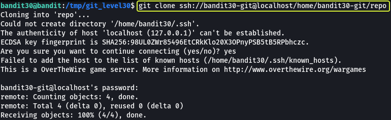
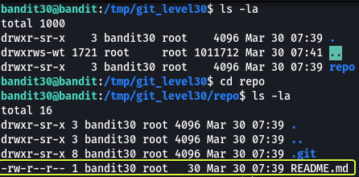

## Level Goal

> There is a git repository at `ssh://bandit30-git@localhost/home/bandit30-git/repo`. The password for the user `bandit30-git` is the same as for the user `bandit30`.  
> Clone the repository and find the password for the next level.

## Commands you may need to solve this level

> git

```
> whatis git  
Git (3pm)        - Perl interface to the Git version control system  
git (1)          - the stupid content tracker
```

## Helpful Reading Material

[Version Control (Git) · the missing semester of your cs education](https://missing.csail.mit.edu/2020/version-control/)

[About Git - GitHub Docs](https://guides.github.com/introduction/git-handbook/)

[Git - Tagging](https://git-scm.com/book/en/v2/Git-Basics-Tagging)

## Solution

From the question, we understand that at this level we are going to be working with Git. Before we clone the repository let's make a folder in the `/tmp` directory as from some of the previous levels we know we only have proper permissions to save files in the `/tmp` folder.

```
bandit30@bandit:~$ cd /tmp/

bandit30@bandit:/tmp$ mkdir git_level30

bandit30@bandit:/tmp$ cd git_level30

bandit30@bandit:/tmp/git_level30$
```

Now that we have created our working directory let's clone the repository.



The password for the repository is the same as bandit30

```
Password: 5b90576bedb2cc04c86a9e924ce42faf
```

Now that we have the repository cloned to our machine. Let us see what files are present in the repository.



We see that there is a file called "README.md" in the folder. Let us have a look at the contents of this file.

**Note:** The `.git` directory found in the repository is created by git that consists of files that are required for the proper functioning of the features that are provided by git.

```
bandit30@bandit:/tmp/git_level30/repo$ cat README.md   
just an epmty file... muahaha
```

Looks like the file is empty and we are not given any clue this time. Let us see if there are branches that are available in this repository.

```
bandit30@bandit:/tmp/git_level30/repo$ git branch -a  
* master  
  remotes/origin/HEAD -> origin/master  
  remotes/origin/master
```

Looking at the branches we again don't find anything useful.

Git has another feature called tags. They are used to mark specific points in the version history of the repository that is important. Let us see if we can find any clues looking at them.

```
bandit30@bandit:/tmp/git_level30/repo$ git tag  
secret
```

We see that we have a tag that is called "secret". Let us view its contents

```
bandit30@bandit:/tmp/git_level30/repo$ git show secret  
47e603bb428404d265f59c42920d81e5
```

And there we go we have found the password for the next level !!!

Logout of the current session and log in as bandit31 to start the next level

```
> ssh bandit31@bandit.labs.overthewire.org -p 2220

This is a OverTheWire game server. More information on http://www.overthewire.org/wargames

bandit31@bandit.labs.overthewire.org's password: 47e603bb428404d265f59c42920d81e5
```