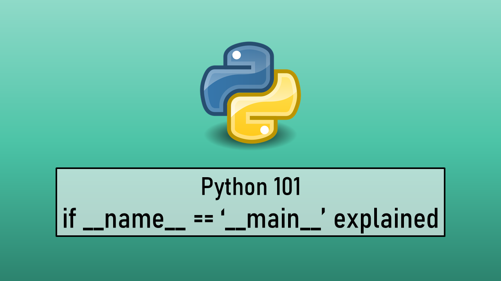

Before we can dive into the question at hand let's look at a few examples to understand what Python does when we run code. When a Python script is executed the **Python interpreter** behind the scenes **sets some global environment variables** and then **executes all the code** that is **present in the file**. This is even true for modules that are imported into the script.

One of the environment variables set by the Python interpreter at the execution of code is **`__name__`**. All the special variables start and end with double underscores and are called **Dunder** or **Magic** variables.

> [!INFO]
> If anyone is wonder why they are called Dunder its because Dunder is short for **D**ouble **Under**scores

## Example 1

When we execute a script the value of the **`__name__`** variable is set to **`__main__`** For imported modules the value of **`__name__`** variable is set to the **name of the module**. Let's see this in action.

```python
# app.py
def function1():
    print("Hello from Function 1")
    print(f"File name : {__name__}")
    
function1()
    
# Output
Hello from Function 1
File name : __main__
```

## Example 2

Let's create a module and import that module into our main program and check the value of `__main__`

```python
# other.py
def function2():
    print("Hello from Function 2")
    print(f"File Name : {__name__}")
    
# app.py
from module import function2

def function1():
    print("Hello from Function 1")
    print(f"File name : {__name__}")
    
function1()
function2()

# Output
Hello from Function 1
File name : __main__

Hello from Function 2
File Name : other
```

As we can see for the imported module the value of the `__name__` variable is set to the name of the module and for the main script it is set to `__main__`. No surprises so far everything seems to be working exactly as we would expect.

## Example 3

Now what happens if we leave a function call or any other global scope statements in the module that will be imported by our main program

```python
# other.py
def function2():
    print("Hello from Function 2")
    print(f"File Name : {__name__}")
    
function2()
print("Even I am reachable")

# app.py
from module import function2

def function1():
    print("Hello from Function 1")
    print(f"File name : {__name__}")
    
function1()

# Output
Hello from Function 2
File Name : other
Even I am reachable
Hello from Function 1
File name : __main__
```

We can see that even though we have not called the imported function (function2) in our main program (app.py) the function still got executed. Even the print() statement from the module was called.

If we recollect the discussion from the start of the article and look at the output closely we understand that this happened because all the content of that imported module was also executed by Python.

Coming back to the main question at hand what is the **`__name__ == '__main__'`** construct found in almost all Python scripts? Simply put it is a **guard statement** and its main purpose is to prevent the above situation from occurring.

## Example 4

Let's see know we can use the guard statement and the knowledge that we have collected so far to fix this issue

```python
# other.py
def function2():
    print("Hello from Function 2")
    print(f"File Name : {__name__}")
    
if __name__ == "__main__":
    function2()
    print("I am not reachable")
    
# app.py
from module import function2

def function1():
    print("Hello from Function 1")
    print(f"File name : {__name__}")
    
if __name__ == '__main__':
    function1()

# Output
Hello from Function 1
File name : __main__
```

As we can see all the code that is behind the guard statement in our imported module is not executed this is because the value of `__name__` is not equal to `__main__` for the imported module. While in the main script, the value of `__name__` is `__main__` and function1() is called.

In this way, Python gives us the flexibility to run code as standalone scripts or as a module while giving us the ability to prevent certain parts of the code from getting executed. We can also add an else statement to the guard statement to perform some other operation when a module is imported.

> [!NOTE]
> It is best practice to include the guard statement in our code even if we are not going to use it as an module. So always include a guard code your code especially now that we understand how it works.

## References

- [__main__ — Top-level code environment — Python 3.11.1 documentation](https://docs.python.org/3/library/__main__.html)
- [python - What does if __name__ == "__main__": do? - Stack Overflow](https://stackoverflow.com/questions/419163/what-does-if-name-main-do)
- [You should put this in all your Python scripts \| if __name__ == '__main__': ... - YouTube](https://www.youtube.com/watch?v=g_wlZ9IhbTs)