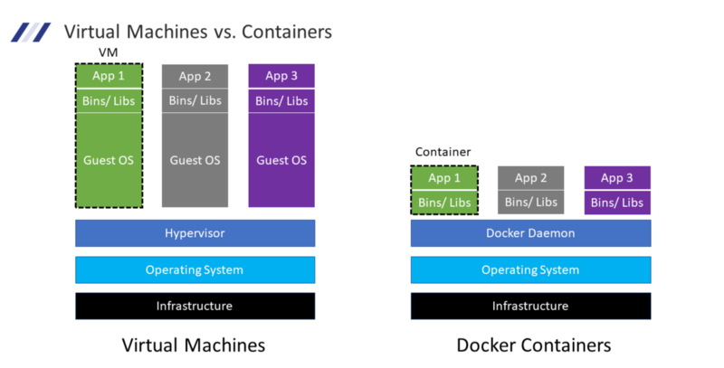
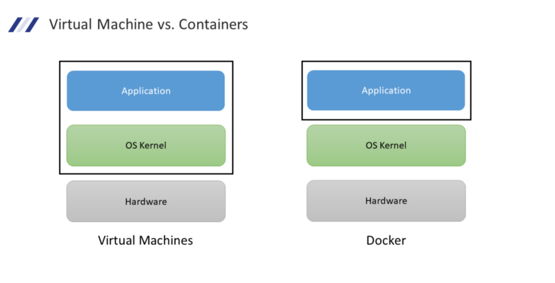

In this post, we will be looking at some basic concepts that are important in understanding Docker and have a discussion along the way on how Virtual Machines differ from Containers.

## What does it mean to Containerize software and What is a Container?

*   The process of packaging software along with all of its components is called **containerization**. Components can be anything ranging from external libraries, frameworks, drivers and other dependencies that are essential for the functioning of the software.
*   **Containers** are lightweight, standalone, executable packages of software that contain **everything** needed to run an application. Since a container consists of everything necessary to run the software they are **platform agnostic** and can be run on any system.
*   The above properties of containers also make them **secure**** as they don't have to rely on any software that is outside the container.

## Virtual Machines vs. Containers

Let us look at what a deployment looks like when making use of Virtual Machines (VMs) and Containers. Let us take a use case where three applications need to be deployed in an **isolated** manner.

Firstly we have **Infrastructure** which could be anything from the developer's laptop/desktop to hardware provisioned in the cloud. Above this, we have the **Operating System (OS)** which consists of the Kernel along with Libraries and Packages that implement the basic functionality that is exposed by the kernel. This OS is also referred to as the Host OS. Above this is the **hypervisor** which is a piece of software that handles the communication between the Virtual Machines deployed on the system and the underlying Host OS. It is also responsible for **emulating the Hardware** that is required for the Virtual Machines. Above this, we have the running VMs. The Virtual Machine consists of its **own OS** also called Guest OS on which we install the libraries and binaries required to run our application and then we finally can deploy our software.

Just by looking at the image above one thing should come clear to us Virtual Machine based deployments are very **bulky**. Even to deploy a simple Hello World app we will need to provision a VM which can be a couple of GBs in size. Now just imagine scaling this to **multiple applications**.

Now let us look at containers the first two layers are the same as VMs. The next layer is the Docker **Runtime** which is software that sits between containers and the Host OS and is responsible for providing the resources necessary for running containers and managing their lifecycle. The container runtime is what makes running containers on **any platform** possible. Above this, we have our running containers which consist of the dependencies of our application along with the application itself.

**Note**: Docker is not the only Container Runtime out there but it is the most popular and widely used one. What is true for the Docker Runtime also more or less applies to other Runtimes as well.

Now looking at the above representation it might look like containers do not contain an OS but this is not **entirely true**. Let us look at another diagram to understand this point further.

As eluded to before an operating system consists of two main parts **the Kernel** and the **low-level **libraries** that expose the features of the kernel to the applications running on the system. A container unlike an Virtual Machine **does not** consist of a **kernel** rather it relies on the Host OSes kernel to utilize the kernel-level features that are required by the container. This is what makes containers so much more **lightweight** when compared to VMs.

**Note**: Alpine Linux is can containerized version of a Linux system that is less than 5 MBs in size this should give you an idea of how small containers can be compared to VMs

Another way to look at this is that VM allows us to **isolate environments** (OS + Software) while Containers move this abstraction one layer higher and allows us to **isolate applications****.

## How to Build a Container?

Building a container in a three-step process. Firstly we need to create a **Dockerfile** which can be taught as a **blueprint**. It contains all the steps that are necessary to build our software. On **building** this file what we get as output is referred to as an **Image**. This image is the blueprint that will generate our container. Now if we **run** an image we get a **container**.

As you might have noticed there is a small difference between Images and Containers. The output of the containerization step is called an Image. This **Image** in its running state is referred to as a **container**.

Once we build an Image we can distribute this image to other people by uploading it to a **Container Registry** which is a site to host and store Images. From here other people can **download** our Images and run them on their system easily without having to install anything (except Container Runtime).

This is one of the key areas where Containers shine unlike VMs we do not have to go through **complex steps** to get our software up and running. As long as the Host OS has a Container Runtime installed we can run containers on that system and the functioning of the software is going to be **the same**** as it was on our system. So no more **"But it worked on my Machine don't know why it is not working on yours"** :)

## Advantages of Containers

*   **Portable**: Containers are platform agnostic and are isolated and hence can be installed on any system
*   **Resource Efficient**: As each container does not bundle its kernel the complete software package footprint is very lean.
*   **Isolation**: Containers contain everything required for this functioning and hence have no external dependencies because of which they can function in an isolated manner.
*   **Speed**: Since containers a so lightweight they allow us to start, create, replicate and delete them in seconds
*   **Secure**: Containerized image is self-sufficient the container does not have to interact with its outside environment. Further container builders are configured out of the box to use the best security practices which further increases the resultant container's security. Also, containers are lightweight and only contain necessary packages for the software this lowers the probability of inclusion of packages that have a vulnerability.
*   **Scalable**: We can create multiple instances using a single image and hence can spin up as many containers as required to match the load.

I how I was able to at least clear to come extent of mystery around containers and docker. I am planning to turn this into a fully featured Docker 101 guide where I will be covering getting started with Docker, Building Images, Docker Networks & Volumes, Docker Compose, etc. so say tuned for more Docker content.

In closing, we looked at what is a **container** and how does it mean to **containerize** an application. We **compared VMs** and **containers** to see how they differ from each other. We covered the steps that are involved in **building** a container and finally saw what are the **advantages** of using containers.

## References

*   [What is a Container? \| Docker](https://www.docker.com/resources/what-container/)
*   [What is containerization?](https://www.redhat.com/en/topics/cloud-native-apps/what-is-containerization)
*   [Docker vs Virtual Machine - simply explained \| Docker Tutorial 6 - YouTube](https://www.youtube.com/watch?v=5GanJdbHlAA)
*   [Virtualization Explained - YouTube](https://www.youtube.com/watch?v=FZR0rG3HKIk)
*   [Virtual Machines vs Docker Containers - Dive Into Docker - YouTube](https://www.youtube.com/watch?v=TvnZTi_gaNc)