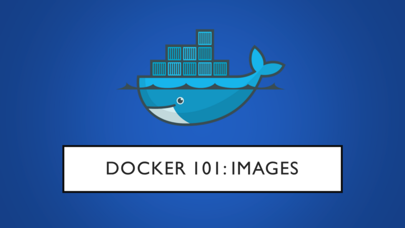
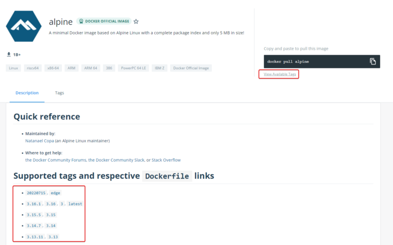
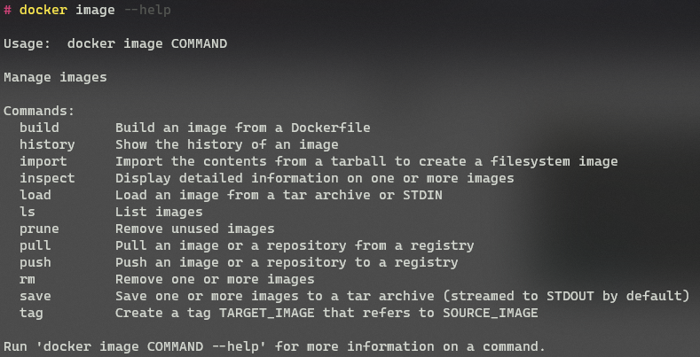

---
categories:
- DevOps
- Docker
date: 2022-07-31 06:35:57 +0530
img_path: /assets/
published: true
tags:
- devops
- docker
- technology
- software-development
title: 'Docker 101: Part 2 - Images'
---



In the previous article, we looked at some of the basic concepts related to containers and how containers differ from VMs. In this article, we will look at Container Registries, Docker Images, and the main commands related to images.

To follow along, Docker Engine needs to be installed on our system this can be achieved by following the instructions given on [Docker Docs](https://docs.docker.com/engine/install/)

## Docker Images

As discussed earlier, an Image is nothing but a package that contains a program along with its dependencies and metadata, which is required for the functioning of the image.

Images don't contain a kernel, even drivers are not included as these underlying components are provided by the Host system on which Docker Engine is installed.

Docker Images are made up of layers, and each layer has a [hash](https://www.sentinelone.com/cybersecurity-101/hashing/) associated with it. The [hash](https://www.sentinelone.com/cybersecurity-101/hashing/) of each layer is used to uniquely identify that layer. Docker uses [Union File System (UFS)](https://stackoverflow.com/questions/32775594/why-does-docker-need-a-union-file-system) to combine multiple layers that make up an image. If multiple images share a layer, then the shared layers only need to be downloaded once.

This is one of the fundamental ideas of containers that makes them so lightweight and robust, this approach allows to save space and reuse parts of images wherever possible. When we run a container, Docker uses its base image and adds a temporary read/ write layer on top of it, once a container has completed its job and is removed by the user, only the temporary layer needs to be deleted. This way the same base image can be used repeatedly whenever required without mutating its state.

Due to this, if we spin up 5 instances of an Image, Docker does not make 5 copies of the base image, rather it uses a single copy of the base image and makes 5 temporary layers (1 for each of the 5 instances).

This layered approach also helps with security, each layer is isolated and cannot see the content in the other layers. Only when UFS merges the layers do the different files that belong to the same directory appear like they are together.

## Container Registry

A container registry is a central place to store and manage container images. Think of it like Google Drive but for images. Along with storage registries generally provide some additional features like vulnerability analysis, image versioning, access control, and CI/CD integrations.

Several organizations provide container registries, some are public while others are private. The most popular registry public registry is [Docker Hub](https://hub.docker.com/search?q=&type=image).


## Downloading Images

Now let us look at how to pull an image to our local system. On Docker Hub, let's find an image to download, I will be using the [Alpine](https://hub.docker.com/_/alpine) image for this example, but the process is the same for all the images. Once Docker is up and running, open a terminal and type the following command.

```
docker image pull alpine
```


This will pull down the latest version of the Alpine image.

Notice the line that says pull complete and has a hash before it, that is the hash of the layer that makes up this image. If we pull down a larger image, we will see multiple such layers being downloaded, which are then merged by UFS to form a single image.


Here we can see that 5 layers make up this Python image. If we try to download two images that share the same layers, we will see that Docker will not re-download the layers that already exist on our system.

We can view all the images that are downloaded and available locally by using the "image ls" command.

```
docker image ls
```


We can see the alpine image with the tag **latest** has been downloaded to our system. This is the default behavior where the latest version of an image is downloaded. Now, what if we don't want to download the latest version of an image how can we specify which version of the image to download? This can be achieved by specifying the **tag** of the image.



On Docker Hub, we can look at the supported tags section of an image to find the available tags alternatively, we can visit the view available tags links below the image pull command to see the same information. The tag is specified after the name of the image to download that version of the image.

```
docker image pull alpine:3.15
```


Now, if we list the images, we will see that two versions of Alpine are now locally available.


## Image Metadata

We can look at the various image-related metadata by looking at the "image history" and "image inspect" commands.

The history command shows us the different layers that make up an image and a snapshot of the commands that were used to make the image (creating images will be covered in a future article).


No need to worry about the missing showing up in the first column only the last layer is considered as an image and hence hash is only shown for it.

The "image inspect" command can be used to view all the metadata about the different layers and configurations that make up the image.


Not everyone will understand all the information that is shown here and that is perfectly fine, what's important is to know that we can view the image-related metadata using the above commands.

## Deleting Images

Once we are using an image, we can remove it from our system to free up space using the "image rm" command. Let's remove one of the two versions of Alpine from our system.

We can remove an image from the system using the "image rm" command.

```
docker image rm <image-name>
```


## Help Command

To view all the commands related to images that are provided by Docker, we can make use of the `--help` flag

```
docker image --help
```



## References

*   [filesystems - Why does Docker need a Union File System - Stack Overflow](https://stackoverflow.com/questions/32775594/why-does-docker-need-a-union-file-system)
*   [UnionFS - Wikipedia](https://en.wikipedia.org/wiki/UnionFS)
*   [Explore Docker's Container Image Repository \| Docker Hub](https://hub.docker.com/search?q=&type=image)
*   [docker image \| Docker Documentation](https://docs.docker.com/engine/reference/commandline/image/)