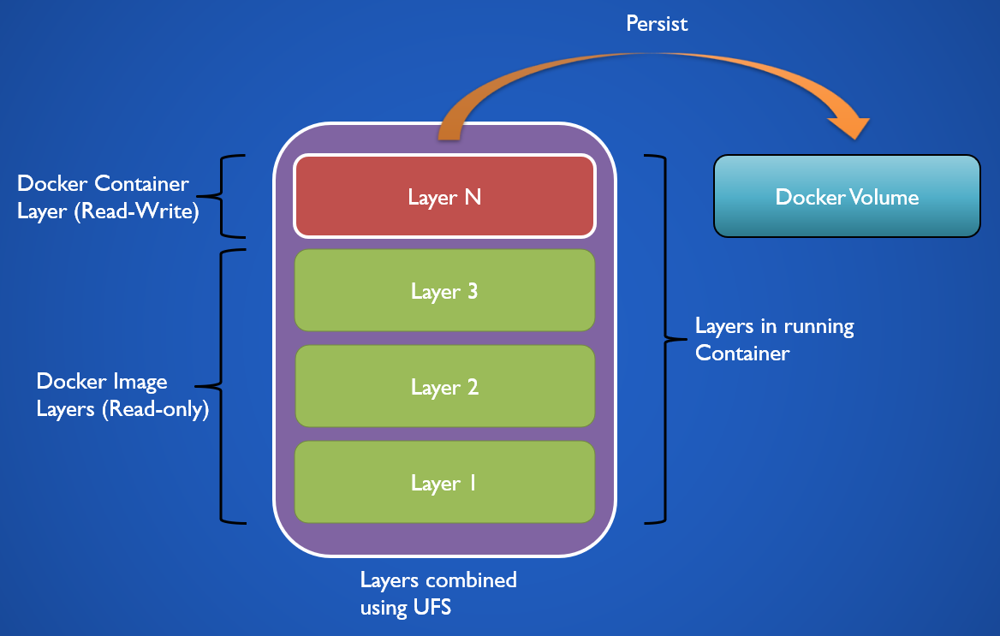
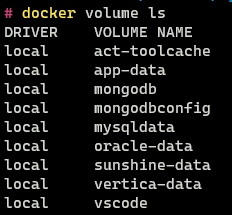
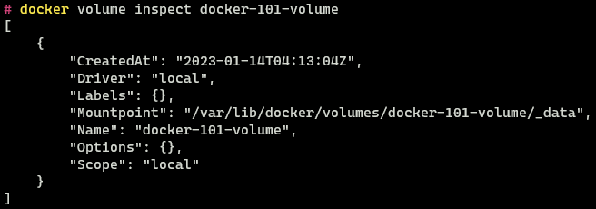
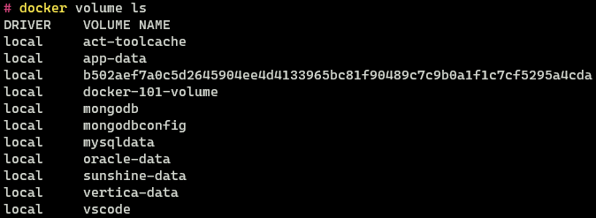
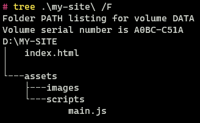
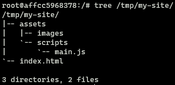

Docker containers are used to run applications and services in an isolated environment. Any data that is generated by the container is only stored while the container is running i.e. data generated by the containers is **ephemeral**. This becomes an issue if we want to persist information even after the container is destroyed. This is where **Blind Mounts** and **Volumes** come into the picture they are mechanisms provided by Docker that allow storage of persistent data even after a container is destroyed.

## Docker Filesystem

A Docker container is created using a Docker image. The image consists of layers which each represent a step specified in the `Dockerfile` used to create the image. The layers present in an image are read-only. When a container is created from an image the layers present in the image are grouped using **Union File System (UFS)**. 

When we create an instance of an image Docker takes the layers in the image and adds a thin (read-write) layer over it. This layer only exists when the container is running. All the data that is generated by the container in its running state is stored in this layer. Docker Volume allows persisting the data that is present in this layer.



## Docker Volumes

### Volumes

In this mode, the data from the container is stored on the host system in a directory that is managed by Docker. We should **never manually modify** the data that is stored in this location. Use this mode when data needs to be persisted. Volumes are not destroyed when the container is removed. 

> [!INFO] Volume Storage Location  
> Linux: `/var/lib/docker/volumes/`  
> Windows: `\\wsl$\docker-desktop-data\version-pack-data\community\docker\volumes`  

When a volume is mounted to a container the directory on the host system that represents that volume is attached to the container. Bind Mounts work in the same manner but in the case of volumes, the location of the volume on the host system is managed by Docker. 

A volume can be mounted simultaneously to multiple containers. Similar to Docker Networks, Volumes support volume drivers which allow containers to write data to remote storage among other possibilities.

Volumes are of two types **named** and **anonymous**. When a user does not provide a name for a volume an anonymous volume is created. It is assigned a random name that will be unique on the host system. Leaving the naming both volumes behave in the same manner.

> [!INFO] For which directories present in the container can we create Volumes ?  
> Directories in the container where defined as volumes in the `Dockerfile` can only be persisted. Docker does not allow to persist data from arbitrary directories in the container.

### Bind Mounts

This mode allows the user to store data anywhere on the host system. The bind mount locations are **not managed by Docker** and they can be accessed and used by other processes.

When blind mount is used the user-specified directory on the host system is attached to the user-specified directory in the container. Using bind mounts we can use files that are present on the host system in the container. We cannot manage Bind Mounts using the Docker CLI.

VS Code has a feature called **Dev Containers** that allows to setup containers easily for development. It makes use of bind mounts automatically to make all the files that are present in the current working directory (on the host) available inside container [3]

> [!INFO] Which directories in container can be used as Bind Mounts ?  
> Unlike Volumes we can bind any location inside the container to any location on the host. While bind mounts are flexible they can be used in a malicious manner.  
> A user can bind a location in the container to an system directory on the host and modify the files which could lead to corruption of data.

### tmpfs Mounts

Data written to this mount is not persisted on the host or in the container. It can be used by the container to write state information and other sensitive information. The data written to this mount is stored in the Memory (RAM) of the host system for as long as the container is running.

## Docker Volume Commands

### List Volumes

To view the volumes that are present on Docker we use the following command

```bash
docker volume ls
```

> [!NOTE]
> Docker does not provide any functionality to interface with Bind Mounts. All the Docker volumes listed here are volumes that are managed by Docker.



Other volume drivers are present which allow us to store files remotely, they can also provide features that are not provided by Docker Volumes.

### Create Volume

To create a volume we can use the `volume create` command. When using local storage we generally don't use this command as Docker will automatically create a volume if it does not exist. This command is mainly used when we need to use a specific volume driver which can be done using the `-d` flag or we want to create a custom configuration for the volume.

```bash
docker volume create <volume-name>
docker volume create docker-101-volume
```

### View Volume Configuration

We can view the configuration and options that are applied to a volume using the `volume inspect` command.

```bash
docker volume inspect docker-101-volume
```



### Delete Volume

To remove volumes that we don't need anymore we can use the `volume rm` command.

```bash
docker volume rm docker-101-volume
```

### Using Volume with Containers 

To save the data that is created by a container in a volume we can use the `-v` or `--mount` flag in the `container run` command. 

Both the above flags will achieve the same result but the way we specify the volume options is different. The `--mount` flag is a newer command and was added to allow users to specify the parameters of the volume in a more verbose and easy-to-understand manner.

```bash
docker container run --name mysql \
	-e MYSQL_ROOT_PASSWORD=my-secret-pw -d mysql
```

For this example, I am using the `mysql` Docker Image. 


After starting the container let's look at the volumes present in Docker



We see that a new Volume with a random string has been created. This is an anonymous volume. The MySQL image exposes a volume mount and since we did not specify a volume to use to store the content of this mount Docker created it for us automatically.

If we inspect the configuration of the running container there will be a section called Mounts using which we can verify that the MySQL container is using the volume that was just created.

```bash
docker container inspect mysql
```


> [!INFO] How to know if container exposes Volume Mounts ?  
> We can check the containers page on the container registry hosting the image where most of the times all the mounts that are exposed by the image will be listed.  
> If they are not listed then we can inspect the configuration of the image we download it, we can even look at the `Dockerfile` that was used to create the container to get the same information.

Now let us create a new instance of MySQL and this time create a named volume. In the output of `container inspect` we can see the container exposes the `/var/lib/mysql` directory.


When creating the container used the `-v` flag. The flag uses the following syntax `<volume-name>:<container-volume-mount>:ro`. The name of the volume to be used is specified first followed by the location in the container we want to store in this volume. Optionally the `ro` flag can be passed if we want the volume to be read-only. Containers that create new data won't be able to write to such volumes. If a volume with the specified name is not found Docker will automatically create it.


After removing the container as we can see the volume is still present. As we can see the lifecycle of the volume is not tied to the lifecycle of the container.


> [!NOTE]
> Anonymous Volumes behave exactly the same way as named volumes. We cannot see the previously created named volume as I have already deleted it.

The same volume can be created using the newer `--mount` flag as follows

```bash
docker container run --name mysql \
	-e MYSQL_ROOT_PASSWORD=my-secret-pw \
	--mount type=volume,source=docker-101-mysql,target=/var/lib/mysql -d mysql
```


All the options that can be used with `--mount` can be found in link [3]. Some volume drivers require the users to pass additional parameters this cannot be done using the `-v` flag.

### Using Bind Mount with Containers

Bind Mounts are mainly used by Developers when there are developing some code and want to test it using a service available as a container. Bind Mounts unlike volumes can be created for any directory inside the container.

The below image denotes a website `my-site` that we have been developing on the system. Now we want to test it using Nginx which we have available as a container.



For that, we mount the `my-site` directory into the Nginx container using the following command

```bash
docker container run --name nginx -it --rm \
	-v $(pwd):/tmp/my-site nginx bash
```


> [!NOTE] Mounting Host System Directory  
> The recommended approach to mount a source directory is using the `pwd` shell command which expands to the absolute path of the current directory. Manually providing the absolute path is also supported but Relative paths are not supported.  
>   
> The syntax for specifying the path will be a little different on Linux and Windows refer the documentation for more details on how to specify paths [3]

On listing the files in the container we can see that the files that are present on the host system are indeed present in the container. If we modify the files in the container the same changes will also reflect on the host system.



The same can be achieved using the `--mount` flag as follows

```bash
docker container run --name nginx -it --rm \
	--mount type=bind,source=$(pwd),target=/tmp/my-site \
	nginx bash
```

> [!INFO] What happens if the same files are present on the host and container ?
> Files on the host system has higher priority the same files in the container will be hidden. The conflicting files in the container is not deleted they are just obscured away. They will be available again once the bind mount is removed.

### Copying files into Volume

We might want to copy files into a volume from our host system or copy files from the volume onto the host system in a location where we can access and modify the files. We can use the `container cp` command to copy files.

To copy files to and from a volume the volume first needs to be attached to a container. The container used need not be the container that created the volume.

For this example, I will use the MySQL container that we had used before. 

```bash
docker container run --name mysql \
	-e MYSQL_ROOT_PASSWORD=my-secret-pw \
	-v docker-101-mysql:/var/lib/mysql -d mysql
```

Let us assume we want to copy all the data that is present in the `docker-101-mysql` volume onto our host system. To do some we need to use the following command

```bash
docker cp mysql:/var/lib/mysql .\mysql-data\
```

The copy command has the following structure `docker cp <source> <target>`. The source is the location from where the data needs to be copied. The data in the volume is always referenced using the container name (e.g. `mysql:/var/lib/mysql`)


As we can see the files in the volume have been copied over into the host system

## References

1. [Manage data in Docker \| Docker Documentation](https://docs.docker.com/storage/)
2. [Guide to Docker Volumes \| Baeldung](https://www.baeldung.com/ops/docker-volumes)
3. [Developing inside a Container using Visual Studio Code Remote Development](https://code.visualstudio.com/docs/devcontainers/containers)
4. [Volumes \| Docker Documentation](https://docs.docker.com/storage/volumes/)