Cover Image Background by <a href="https://www.freepik.com/free-vector/modern-business-background-with-geometric-shapes_5287944.htm#page=3&query=powerpoint%20background&position=15&from_view=search&track=ais" target="_blank" rel="noopener noreferrer">BiZkettE1</a> on Freepik

[TryHackMe \| Agent Sudo](https://tryhackme.com/room/agentsudoctf)

## Task 1: Author note

Welcome to another THM-exclusive CTF room. Your task is simple, capture the flags just like the other CTF room. Have Fun!  
  
If you are stuck inside the black hole, post on the forum or ask in the TryHackMe discord.

### Questions

**Deploy the machine**

> No answer required

## Task 2: Enumerate

Enumerate the machine and get all the important information.

```bash
sudo nmap -sS -A -T4 -oN nmap.txt 10.10.9.96
```

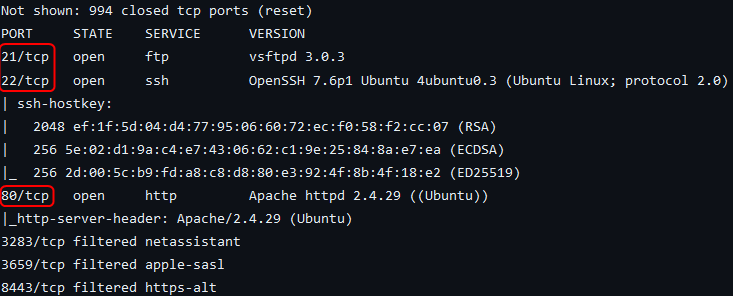

[Nmap Scan Results - GitHub](https://github.com/dvdmtw98/ctf-resources/blob/main/tryhackme/agent_sudo/nmap.txt)

The scan found 3 services running on the target. 

Port **21** is used by FTP which is using `vsftpd 3.0.3`.

Port **22** has SSH running. The target is using `OpenSSH 7.6p1`. Additionally, the target is using Ubuntu as its OS.

Port **80** is used by the Apache webserver. The target is using `Apache 2.4.29`.

> [!NOTE]
> Rustscan can also perform service enumeration. But on this machine with Rustscan I was having trouble detecting all the 3 services.


The web application instructs us to change the user-agent of the browser to our codename. At this point, I was a little confused. But since I could see that one of the agent codenames is R I set the user agent to **R**.

On Firefox the user agent can be changed using the following add-on.

[User-Agent Switcher – Get this Extension for 🦊 Firefox (en-US)](https://addons.mozilla.org/en-US/firefox/addon/uaswitcher/)

From the preferences menu, I created a new custom user-agent and set its value to R and refreshed the page.

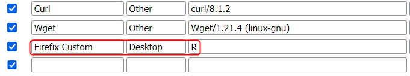


The output changed to show a warning. It also revealed that there are 26 agents (including Agent R). Then it struck me that the agent codenames are the 26 letters of the English alphabet.

I changed the user agent to **A** and refreshed the page. This did not change the content shown which implied that this website was not meant to be accessed by agent A. 

This process has to be repeated until the agent who is meant to access the page is found. The testing can be automated by using Burp Suite along with a wordlist (containing the 26 alphabets).

On changing the user-agent to **C** and refreshing the site I was redirected to a new page.

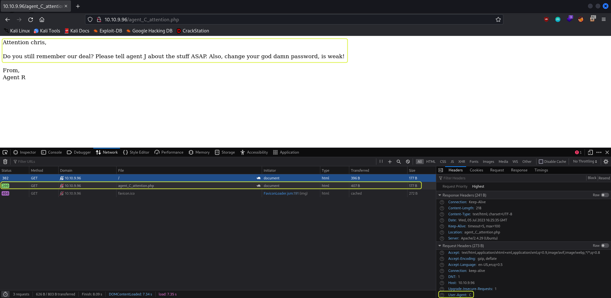

Agent C is called **Chris**. And he needs to relay some information to Agent J. We also learn that the password used by Agent C is **weak**.

### Questions

**How many open ports?**

> 3

**How do you redirect yourself to a secret page?**

> user-agent

**What is the agent's name?**

> Chris

## Task 3: Hash cracking and brute-force

Done enumerate the machine? Time to brute your way out.

Since Agent C (Chris) has a weak password a dictionary brute-force attack could give up the credentials for the FTP service.

```bash
hydra -l chris -P /usr/share/wordlists/rockyou.txt 10.10.9.96 ftp -I
```

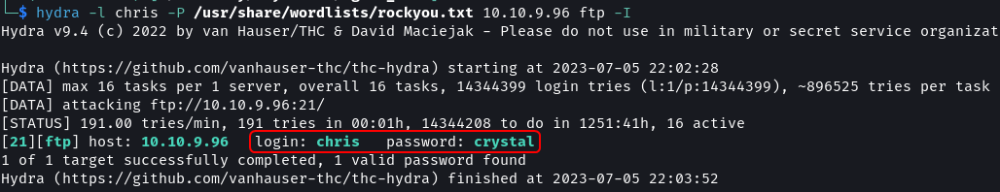

The password for **Chris** to log in via FTP is `crystal`.

```bash
ftp 10.10.9.96
```


There are three files located in the directory that can be accessed by Chris. Download all the files from the FTP server.

```bash
mget *
```


The `To_agentJ.txt` file contains instructions left by Agent C for Agent J to find their password. Agent J is instructed that the alien images are fake and that they contain hidden information.

```bash
binwalk cute-alien.jpg

binwalk cutie.png
```


The `cutie.png` file contains two compressed files embedded in it. The first archive in the image is compressed using `Zlib`. The second archive is a `.zip` file that is encrypted (password protected). Additionally, we can see that the `.zip` file contains a `To_agentR.txt` file. Since we need the `.txt` file we need to extract the second archive from the image.

`dd` utility allows to carve out bytes of data from a file and save it as a new file. To crave out the Zip archive from the image the byte at which it starts and ends is needed. `binwalk` detected that the archive starts at byte 34562 and ends at byte 34820. The Zip archive also has a footer which is detected to be 22 bytes long. This means the total size of the archive is (34820 - 34562) + 22 = 280 bytes.

```bash
dcfldd if=cutie.png of=secret.zip bs=1 skip=34562 count=280 status=on
```

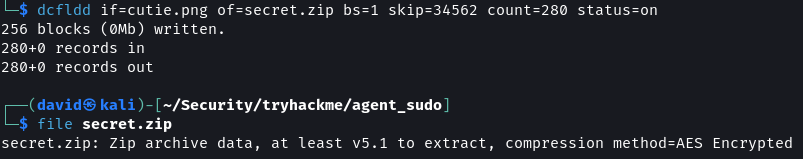

> [!NOTE]
> `dcfldd` is the U.S. Department of Defense Computer Forensics Lab version of the `dd` utility. `dcfldd` in addition to all the features present in `dd` has an option to show a progress bar which is quite handy for craving out data from large files.  
>   
> `binwalk` also has the `-e` option which will automatically extract all the embedded files that are detected in the input file.

For cracking the password of the archive the hash of the file has to be written into a file. Using `john` a dictionary brute-force attack can be performed.

```bash
zip2john secrets.zip > hash.txt

john --wordlist=/usr/share/wordists/rockyou.txt hash.txt
```

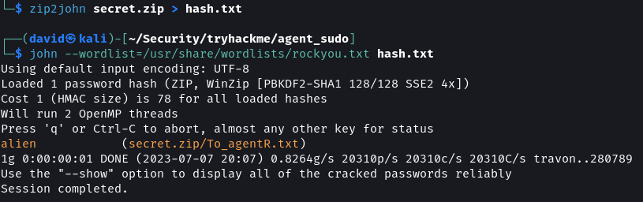

The password for the archive is `alien`. Decompress the archive to view its contents.

```bash
7z x secrets.zip
```


> [!NOTE]
> The archive cannot be decompressed using `unzip` as it is created using a newer version of Zip that is not supported by the `unzip` utility.

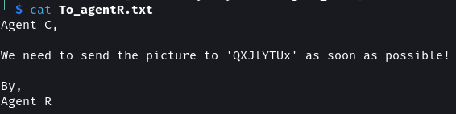

The `To_agentR.txt` file contains instructions for Agent C from Agent R. It instructs Agent C to send an image to some location. The location in the message appears to be encoded using a cipher.


The magic function in CyberChef detects the text is encoded using Base64 encoding. Agent R wants Agent C to send the images to `Area51`.

[CyberChef](https://gchq.github.io/CyberChef/)

Since a previous instruction told Agent C that all of the alien images contain hidden data and since only the `cutie.png` image was used so far the `cute-alien.jpg` image should also contain some hidden instructions.

On using `steghide` on the image a prompt for a password is shown confirming that it has hidden data.

```bash
steghide extract -sf cute-alien.jpg
```


On using `Area51` as its password the hidden content is extracted.

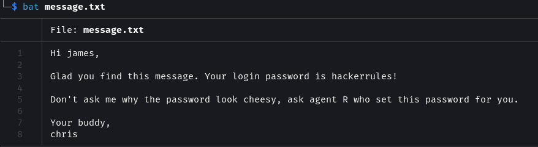

This is a message from Agent C (Chris) to Agent J (**James**). The password for James is `hackerrules!`.

```bash
ssh james@10.10.226.220
```

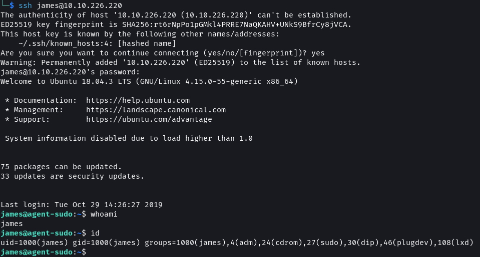

### Questions

**FTP password**

> crystal

**Zip file password**

> alien

**Steg password**

> Area51

**Who is the other agent (in full name)?**

> James

**SSH password**

> hackerrules!


## Task 4: Capture the user flag

You know the drill.

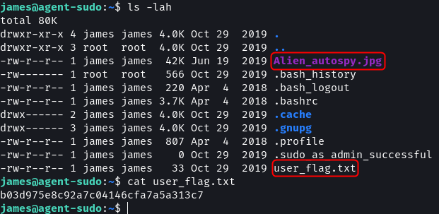

The home directory contains a `user_flag.txt` file with the user flag. Next, the incident in the `Alien_autospy.jpg` file needs to be identified. The image can be downloaded onto our system using SCP.

```bash
# Download file using SCP
scp james@10.10.226.220:~/Alien_autospy.jpg .
```

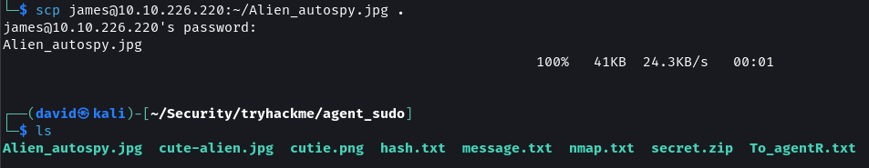

On uploading the image to Google Image search we get multiple news articles. The article from Fox News calls it the `Roswell alien autopsy` incident.


[Google Image Search - Results](https://lens.google.com/search?ep=gisbubb&hl=en-IN&re=df&p=Acn1BYfMgYwY3Zo62IwClV3ixGV81ToL3V3L9rgrtcR-KBflxZZVHz7VbTaNWswxsbvXtWEEroeWb6kGm4DzdUe3ndph_CdY2wIRwAb1fYycGOc0Z_apZAI3JjI_FcW3jOl234jTQPzh7nLOBZYkj8RVA9pQcIWFV6JPmY9Mjqq1rxXWzhvIYBnDmcpk9p4QuIujr686qtGJIcXEK2X0yZUS&no_sw_cr=1&zx=1688895125214#lns=W251bGwsbnVsbCxudWxsLG51bGwsbnVsbCxudWxsLDEsIkVrY0tKREUwTkRNNE4yTm1MVGRrT1RndE5ERXlNUzA0TW1SbExUQm1Nek0zTVdVMk5UVmpNaElmVlRWTGRVRnFkemxqTmxWbVdVeHVaVFo2U1ROWFNFMHhkUzFwWm10NFp3PT0iLG51bGwsbnVsbCxudWxsLDEsbnVsbCxbW10sbnVsbCxudWxsLG51bGwsOF0sW251bGwsMTIsW11dXQ==)

### Questions

**What is the user flag?**

> b03d975e8c92a7c04146cfa7a5a313c7

**What is the incident of the photo called?**

> Roswell alien autopsy

## Task 5: Privilege escalation

Enough with the extraordinary stuff? Time to get real.

I checked if any unusual binaries have the SUID bit set but found none. Next, I listed all the processes that are running as root on the system and the running processes also looked to be in order.

```bash
# Binaries with SUID set
find / -type f -user root -perm -4000 -exec ls -lah {} + 2> /dev/null

# Processes running as root
ps aux | grep root

# Sudo permissions
sudo -l
```


The `sudoers` file shows that Agent J can run the `/bin/bash` command as any user leaving the root user. This is a strange and uncommon access configuration.

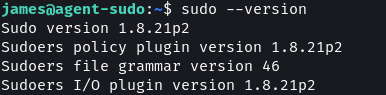

The system is using version `1.8.21p2` of the sudo utility.

A quick Google search reveals that this version of the binary has a vulnerability that can be used to gain root access.


[sudo 1.8.27 - Security Bypass - Linux local Exploit](https://www.exploit-db.com/exploits/47502)

```bash
sudo -u#-1 /bin/bash
```


### Questions

**CVE number for the escalation (Format: CVE-xxxx-xxxx)**

> CVE-2019-14287

**What is the root flag?**

> b53a02f55b57d4439e3341834d70c062

**(Bonus) Who is Agent R?**

> DesKel

That's all. Happy Hacking :)