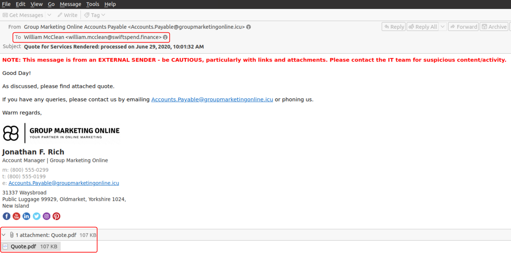
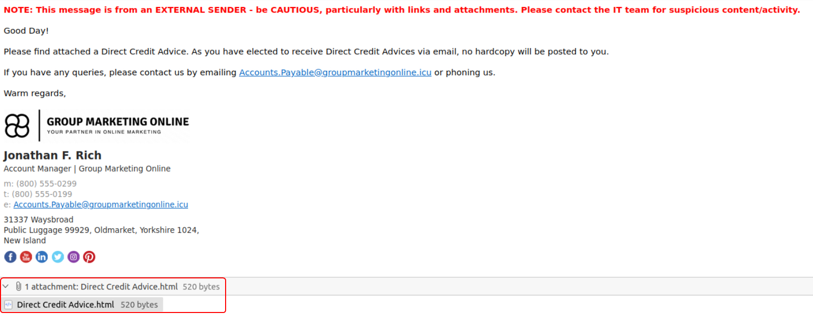
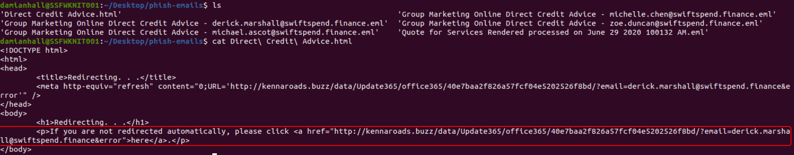
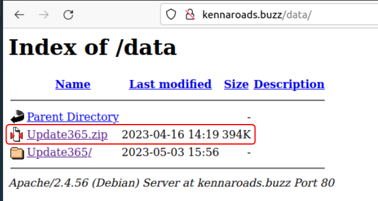
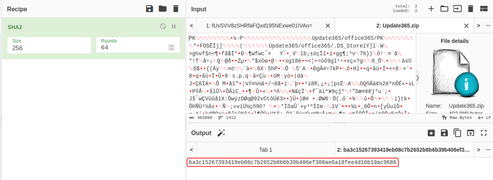
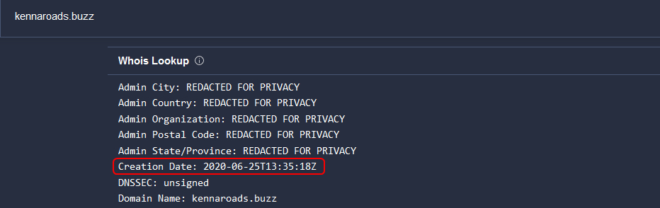

Cover Image Background by <a href="https://www.freepik.com/free-vector/modern-business-background-with-geometric-shapes_5287944.htm#page=3&query=powerpoint%20background&position=15&from_view=search&track=ais" target="_blank" rel="noopener noreferrer">BiZkettE1</a> on Freepik

[TryHackMe \| Snapped Phish-ing Line](https://tryhackme.com/room/snappedphishingline)

## Task 1: Challenge Scenario

### Premise Setup

#### Disclaimer

Based on real-world occurrences and past analysis, this scenario presents a narrative with invented names, characters, and events.

**Please note:** The phishing kit used in this scenario was retrieved from a real-world phishing campaign. Hence, it is advised that interaction with the phishing artifacts be done only inside the attached VM, as it is an isolated environment.

#### An Ordinary Midsummer Day...

As an IT department personnel of SwiftSpend Financial, one of your responsibilities is to support your fellow employees with their technical concerns. While everything seemed ordinary and mundane, this gradually changed when several employees from various departments started reporting an unusual email they had received. Unfortunately, some had already submitted their credentials and could no longer log in.

You now proceeded to investigate what is going on by:

1. Analyzing the email samples provided by your colleagues.
2. Analyzing the phishing URL(s) by browsing it using Firefox.
3. Retrieving the phishing kit used by the adversary.
4. Using CTI-related tooling to gather more information about the adversary.
5. Analyzing the phishing kit to gather more information about the adversary.

#### Connecting to the Machine

Start the virtual machine in split-screen view by clicking the green **Start Machine** button on the upper right section of this task. If the VM is not visible, use the blue **Show Split View** button at the top-right of the page. Alternatively, using the credentials below, you can connect to the VM via RDP.

**Note:** The phishing emails to be analyzed are under the _**phish-emails**_ directory on the Desktop. Usage of a web browser, text editor and some knowledge of the **grep** command will help.

### Room Walkthrough

The email samples are in the `.eml` format which can be opened using Thunderbird. 

The email titled **Quote for Services Rendered processed on June 29 2020 100132 AM** was sent to **William McClean** and contains an **PDF** attachment. The mail was sent from the email id **Accounts.Payable@groupmarketingonline.icu**

**Who is the individual who received an email attachment containing a PDF?**

> William McClean

**What email address was used by the adversary to send the phishing emails?**

> Accounts.Payable@groupmarketingonline.icu

The emails that were sent to the other employees are all identical. All of them also contain an HTML file as an attachment.

The HTML contains a link that points to `kennaroads.buzz`. When the HTML file is opened with a web browser it leads to a page that looks like the Microsoft Login page.

> [!INFO] Converting URL to Defanged Format  
> All the periods (.) that are present in the URL along with the `://` symbol that is present after the protocol should be enclosed in square brackets. Then all the t's that are present in the protocol name (HTTP/HTTPS) has to be replaced with the letter `x`.
> 
> [Defang all the things! - SANS Internet Storm Center](https://isc.sans.edu/diary/Defang+all+the+things/22744)

**What is the redirection URL to the phishing page for the individual Zoe Duncan? (defanged format)**

> hxxp[://]kennaroads[.]buzz/data/Update365/office365/40e7baa2f826a57fcf04e5202526f8bd/?email=zoe[.]duncan@swiftspend[.]finance&error

On enumerating the URL the link to the malicious code can be found.

**What is the URL to the .zip archive of the phishing kit? (defanged format)**

> hxxp[://]kennaroads[.]buzz/data/Update365[.]zip

To find the hash of the file use CyberChef which is pre-installed on the VM (present in the "tools" folder). Load the file into the input field and use the SHA2 function with a hash size set to 256.

**What is the SHA256 hash of the phishing kit archive?**

> ba3c15267393419eb08c7b2652b8b6b39b406ef300ae8a18fee4d16b19ac9686

To find the time at which the phishing kit and domain were first flagged as malicious use VirusTotal. The site has to be opened on our local machine as the VM does not have internet access.

[VirusTotal - Home](https://www.virustotal.com/gui/home/upload)

**When was the phishing kit archive first submitted? (format: YYYY-MM-DD HH:MM:SS UTC)**

> 2020-04-08 21:55:50 UTC

**When was the phishing domain that was used to host the phishing kit archive first registered? (format: YYYY-MM-DD)**

> 2020-06-25

On further enumerating the domain used by the adversary a `log.txt` file can be found that contains the details collected from the users who fell for the phishing attack.

**What was the email address of the user who submitted their password twice?**

> michael.ascot@swiftspend.finance

To find the email ids used by the adversary the malicious package has to be downloaded. 

By going through each file in the package the emails that are used can be found. Alternatively, using `grep` and a simple regex condition all patterns in the code that look like an email id can be listed.

**What was the email address used by the adversary to collect compromised credentials?**

> m3npat@yandex.com

**The adversary used other email addresses in the obtained phishing kit. What is the email address that ends in "@gmail.com"?**

> jamestanner2299@gmail.com

Finding the flag in this room is a little tricky. But if we follow the hint word for word it can be found. 

The hint mentions that the file with the flag is called flag and has the extension `.txt`. On enumerating all the directories on the domain for a file called `flag.txt` the flag will eventually get displayed.

The flag is in an encoded format. On using the Magic function in CyberChef the encoding is identified as Base64. The output appears to be in reverse. So to get the decoded flag the Magic function should be replaced with the Base64 function followed by the Reverse function.

**What is the hidden flag?**

> THM{pL4y_w1Th_tH3_URL}