Cover Image by [BiZkettE1](https://www.freepik.com/free-vector/modern-business-background-with-geometric-shapes_5287944.htm) on Freepik

[TryHackMe \| Advent of Cyber 2023](https://tryhackme.com/room/adventofcyber2023)

It is strongly recommended to go through the reading material that accompanies each task before going through this guide. This article will only include the content necessary to answer the questions.

## \[Day 17\] I Tawt I Taw A C2 Tat!

### Learning Objectives

- Gain knowledge of the network traffic data format
- Understand the differences between full packet captures and network flows
- Learn how to process network flow data
- Discover the SiLK tool suite
- Gain hands-on experience in network flow analysis with SiLK

### Walkthrough

Today's challenge focuses on NetFlow Packet Analysis. Before analyzing the packet capture we need to learn how to use SiLK.


We can look at metadata related to SiLK and the NetFlow packet that we want to analyze using the following commands:

```bash
silk_config -v
```

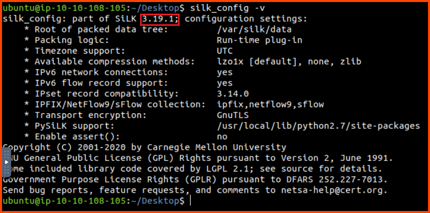

```bash
rwfileinfo suspicious-flows.silk
```


Now we can take a look at `rwcut` which is an SiLK utility that allows to extract fields from the raw NetFlow packet capture.

```bash
# List the first 5 records
rwcut suspicious-flows.silk --num-recs=5
```


```bash
: '
List protocol, source IP, source port, destination IP, destination Port 
for the first 5 records
'
rwcut suspicious-flows.silk --fields pro,sIP,sPort,dIP,dPort --num-recs=5
```


Next, we can take a look at `rwfilter` which is the utility that allows us to filter out packets based on a condition.

```bash
: '
List protocol, source IP, source port, destination IP, destination Port
for the first 5 records where protocol is 17 (UDP)
'
rwfilter suspicious-flows.silk --proto=17 --pass=stdout | rwcut --fields=pro,sIP,sPort,dIP,dPort --num-recs=5 
```

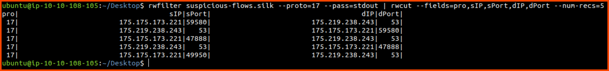

Finally, let us look at `rwstatus`. This utility provides us with stats about the traffic that is captured in the NetFlow file.

```bash
: '
List the destination IP, Record count, Packet count and Total data transmitted in bytes for Top 10 most active unique source IP, destination IP pair
'
rwstats suspicious-flows.silk --fields=dPort --values=records,packets,bytes,sIP-Distinct,dIP-Distinct --count=10
```

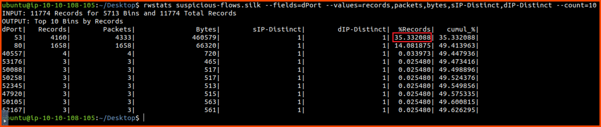

Using the above command we can look at the amount of traffic that has been transmitted between the top 10 most chatty client and server pair. We can see that the majority of the packets have been transmitted on port 53 (DNS) and port 80 (HTTP).

**Note**: `--num-recs=5` returns the first 5 records from the file. `--count=10` return the top 10 records that match the provided condition.

Now that we know how to use the packet inspection utilities that are provided by SiLK let's analyze the packet capture and look for anomalies patterns.

```bash
: '
List the source IP and amount of data trasmitted in bytes 
for the top 10 chatty source IPs
'
rwstats suspicious-flows.silk --fields=sIP --values=bytes --count=10 --top
```

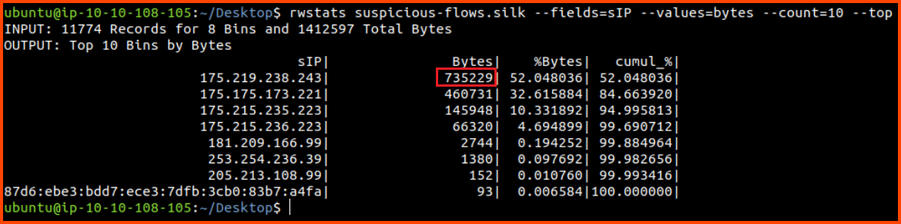

From the above result, we can see that `175.219.238.243`, `175.175.173.221` and `175.215.235.223` are the most active clients.

```bash
: '
List the source IP, destination IP, record count, packet count and bytes transmitted for the top 10 most active source IP, destination IP pair
'
rwstats suspicious-flows.silk --fields=sIP,dIP --values=records,bytes,packets --count=10
```

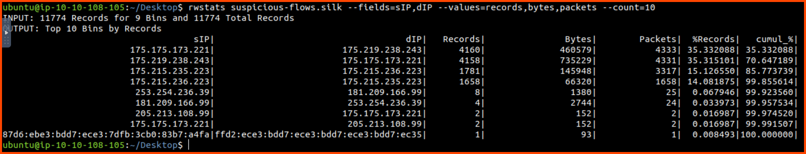

We can see that the to and from communication between `175.175.173.221` and `175.219.238.243` makes up more than 70% of the traffic.

```bash
: '
List the source IP, destination IP, record count, packet count and data transmitted in bytes for the top 10 packets where the source port or destination port is 53
'
rwfilter suspicious-flows.silk --aport=53 --pass=stdout | rwstats --fields=sIP,dIP --values=records,bytes,packets --count=10
```


We can see that almost 100% of the DNS traffic on the network is occurring between these two hosts. This is not normal traffic unless both the hosts are DNS servers.

```bash
: '
List the source IP, destination IP and start time of the flow for the first 10 records in the file where source IP is 175.175.173.221
'
rwfilter suspicious-flows.silk --saddress=175.175.173.221 --dport=53 --pass=stdout | rwcut --fields=sIP,dIP,stime | head -10

: '
List the source IP, destination IP and start time of the flow for the first 10 records in the file where source IP is 175.175.173.221
'
rwfilter suspicious-flows.silk --saddress=175.219.238.243 --dport=53 --pass=stdout | rwcut --fields=sIP,dIP,stime | head -10
```


From the above results, we can observe that all the DNS traffic is flowing in a single direction. The time delay between the DNS requests is quite suspicious. One potential explanation for the traffic is the existence of a C2 server. `175.175.173.221` could be an infected host that is talking to a C2 server (`175.175.173.221`) using DNS.

Next, we can check to see if any other hosts are talking to this C2 server.

```bash
: '
List the source IP, destination IP for the top 10 most active flows that have the source IP or destination IP as 175.175.173.221
'
rwfilter suspicious-flows.silk --any-address=175.175.173.221 --pass=stdout | rwstats --fields=sIP,dIP  --count=10
```

From the results, we can see that `205.213.108.99` has also communicated with the client that could be a C2 server.

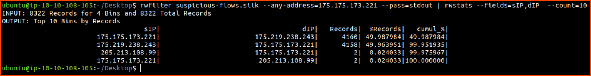

```bash
: '
List the source IP, source port, destination IP, destination port and protocol for the top 10 most active flows that have the source IP or destination IP as 175.175.173.221
'
rwfilter suspicious-flows.silk --any-address=205.213.108.99 --pass=stdout | rwstats --fields=sIP,sPort,dIP,dPort,proto  --count=10
```


`205.213.108.99` has sent 4 packets to the C2 server. Since there aren't many packets we don't have to investigate this IP further.

During the initial analysis, we also observed that a lot of packets were being transmitted on port 80. Let's explore this lead to see if there is any anomalous traffic.

```bash
: '
List the source IP and destination IP for the top 10 clients that have the most traffic on port 80 
'
rwfilter suspicious-flows.silk --aport=80 --pass=stdout | rwstats --fields=sIP,dIP --count=10

: '
List the source IP, destination IP and destination port for the top 10 clients that have the most traffic on port 80 
'
rwfilter suspicious-flows.silk --aport=80 --pass=stdout | rwstats --fields=sIP,dIP,dPort --count=10
```


From the results, we can see that there is a lot of traffic on port 80 between `175.215.235.223` and `175.215.236.223`. If we break down the results to include the destination port we observe that 48% of the traffic from `x.x.235.223` to `x.x.236.223` is on port 80.

```bash
: '
List the source IP, destination IP, destination port, TCP flags and flow start time for the packets with source IP as 175.215.236.223
'
rwfilter suspicious-flows.silk --saddress=175.215.236.223 --pass=stdout | rwcut --fields=sIP,dIP,dPort,flag,stime | head

: '
List the source IP, TCP flags and destination IP for all packets with source IP as 175.215.236.223
'
rwfilter suspicious-flows.silk --saddress=175.215.236.223 --pass=stdout | rwstats --fields=sIP,flag,dIP --count=10

: '
List the source IP, TCP flags and destination IP for all packets with source IP as 175.215.235.223
'
rwfilter suspicious-flows.silk --saddress=175.215.235.223 --pass=stdout | rwstats --fields=sIP,flag,dIP --count=10
```

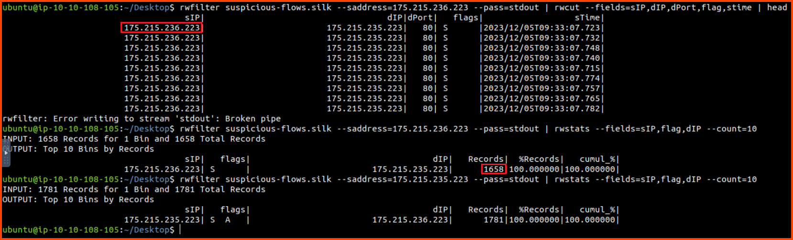

We can see that `x.x.236.223` sends multiple SYN packets to `x.x.235.223`. The timing of these packets looks suspicious as well. Additionally, if we list all the packets that have been sent between these hosts we do not see any ACK packets which could have been sent to finish the TCP handshake. This traffic now looks very suspicious. If we look at all the packets that have been sent from the target to the source we see SYN ACK packets being sent. 

This traffic looks like a SYN flood DoS attack. In this attack, the attacker starts a TCP handshake with the target but never completes it. This causes the target to leave the connection open for the source to reply which never happens. This leads to all the open ports on the target to get utilized preventing legitimate traffic from reaching it.

```bash
: '
List the source IP and destination IP for the top 10 flows that have the source IP or destination IP as 175.215.236.223
'
rwfilter suspicious-flows.silk --any-address=175.215.236.223 --pass=stdout | rwstats --fields=sIP,dIP  --count=10
```


We do not see any other host speaking with `x.x.236.223` which implies that this host is not trying to DoS any other device on the network.

### Questions

**1. Which version of SiLK is installed on the VM?**


> 3.19.1

**2. What is the size of the flows in the count records?**


> 11774

**3. What is the start time (sTime) of the sixth record in the file?**

```bash
# List the first 6 records
rwcut suspicious-flows.silk --num-recs=6
```

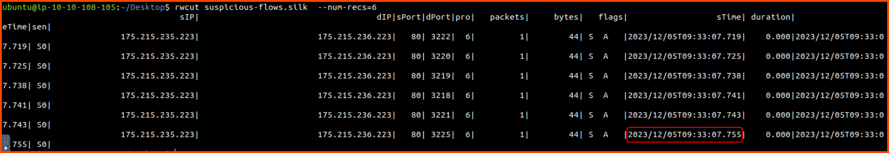

> 2023/12/05T09:33:07.755

**4. What is the destination port of the sixth UDP record?**

```bash
: '
List protocol, source IP, source port, destination IP, destination Port
for the first 6 records where protocol is 17 (UDP)
'
rwfilter suspicious-flows.silk --proto=17 --pass=stdout | rwcut --fields=pro,sIP,sPort,dIP,dPort --num-recs=6
```


> 49950

**5. What is the record value (%) of the dport 53?**

```bash
: '
List the destination IP, Record count, Packet count and Total data transmitted in bytes for Top 10 most active unique source IP, destination IP pair
'
rwstats suspicious-flows.silk --fields=dPort --values=records,packets,bytes,sIP-Distinct,dIP-Distinct --count=10
```


> 35.332088

**6. What is the number of bytes transmitted by the top talker on the network?**

```bash
: '
List the source IP and amount of data trasmitted in bytes 
for the top 10 chatty source IPs
'
rwstats suspicious-flows.silk --fields=sIP --values=bytes --count=10 --top
```


> 735229

**7. What is the sTime value of the first DNS record going to port 53?**

```bash
: '
List the source IP, destination IP and start time of the flow for the first 10 records in the file where source IP is 175.175.173.221
'
rwfilter suspicious-flows.silk --saddress=175.175.173.221 --dport=53 --pass=stdout | rwcut --fields=sIP,dIP,stime | head -10
```


> 2023/12/08T04:28:44.825

**8. What is the IP address of the host that the C2 potentially controls? (In defanged format: 123\[.\]456\[.\]789\[.\]0 )**

> 175[.]175[.]173[.]221

**9. Which IP address is suspected to be the flood attacker? (In defanged format: 123\[.\]456\[.\]789\[.\]0 )**

```bash
: '
List the source IP, destination IP, destination port, TCP flags and flow start time for the packets with source IP as 175.215.236.223
'
rwfilter suspicious-flows.silk --saddress=175.215.236.223 --pass=stdout | rwcut --fields=sIP,dIP,dPort,flag,stime | head

: '
List the source IP, TCP flags and destination IP for all packets with source IP as 175.215.236.223
'
rwfilter suspicious-flows.silk --saddress=175.215.236.223 --pass=stdout | rwstats --fields=sIP,flag,dIP --count=10
```


> 175[.]215[.]236[.]223

**10. What is the sent SYN packet's number of records?**

> 1658

## \[Day 18\] A Gift That Keeps on Giving

### Learning Objectives  

- Identify the CPU and memory usage of processes in Linux.
- Kill unwanted processes in Linux.
- Find ways a process can persist beyond termination.
- Remove persistent processes permanently.

### Walkthrough

When we run `top` to list the processes that are running we notice a strange application called `a`. It is using 100% of our CPU.

```bash
top
```

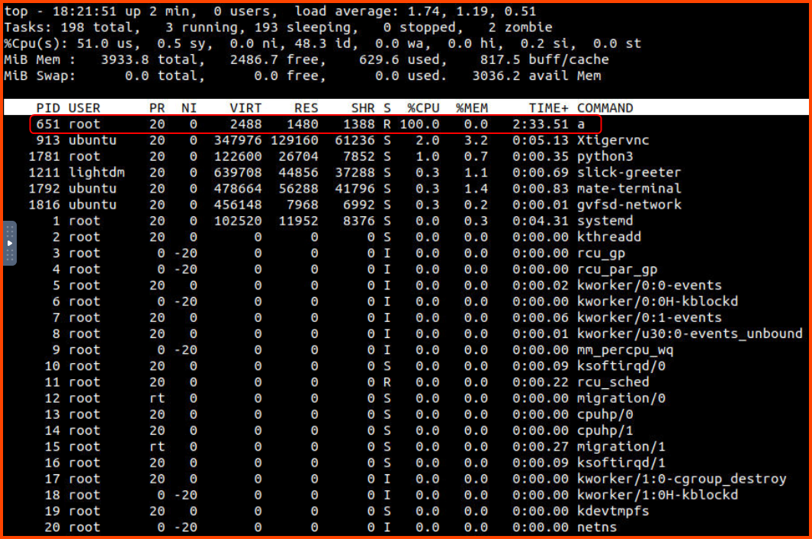

The process has the PID 651. We can terminate the process using the `kill` command.

```bash
sudo kill 651
```

On viewing the results of `top` again we notice that a new instance of the process `a` has been started. So killing it from the running process is not going to help us. We need to find the application that is spawning the process.

One way to schedule tasks on Linux is to use `cron`. Each user on the system gets a different `cron` configuration file. Since the process `a` was running as the root user let's look at the jobs that have been scheduled for root.

```bash
sudo su
crontab -l
```

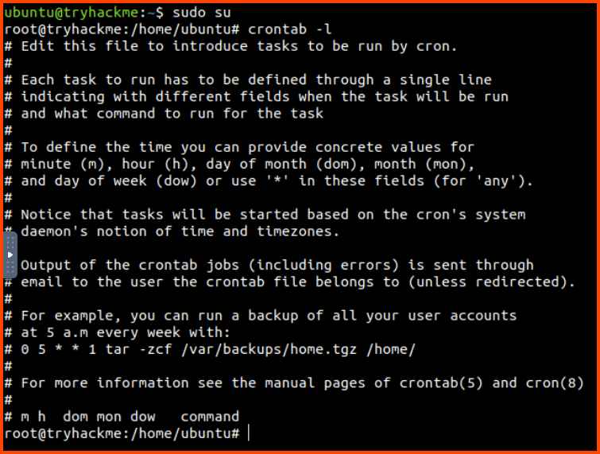

We do not see any scheduled process in the configuration.

Another way to schedule a process is to use `systemctl`. The output of `systemctl` will have a lot of processes. Since we know that the process that we are looking for is active we only need to look for running processes.

```bash
systemctl list-unit-files | grep enabled
```

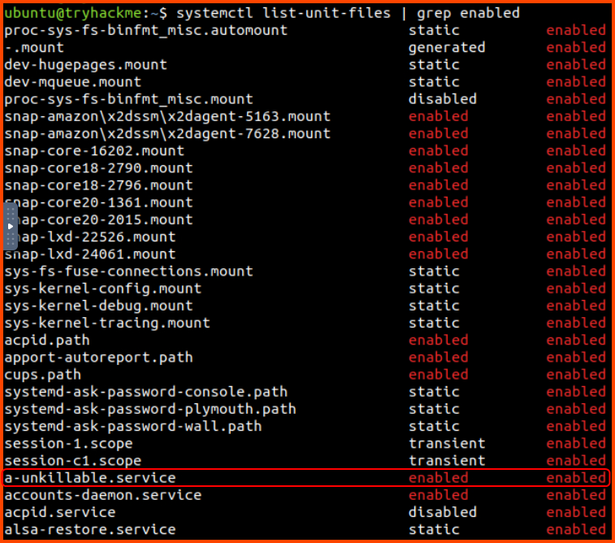

In the output, there is a suspicious process called `a-unkillable`. Let us try to get more details about this process.

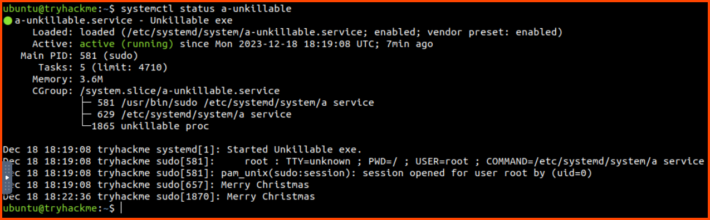

We can see that the binary for this process is located in the `/etc/systemd/system` directory. It also seems to periodically print out "Merry Christmas".

Now that we know how the process is being executed. Let us stop the task that is starting the process.

```bash
sudo su
systemctl stop a-unkillable
systemctl status a-unkillable
```

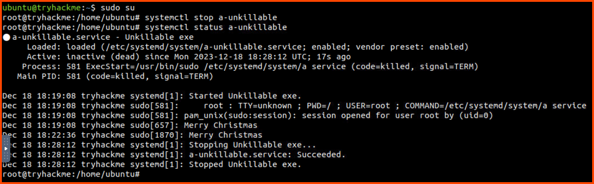

Once the process is stopped it should no longer be running on the system. We can confirm this using the `top` command.

```bash
top
```

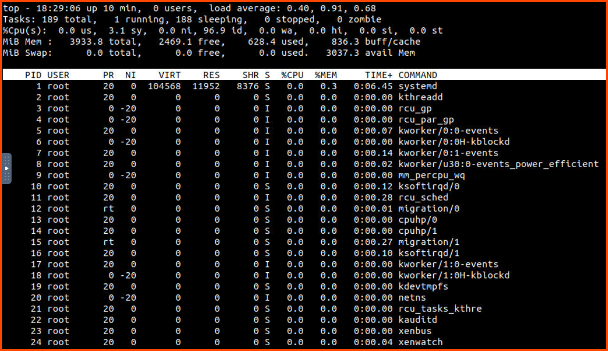

Now that we know that the process is not running. We can disable it and then delete all the files that are related to the malicious process.

```bash
systemctl disable a-unkillable

rm -rf /etc/systemd/system/a
rm -rf /etc/systemd/system/a-unkillable.service

systemctl status a-unkillable
systemctl daemon-reload
```

[What is the difference between "systemctl start" and "systemctl enable"?](https://askubuntu.com/questions/733469/what-is-the-difference-between-systemctl-start-and-systemctl-enable)

[How To Use Systemctl to Manage Systemd Services and Units \| DigitalOcean](https://www.digitalocean.com/community/tutorials/how-to-use-systemctl-to-manage-systemd-services-and-units)


### Questions

**1. What is the name of the service that respawns the process after killing it?**

> a-unkillable.service

**2. What is the path from where the process and service were running?**

> /etc/systemd/system/

**3. The malware prints a taunting message. When is the message shown? Choose from the options below.**  
**1) Randomly**  
**2) After a set interval**  
**3) On process termination**  
**4) None of the above**  

> 4

## \[Day 19\] CrypTOYminers Sing Volala-lala-latility

### Learning Objectives

- Understand what memory forensics is and how to use it in a digital forensics investigation
- Understand what volatile data and memory dumps are
- Learn about Volatility and how it can be used to analyze a memory dump
- Learn about Volatility profiles

### Questions

Before solving the questions we first need to load the profile required to analyze the memory image into Volatility.

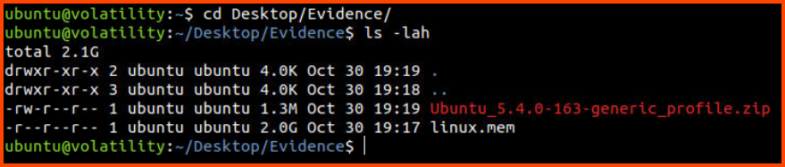

```bash
# Copy Ubuntu profile into Volatility plugins folder
cp Ubuntu_5.4.0-163-generic_profile.zip ~/.local/lib/python2.7/site-packages/volatility/plugins/overlays/linux/

# List Ubuntu related profiles
vol.py --info | grep Ubuntu
```


**1. What is the exposed password that we find from the bash history output?**

To answer this question we need to view the content of the history file. This is done using the `linux_bash` plugin.

```bash
vol.py -f linux.mem --profile="LinuxUbuntu_5_4_0-163-generic_profilex64" linux_bash
```


> NEhX4VSrN7sV

**2. What is the PID of the miner process that we find?**

To view the processes that were running when the memory dump was created we use the `linux_pslist` plugin.

```bash
vol.py -f linux.mem --profile="LinuxUbuntu_5_4_0-163-generic_profilex64" linux_pslist
```


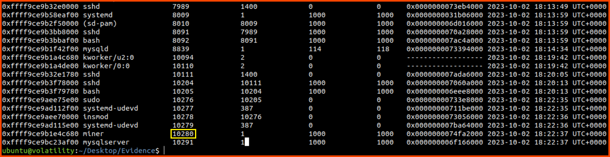

> 10280

**3. What is the MD5 hash of the miner process?**

To find the MD5 hashes of processes we need to first extract the binary from the memory dump. This can be performed using the `linux_procdump` plugin. Once we have the binary we can use `md5sum` to calculate the hash.

```bash
mkdir extracted

# Extract the binary for suspicious processes
vol.py -f linux.mem --profile="LinuxUbuntu_5_4_0-163-generic_profilex64" linux_procdump -D extracted -p 10280
vol.py -f linux.mem --profile="LinuxUbuntu_5_4_0-163-generic_profilex64" linux_procdump -D extracted -p 10291
```


```bash
md5sum extracted/*
```

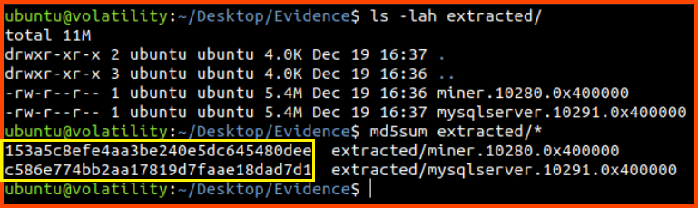

> 153a5c8efe4aa3be240e5dc645480dee

**4. What is the MD5 hash of the mysqlserver process?**

> c586e774bb2aa17819d7faae18dad7d1

**5. Use the command `strings extracted/miner.<PID from question 2>.0x400000 | grep http://`. What is the suspicious URL? (Fully defang the URL using CyberChef)**

We can use the provided command on the binary that we have extracted to find the C2 server URL.

```bash
strings extracted/miner.10280.0x400000 | grep http://
```

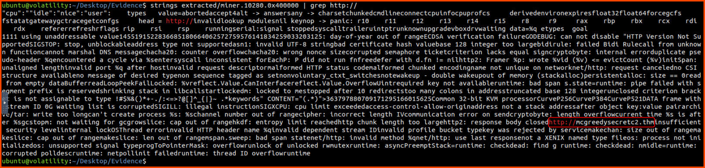

From the output, we can see that `http://mcgreedysecretc2.thm` is the suspicious URL. The output is required in defanged format so we convert it to that format using CyberChef.

[CyberChef - The Cyber Swiss Army Knife](https://0x1.gitlab.io/code/CyberChef/)


> hxxp[://]mcgreedysecretc2[.]thm

**6. After reading the elfie file, what location is the mysqlserver process dropped in on the file system?**

One of the ways to make a process persistent on the system is to use cronjobs. To view all the cron configuration files on the system we can use the `linux_enumerate_files` plugin. The cron file that we are looking for is `elfie`.

```bash
vol.py -f linux.mem --profile="LinuxUbuntu_5_4_0-163-generic_profilex64" linux_enumerate_files | grep -i cron
```


We can save the content of the file to disk using the following command:

```bash
vol.py -f linux.mem --profile="LinuxUbuntu_5_4_0-163-generic_profilex64" linux_find_file -i 0xffff9ce9b78280e8 -O elfie
```


```bash
cat elfie
```


> /var/tmp/.system-python3.8-Updates/mysqlserver

## \[Day 20\] Advent of Frostlings

### Learning Objectives

- Learn about poisoned pipeline execution.
- Understand how to secure CI/CD pipelines.
- Get an introduction to secure software development lifecycles (SSDLC) & DevSecOps.
- Learn about CI/CD best practices.

### Walkthrough

From the Attack Box visit `http://10.10.208.91`. We will be presented with the GitLab login page. Use the credentials provided to log in.

> Username: DelfSecOps  
> Password: TryHackMe!

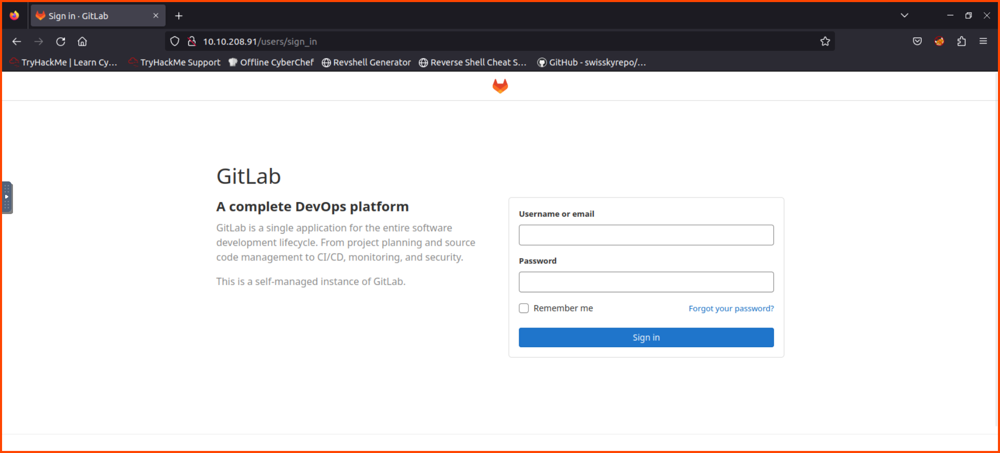

On the projects page, we can see the repository that contains the Calendar code. Click on the project to open the codebase.


We see that the repository has a GitLab pipeline file (`.gitlab-ci.yml`). Since the pipeline is causing the issue let's take a look at the config.

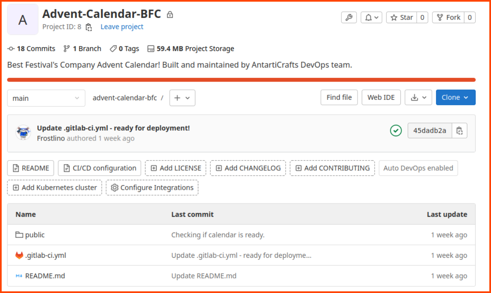

In the `test` section, we see that the website uses an Apache Docker image for hosting the website. The website runs on port `9081`.


If we go to the Merge requests from the sidebar and select the Merged tab we see that there was one merge request.


On reading the merge request messages we see that the lead developer of the project allowed a change without reading the code. This code could be the reason the site is not functioning properly.

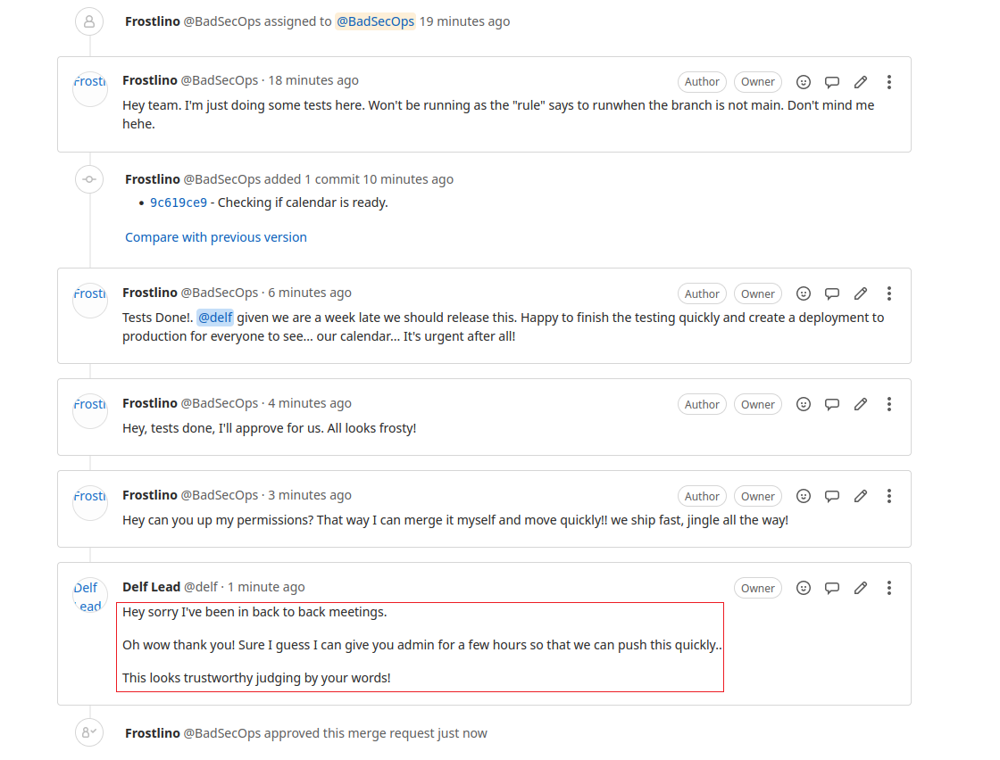

Let us look at the website that was deployed and see what is happening.

```
http://10.10.208.91:9081
```

We can see that the calendar was defaced because of the last code changes.


From the sidebar select CI/CD. Click on the passed button for the topmost pipeline.


Click on the job called `test`.


From the pipeline output, we can see that the content of the `index.html` file has been changed with a different code that defaces the website.


### Questions

**1. What is the handle of the developer responsible for the merge changes?**

The last commit that caused the problem was made by the user `Frostlino`. If we click on his name anywhere in the UI we will be taken to the below page where we can see his actual name.


> BadSecOps

**2. What port is the defaced calendar site server running on?**

The answer to this question is present in the GitLab CI/CD configuration file.


> 8091

**3. What server is the malicious server running on?**

From the GitLab CI/CD config file we can see that the website is using Apache webserver.

> Apache

**4. What message did the Frostlings leave on the defaced site?**


> Frostlings Rule

**5. What is the commit ID of the original code for the Advent Calendar site?**

For this question, we need to go to the Commits page. From the sidebar select Repository and then click on Commits. We need to find the commit that was made by Def Lead that added the pipeline configuration. This is the last code change that was made on Dec 06, 2023.

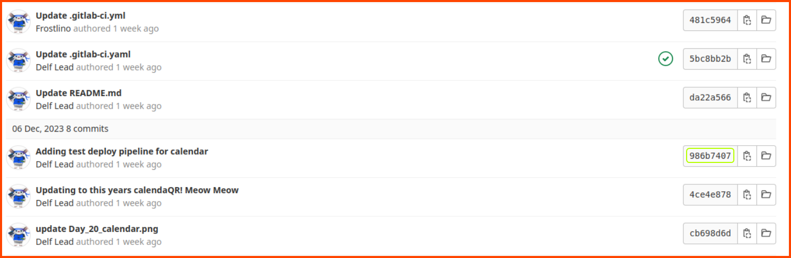

> 986b7407