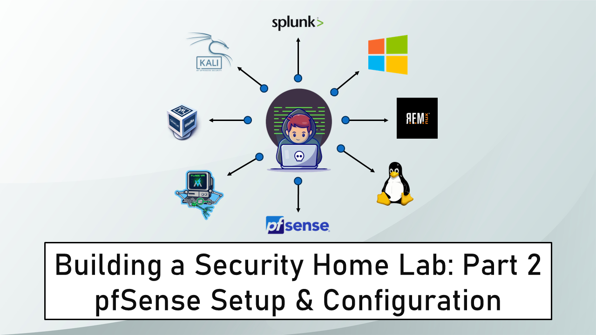

Banner Background by [logturnal](https://www.freepik.com/free-vector/gradient-white-color-background-abstract-modern_34010189.htm) on Freepik  
Hacker Image by [catalyststuff](https://www.freepik.com/free-vector/hacker-operating-laptop-cartoon-icon-illustration-technology-icon-concept-isolated-flat-cartoon-style_11602236.htm) on Freepik

> [!IMPORTANT] Changelog  
> -  **Mar. 27, 2026**
> 	- Major overhaul of pfSense installation steps to make it compatible with new versions of VirtualBox.
> - **Feb. 23, 2025**
> 	- Added note to clarify the confusion around IPv6 address on the WAN interface.
> - **Nov. 01, 2024**
> 	- Updated the article to indicate pfSense download from the official website now requires an account.
> 	- Updated the pfSense download link to point to pfSense official mirror from where the ISO can be downloaded without an account.
> 	- Updated Virtual Box instructions to reference the “Expert” mode option.

In this module, we will go over the installation of pfSense. Additionally, we will also complete the initial configuration required to onboard the subnets that make up our lab into pfSense.  

> [!INFO] Lab Startup
> pfSense is going to be the default gateway and firewall for our home lab. The pfSense VM should be the first VM that is booted. Once the pfSense VM up other VMs in the lab can be launched.

## Download pfSense

Go to the following link: [pfSense CE Download](https://atxfiles.netgate.com/mirror/downloads/)  
As of writing the latest version of pfSense is **`2.7.2`**  
Download the `amd64` version `ISO` of the latest version available.  

> [!INFO] pfSense Download
> Downloads from pfSense (Netgate) website now requires registration. Netgate  has also removed the option to download pfSense CE directly. Currently, the only option is to get the Netgate installer and install the CE edition from it. To avoid all this hassle use the link provided above to download the ISO directly from a mirror.
> 
> [Is Netgate requiring a login to download CE now? : r/PFSENSE](https://www.reddit.com/r/PFSENSE/comments/1chzp1n/is_netgate_requiring_a_login_to_download_ce_now/)  
> [PFSense ISO Download Requires an Account and Billing Address : r/PFSENSE](https://www.reddit.com/r/PFSENSE/comments/1co8f1o/pfsense_iso_download_requires_an_account_and/)

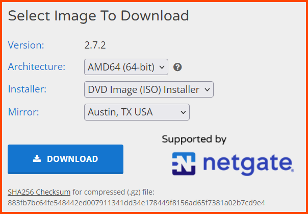

The downloaded file will have the extension **`.iso.gz`**. Use a decompression software like **`7-Zip`** to extract the image.

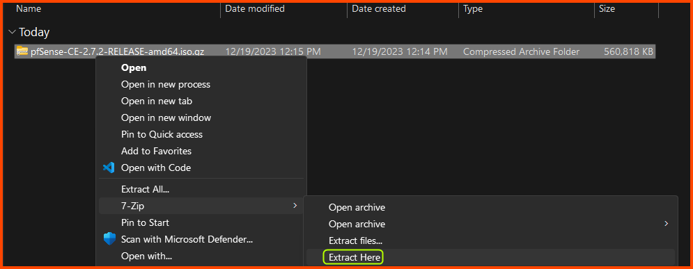

After extraction, we will have a file that has the **`.iso`** extension. 

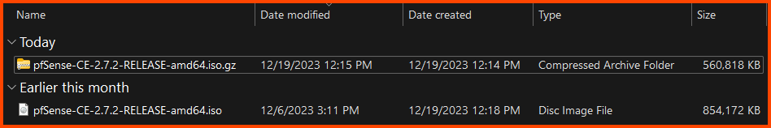

## pfSense VM Creation

Launch VirtualBox. Check on **`Tools`** from the sidebar and then Select **`New`** from the Toolbar.

![[vbox-01.png|500]]

For <u>Name</u>, you can enter anything that makes sense. The <u>Folder</u> option defines the location where the VM will be saved. From the <u>ISO Image</u> dropdown select Others and select the **`.iso`** file that we just downloaded. Select <u>Type</u> as **`BSD`** and <u>Version</u> as **`FreeBSD (64-bit)`** and then click on **`Next`**.

![[vbox-02.png|560]]

Here we select the amount of RAM and CPU that the VM can use. No need to change anything. Click on **`Next`** to continue.

![[vbox-03.png|560]]

On this page, we choose the amount of storage space to reserve for the VM. Enter **`20GB`** in the input field.

![[vbox-04.png|560]]

[10.2. Understanding Virtual Disks](https://rhv.bradmin.org/ovirt-engine/docs/Administration_Guide/Understanding_virtual_disks.html)

Confirm that everything looks right and then click on **`Finish`**.

![[vbox-05.png|560]]

Once done we should see the newly created VM in the sidebar.

> [!INFO]
> Ignore the "Security Home Lab" and "Other VMs" Group that will be present in all the images. These groups contain VMs I have created for testing purposes. They will not be present in your instance. 

### Adding VM to Group

I like to keep my VMs organized by using the Groups feature of VirtualBox. This makes it easy to store related VMs together.

![[vbox-06.png|560]]

Right-click on the pfSense VM from the sidebar, select **`Move to Group -> [New]`**. The VM will now be added to a <u>Group</u> called **`New Group`**. 

![[vbox-07.png|400]]

Right-click on the Group, and select **`Rename Group`**. Name the Group **`Firewall`**.

![[vbox-08.png|240]]

The final result should match the following:

![[vbox-09.png|300]]

## pfSense VM Configuration

Before we boot the VM we need to configure some settings related to VirtualBox. Select the pfSense VM from the sidebar and then click on **`Settings`**.

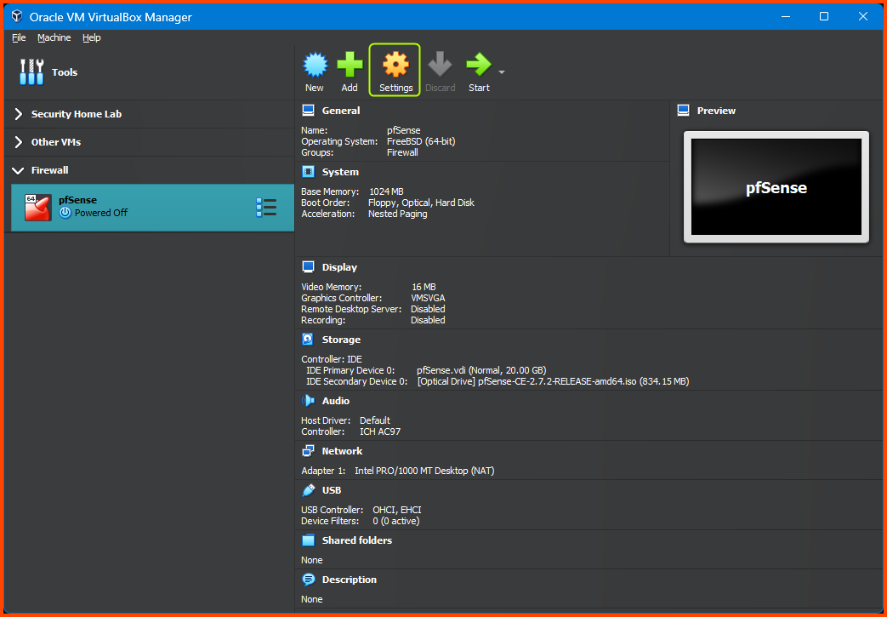

### System Configuration

> [!INFO] UI Changes
> Make sure “Expert" Mode is selected using the toggle at the top left corner of the menu. Some of the options that are required to setup this lab will not show up in “Basic” mode.
> 
> ![[vbox-73.png|460]]

Select **`System -> Motherboard`** in the <u>Boot Order</u> section use the arrows to move the **`Hard Disk`** to the top, **`Optical`** should be next. Ensure that **`Floppy`** is unchecked. 

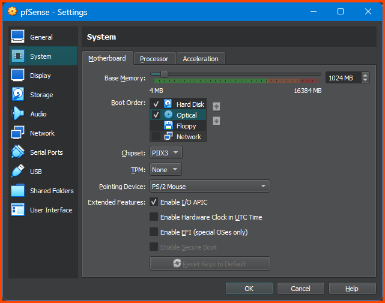

### USB Configuration

Go to the **`USB`** tab and uncheck the **`Enable USB Controller`** option. Since the VM we are configuring is a router we do not need USB support.

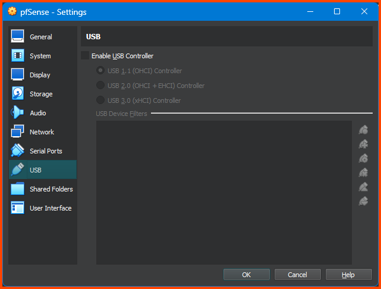

### Network Configuration

Go to **`Network -> Adapter 1`**. For the <u>Attached to</u> field select **`NAT`**. Expand the **`Advanced`** section and for <u>Adaptor Type</u> select **`Intel PRO/1000 MT Desktop (82540EM)`**.

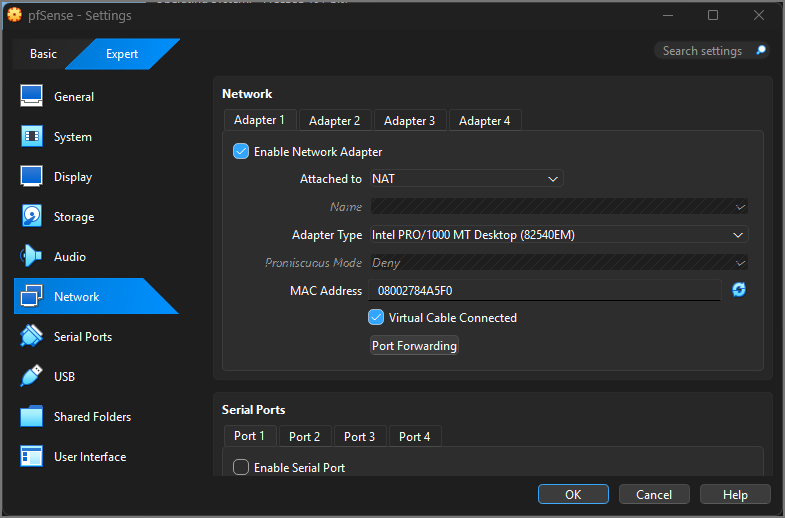

Select **`Adapter 2`**. Tick the **`Enable Network Adapter`** option. For the <u>Attached to</u> option select **`Internal Network`**. For <u>Name</u> enter **`LAN 0`**. Expand the **`Advanced`** section. For <u>Adapter Type</u> select **`Intel PRO/1000 MT Desktop (82540EM)`**.

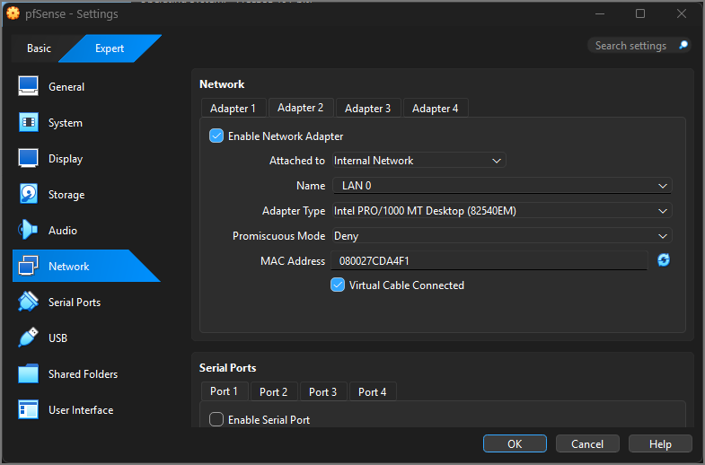

Select **`Adapter 3`**. Tick the **`Enable Network Adapter`** option. For the <u>Attached to</u> option select **`Internal Network`**. For <u>Name</u> enter **`LAN 1`**. Expand the **`Advanced`** section. For <u>Adapter Type</u> select **`Intel PRO/1000 MT Desktop (82540EM)`**.

Select **`Adapter 4`**. Tick the **`Enable Network Adapter`** option. For the <u>Attached to</u> option select **`Internal Network`**. For <u>Name</u> enter **`LAN 2`**. Expand the **`Advanced`** section. For <u>Adapter Type</u> select **`Intel PRO/1000 MT Desktop (82540EM)`**. 

Once done click on **`OK`** to save the changes and close the configuration menu.

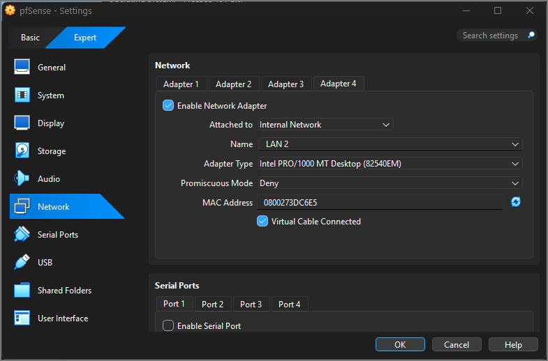

[VirtualBox Network Settings: All You Need to Know](https://www.nakivo.com/blog/virtualbox-network-setting-guide/)

> [!INFO]
> The network diagram shown in the first module consisted of 6 network interfaces. VirtualBox only allows us to configure 4 interfaces uses the UI. Towards the end of the guide we will see how to add more interfaces using VirtualBox CLI.

## pfSense Installation

Select the pfSense VM from the sidebar and click on **`Start`** from the toolbar.

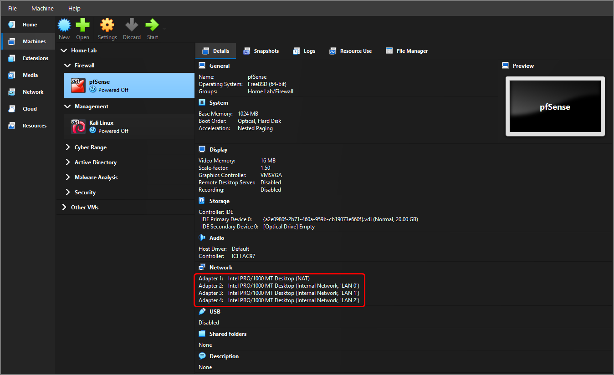

On boot, a banner will be shown followed by a lot of text. Wait for the below screen to appear. Press **`Enter`** to Accept the agreement. 

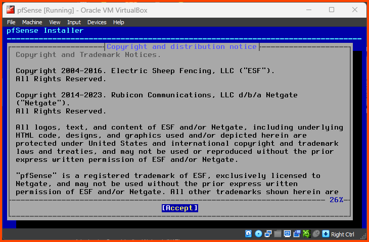

Press **`Enter`** to start the Installation.

> [!INFO] pfSense Display Size    
> The display for pfSense is generally small, making it quite hard to read. You can go to `View -> Virtual Screen 1` and use any of the options listed to make the display larger.
> 
> ![[vbox-76.png|280]]

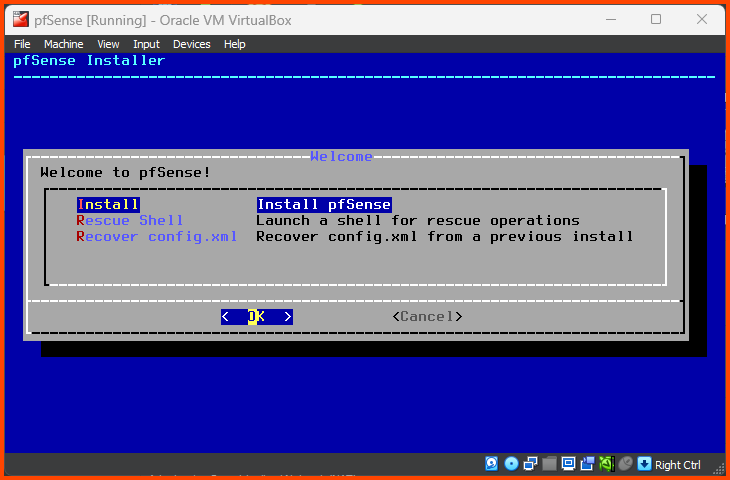

Press **`Enter`** to select the <u>Auto (UFS)</u> partition option.

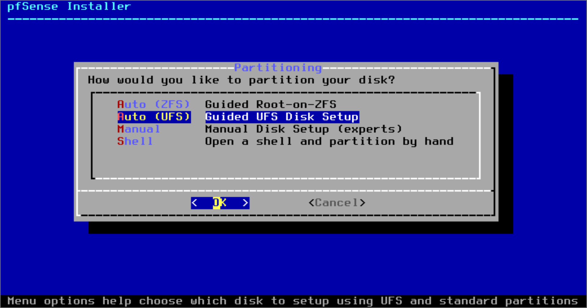

Press **`Enter`** to partition the <u>Enter Disk</u>.

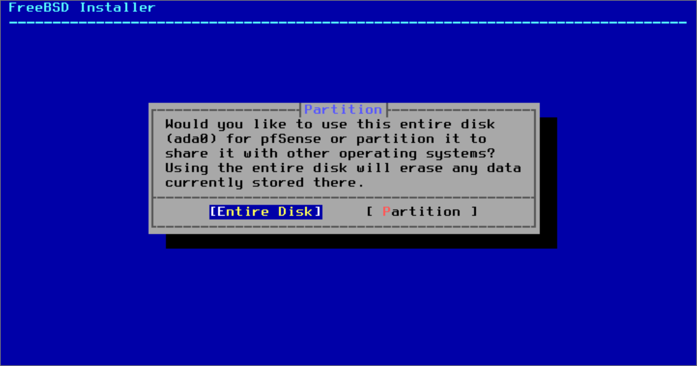

Select <u>GPT</u> as the Partition Scheme.

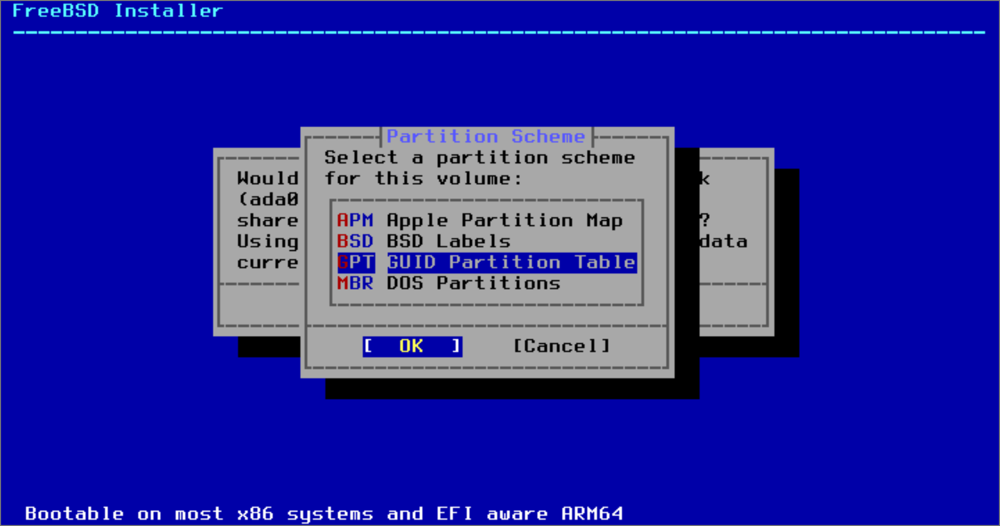

Press `Enter` to finalize/confirm the partitions that will be created.

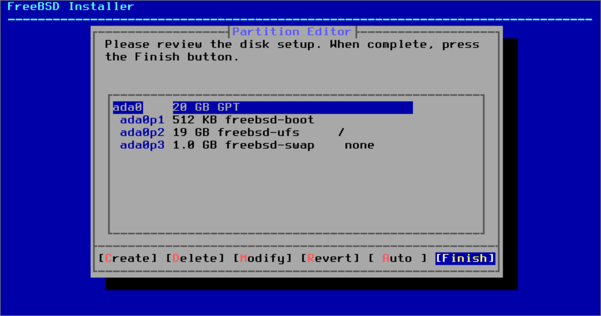

Select <u>Commit</u> to begin the partitioning and installation.

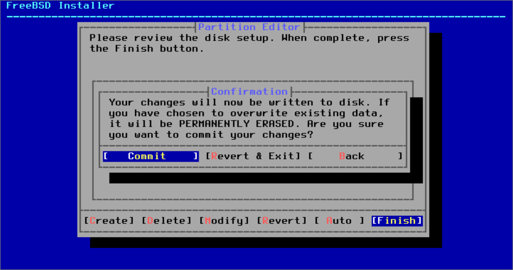

Wait for the installation to complete.

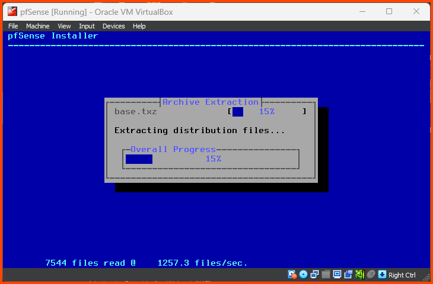

Press **`Enter`** to Reboot the VM.

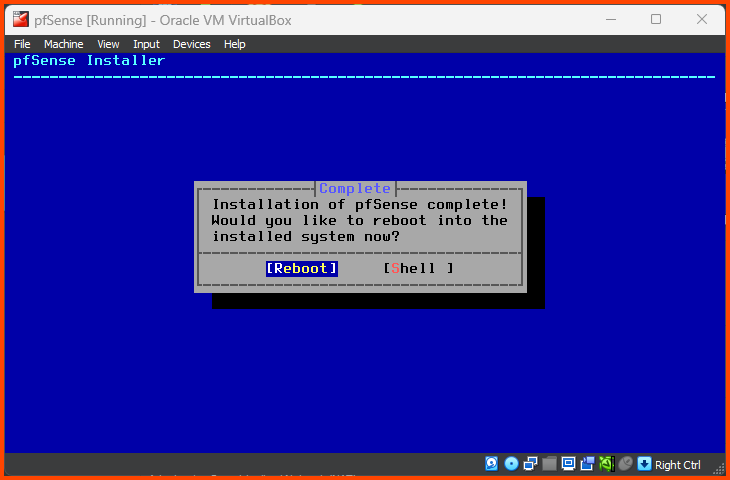

On reboot the VM will again start the installation wizard. Use the close button to shut down the VM.

![[pfsense-123.png|500]]

## Post-Installation Cleanup

Once the VM shuts down click on <u>Settings</u> from the top bar. 

In the settings menu navigate to <u>Storage</u>. Select the CD drive (usually the 2nd one) the and then click on the little blue disk icon on the right side of the <u>Optical Drive</u> option. Select <u>Remove Disk from Virtual Drive</u> to remove the ISO.

Click on `OK` to save the changes. 

![[pfsense-124.png|640]]

## pfSense Configuration

Start the pfSense VM. The VM can take a few minutes to boot completely. Let us now onboard the interfaces we configured in the VM settings. 

Press **`2`** to start the Interface Assignment wizard.

The `WAN` interface IP address assignment is managed by VirtualBox. The IP assignment for the LAN interfaces is managed by pfSense. An IP address is automatically assigned by pfSense to the **`LAN`** interface. 

VirtualBox can assign the WAN interface an IPv4 or IPv6 address (sometimes both like in the image below). This is okay and will not cause any issues. In Part 3, I will show how IPv6 and DHCPv6 can be disabled.

![[pfsense-126.png|560]]

Sometimes the above screen is skipped entirely and the interface assignment wizard is loaded directly. If that happens just continue with the below steps.  

Should VLANs be set up now? **`n`**  
In the next step, we will configure the interfaces manually.

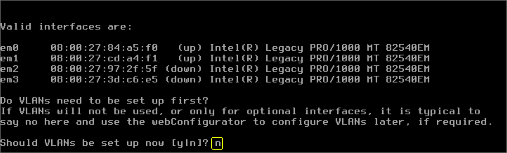

Enter the WAN interface name: **`em0`**  
Enter the LAN interface name: **`em1`**  
Enter the Optional 1 interface name: **`em2`**  
Enter the Optional 2 interface name: **`em3`**  

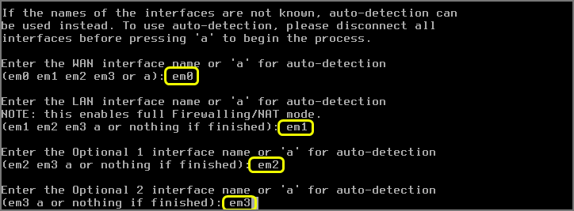

Do you want to proceed?: **`y`**

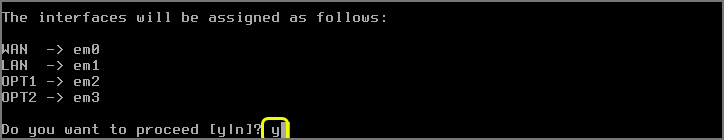

As stated earlier, the IP assignment for all the LAN interfaces (LAN, OPT1, OPT2, etc.) is managed by pfSense. The **`OPT1`** and **`OPT2`** interfaces are not in the up state so they are not assigned an IP.

![[pfsense-125.png|560]]

#### Configuring LAN (em1)

Enter **`2`** to select "Set interface(s) IP address". Enter **`2`** to select the **`LAN`** interface.

Configure IPv4 address LAN interface via DHCP?: **`n`**  
Enter the new LAN IPv4 address: **`10.0.0.1`**  
Enter the new LAN IPv4 subnet bit count: **`24`**  

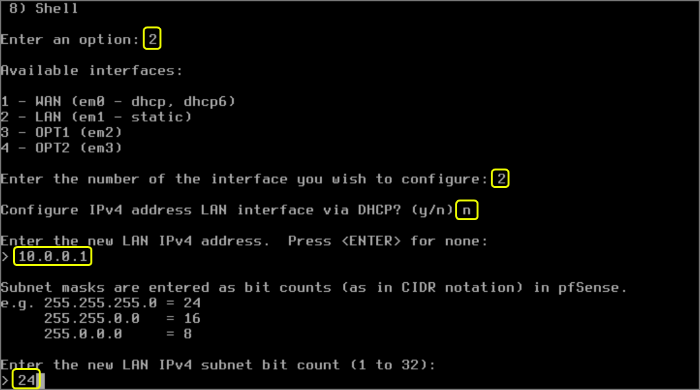

For the next question directly press **`Enter`**. Since this is a **`LAN`** interface we do not have to worry about configuring the upstream gateway.

Configure IPv6 address LAN interface via DHCP6: **`n`**  
For the new LAN IPv6 address question press **`Enter`**  

Do you want to enable the DHCP server on LAN?: **`y`**  
Enter the start address of the IPv4 client address range: **`10.0.0.100`**  
Enter the end address of the IPv4 client address range: **`10.0.0.199`**  

Do you want to revert to HTTP as the webConfigurator protocol?: **`n`**

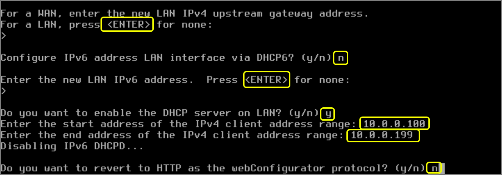

pfSense will use the inputs we provided and configure the interface.  
Press **`Enter`** to complete the **`LAN`** interface configuration.

Once the changes apply we see that the IP address of the **`LAN`** interface has changed to the IP address that we provided.

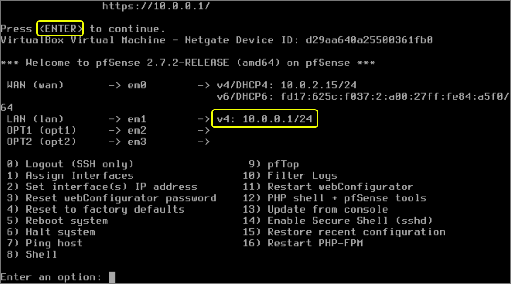

### Configuring OPT1 (em2)

Enter **`2`** to select "Set interface(s) IP address". Enter **`3`** to select the **`OPT1`** interface.

Configure IPv4 address OPT1 interface via DHCP?: **`n`**  
Enter the new OPT1 IPv4 address: **`10.6.6.1`**  
Enter the new OPT1 IPv4 subnet bit count: **`24`**  

![[pfsense-17.png|560]]

For the next question directly press **`Enter`**. Since **`OPT1`** is a **`LAN`** interface we do not have to worry about configuring the upstream gateway.

Configure IPv6 address OPT1 interface via DHCP6: **`n`**  
For the new OPT1 IPv6 address question press **`Enter`**  

Do you want to enable the DHCP server on OPT1?: **`y`**  
Enter the start address of the IPv4 client address range: **`10.6.6.100`**  
Enter the end address of the IPv4 client address range: **`10.6.6.199`**  

Do you want to revert to HTTP as the webConfigurator protocol?: **`n`**

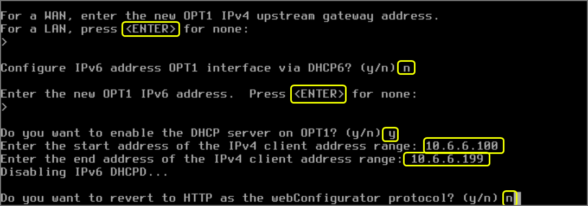

Press **`Enter`** to save the changes and return to the main menu.

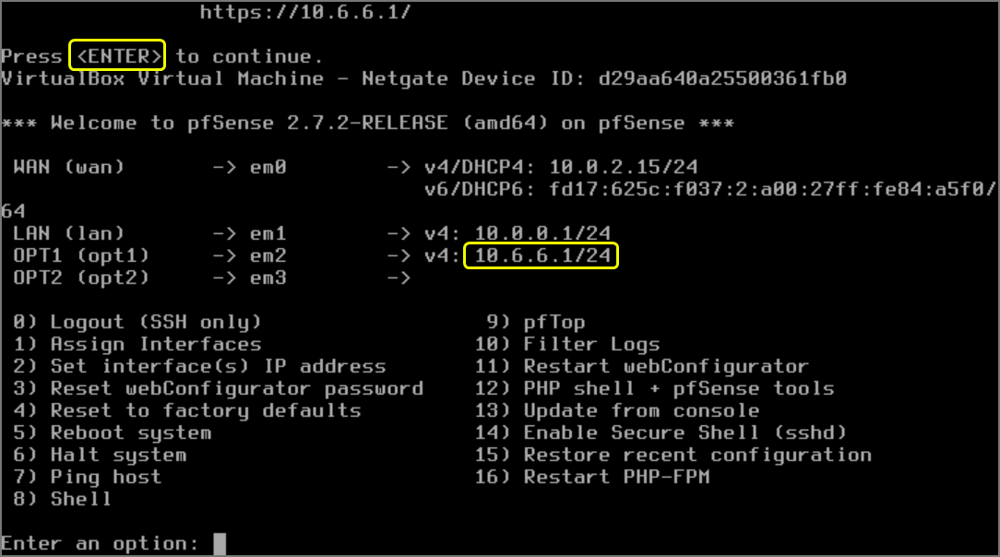

Once the changes apply, we see that the IP address of the **`OPT1`** interface has changed to the IP address that we provided.

### Configuring OPT2 (em3)

Enter **`2`** to select "Set interface(s) IP address". Enter **`4`** to select the **`OPT2`** interface.

Configure IPv4 address OPT2 interface via DHCP?: **`n`**  
Enter the new OPT2 IPv4 address: **`10.80.80.1`**  
Enter the new OPT2 IPv4 subnet bit count: **`24`**  

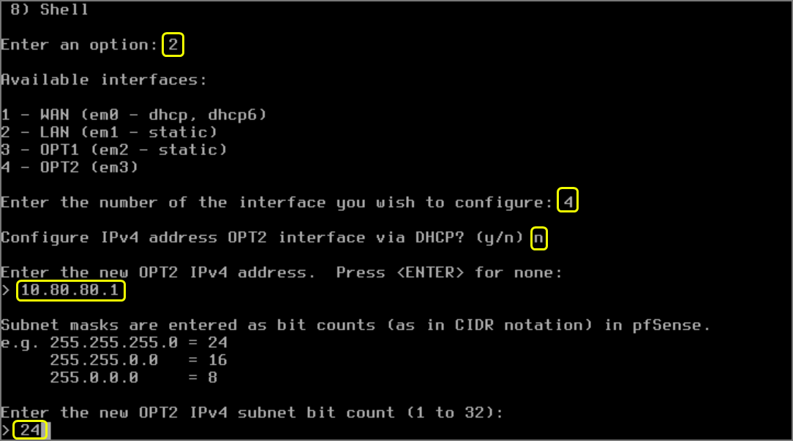

For the next question directly press **`Enter`**. Since **`OPT2`** is a **`LAN`** interface we do not have to worry about configuring the upstream gateway.

Configure IPv6 address OPT2 interface via DHCP6: **`n`**  
For the new OPT2 IPv6 address question press **`Enter`**  

Do you want to enable the DHCP server on OPT2?: **`n`**  
Do you want to revert to HTTP as the webConfigurator protocol?: **`n`**

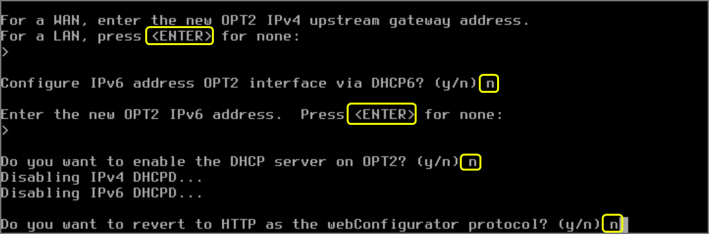

> [!INFO]
> **`OPT2`** will be used to setup the Active Directory (AD) Lab. The Domain Controller (DC) in the lab will act as the DHCP server. Since DC will perform DHCP operations we have not enabled DHCP IP address assignment for this interface in pfSense.  

Press **`Enter`** to save the changes and return to the main menu.

The IP ranges for the **`LAN`**, **`OPT1`** and **`OPT2`** interfaces should be as follows:

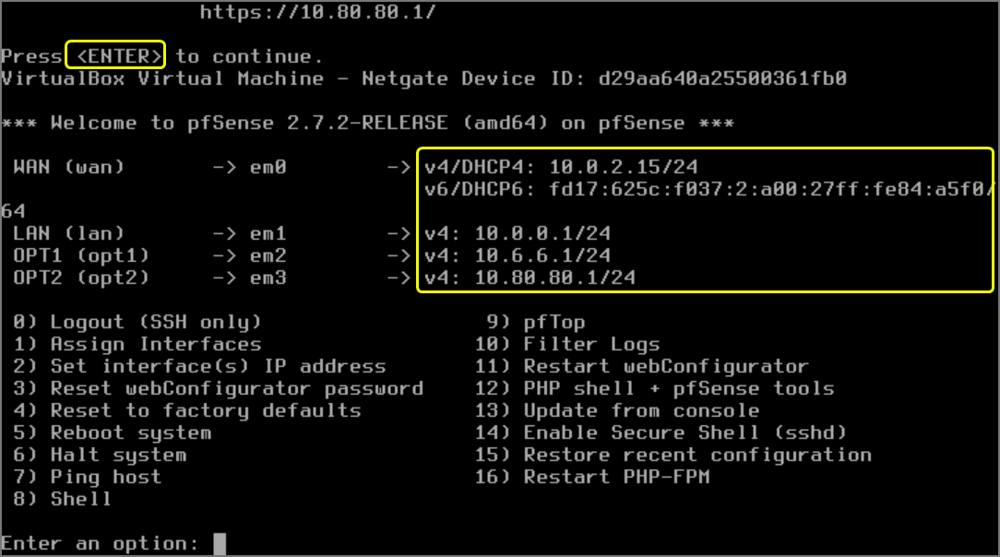

With this, we have completed the onboarding of the interfaces in pfSense. However, there is still a lot of things that has to be configured in pfSense. Once we set up Kali Linux in the next module we will use the pfSense GUI to make the necessary changes. 

> [!INFO]
> pfSense Web Interface is accessible on all the **`LAN`** interfaces (LAN, OPT1, OPT2, etc.) by default. 

## Shutdown pfSense

When we start the lab pfSense is the first VM that has to be booted. When we shut down the lab pfSense will be the last VM that is stopped.

Enter an option: **`6`** (Halt system)
Do you want to process?: **`y`**

This will initiate the shutdown sequence.

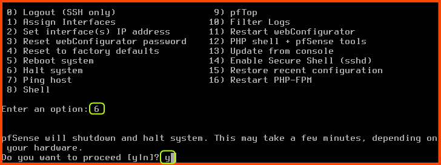

## Backup pfSense
At this point you can take a snapshot/backup of the pfSense VM. The snapshot will allow us to return to the current state of the VM if something goes wrong down the line.

Power off the VM and click on the **`Snapshots`** tab.

![[vbox-77.png|600]]

Click on <u>Take</u> from the toolbar.

Give the snapshot a descriptive name and description. Click on <u>Ok</u>.

![[vbox-78.png|450]]

Now we have a snapshot/backup of the current state of the VM.

![[vbox-79.png|600]]

In the next module, we will set up Kali Linux on the **`LAN`** interface. This VM will also be used as the attack VM to target the vulnerable systems on the **`OPT1 (CYBER_RANGE)`** interface.

[Part 3 - Kali Linux Setup](https://blog.davidvarghese.net/posts/building-home-lab-part-3/)
