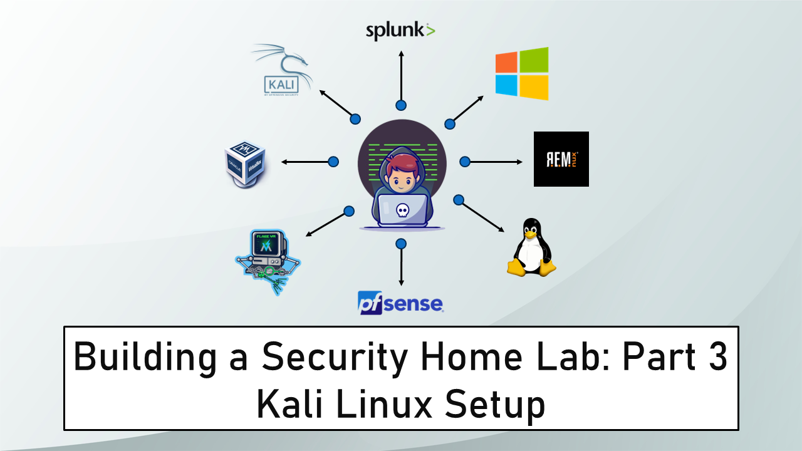

Banner Background by [logturnal](https://www.freepik.com/free-vector/gradient-white-color-background-abstract-modern_34010189.htm) on Freepik  
Hacker Image by [catalyststuff](https://www.freepik.com/free-vector/hacker-operating-laptop-cartoon-icon-illustration-technology-icon-concept-isolated-flat-cartoon-style_11602236.htm) on Freepik

> [!IMPORTANT] Changelog
> - **Nov. 10, 2024**
> 	- Added note about settings that could fix the “black screen on boot” problem that occurs on certain machines.
> 	- Updated Kali Linux VM setup steps to include configuration that is recommended by Offensive Security.

In this module, we are going to install Kali Linux. We will use this VM in the next module also to complete the pfSense setup. 

## Download Kali Linux

Go to the following link: [Get Kali \| Kali Linux](https://www.kali.org/get-kali/#kali-installer-images)

Download the <u>64-bit Recommended Installer</u>. The image is ~4GB in size so it will take some time to download.

As of writing the latest version of Kali Linux is **`2023.4`**.

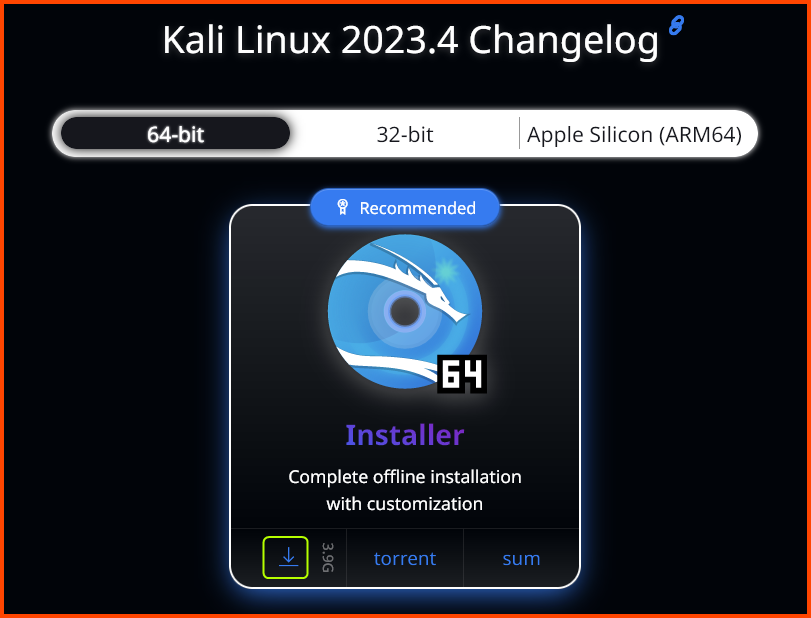

Once it is downloaded we should have an **`.iso`** file. 


## Kali Linux VM Creation

Launch VirtualBox. Select **`Tools`** from the sidebar and then click on **`New`** from the toolbar.

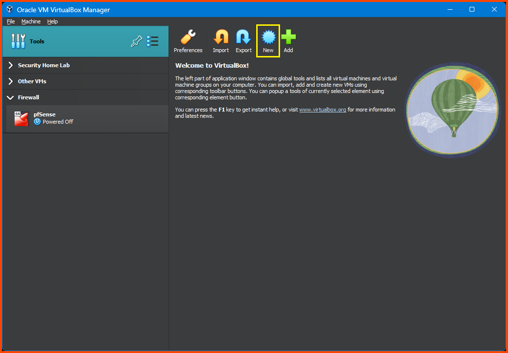

Give the VM a <u>Name</u>. Set the <u>Folder</u> option to the location where the Home Lab VMs are going to be saved. Leave the <u>ISO Image</u> option empty. Select <u>Type</u> as **`Linux`** and <u>Version</u> as **`Debian (64-bit)`** then click on **`Next`**. 


Leave everything on its default values. Click on **`Next`**.

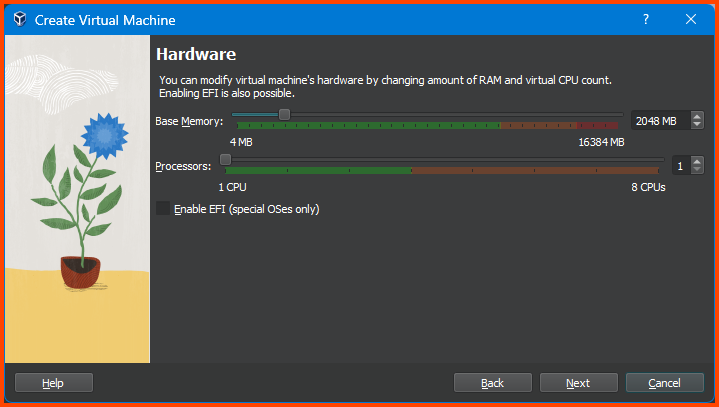

Increase the <u>Disk Size</u> to **`80GB`** and click on **`Next`**.

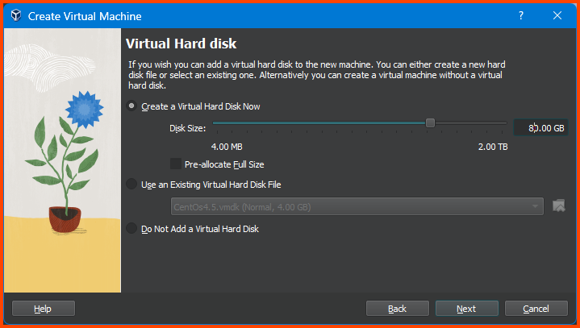

Ensure that all the settings look right and click on **`Finish`**.

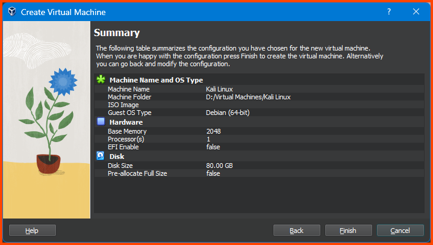


### Adding VM to Group

Right-click on the Kali Linux VM from the sidebar, select **`Move to Group -> [New]`**.


The VM will now be added to a <u>Group</u> called **`New Group`**. Right-click on the group name and select **`Rename Group`**. Name the group **`Management`**.


Select the <u>Firewall</u> and <u>Management</u> group (**`Ctrl+Click`**). Right-click on the name of one of the groups. From the menu select **`Move to Group -> [New]`**.

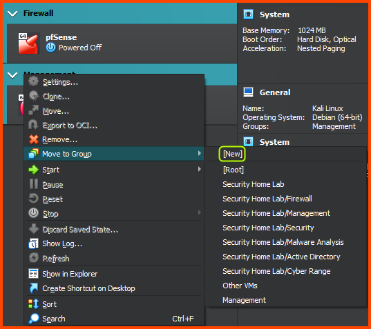

Now both the groups should be nested inside a <u>group</u> called **`New Group`**. Right-click on the group and choose **`Rename Group`**. Give the group the name **`Home Lab`**.


In the end, we should have the following structure:

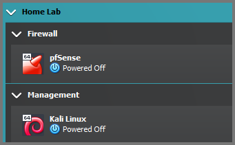

## Kali Linux VM Configuration

Select the Kali Linux VM and then from the toolbar select **`Settings`**.

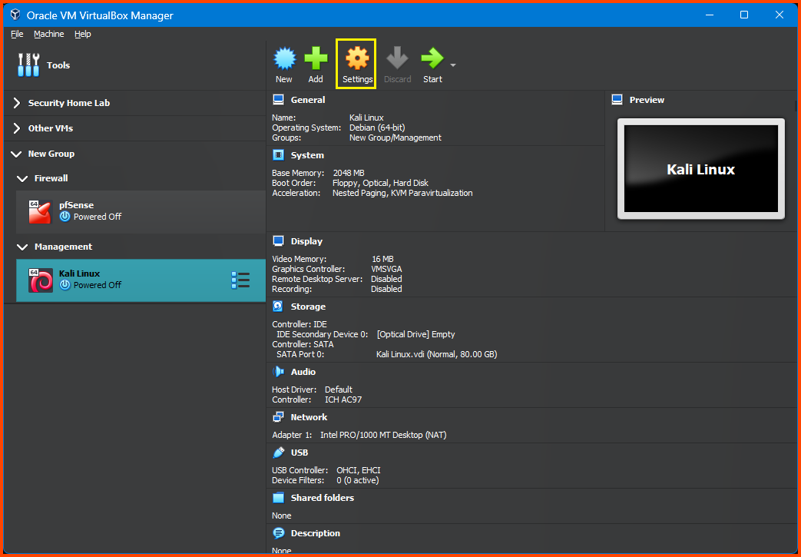

### System Configuration

Go to **`System -> Motherboard`**. For the <u>Boot Order</u> option ensure that the **`Hard Disk`** is on the top followed by **`Optical`**. Uncheck **`Floppy`**.  


Go to **`System -> Processor`**. From Extended Features list select **`Enable PAE/NX`**.

![[vbox-74.png|540]]

Go to **`Display -> Screen`** and increase the <u>Video Memory</u> to **`128 MB`**.

![[vbox-75.png|540]]

### Boot Image Configuration

Go to the **`Storage`** tab. Select the Empty disk present below **`Controller: IDE`** then click on the small disk icon on the right side of the <u>Optical Drive</u> option.


Select **`Choose a disk file`** and then select the downloaded **`.iso`** file for Kali Linux.


The final result should look as follows:

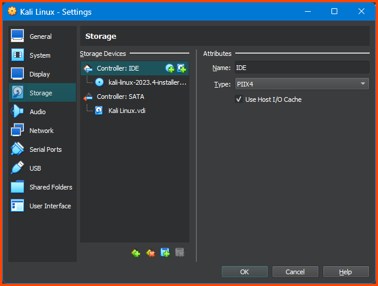

### Network Configuration

Go to **`Network -> Adapter 1`**. For the <u>Attached to</u> field select **`Internal Network`**. For <u>Name</u> select **`LAN 0`**. Expand the <u>Advanced</u> section. For <u>Adapter Type</u> select **`Paravirtualized Network (virtio-net)`**.

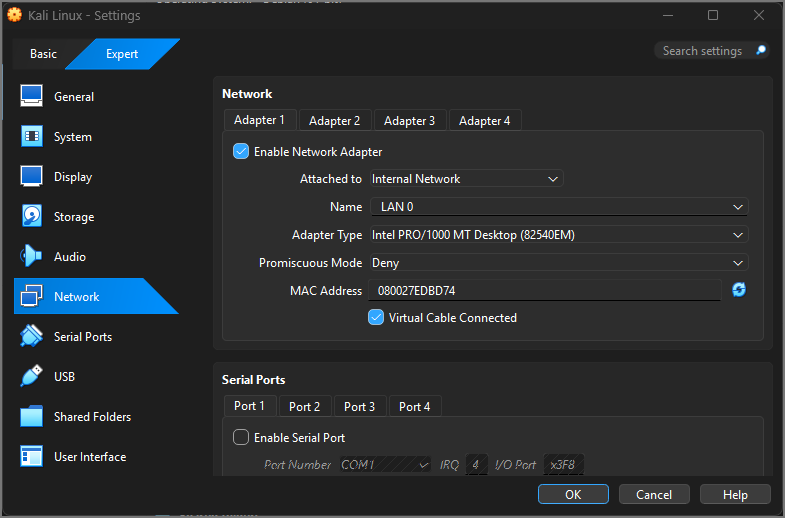

## Kali Linux Installation

Remember to boot the pfSense VM if it was shut down before starting the Kali Linux installation.

Select Kali Linux from the sidebar and click on **`Start`** on the toolbar.

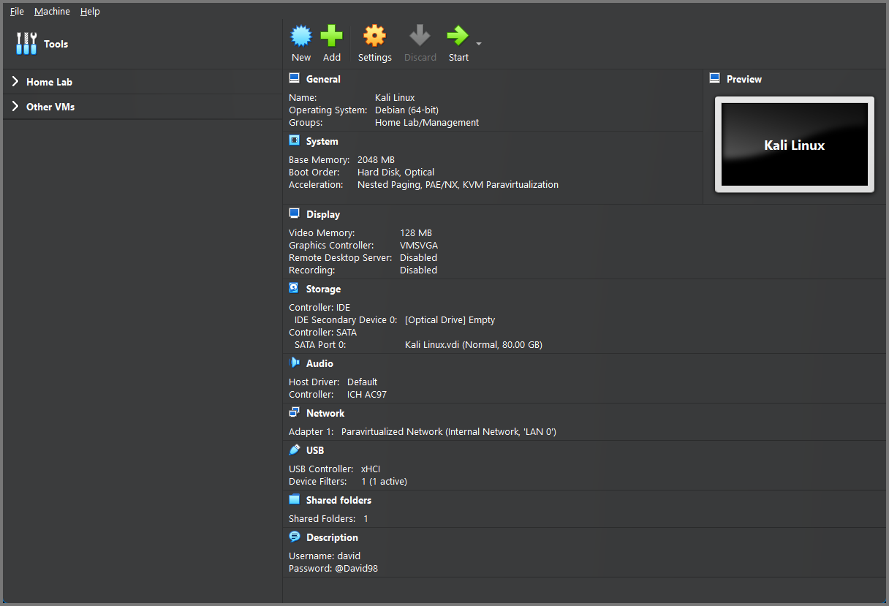

From the Installer menu select <u>Graphical Install</u>.

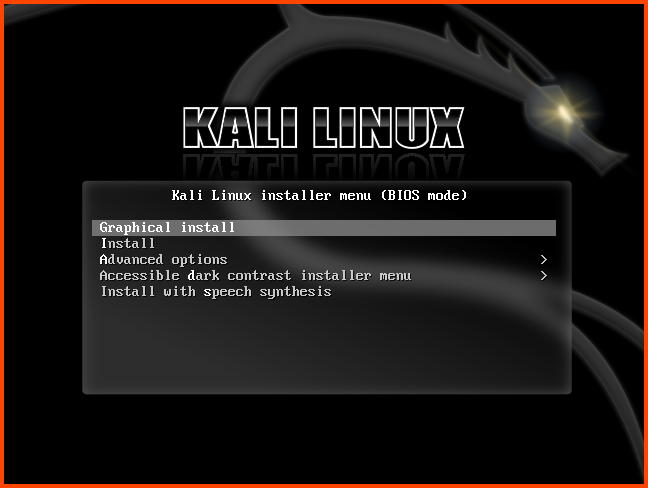

Select your Language, location and keyboard layout.

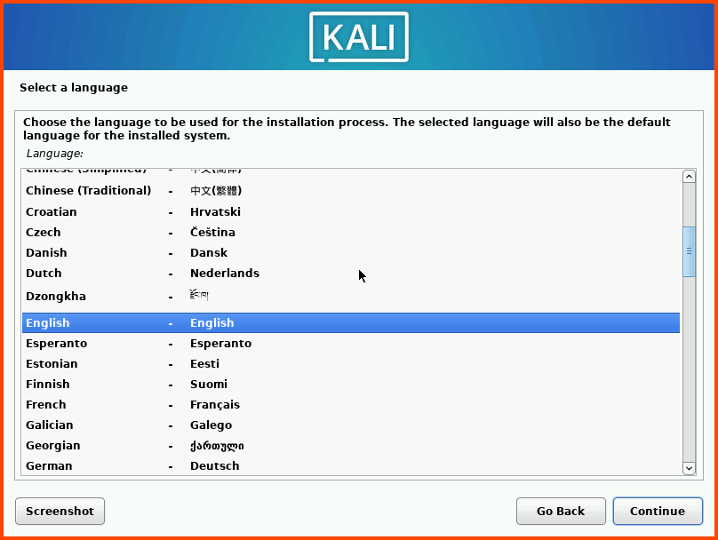


Enter a <u>name</u> for the VM. You can use any name here. The hostname is used to identify the system on the network. The hostname can also be changed after installation.

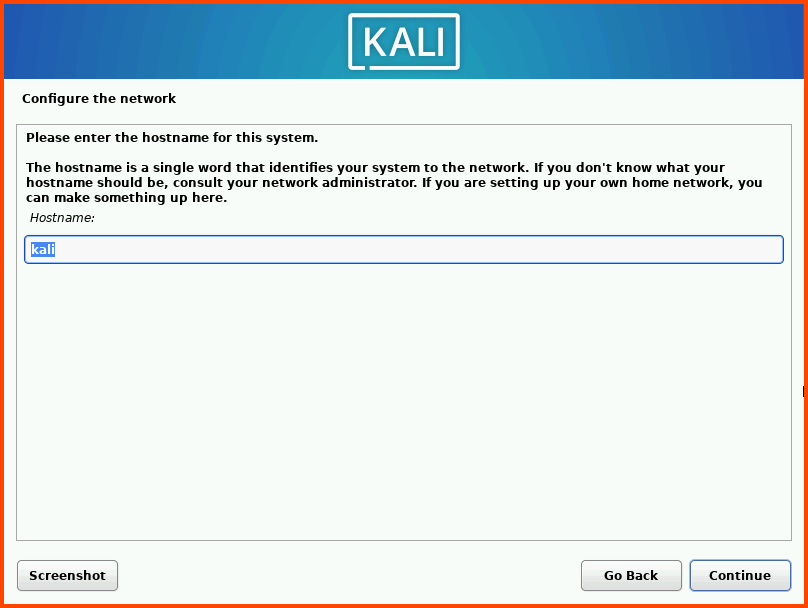

Leave the domain name input blank and click on **`Continue`**.


Enter your <u>name</u>. This name will be shown on the login screen.

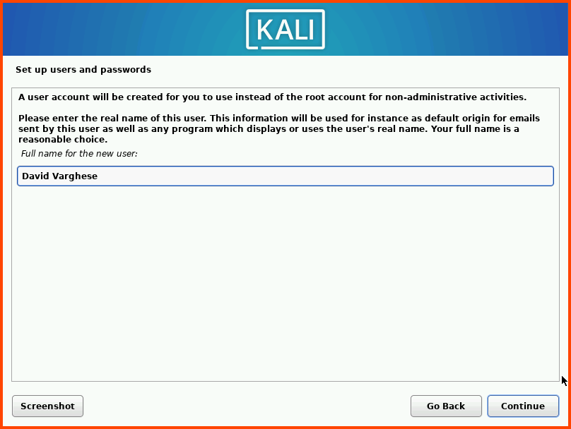

The <u>username</u> is used to create the home directory for the user. All the user-related configurations are stored in this folder.


Enter a strong password. Re-enter the password in the second field and click on **`Continue`**.


Select your <u>clock</u> and then click on **`Continue`**.


Select the drive (**`sda`**) and click on **`Continue`**.

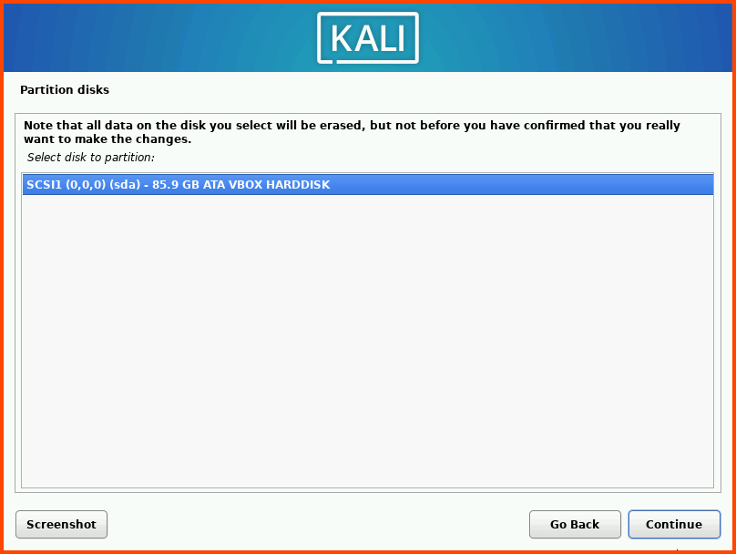

Select <u>Guided - use entire disk</u> and then click on **`Continue`**.


Select the option: <u>All files in one partition</u> and click on **`Continue`**. 


Select <u>Finish partitioning and write changes to disk</u>. Then click on **`Continue`**.

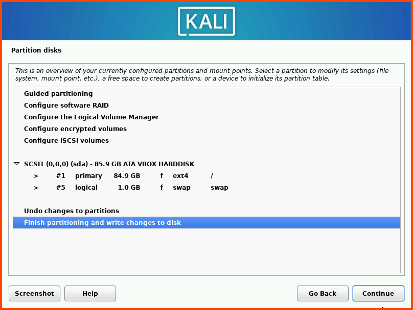

Select **`Yes`** and click on **`Continue`**.


After the base system installation is complete we need to choose the desktop environment that will be installed. I have selected <u>GNOME</u> for installation. 

The default is XFCE it does not look as pretty as GNOME it is much lighter and should have better performance. KDE Plasma is the fanciest with a lot of bells and whistles. I would only recommend KDE if you can assign <u>2 cores</u> and <u>4GB RAM</u> for this VM. Once the desktop environment is selected click on **`Continue`**.


The installation will take some time. Select **`Yes`** and click on **`Continue`**. 


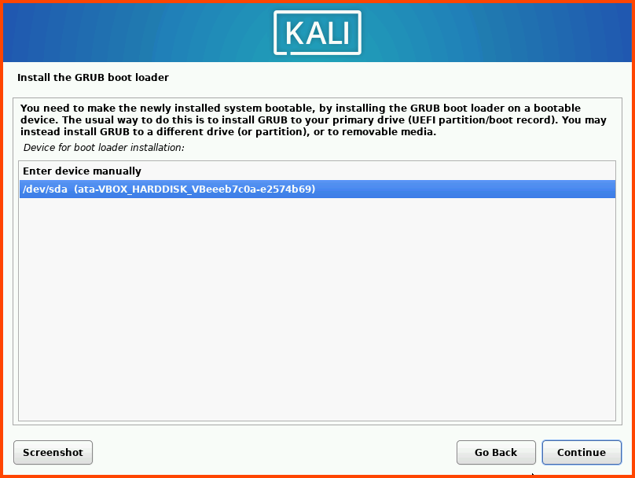

Click on **`Continue`** to Reboot the system.

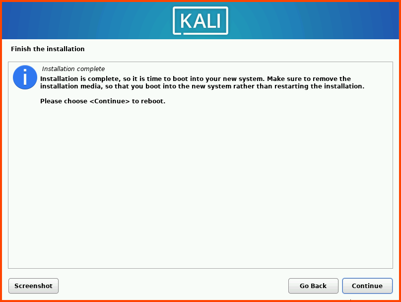

After reboot, we should see the Login screen. Click **`Enter`** to log in. Enter the password that was configured during the installation.


## Post-Installation Configuration

Kali Linux installer can detect when it is run from a VM because of this it automatically installs <u>Guest Addons</u>.

Press **`Right Ctrl+F`** to enter Fullscreen mode. The VM should scale to fill the entire screen. Press **`Right Ctrl+F`** again to exit Fullscreen mode. From the dock at the bottom of the screen. Select the <u>Terminal</u>.


Run the command: **`ip a`**. We can see that the Kali VM has been assigned an IP address from the LAN network range. The VM should be able to access the internet as well.

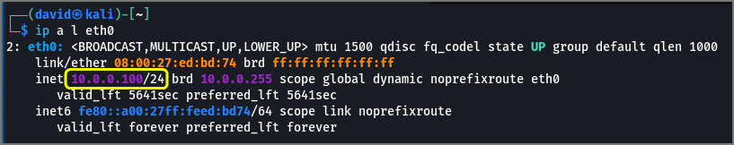

Use the following command to update the system:

```bash
sudo apt update && sudo apt full-upgrade
```

Enter password when prompted.

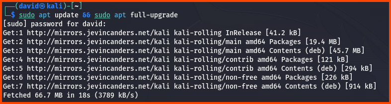

Once the sources have been fetched we will be asked if we want to continue. Enter **`Y`** and then press **`Enter`** to start the update.

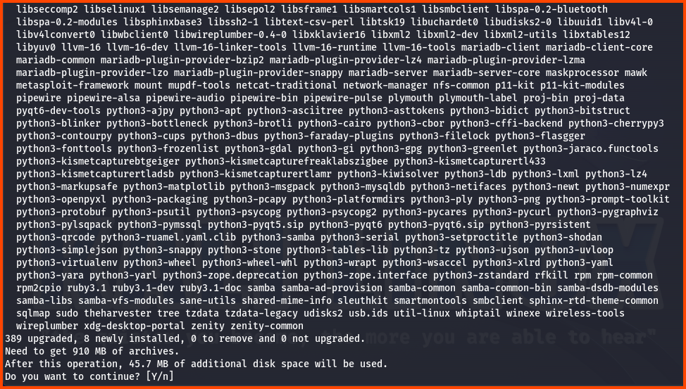

After the update is complete run the following command to remove the unused packages:

```bash
sudo apt autoremove
```


The **`.iso`** file that was downloaded to create the VM can be deleted now if you do not plan to store it for future use.

> [!IMPORTANT] Black Screen on Boot
> On certain machines starting the Kali VM results in a black screen. This issue occurs usually after updating the VM. There isn’t a definitive solution to this problem. The issue may popup from time to time.  
> 
> Some users have reported that changing the “Graphics Controller” to `VBoxSVGA` seems to resolve the problem for them. This option is located under `Settings → Display → Screen`.
> 
> Forcefully powering off the VM and starting it back up also seems to fix the issue. The VM might need to be restarted 2-3 times before the VM loads properly.

In the next module, we will access the pfSense Web UI and complete the remaining configuration.

[Part 4 - pfSense Firewall Configuration](https://blog.davidvarghese.net/posts/building-home-lab-part-4/)
