Banner Background by [logturnal](https://www.freepik.com/free-vector/gradient-white-color-background-abstract-modern_34010189.htm) on Freepik  
Hacker Image by [catalyststuff](https://www.freepik.com/free-vector/hacker-operating-laptop-cartoon-icon-illustration-technology-icon-concept-isolated-flat-cartoon-style_11602236.htm) on Freepik


> [!IMPORTANT] Changelog
> - **Oct. 31, 2024**
> 	- Updated instructions to reflect additonal step required to install Tsurugi Linux 2024.1+

In this module, we are going to set up Tsurugi Linux which is an OS that comes pre-configured with many of the commonly used Digital Forensics & Incident Response tools. Before deploying the VM we will create a new Interface in pfSense called Security that will have our DFIR VM and in the future other security tools.

## Creating New Interface

As discussed in the last module using VirtualBox GUI we cannot create more than 4 interfaces but using the CLI we can create up to 8 Interfaces.

### Creating new Interface

Before creating the interface we need the name of the pfSense VM. In my case, the VM is called "<u>pfSense</u>". Also, ensure the VM is "Powered Off" before running the commands. 

The last Adapter we created is called <u>Adapter 5</u>.

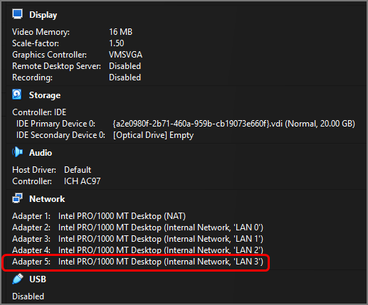

Launch PowerShell and run the following commands:

```powershell
# Create a Internet Network
VBoxManage modifyvm "pfSense" --nic6 intnet

# Use the Paravirtualized Adapter
VBoxManage modifyvm "pfSense" --nictype6 virtio

# Give it the name LAN 3
VBoxManage modifyvm "pfSense" --intnet6 "LAN 4"

# Network Interface is connected by Cable
VBoxManage modifyvm "pfSense" --cableconnected6 on
```

> [!NOTE]
> In the above commands "pfSense" is the name of my VM.  
> In the 3rd command in place of "LAN 3" you can use a different name that matches your network name convention.

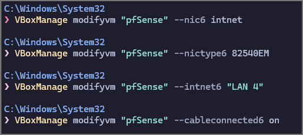

The pfSense VM will now have an Adapter 6.

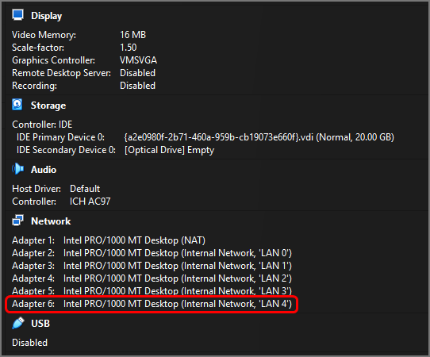

### Enabling the Interface

Start the pfSense VM. pfSense will not detect the new interface. We need to onboard the interface before it shows up.

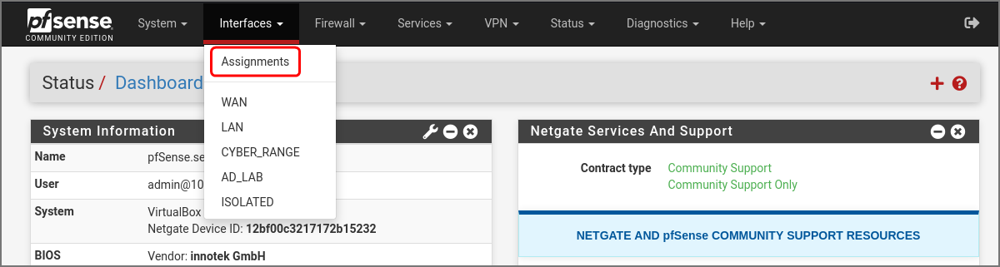

Enter **`1`** to select "Assign Interfaces".  
Should VLANs be set up now? **`n`**

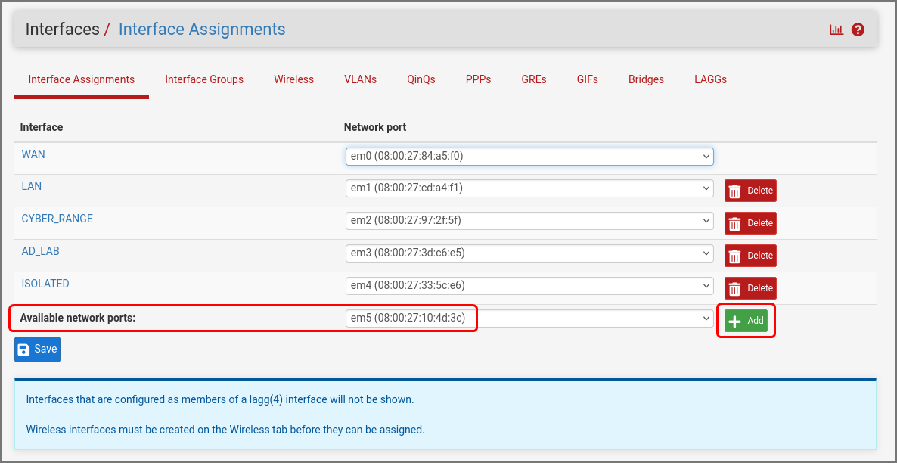

Enter the WAN interface name: **`vtnet0`**  
Enter the LAN interface name: **`vtnet1`**  
Enter the Optional 1 interface name: **`vtnet2`**  
Enter the Optional 2 interface name: **`vtnet3`**  
Enter the Optional 3 interface name: **`vtnet4`**  
Enter the Optional 4 interface name: **`vtnet5`**

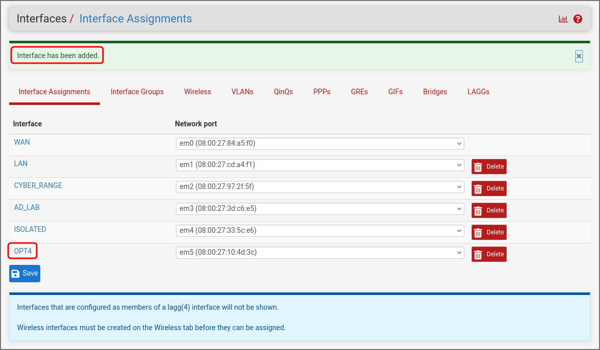

Do you want to proceed?: **`y`**

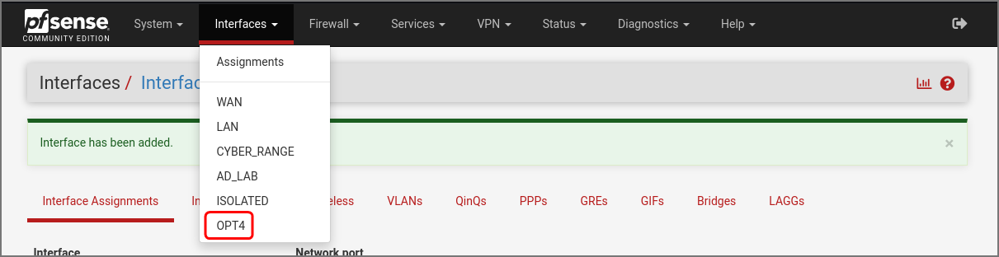

The new interface is onboarded. Now we need to assign it an IP address.

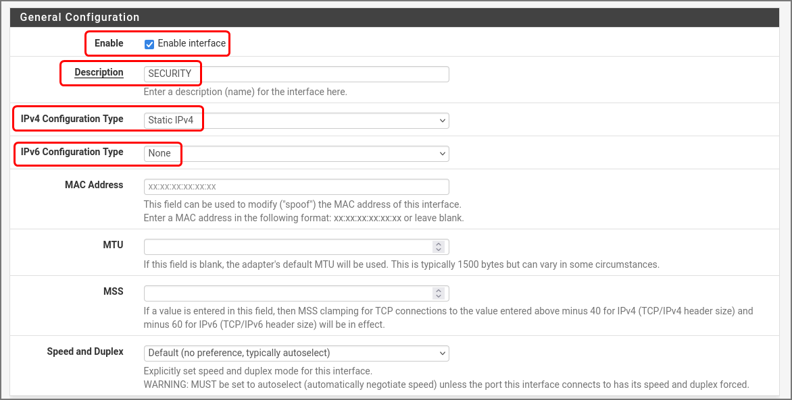

Enter **`2`** to select "<u>Set interface(s) IP address</u>". Enter **`6`** to select the OPT4 interface.

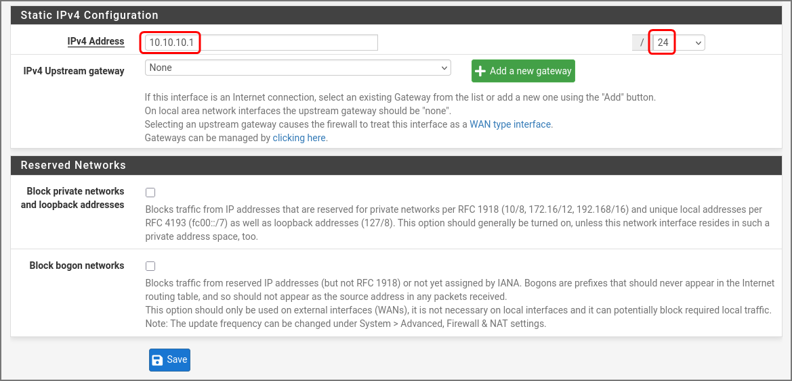

Configure IPv4 address OPT3 interface via DHCP?: **`n`**  
Enter the new OPT4 IPv4 address: **`10.10.10.1`**  
Enter the new OPT4 IPv4 subnet bit count: **`24`**  

For the next question directly press **`Enter`**. Since this is an **`LAN`** interface we do not have to worry about configuring the upstream gateway.

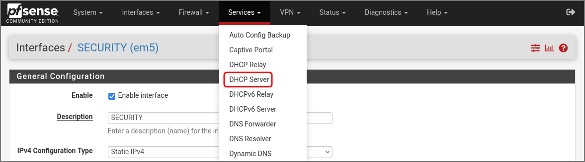

Configure IPv6 address OPT4 interface via DHCP6: **`n`**  
For the new OPT4 IPv6 address question press **`Enter`**.  
Do you want to enable the DHCP server on OPT4?: **`y`**  
Enter the start address of the IPv4 client address range: **`10.10.10.11`**  
Enter the end address of the IPv4 client address range: **`10.10.10.243`**  
Do you want to revert to HTTP as the webConfigurator protocol?: **`n`**

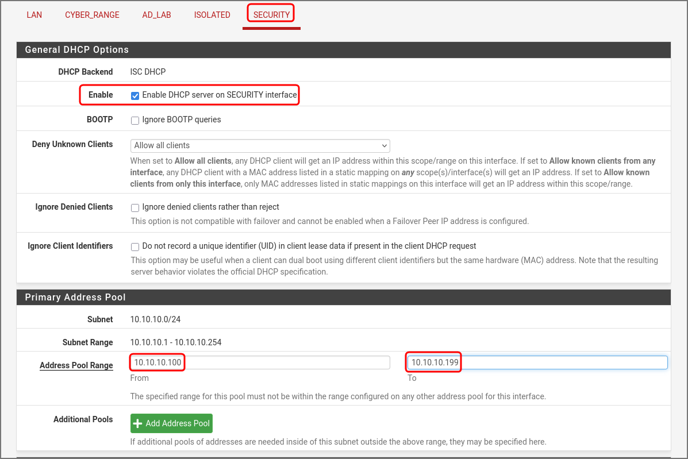

Now interface OPT4 will have an IP address.

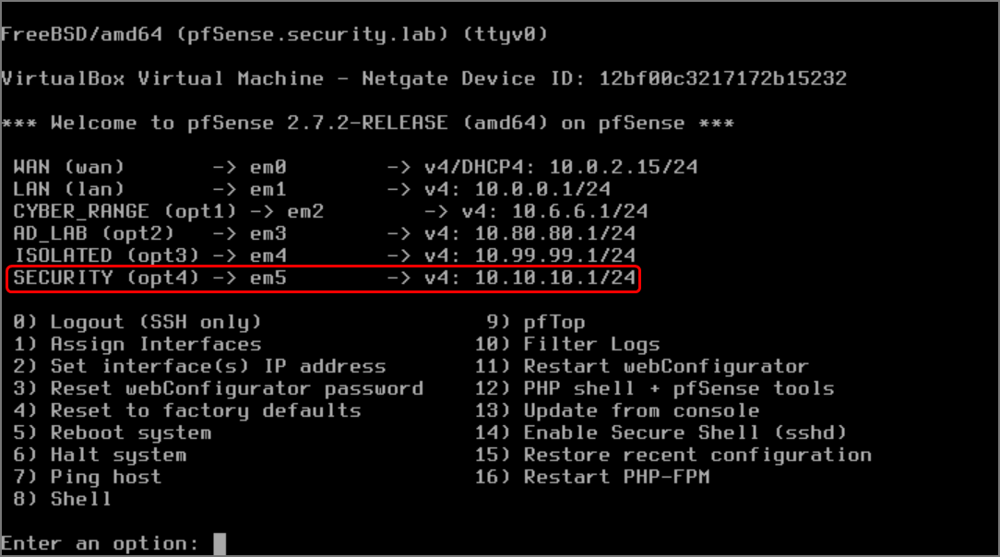

### Renaming the Interface

Launch the Kali Linux VM. Login to the pfSense web portal. From the navigation bar select **`Interfaces -> OPT4`**. 


In the description field enter **`SECURITY`**. Scroll to the bottom and click on **`Save`**.

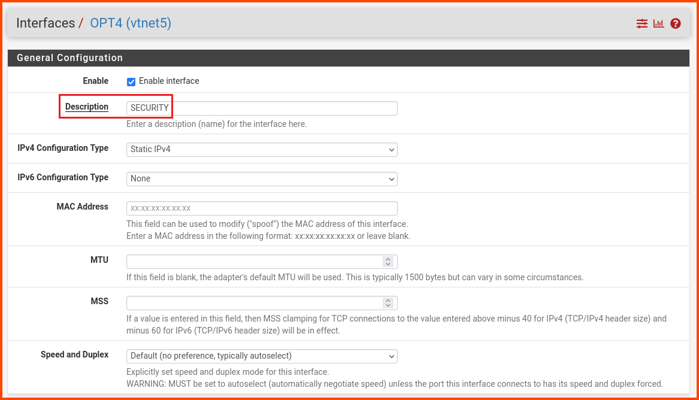

Click on **`Apply Changes`** in the popup that appears to persist the changes.


### Interface Firewall Configuration

From the navigation bar click on **`Firewall -> Rules`**.


Select the SECURITY tab. Click on the "Add" button to create a new rule.

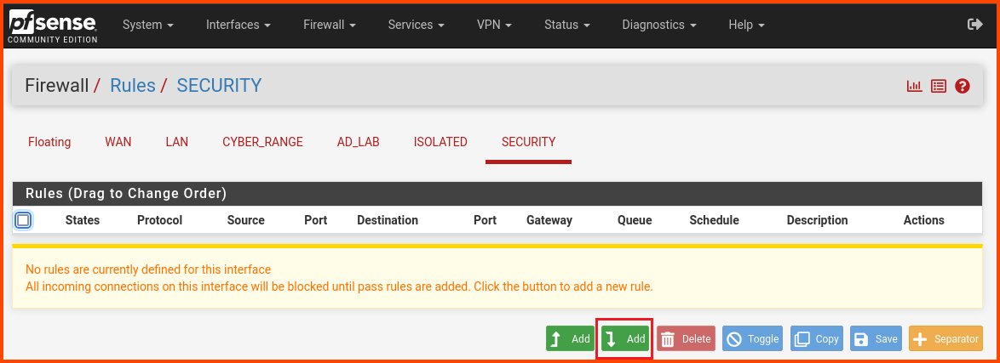

Change the values as follows:  
Action: **`Block`**  
Address Family: **`IPv4+IPv6`**  
Protocol: **`Any`**  
Source: **`SECURITY subnets`**  
Destination: **`WAN subnets`**  
Description: **`Block access to services on WAN interface`**

Scroll to the bottom and click on **`Save`**.

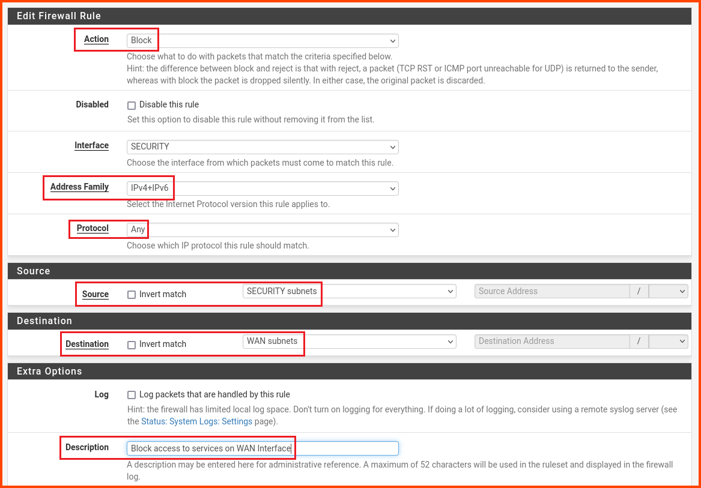

Ignore the popup for saving changes. Click on "Add" to create a new rule.

Change the values as follows:  
Action: **`Block`**  
Address Family: **`IPv4+IPv6`**  
Protocol: **`Any`**  
Source: **`SECURITY subnets`**  
Destination: **`LAN subnets`**  
Description: **`Block access to services on LAN`**

Scroll to the bottom and click on **`Save`**.


Click on "Add" to create a new rule.

Change the values as follows:  
Address Family: **`IPv4+IPv6`**  
Protocol: **`Any`**  
Source: **`SECURITY subnets`**  
Description: **`Allow traffic to all subnets and Internet`**

Scroll to the bottom and click on **`Save`**.


In the popup click on **`Apply Changes`** to persist the new rule.

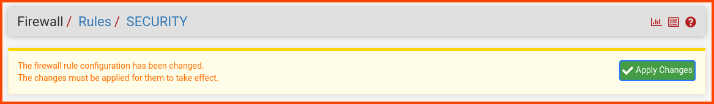

The final result will be as follows:


### Reboot pfSense

Now we need to restart pfSense to ensure that the firewall rules are propagated properly. From the navigation bar select **`Diagnostics -> Reboot`**.


Click on **`Submit`**.

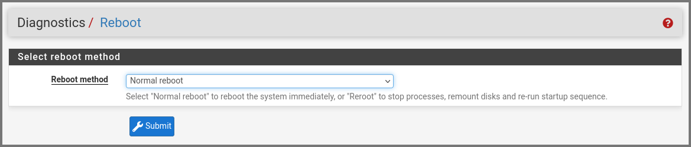

Once pfSense boots up you will be redirected to the login page.

## Tsurugi Linux Setup

### Download Image

Go to the following URL: [Tsurugi Linux - Downloads](https://tsurugi-linux.org/downloads.php). Select one of the Mirror Links.

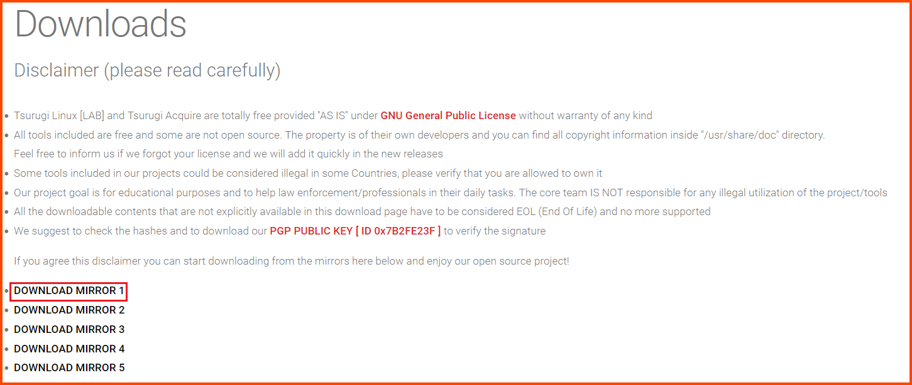

Download the ISO image. As of writing the latest version of Tsurugi Linux is **`2023.2`**.  
The ISO is ~16GB. It will take a while to download.

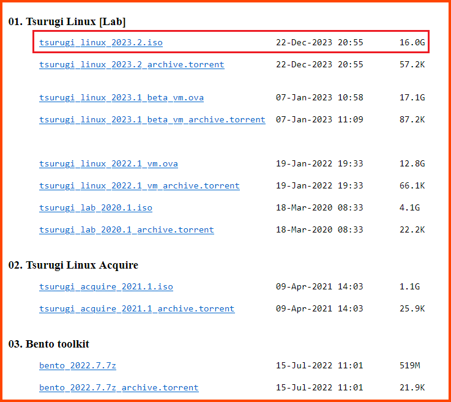

After the download is complete we will have a **`.iso`** file.

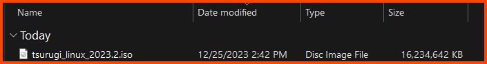

### Creating the VM

Select Tools from the sidebar and then select **`New`**.


Give the VM a <u>name</u> and then select the downloaded <u>ISO image</u>. Click on **`Next`**.

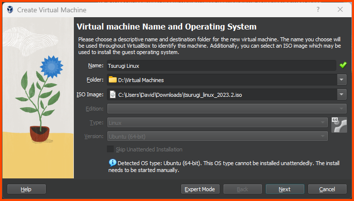

Increase the Base <u>Memory</u> to **`4096MB`** and then click on **`Next`**.


Increase the <u>Hard Disk</u> size to **`150GB`**.

> [!NOTE]
> Tsurugi Linux installation will not work if we provide less than **`110GB`** of storage.


Click if all the settings look right and then click on **`Finish`**.


#### Adding VM to Group

Right-click on the VM name and then select "<u>Move to Group</u>" and then choose **`New`**.


Right-click on the group name, select "<u>Rename Group</u>" and call it "<u>Security</u>".

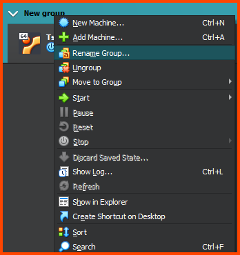

Right-click on the group name, select "<u>Move to Group</u>" and then select "<u>Home Lab</u>".


The final result should match the following:

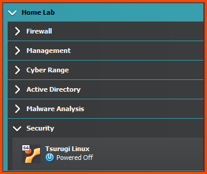

### Configuring the VM

Select the VM and then from the toolbar select "<u>Settings</u>".


Go to **`System -> Motherboard`**. In <u>Boot Order</u> ensure that Hard Disk is on top followed by Optical. Uncheck Floppy.

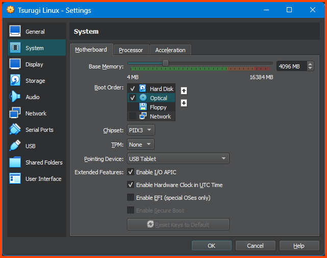

> [!ATTENTION] Tsurugi Linux 2024.1+ Additional Step  
> Tsurugi Linux 2024.1 onwards it is necessary to also enabled the “Enable EFI” option in VirtualBox. If this option is not enabled the OS installation will fail.  
> 
> ![[tsurugi-47.png|360]]

Go to **`Network -> Adapter 1`**. For the <u>Attached to</u> option select **`Internal Network`**. For <u>name</u> select **`LAN 4`**. Click on **`OK`** to save the changes.


### Installing Tsurugi Linux

Select the VM and from the toolbar select **`Start`**.


Press **`Enter`** to start the Tsurugi Linux in GUI mode.

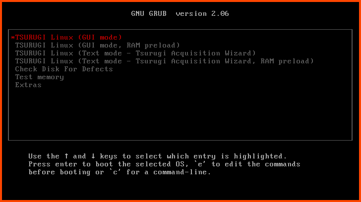

Once on the desktop double-click on **`Displays`**.

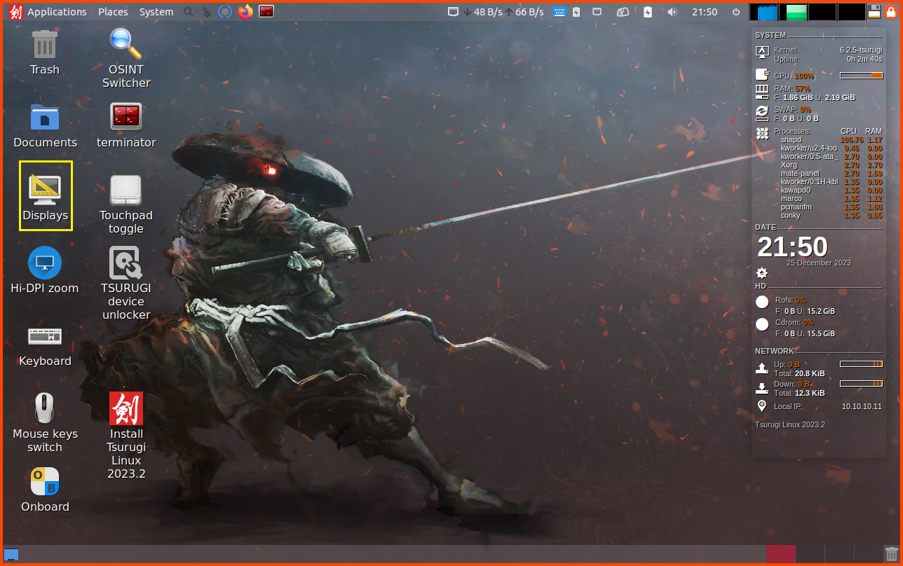

In the Resolution window select <u>1600x1050</u> and click on **`Apply`**.


Click on "<u>Keep This Configuration</u>" to confirm the changes.

> [!NOTE]
> Without changing the resolution of the screen you will not be able to see the buttons that are present at the bottom of the Installer.


Double-click on the "<u>Install Tsurugi Linux 2023.2</u>" icon to start the installer.

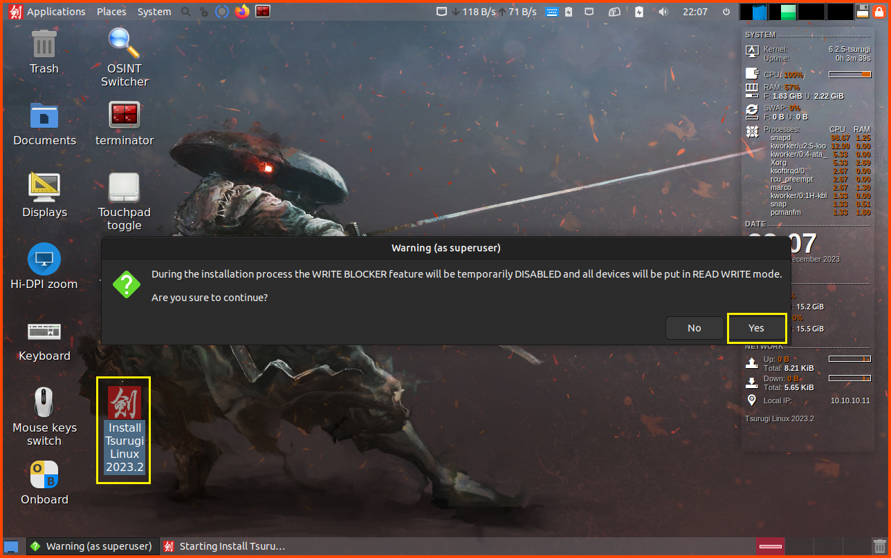

Once the installer starts. Use the scrollbar on the right side of the VM display and scroll to the bottom. Select your <u>language</u> and click on **`Continue`**.


Select <u>Keyboard</u> and click on **`Continue`**.

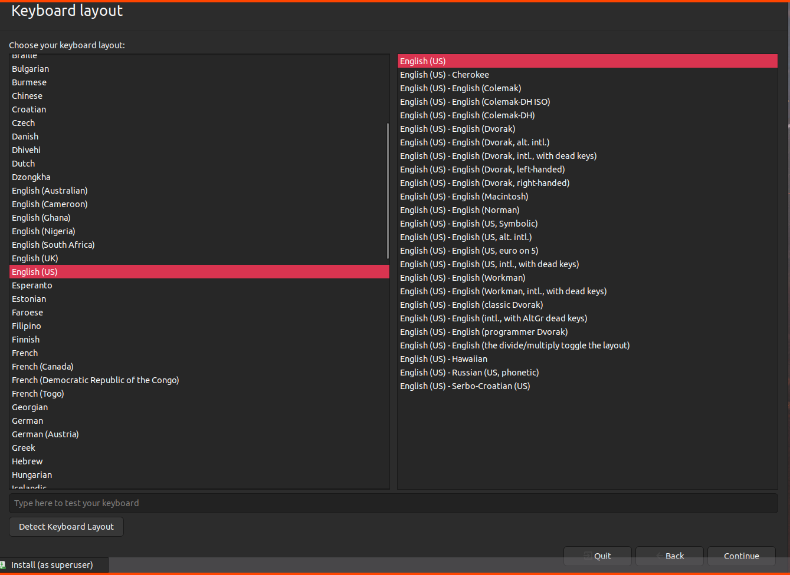

Enable "<u>Install third-party software for graphics and Wi-Fi hardware and additional media features</u>" and click on **`Continue`**. 

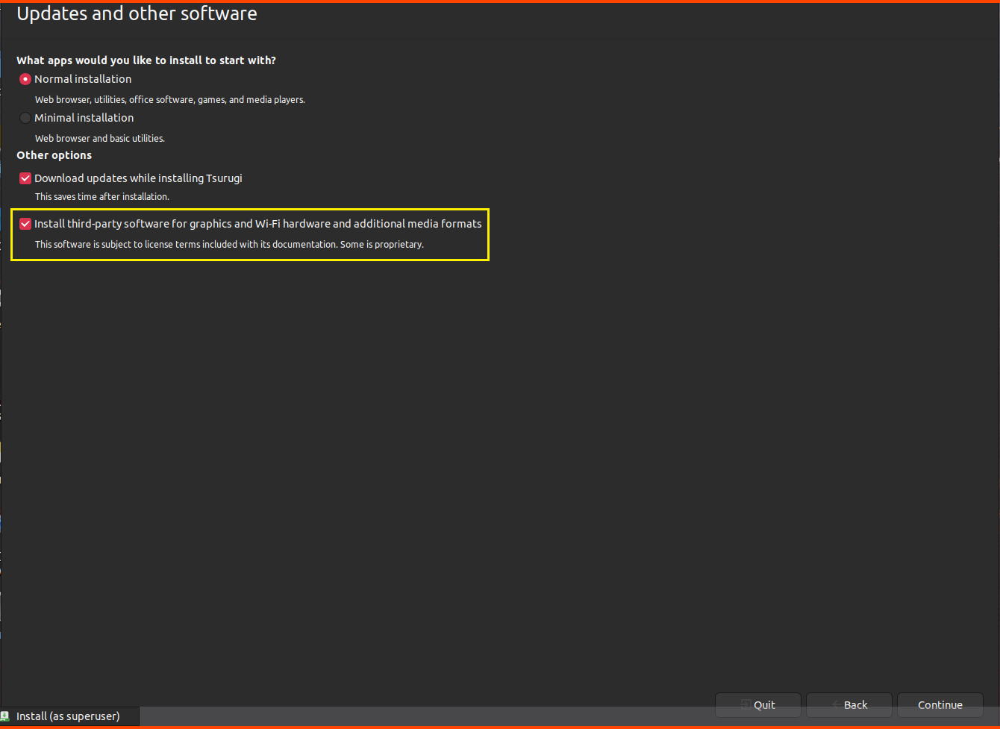

Click on **`Install Now`**.


Click on **`Continue`**.


Select your <u>location/timezone</u> using the map and click on **`Continue`**.

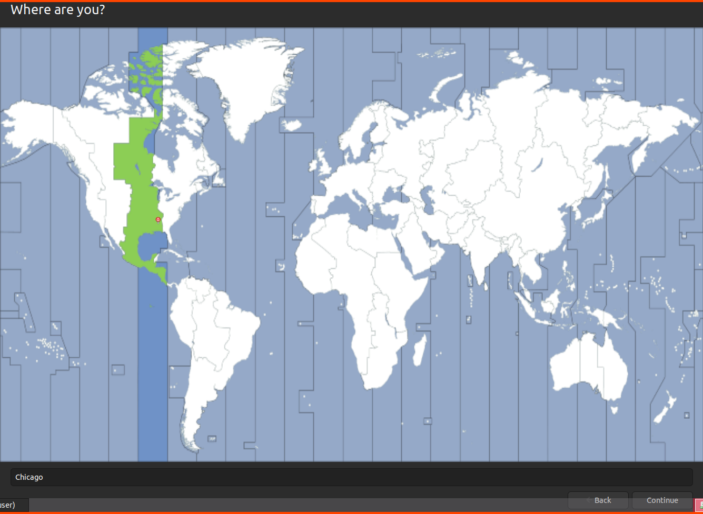

Provide a username, computer name and password then click on **`Continue`**.

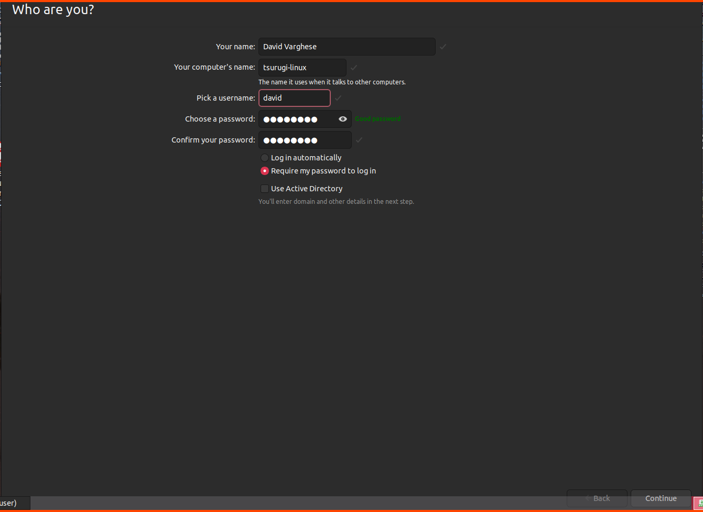


After the installation is complete click on "<u>Restart Now</u>".


When the VM reboots you might get the following screen. VirtualBox should automatically remove this disk when the screen appears. Press **`Enter`** to continue.


Login using the password that was configured.

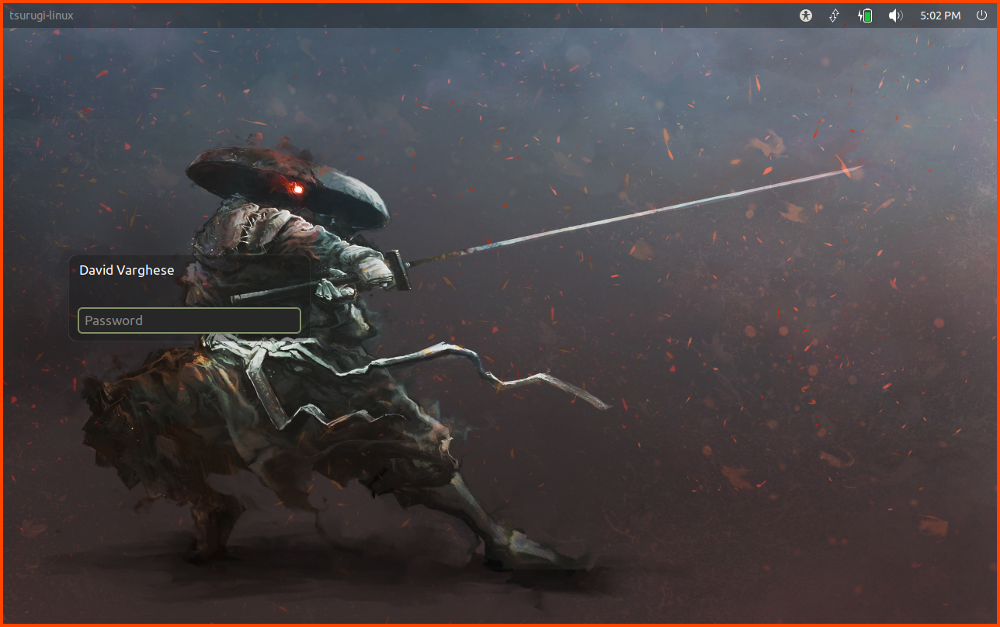

### Post-Install Configuration

#### Guest Additions Installation

Click on **`Devices -> Inert Guest Additions CD Image`**. This will insert the ISO image.


You might be prompted for credentials. Enter the <u>password</u> and click on **`Authenticate`**.


From the top right corner click on the CD icon then select **`Mount VBox_GAs`**.

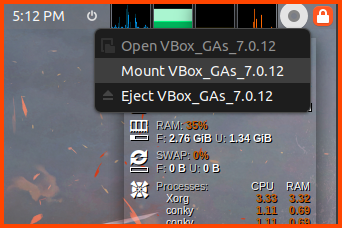

The <u>ISO image</u> will not be visible on the desktop. Double-click on the Image icon.


From the toolbar select **`Tools -> Open Current Folder in Terminal`**.

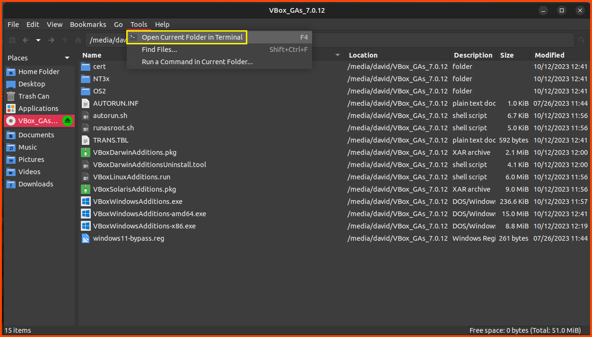

Run the following command to install Guest Additions.

```bash
sudo ./VBoxLinuxAdditions.run
```

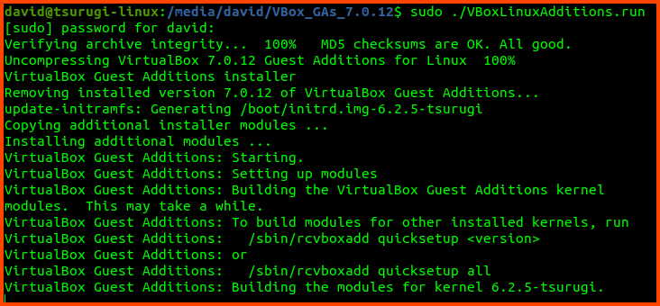

Once the installation is complete. Press **`Right Ctrl+F`** to enter <u>Fullscreen</u> mode. The same key can be used to exit Fullscreen the VM will scale to fit the window size. From the top right corner select **`Eject VBox_GAs`** to remove the ISO image.

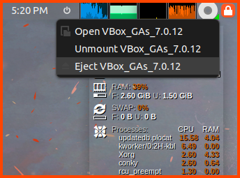

To Shutdown the system click on the <u>power icon</u> beside the clock then select "<u>Shut Down</u>".

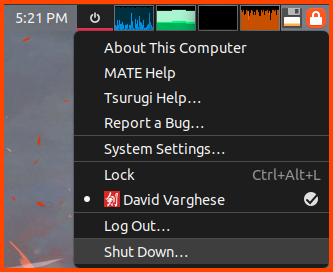

Select "<u>Shut Down</u>"


#### Updating the System

Open the **`terminator`** app from the desktop and run the following command:

```bash
sudo apt update && sudo apt full-upgrade
```


If there are any updates click **`Enter`** to start the installation. Provide your password when prompted.

#### Creating VM Snapshot

Shut down the VM before creating a Snapshot. Use the <u>Hamburger menu</u> beside the VM name to access the Snapshot page.

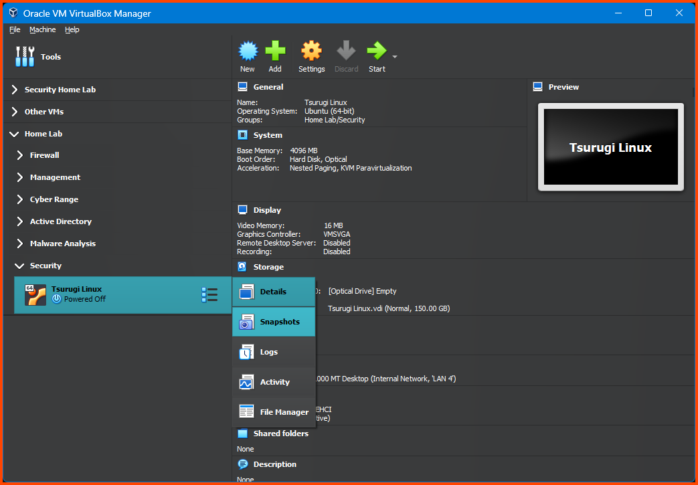

Click on **`Take`** to create a Snapshot.


Give the Snapshot a descriptive <u>name</u> and click on **`OK`**.


Use the Hamburger menu and click on Details to return to the main page.

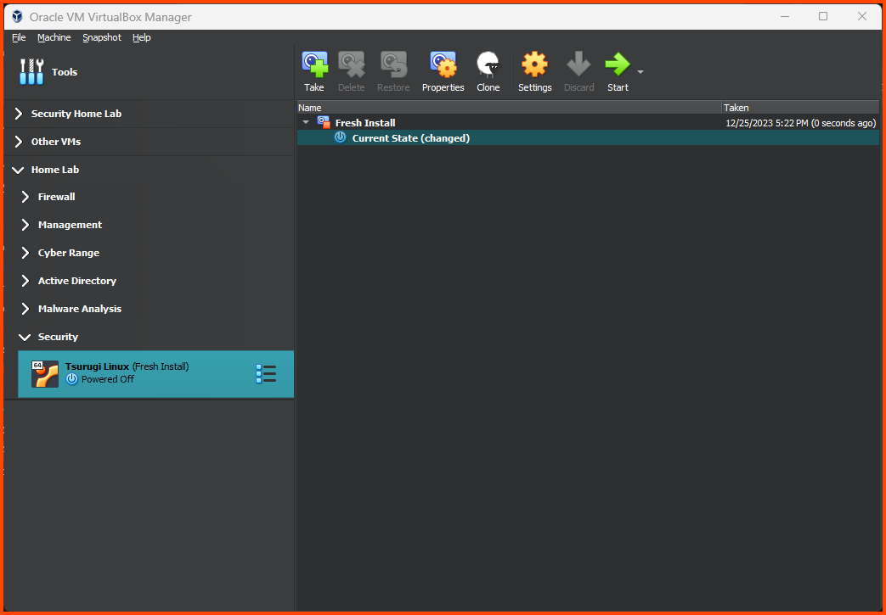

In the next module, we will install **`Ubuntu`** and then download and set up **`Splunk`**. We will also install the Splunk Universal Forwarder on the Domain Controller in our Active Directory Lab. This will allow us to capture the events that are generated on the Domain Controller.

[Part 10 - Splunk Setup & Configuration](https://blog.davidvarghese.dev/posts/building-home-lab-part-10/)
