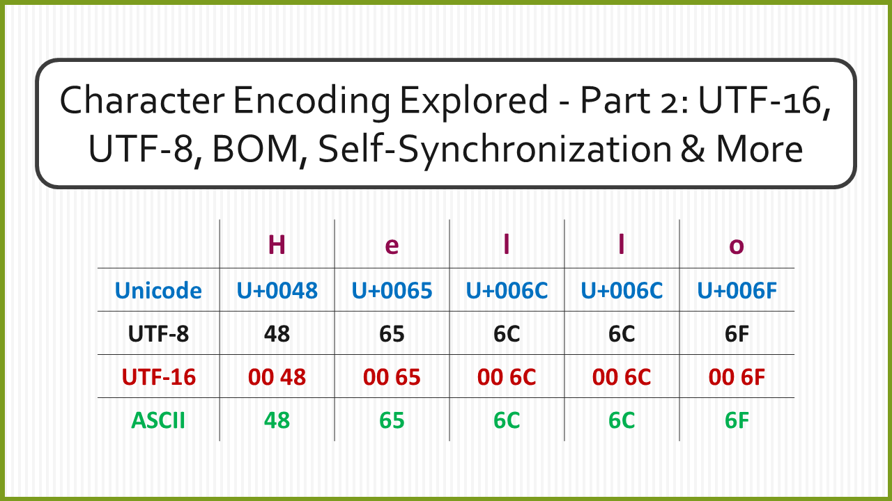
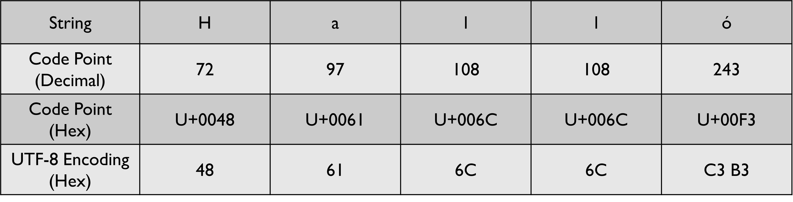
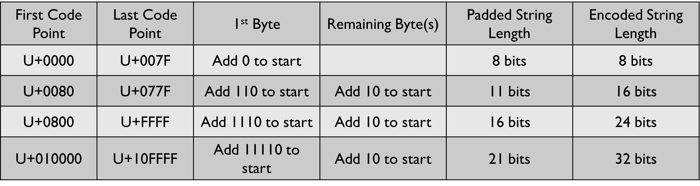
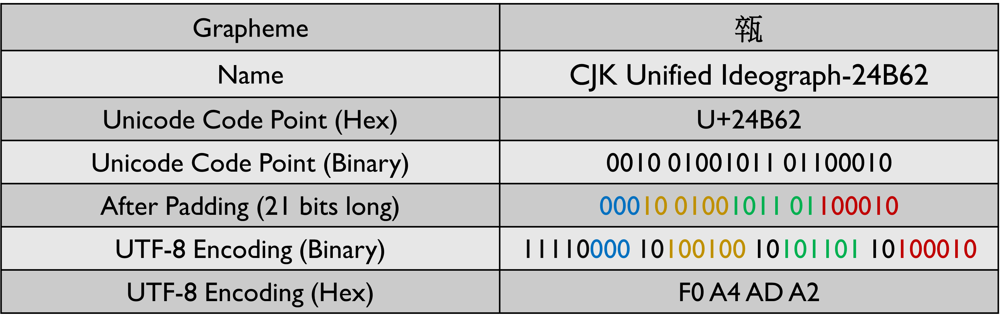
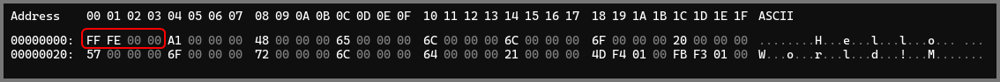
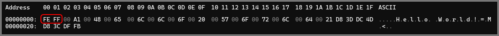
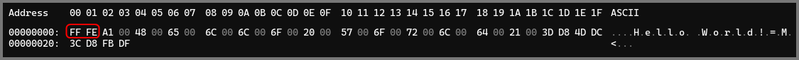
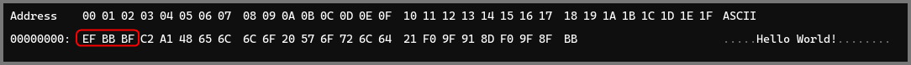

In is module we will continue from where we left off. We will go over the UTF-16 and UTF-8 encoding scheme. We will then spend some time covering BOM and Unicode-aware functions and finally, we will cover what it means for a character encoding to be self-synchronizing.

[Character Encoding Explored - Part 1: Character Set, ASCII, Unicode & UTF-32](https://blog.davidvarghese.net/posts/character-encoding-part-1/)

### UTF-16 Encoding

<iframe
	width="560" height="315" src="https://www.youtube-nocookie.com/embed/uTJoJtNYcaQ?si=v-f7SRNJyeXQ3jpu" title="YouTube video player" frameborder="0" allow="accelerometer; autoplay; clipboard-write; encrypted-media; gyroscope; picture-in-picture; web-share" allowfullscreen>
</iframe>

UTF-16 was designed to address the space inefficiency of UTF-32. Before UTF-16, there was UCS-2. UCS-2 utilized 16 bits (2 bytes) to represent the graphemes from the Unicode character set. A stream of 16 bits is called a “word”. UCS-2 is a fixed-length encoding scheme as all the characters are encoded using 16-bit code units.

[UTF-16 - Wikipedia](https://en.wikipedia.org/wiki/UTF-16)

By Unicode 3.0, ~50,000 graphemes were assigned a code point in Unicode. UCS-2 could easily encode all these graphemes. Using 2 bytes, we can represent 65,536 graphemes. With every subsequent release of Unicode, numerous additional graphemes were introduced. Soon we had graphemes that had code points that were greater than 65,536. These characters could not be encoded by UCS-2. 

To remedy this issue, a new encoding called UTF-16 was created. UTF-16 introduced the concept of surrogate pairs. Any character that was too large to be represented using 16 bits was represented using a surrogate pair. A surrogate pair is made of two 16-bit code units. The 1st 16-bit unit is called the high surrogate, the 2nd 16-bit unit is called the low surrogate. Graphemes that are in the range `U+0000-U+FFFF` are encoded in the same way as UCS-2. UTF-16 represents all characters in Unicode using 2 or 4 bytes. Since the encodings have variable length, UTF-16 is a variable-length encoding scheme.

The algorithm for encoding graphemes that are beyond `0xFFFF` is as follows:
* Subtract `0x10000` from the Unicode code point of the grapheme.
* Convert the result into binary. The result will always have 20 bits.
* Split the binary number into two 10-bit units. These units will form the surrogate pair.
* Add `0xD800` to the high surrogate to get the value of the high surrogate value.
* Add `0xDC00` to the low surrogate to get the value of the low surrogate value.

[How does UTF-16 encoding use surrogate code points? - Stack Overflow](https://stackoverflow.com/questions/66605467/how-does-utf-16-encoding-use-surrogate-code-points)

The value of the high surrogate will always be in the range `0xD800` - `0xDBFF`  
The value of the low surrogate will always be in the range `0xDC00` - `0xDFFF`

An overwhelming amount of content on the internet is written in English. Latin characters encoded using ASCII could be represented using 8 bits. The same characters encoded with UTF-16 require 16 bits. While UTF-16 in most cases used half the space of UTF-32, it still required more space than ASCII. UTF-16 is found to be a good choice for encoding text that predominately contains characters from Asian scripts.

### UTF-8 Encoding
UTF-8 was created to solve the shortcomings of UTF-32 and UTF-16. UTF-8 maps code points to between 1 and 4 bytes. Small code points can be represented using 1 byte, which saves a lot of space. Larger code points take anywhere from 2 to 4 bytes. Since the length of the encoding is not fixed, UTF-8 is a variable-length encoding scheme.

[UTF-8 - Wikipedia](https://en.wikipedia.org/wiki/UTF-8)

UTF-8 is backward compatible with ASCII. All the graphemes that are represented in ASCII have the same code point and encoding in UTF-8. Because of this, UTF-8 encoding can be used to communicate with programs that only understand ASCII. The old programs can read UTF-8 encoded data streams and decode the data using ASCII without any side effects. The method in which characters are encoded using UTF-8 also ensured that no code point has 8 consecutive 0s.

Since each grapheme is encoded using a variable-length encoding the decoding process is more involved because of which it is not a constant time operation. Indexing into a UTF-8 encoded stream to find the nth character is also challenging, as jumping around the stream using a fixed-size hop is not possible. This does introduce a slight impact on performance but is not an issue most of the time.

UTF-8 is the most popular encoding standard in the world. The small code points in UTF-8 are used to represent English letters, and the larger code points are used to represent the letters from other writing systems. Because of this, English text can be represented using fewer bytes as compared to other languages. This does give English an edge in space-efficiency over other languages when using UTF-8. This is an unfortunate consequence of English being the most widely used language on the internet.

The 1st 127 Unicode graphemes map 1-to-1 with Extended ASCII. These graphemes are represented in UTF-8 using 1 byte. Since all the graphemes in this range can be encoded with 7 bits, a 0 is added to the left of the string to make it 8 bits long.

Graphemes in the range 128 to 1,919 are encoded in UTF-8 using 2 bytes. The left 3 bits of the 1st byte is set to `110`. The left 2 bits of the 2nd byte is set to `10`. The binary representation of the Unicode code point should be padded to be 11 bits long before encoding it is encoded using UTF-8.

A similar pattern is used for encoding the graphemes that fall in the other two ranges. You would have observed that for graphemes that require more than 1 byte, the number of 1s in the 1st byte is equal to the number of bytes that will be used. The length of the stream required before performing the UTF-8 encoding is determined by the amount of `x` that is shown in the above image.

Let us take a look at some examples to see how the encoding is performed.

With UTF-8 we will never have 8 consecutive 0s because of this we do not have to worry about the transmission getting terminated prematurely. Since most of the commonly used characters can be represented in 1 byte, UTF-8 is a lot more space-efficient than UTF-16 and UTF-32.

### Unicode Aware Functions

<iframe 
	width="560" height="315" src="https://www.youtube-nocookie.com/embed/jeIBNn5Y5fI?si=Au82ap2gQjwZB36o" title="YouTube video player" frameborder="0" allow="accelerometer; autoplay; clipboard-write; encrypted-media; gyroscope; picture-in-picture; web-share" allowfullscreen>
</iframe>

Let us look at a code snippet from a Python 2 program.

The `len` function by default returns the number of bytes that are present in a string. This is 3 for the 1st example. However, this is not the same as the number of code points that are present in the example which is 1. Functions that work directly on the bytes of a string are called Unicode Unaware Functions. To make the `len` function Unicode Aware we have to prefix the string with a `u`. The `len` function will now work as expected (shown by the 2nd result) and return the number of code points that are present in the string.

The last two examples denote the victory emoji with the color modifier. It is a single grapheme but is represented as 2 graphemes by my terminal. When the Unicode Unaware Function is used we get the result as 7. The victory emoji with the color modifier is represented in UTF-8 using 3 and 4 bytes respectively. When the Unicode Aware Function is used we get the result as 2 which is the number of code points that is present in the string.

### BOM (Byte Order Mark)

BOM is a special usage of the Unicode character `U+FEFF`. This character is called "No Width No-Break Space" in the Unicode standard. It is located at the start of a Unicode-encoded data stream and can provide useful information about the stream.

[Byte Order Mark (BOM) - Wikipedia](https://en.wikipedia.org/wiki/Byte_order_mark)

BOM is primarily used to indicate the endianness of data (UTF-16 and UTF-32). The presence of BOM provides a degree of assurance that the data is using Unicode. BOM can also be used to identify the type of Unicode encoding that was used.

**Endianness** is a term used in computer science to represent the order in which bytes of data are stored in memory. Endianness is represented as Big-Endian (BE) or Little-Endian (LE). The concept of endianness becomes important when we deal with data that spans multiple bytes (like 16-bit code units in UTF-16 and 64-bit code units in UTF-32). Let's say we have a 16-bit number `12345`, which is `30 39` in hexadecimal. In a big-endian system, it would be stored as `30 39`. In a little-endian system, the same number would be stored as `39 30`.

[Endianness - Wikipedia](https://en.wikipedia.org/wiki/Endianness)

The choice between big-endian and little-endian is often made based on the specific requirements of a system. For instance, network protocols like the TCP/IP use big-endian (aka Network Byte Order), while many processor architectures (like x86 and ARM) use little-endian (aka Host Byte Order).

[Network Protocols - Big Endian or Little Endian? - Stack Overflow](https://stackoverflow.com/questions/997571/big-endian-or-little-endian-on-net)

The string "¡Hello World!👍🏻" was used as input for the examples shown below.  

#### UTF-32
In UTF-32 BOM is used to represent the byte order. The BOM character will be encoded as `00 00 FE FF` in UTF-32-BE.

BOM will be encoded as `FF FE 00 00` in UTF-32-LE. Notice how in UTF-32-LE (the image below) the encoding of all the graphemes is reversed.

#### UTF-16
Similarly, UTF-16 also uses BOM to represent the byte order. The BOM character will be encoded as `FE FF` in UTF-16-BE.

BOM will be encoded as `FF FE` in UTF-16-LE. Notice how in UTF-16-LE (the image below) the encoding of all the graphemes is reversed.

#### UTF-8
In UTF-8 BOM is not required since each grapheme is encoded using 8 byte code units. The Unicode standard also discourages using BOM with UTF-8. 

However, some applications will add BOM to UTF-8 streams. The BOM in this case is used to denote that the data stream is encoded using UTF-8. BOM will be encoded as `EF BB BF` in UTF-8.

BOM should not be used in UTF-8 data streams that will be read by software that only understands ASCII. Since BOM is not present in ASCII the software reading the data will not be able to decode it. It can also cause display problems in browsers, unwanted characters will be displayed at the start of the web page because BOM was included in the HTML file.

### Self-Synchronizing Encoding

When you learn more about character encodings you will come across the term - "self-synchronizing". What does it mean for a character encoding to be self-synchronizing? For a stream of encoded characters to be self-synchronizing we should be able to start reading the data at any point and still able to identify where the character begins. Imagine, you are reading a book, you can flip to any page and start reading (decoding) a sentence (encoded data) knowing anything that came before it. Self-synchronizing character encoding schemes operate in a similar manner.

[Self-synchronizing code - Wikipedia](https://en.wikipedia.org/wiki/Self-synchronizing_code)

This is an important property to consider when choosing a character encoding scheme. Data can sometimes get lost or corrupted during transmission. If the encoding is self-synchronizing, we can still make sense of the remaining data even if some of the data is missing or corrupted. This is analogues to reading a book which has a few pages torn.

#### UTF-32
UTF-32 is self-synchronizing at the byte level. This is because all the graphemes are encoded using 4 bytes. Even if some error occurs during transmission and some of the bits that make up a character are corrupted or changed, we can still decode the next character by jumping to the nearest 4-byte boundary. In UTF-32 it is possible to decode corrupted characters as well but the decode will result in a character that is different from the one that was originally encoded.

In other words, UTF-32 is self-synchronizing because of its fixed-length encoding. However, as discussed earlier UTF-32 is not space-efficient. This is why UTF-32 is not commonly used for transmitting data. It is mainly used in local data processing where the fixed width of characters can simplify certain operations.

#### UTF-16
UTF-16 is self-synchronizing at the 16-bit code unit level. It is important to note that it is different from UTF-8 and UTF-32 which are self-synchronizing at the byte level. 

If we read a sequence of 16-bit code units, we can identify the start of a character based on the value of each code unit. If it is in the range `0xD800—0xDBFF`, it's the high surrogate pair. If it's in the range `0xDC00—0xDFFF`, it's the low surrogate pair. If it's in neither of those ranges, it's a standalone character. Even if the data were to get changed in transmission, when we read the stream we might misinterpret a 16-bit code unit but when we read the next unit we can correctly identify it as its value will be in the high surrogate, low surrogate or standalone character range.

On the other hand, if we start reading from the middle of a UTF-16 encoded sequence of bytes, in units of 8-bits we will not be able to determine if we are at the start of a 16-bit unit or in the middle of one. This is problematic on systems that cannot read data as 16-bit units.

This makes UTF-16 more fragile in comparison to UTF-8. This is one of the reasons why UTF-8 is generally preferred for transmitting and storing text data, even though UTF-16 can be more space-efficient for Asian scripts.

#### UTF-8
UTF-8 is self-synchronizing at the byte level. In UTF-8 all characters are represented by 1 to 4 bytes. The 1st byte of each character uses a specific pattern that denotes the number of bytes that make up the character. This pattern is what enables UTF-8 to be a self-synchronizing encoding.

Let's consider the grapheme `A`. In UTF-8, it is represented in a single byte (`01000001`). If you start reading at this byte, you can tell it's the start of a 1-byte character because it begins with a `0`.

If we have a grapheme like `©`. In UTF-8, it would be represented using 2 bytes (`11000010 10101001`). If you start reading at the first byte, you can tell it's the start of a 2-byte character because it begins with `110`. If you start reading at the second byte, you can tell it's not the start of a character because it begins with `10`.

Assume we have a sequence of UTF-8 encoded data. An error in transmission causes a bit of the data to get flipped. When we read the stream, we will misinterpret the byte that has the error. However, when we read the next byte, we can easily identify if it is the start of a character or the middle of a character because of the pattern that is present in each byte. The error is isolated to the character where it occurred and does not affect the remaining characters in the sequence.

This property of UTF-8 makes it robust against transmission errors and is one of the reasons why it's widely used for transmitting and storing text data.

### Conclusion

In the 1st module, we went over some of the terminologies that are used to explain character encoding concepts. Then we looked at ASCII and Extended ASCII which were 2 encoding schemes that were used extensively in the early days of the Internet. Then we dived into Unicode and why we required a new standard to represent characters. We covered some topics related to the Unicode code space like planes and blocks. Finally, we went over UTF-32 a fixed-length character encoding scheme.

In this module, we discussed UTF-16 and UTF-8 which are both variable-length character encoding schemes. We took a look at Unicode Aware Functions. Then we discussed the BOM character which is used to denote the endianness of text in Unicode. Finally, we had a brief discussion on self-synchronizing character encodings and why they are better than encodings that require external synchronization.
